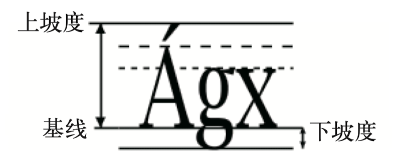

<script setup>
import TextLength from './components/TextLength.vue';
import TextPath from './components/TextPath.vue';
</script>

# 文本

## 字体中的一些概念

1. 基线：小写字母x的下端沿，字体中的所有符号以基线对准
2. 上坡度：基线到字体中最高字符顶部的距离
3. 下坡度：基线到最深字符底部的距离
4. 字符总高度：上坡度和下坡度之和，也称为`em`高
5. 大写字母高度：基线上的大写字母的高度
6. x高度：基 线到小写字母x顶部的高度



上方的虚线表示大写字母高度，下面的虚线标记了x高度。

## \<text>
在SVG中使用`<text>`元素声明一个文本。

`<text>`中的`x、y`坐标就是元素内容的第一个字符的基线位置。

```html
<svg width="150" height="150" viewBox="0 0 150 150" xmlns="http://www.w3.org/2000/svg">
  <!-- 基线 -->  
  <path d="M 20 10, 20 120 M 10 30 140 30 M 10 70 140 70 M 10 110 140 110" style="stroke: gray;"/>
  <text x="20" y="30">Simplest Text</text>
  <text x="20" y="70" style="stroke: black;">Outlined/filled</text>
  <text x="20" y="110" style="stroke: black; stroke-width: 0.5; fill: none;">Outlined only</text>
</svg>
```

<div class="demo">
  <svg width="150" height="150" viewBox="0 0 150 150" xmlns="http://www.w3.org/2000/svg">
    <path d="M 20 10, 20 120 M 10 30 140 30 M 10 70 140 70 M 10 110 140 110" style="stroke: gray;"/>
    <text x="20" y="30">Simplest Text</text>
    <text x="20" y="70" style="stroke: black;">Outlined/filled</text>
    <text x="20" y="110" style="stroke: black; stroke-width: 0.5; fill: none;">Outlined only</text>
  </svg>
</div>

### 文本样式

可以为`<text>`元素引用CSS相关font样式。

```html
<svg width="150" height="100" viewBox="0 0 150 100" xmlns="http://www.w3.org/2000/svg">
  <!-- 基线 -->  
  <path d="M 20 10, 20 100 M 10 50 140 50" style="stroke: gray;"/>
  <text x="20" y="50" style="font-family: -apple-system; font-size: 22px; font-weight: bolder">Outlined only</text>
</svg>
```

<div class="demo">
  <svg width="200" height="100" viewBox="0 0 200 100" xmlns="http://www.w3.org/2000/svg">
    <!-- 基线 -->  
    <path d="M 20 10, 20 100 M 10 50 200 50" style="stroke: gray;"/>
    <text x="20" y="50" style="font-family: -apple-system;font-size: 22px; font-weight: bolder">Outlined only</text>
  </svg>
</div>

### 文本对齐
由于在SVG中我们不能事先知道`<text>`的结束位置，所以文本居中对齐或者右对齐变得很困难。但我们可以使用`text-anchor`属性来指定文本坐标生效的位置，它的值可以是`start`、`middle`或者`end`

```html
<svg width="200" height="200" viewBox="0 0 200 200" xmlns="http://www.w3.org/2000/svg">
  <path d="M 100 0 100 200" style="stroke: gray;"/>
  <text x="100" y="50" style="text-anchor: start">Start</text>
  <text x="100" y="100" style="text-anchor: middle">Middle</text>
  <text x="100" y="150" style="text-anchor: end">End</text>
</svg>
```

<div class="demo">
  <svg width="200" height="200" viewBox="0 0 200 200" xmlns="http://www.w3.org/2000/svg">
    <path d="M 100 0 100 200" style="stroke: gray;"/>
    <text x="100" y="50" style="text-anchor: start">Start</text>
    <text x="100" y="100" style="text-anchor: middle">Middle</text>
    <text x="100" y="150" style="text-anchor: end">End</text>
  </svg>
</div>

## \<tspan>
`<tspan>`与`<span>`类型，可以为段落中的不同文字设置不同样式。

```html
<svg width="400" height="100" viewBox="0 0 400 100" xmlns="http://www.w3.org/2000/svg">
  <text x="50" y="50" style="text-anchor: start">
      I'm <tspan style="fill: red; font-style: italic;">italic and red</tspan>. I'm <tspan style="fill: green; font-weight: bold;">bold and green</tspan>
  </text>
</svg>
```

<div class="demo">
  <svg width="400" height="100" viewBox="0 0 400 100" xmlns="http://www.w3.org/2000/svg">
    <text x="50" y="50" style="text-anchor: start">
        I'm <tspan style="fill: red; font-style: italic;">italic and red</tspan>. I'm <tspan style="fill: green; font-weight: bold;">bold and green</tspan>
    </text>
  </svg>
</div>

使用`dx`、`dy`可以修改`<tspan>`的水平及垂直偏移量

```html
<svg width="400" height="100" viewBox="0 0 400 100" xmlns="http://www.w3.org/2000/svg">
  <text x="50" y="50">
      I'm <tspan dx="20" style="fill: red; font-style: italic;">italic and red</tspan>. I'm <tspan dy="20" style="fill: green; font-weight: bold;">bold and green</tspan>
  </text>
</svg>
```
<div class="demo">
  <svg width="400" height="100" viewBox="0 0 400 100" xmlns="http://www.w3.org/2000/svg">
    <text x="50" y="50">
        I'm <tspan dx="20" style="fill: red; font-style: italic;">italic and red</tspan>. I'm <tspan dy="20" style="fill: green; font-weight: bold;">bold and green</tspan>
    </text>
  </svg>
</div>

也可以对`<tspan>`应用`x`、`y`进行绝对定位：

```html
<svg width="400" height="100" viewBox="0 0 400 100" xmlns="http://www.w3.org/2000/svg">
  <text x="200" y="20" style="text-anchor: middle">
    <tspan x="200" y="20" style="text-anchor: middle;">北国风光，千里冰封，万里雪飘。</tspan>
    <tspan x="200" y="40" style="text-anchor: middle;">望长城内外，惟余莽莽；</tspan>
    <tspan x="200" y="60"  style="text-anchor: middle;">大河上下，顿失滔滔。</tspan>
    <tspan x="200" y="80"  style="text-anchor: middle;">山舞银蛇，原驰蜡象，欲与天公试比高。</tspan>
  </text>
</svg>
```

<div class="demo">
  <svg width="400" height="100" viewBox="0 0 400 100" xmlns="http://www.w3.org/2000/svg">
    <text x="200" y="20" style="text-anchor: middle">
      <tspan x="200" y="20" style="text-anchor: middle;">北国风光，千里冰封，万里雪飘。</tspan>
      <tspan x="200" y="40" style="text-anchor: middle;">望长城内外，惟余莽莽；</tspan>
      <tspan x="200" y="60"  style="text-anchor: middle;">大河上下，顿失滔滔。</tspan>
      <tspan x="200" y="80"  style="text-anchor: middle;">山舞银蛇，原驰蜡象，欲与天公试比高。</tspan>
    </text>
  </svg>
</div>

使用`base-line`实现上标、下标：

```html
<style>
.sub {
  baseline-shift: sub;
  font-size: 0.7em;
}
.super {
  baseline-shift: super;
  font-size: 0.7em;
}
</style>

<svg width="400" height="100" viewBox="0 0 400 100" xmlns="http://www.w3.org/2000/svg">
  <text x="150" y="20">
    x<tspan class="super">2</tspan> + y<tspan class="super">2</tspan>
  </text>
  <text x="150" y="50">
    CO<tspan class="sub">2</tspan>  O<tspan class="sub">2</tspan>
  </text>
</svg>
```

<style>
.sub {
  baseline-shift: sub;
  font-size: 0.7em;
}
.super {
  baseline-shift: super;
  font-size: 0.7em;
}
</style>

<div class="demo">
  <svg width="400" height="100" viewBox="0 0 400 100" xmlns="http://www.w3.org/2000/svg">
    <text x="150" y="20">
      x<tspan class="super">2</tspan> + y<tspan class="super">2</tspan>
    </text>
    <text x="150" y="50">
      CO<tspan class="sub">2</tspan>  O<tspan class="sub">2</tspan>
    </text>
  </svg>
</div>

## 设置文本长度
使用`textLength`属性显示设置文本宽度。使用`lengthAdjust`可自动调整字符间间距，`lengthAdjust`有两个可选值：`spacing`（调整间距，字符不发生变化）、`spacingAndGlyphs`（同时调整字符和间距）

```html
<svg width="400" height="100" viewBox="0 0 400 100" xmlns="http://www.w3.org/2000/svg">
    <text x="50" y="20" textLength="150" lengthAdjust="spacingAndGlyphs">Hello world!</text>
  </svg>
```

<div class="demo">
  <TextLength />
</div>

## \<switch>
使用`<switch>`元素可根据不同语言环境显示不同内容。

```html
<svg viewBox="0 -20 100 50">
  <switch>
    <text systemLanguage="ar">مرحبا</text>
    <text systemLanguage="de,nl">Hallo!</text>
    <text systemLanguage="en-us">Howdy!</text>
    <text systemLanguage="en-gb">Wotcha!</text>
    <text systemLanguage="en-au">G'day!</text>
    <text systemLanguage="en">Hello!</text>
    <text systemLanguage="es">Hola!</text>
    <text systemLanguage="fr">Bonjour!</text>
    <text systemLanguage="ja">こんにちは</text>
    <text systemLanguage="ru">Привет!</text>
    <text systemLanguage="zh-cn">你好！</text>
    <!-- 如果没有匹配到的语言，则显示一个笑脸 -->
    <text>☺</text>
  </switch>
</svg>
```

<div class="demo">
  <svg viewBox="0 -20 100 50">
    <switch>
      <text systemLanguage="ar">مرحبا</text>
      <text systemLanguage="de,nl">Hallo!</text>
      <text systemLanguage="en-us">Howdy!</text>
      <text systemLanguage="en-gb">Wotcha!</text>
      <text systemLanguage="en-au">G'day!</text>
      <text systemLanguage="en">Hello!</text>
      <text systemLanguage="es">Hola!</text>
      <text systemLanguage="fr">Bonjour!</text>
      <text systemLanguage="ja">こんにちは</text>
      <text systemLanguage="ru">Привет!</text>
      <text systemLanguage="zh-cn">你好！</text>
      <text>☺</text>
    </switch>
  </svg>
</div>

## 文本路径
使用`<textPath>`可以让文字按路径进行排列。使用`startOffset`可改变文字的起始位置。

```html
<svg width="400" height="200" viewBox="0 0 400 200" xmlns="http://www.w3.org/2000/svg">
  <defs>
    <path id="bezierPath" d="M40 100 Q150 40 200 100 T 380 100"  style="stroke: gray; fill: none;"/>
  </defs>
  <!-- 显示曲线 -->
  <use xlink:href="#bezierPath" />
  <text style="font-size: 24px;">
    <textPath xlink:href="#bezierPath">
      江山代有才人出，各领风骚数百年。
    </textPath>
  </text>
</svg>
```

<div class="demo">
  <TextPath />
</div>
