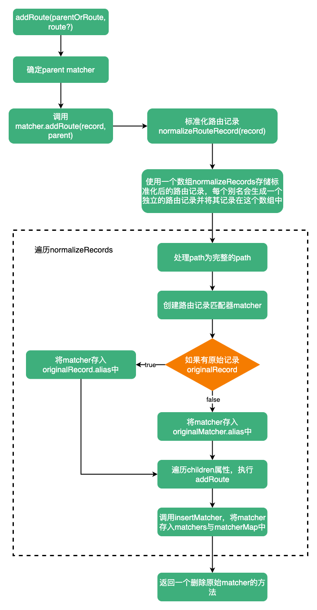

# addRoute

:::tip
添加一条新的路由记录。
:::

`addRoute`接收两个参数：`parentOrRoute`、`route`。如果有两个参数时，`parentOrRoute`就是父路由的记录，`route`是要添加的路由；如果只有一个参数，`parentOrRoute`就是要添加的路由。

```ts
function addRoute(
  parentOrRoute: RouteRecordName | RouteRecordRaw,
  route?: RouteRecordRaw
) {
  let parent: Parameters<typeof matcher['addRoute']>[1] | undefined
  let record: RouteRecordRaw
  // 如果parentOrRoute(string或symbol)是个name，那么parent就是根据这个name获取到的matcher
  if (isRouteName(parentOrRoute)) {
    parent = matcher.getRecordMatcher(parentOrRoute)
    record = route!
  } else {
    record = parentOrRoute
  }

  // 调用matcher.addRoute
  return matcher.addRoute(record, parent)
}
```

对于`matcher.addRoute`可参考[matcher.addRoute](https://maxlz1.github.io/blog/vue-router/routerMatcher.html#addroute)

对于`addRoute`的流程如下图：


