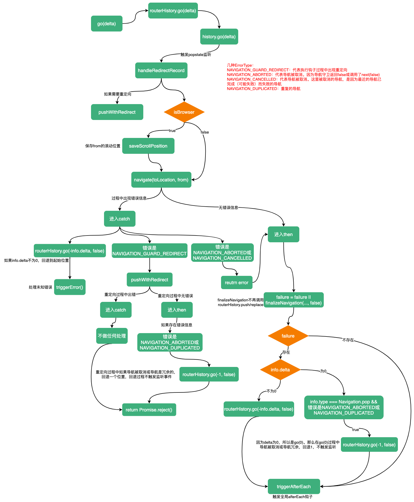

# go

::: tip
允许在历史中前进或后退。
:::

`go`接收一个参数`delta`，表示相对当前页面，移动多少步，负数表示后退，正数表示前进。

`go`的实现很简单：调用`routerHistory.go()`。关于`routerHistory.go()`的实现可参考：[createWebHistory](https://maxlz1.github.io/blog/vue-router/createWebHistory.html)

```ts
const go = (delta: number) => routerHistory.go(delta)
```

在`routerHistory.go`中会调用`history.go`，触发`popstate`监听函数。我们看下监听函数：

```ts
// 文件位置：src/history/html5.ts useHistoryListeners方法
window.addEventListener('popstate', popStateHandler)

const popStateHandler: PopStateListener = ({
 state,
}: {
  state: StateEntry | null
}) => {
  // 当前location，字符串
  const to = createCurrentLocation(base, location)
  const from: HistoryLocation = currentLocation.value
  const fromState: StateEntry = historyState.value
  let delta = 0

  // 如果不存在state
  // 关于为什么state可能为空，可参考：https://developer.mozilla.org/zh-CN/docs/Web/API/Window/popstate_event
  if (state) {
    currentLocation.value = to
    historyState.value = state

    // 如果暂停监听了，并且暂停时的状态是from，直接return
    if (pauseState && pauseState === from) {
      pauseState = null
      return
    }
    // 计算移动的步数
    delta = fromState ? state.position - fromState.position : 0
  } else {
    replace(to)
  }

  // 循环调用监听函数
  listeners.forEach(listener => {
    listener(currentLocation.value, from, {
      delta,
      type: NavigationType.pop,
      direction: delta
        ? delta > 0
          ? NavigationDirection.forward
          : NavigationDirection.back
        : NavigationDirection.unknown,
    })
  })
}
```

可以看到，在监听函数最后会循环调用`listeners`中的`listener`，那么`listener`是什么？什么时候被添加的呢？

在`install`的过程中（`install`的过程可参考：[app.use(router)](https://maxlz1.github.io/blog/vue-router/router-install.html)），会根据`location`进行第一次跳转。这个跳转是通过调用`push`方法完成的，因为`push`会调用`pushWidthRedirect`方法，在`pushWidthRedirect`中的最后会执行`finalizeNavigation`（不考虑中间reject错误）。而在`finalizeNavigation`中的最后会调用一个`markAsReady`方法。

```ts{5}
function markAsReady<E = any>(err?: E): E | void {
  if (!ready) {
    // still not ready if an error happened
    ready = !err
    setupListeners()
    readyHandlers
      .list()
      .forEach(([resolve, reject]) => (err ? reject(err) : resolve()))
    readyHandlers.reset()
  }
  return err
}
```

在`markAsReady`中调用了`setupListeners`的一个方法。在这个方法中会调用`routerHistory.listen()`添加一个函数。

```ts
let removeHistoryListener: undefined | null | (() => void)
function setupListeners() {
  // 如果有removeHistoryListener，说明已经添加过listener
  if (removeHistoryListener) return
  // routerHistory.listen返回一个删除这个listener函数
  removeHistoryListener = routerHistory.listen((to, _from, info) => {
    const toLocation = resolve(to) as RouteLocationNormalized

    // 确定是否存在重定向
    const shouldRedirect = handleRedirectRecord(toLocation)
    if (shouldRedirect) {
      pushWithRedirect(
        assign(shouldRedirect, { replace: true }),
        toLocation
      ).catch(noop)
      return
    }

    pendingLocation = toLocation
    const from = currentRoute.value

    // 保存from滚动位置
    if (isBrowser) {
      saveScrollPosition(
        getScrollKey(from.fullPath, info.delta),
        computeScrollPosition()
      )
    }
    
    navigate(toLocation, from)
      .catch((error: NavigationFailure | NavigationRedirectError) => {
        // 导航被取消
        if (
          isNavigationFailure(
            error,
            ErrorTypes.NAVIGATION_ABORTED | ErrorTypes.NAVIGATION_CANCELLED
          )
        ) {
          return error
        }
        // 在钩子中进行了重定向
        if (
          isNavigationFailure(error, ErrorTypes.NAVIGATION_GUARD_REDIRECT)
        ) {
          pushWithRedirect(
            (error as NavigationRedirectError).to,
            toLocation
          )
            .then(failure => {
              // 钩子中的重定向过程中如果导航被取消或导航冗余，回退一步
              if (
                isNavigationFailure(
                  failure,
                  ErrorTypes.NAVIGATION_ABORTED |
                    ErrorTypes.NAVIGATION_DUPLICATED
                ) &&
                !info.delta &&
                info.type === NavigationType.pop
              ) {
                routerHistory.go(-1, false)
              }
            })
            .catch(noop)
          return Promise.reject()
        }
        // 恢复历史记录，，但不触发监听
        if (info.delta) routerHistory.go(-info.delta, false)
        // 无法识别的错误，交给全局错误处理器
        return triggerError(error, toLocation, from)
      })
      .then((failure: NavigationFailure | void) => {
        failure =
          failure ||
          finalizeNavigation(
            toLocation as RouteLocationNormalizedLoaded,
            from,
            false
          )
        
        if (failure) {
          // 如果存在错误信息，回到原始位置，但不触发监听
          if (info.delta) {
            routerHistory.go(-info.delta, false)
          } else if (
            info.type === NavigationType.pop &&
            isNavigationFailure(
              failure,
              ErrorTypes.NAVIGATION_ABORTED | ErrorTypes.NAVIGATION_DUPLICATED
            )
          ) { // 错误类型时导航被取消或冗余，回退历史记录，但不触发监听
            routerHistory.go(-1, false)
          }
        }

        // 触发全局afterEach钩子
        triggerAfterEach(
          toLocation as RouteLocationNormalizedLoaded,
          from,
          failure
        )
      })
      .catch(noop)
  })
}
```

可以看到这个监听函数和`push`的过程十分相似，与`push`不同的是，在触发监听时，一旦出现了一些错误信息（如导航被取消、导航时冗余的、位置错误），需要将历史记录回退到相应位置。

看下`go`的流程：


