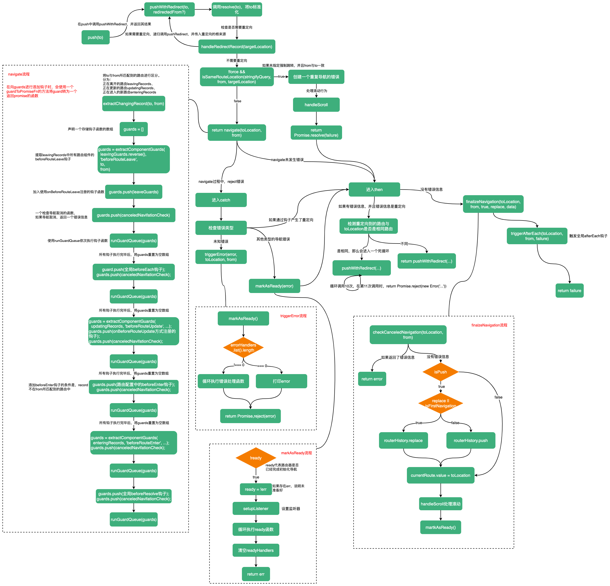

# push

:::tip
通过在历史堆栈中推送一个 entry，以编程方式导航到一个新的 URL。
:::

`push`方法接收一个`to`参数，表示要跳转的路由，它可以是个字符串，也可以是个对象。在`push`方法中调用了一个`pushWithRedirect`函数，并返回其结果。

```ts
function push(to: RouteLocationRaw | RouteLocation) {
  return pushWithRedirect(to)
}
```

`pushWithRedirect`接收两个参数：`to`、`redirectedFrom`，并返回`pushWithRedirect`的结果。其中`to`是要跳转到的路由，`redirectedFrom`代表`to`是从哪个路由重定向来的，如果多次重定向，它只是最初重定向的那个路由。

```ts
function pushWithRedirect(
  to: RouteLocationRaw | RouteLocation,
  redirectedFrom?: RouteLocation
): Promise<NavigationFailure | void | undefined> {
  // ...
}
```

因为要到的`to`中可能存在重定向，所以`pushWithRedirect`中首先要处理重定向：当`to`中存在重定向时，递归调用`pushWithRedirect`。

```ts
// 将to处理为规范化的路由
const targetLocation: RouteLocation = (pendingLocation = resolve(to))
// 当前路由
const from = currentRoute.value
// 使用 History API(history.state) 保存的状态
const data: HistoryState | undefined = (to as RouteLocationOptions).state
// force代表强制触发导航，即使与当前位置相同
const force: boolean | undefined = (to as RouteLocationOptions).force
// replace代表是否替换当前历史记录
const replace = (to as RouteLocationOptions).replace === true

// 获取要重定向的记录
const shouldRedirect = handleRedirectRecord(targetLocation)

// 如果需要重定向，递归调用pushWithRedirect方法
if (shouldRedirect)
  return pushWithRedirect(
    assign(locationAsObject(shouldRedirect), {
      state: data,
      force,
      replace,
    }),
    // 重定向的根来源
    redirectedFrom || targetLocation
  )
```

`handleRedirectRecord`函数的实现：
```ts
function handleRedirectRecord(to: RouteLocation): RouteLocationRaw | void {
  // 找到匹配的路由，to.matched中的路由顺序是父路由在子路由前面，所以最后一个路由是我们的最终路由
  const lastMatched = to.matched[to.matched.length - 1]
  // 如果路由存在redirect
  if (lastMatched && lastMatched.redirect) {
    const { redirect } = lastMatched
    // 如果redirect是函数，需要执行函数
    let newTargetLocation =
      typeof redirect === 'function' ? redirect(to) : redirect

    // 如果newTargetLocation是string
    if (typeof newTargetLocation === 'string') {
      // 如果newTargetLocation中存在?或#，需要将newTargetLocation解析成一个LocationNormalized类型的对象
      newTargetLocation =
        newTargetLocation.includes('?') || newTargetLocation.includes('#')
          ? (newTargetLocation = locationAsObject(newTargetLocation))
          : { path: newTargetLocation }
      // 设置params为一个空对象
      newTargetLocation.params = {}
    }

    // 如果newTargetLocation中没有path和name属性，则无法找到重定向的路由，开发环境下进行提示
    if (
      __DEV__ &&
      !('path' in newTargetLocation) &&
      !('name' in newTargetLocation)
    ) {
      warn(
        `Invalid redirect found:\n${JSON.stringify(
          newTargetLocation,
          null,
          2
        )}\n when navigating to "${
          to.fullPath
        }". A redirect must contain a name or path. This will break in production.`
      )
      throw new Error('Invalid redirect')
    }

    return assign(
      {
        query: to.query,
        hash: to.hash,
        params: to.params,
      },
      newTargetLocation
    )
  }
}
```

处理完重定向后，接下来会检测要跳转到的路由和当前路由是否为同一个路由，如果是同一个路由并且不强制跳转，会创建一个失败函数赋给`failure`，然后处理滚动行为。

```ts
const toLocation = targetLocation as RouteLocationNormalized

// 设置重定向的来源
toLocation.redirectedFrom = redirectedFrom
let failure: NavigationFailure | void | undefined

// 如果要跳转到的路由与当前路由一致并且不强制跳转
if (!force && isSameRouteLocation(stringifyQuery, from, targetLocation)) {
  // 创建一个错误信息
  failure = createRouterError<NavigationFailure>(
    ErrorTypes.NAVIGATION_DUPLICATED,
    { to: toLocation, from }
  )
  // 处理滚动行为
  handleScroll(
    from,
    from,
    true,
    false
  )
}
```

关于`handleScroll`的实现如下：首先从`options`中找到`scrollBehavior`选项，如果不是浏览器环境或不存在`scrollBehavior`，返回一个`Promise`对象。相反，获取滚动位置（根据历史记录中的position和path获取），然后在下一次DOM刷新后，执行定义的滚动行为函数，滚动行为函数执行完后，将滚动行为函数结果作为最终的滚动位置将页面滚动到指定位置。

```ts
function handleScroll(
  to: RouteLocationNormalizedLoaded,
  from: RouteLocationNormalizedLoaded,
  isPush: boolean,
  isFirstNavigation: boolean
): Promise<any> {
  const { scrollBehavior } = options
  if (!isBrowser || !scrollBehavior) return Promise.resolve()

  // 获取滚动位置
  const scrollPosition: _ScrollPositionNormalized | null =
    (!isPush && getSavedScrollPosition(getScrollKey(to.fullPath, 0))) ||
    ((isFirstNavigation || !isPush) &&
      (history.state as HistoryState) &&
      history.state.scroll) ||
    null

  // 下一次DOM更新后触发滚动行为，滚动行为执行完后，滚动到指定位置
  return nextTick()
    .then(() => scrollBehavior(to, from, scrollPosition))
    .then(position => position && scrollToPosition(position))
    .catch(err => triggerError(err, to, from))
}

export function getScrollKey(path: string, delta: number): string {
  // history.state.position记录着当前路由在历史记录中的位置，该位置从0开始
  const position: number = history.state ? history.state.position - delta : -1
  // key值为 在历史记录中的位置+path
  return position + path
}

export function getSavedScrollPosition(key: string) {
  // 根据key值查找滚动位置
  const scroll = scrollPositions.get(key)
  // 查完后，删除对应记录
  scrollPositions.delete(key)
  return scroll
}
```

在`pushWithRedirect`最后返回一个`Promise`。如果有`failure`，返回`failure`。如果没有`failure`则执行`navigate(toLocation, from)`

那么`navigate`是做什么的呢？`navigate`函数接收两个参数：`to`、`from`。

`navigate`中首先调用了一个`extractChangingRecords`函数，该函数的作用是将`from`、`to`所匹配到的路由分别存到三个数组中：`from`、`to`所共有的路由放入`updatingRecords`（正在更新的路由）、`from`独有的路由放入`leavingRecords`（正要离开的路由）、`to`独有的路由放入`enteringRecords`（正在进入的新路由）。紧接着又调用了一个`extractComponentsGuards`函数，用来获取组件内的`beforeRouteLeave`钩子，注意`extractComponentsGuards`函数只能获取使用`beforeRouteLeave(){}`方式注册的函数，对于使用`onBeforeRouteLeave`注册的函数需要单独处理。

```ts
const [leavingRecords, updatingRecords, enteringRecords] =
  extractChangingRecords(to, from)

// 向guards中添加leavingRecords中的路由组件的beforeRouteLeave钩子函数
guards = extractComponentsGuards(
  // 这里leavingRecords需要反转，因为matched中的顺序是父路由在子路由前，当离开时，应先离开子路由再离开父路由
  leavingRecords.reverse(),
  'beforeRouteLeave',
  to,
  from
)

// 向guards中添加使用onBeforeRouteLeave方式注册的方法
for (const record of leavingRecords) {
  record.leaveGuards.forEach(guard => {
    guards.push(guardToPromiseFn(guard, to, from))
  })
}

// 如果发生了新的导航canceledNavigationCheck可以帮助跳过后续所有的导航
const canceledNavigationCheck = checkCanceledNavigationAndReject.bind(
  null,
  to,
  from
)

guards.push(canceledNavigationCheck)
```

`extractChangingRecords`的实现过程：如果`to`和`from`配配到的路由中有公共的，说明这些路由在跳转过程中是更新操作，将其加入`updatingRecords`中；如果是`from`所匹配到独有的路由，说明要离开这些路由，将它们放入`leavingRecords`中；相反，如果`to`匹配到的路由中，`from`没有匹配到，说明是新的路由，将它们放入`enteringRecords`中。
```ts
function extractChangingRecords(
  to: RouteLocationNormalized,
  from: RouteLocationNormalizedLoaded
) {
  // 要离开的路由
  const leavingRecords: RouteRecordNormalized[] = []
  // 更新的路由
  const updatingRecords: RouteRecordNormalized[] = []
  // 要进入的新的路由（在from.matched中未出现过）
  const enteringRecords: RouteRecordNormalized[] = []

  const len = Math.max(from.matched.length, to.matched.length)
  for (let i = 0; i < len; i++) {
    const recordFrom = from.matched[i]
    if (recordFrom) {
      // 如果recordFrom在to.matched中存在，将recordFrom加入到updatingRecords，否则加入到leavingRecords中
      if (to.matched.find(record => isSameRouteRecord(record, recordFrom)))
        updatingRecords.push(recordFrom)
      else leavingRecords.push(recordFrom)
    }
    const recordTo = to.matched[i]
    if (recordTo) {
      // 如果recordTo在from.matched中找不到，说明是个新的路由，将recordTo加入到enteringRecords
      if (!from.matched.find(record => isSameRouteRecord(record, recordTo))) {
        enteringRecords.push(recordTo)
      }
    }
  }

  return [leavingRecords, updatingRecords, enteringRecords]
}
```

`extractComponentsGuards`是专门用来从路由组件中提取钩子函数的。`extractComponentsGuards`接收四个参数：`matched`（从`to`、`from`中提取出的`leavingRecords`、`updatingRecords`、`enteringRecords`之一）、`guardType`（钩子类型，可以取的值`beforeRouteEnter`、`beforeRouteUpdate`、`beforeRouteLeave`）、`to`、`from`。返回值是一个钩子函数列表。

```ts
export function extractComponentsGuards(
  matched: RouteRecordNormalized[],
  guardType: GuardType,
  to: RouteLocationNormalized,
  from: RouteLocationNormalizedLoaded
) {
  // 声明一个数组保存钩子函数
  const guards: Array<() => Promise<void>> = []

  for (const record of matched) {
    // 遍历路由对应的组件components
    for (const name in record.components) {
      let rawComponent = record.components[name]
      // 开发环境下进行提示
      if (__DEV__) {
        // 如果组件不存在或组件不是object和function，提示不是有效的组件
        if (
          !rawComponent ||
          (typeof rawComponent !== 'object' &&
            typeof rawComponent !== 'function')
        ) {
          warn(
            `Component "${name}" in record with path "${record.path}" is not` +
              ` a valid component. Received "${String(rawComponent)}".`
          )
          // 抛出错误
          throw new Error('Invalid route component')
        } else if ('then' in rawComponent) { // 如果使用import('./xxx.vue')的方式使用组件，进行提示，并转为() => import('./xxx.vue')
          warn(
            `Component "${name}" in record with path "${record.path}" is a ` +
              `Promise instead of a function that returns a Promise. Did you ` +
              `write "import('./MyPage.vue')" instead of ` +
              `"() => import('./MyPage.vue')" ? This will break in ` +
              `production if not fixed.`
          )
          const promise = rawComponent
          rawComponent = () => promise
        } else if (
          (rawComponent as any).__asyncLoader &&
          // warn only once per component
          !(rawComponent as any).__warnedDefineAsync
        ) { // 如果使用defineAsyncComponent()方式定义的组件，进行提示
          ;(rawComponent as any).__warnedDefineAsync = true
          warn(
            `Component "${name}" in record with path "${record.path}" is defined ` +
              `using "defineAsyncComponent()". ` +
              `Write "() => import('./MyPage.vue')" instead of ` +
              `"defineAsyncComponent(() => import('./MyPage.vue'))".`
          )
        }
      }

      // 如果路由组件没有被挂载跳过update和leave钩子
      if (guardType !== 'beforeRouteEnter' && !record.instances[name]) continue

      // 如果是个路由组件
      // 路由组件需要满足：rawComponent是object || rawComponent有['displayName', 'props`、`__vccOpts`]中的任一属性
      if (isRouteComponent(rawComponent)) {
        // __vccOpts是由vue-class-component添加的
        const options: ComponentOptions =
          (rawComponent as any).__vccOpts || rawComponent
        const guard = options[guardType]
        // 向guards中添加一个异步函数
        guard && guards.push(guardToPromiseFn(guard, to, from, record, name))
      } else {
        // 能进入这个方法的表示rawComponent是个函数；例如懒加载() => import('./xx.vue')；函数式组件() => h('div', 'HomePage')
        // 注意这个的分支只发生在调用beforeRouteEnter之前，后续过程不会进行该过程。
        // 因为在调用beforeRouteEnter钩子之前，会进行异步路由组件的解析，一旦异步路由组件解析成功，会将解析后的组件挂载至对应的components[name]下
        
        // 执行rawComponent，例如懒加载() => import('./xx.vue')；如果函数式组件未声明displayName也会进入此分支
        let componentPromise: Promise<
          RouteComponent | null | undefined | void
        > = (rawComponent as Lazy<RouteComponent>)()

        // 对于函数式组件需要添加一个displayName属性，如果没有，进行提示，并将componentPromise转为一个Promise
        if (__DEV__ && !('catch' in componentPromise)) {
          warn(
            `Component "${name}" in record with path "${record.path}" is a function that does not return a Promise. If you were passing a functional component, make sure to add a "displayName" to the component. This will break in production if not fixed.`
          )
          componentPromise = Promise.resolve(componentPromise as RouteComponent)
        }

        // 向guards中添加一个钩子函数，在这个钩子的执行过程中先解析异步路由组件，然后调用钩子函数
        guards.push(() =>
          componentPromise.then(resolved => {
            // 如果解析失败抛出错误
            if (!resolved)
              return Promise.reject(
                new Error(
                  `Couldn't resolve component "${name}" at "${record.path}"`
                )
              )
            // 判断解析后的组件是否为esm，如果是esm，需要取resolved.default
            const resolvedComponent = isESModule(resolved)
              ? resolved.default
              : resolved
            // 使用解析完的组件替换对应的components[name]
            record.components[name] = resolvedComponent
            const options: ComponentOptions =
              (resolvedComponent as any).__vccOpts || resolvedComponent
            // 对应的组件内的钩子
            const guard = options[guardType]
            // 钩子转promise，并执行
            return guard && guardToPromiseFn(guard, to, from, record, name)()
          })
        )
      }
    }
  }

  return guards
}
```

在`navigate`函数最后会调用`guards`中的钩子，并在`beforeRouteLeave`钩子执行完后执行了一系列操作。其实在这里就体现了`vue-router`中钩子的执行顺序：

```ts
return (
    runGuardQueue(guards)
      .then(() => {
        // 调用全局beforeEach钩子
        guards = []
        for (const guard of beforeGuards.list()) {
          guards.push(guardToPromiseFn(guard, to, from))
        }
        guards.push(canceledNavigationCheck)

        return runGuardQueue(guards)
      })
      .then(() => {
        // 获取组件中的beforeRouteUpdate钩子，以beforeRouteUpdate() {}方式声明
        guards = extractComponentsGuards(
          updatingRecords,
          'beforeRouteUpdate',
          to,
          from
        )

        // 以onBeforeRouteUpdate注册的
        for (const record of updatingRecords) {
          record.updateGuards.forEach(guard => {
            guards.push(guardToPromiseFn(guard, to, from))
          })
        }
        guards.push(canceledNavigationCheck)

        // 调用beforeRouteUpdate钩子
        return runGuardQueue(guards)
      })
      .then(() => {
        guards = []
        for (const record of to.matched) {
          // 不在重用视图上触发beforeEnter
          // 路由配置中有beforeEnter，并且from不匹配record
          if (record.beforeEnter && !from.matched.includes(record)) {
            if (Array.isArray(record.beforeEnter)) {
              for (const beforeEnter of record.beforeEnter)
                guards.push(guardToPromiseFn(beforeEnter, to, from))
            } else {
              guards.push(guardToPromiseFn(record.beforeEnter, to, from))
            }
          }
        }
        guards.push(canceledNavigationCheck)

        // 调用路由配置中的beforeEnter
        return runGuardQueue(guards)
      })
      .then(() => {

        // 清除存在的enterCallbacks 由extractComponentsGuards添加
        to.matched.forEach(record => (record.enterCallbacks = {}))

        // 获取被激活组件中的beforeRouteEnter钩子，在之前会处理异步路由组件
        guards = extractComponentsGuards(
          enteringRecords,
          'beforeRouteEnter',
          to,
          from
        )
        guards.push(canceledNavigationCheck)

        return runGuardQueue(guards)
      })
      .then(() => {
        guards = []
        // 处理全局beforeResolve钩子
        for (const guard of beforeResolveGuards.list()) {
          guards.push(guardToPromiseFn(guard, to, from))
        }
        guards.push(canceledNavigationCheck)

        return runGuardQueue(guards)
      })
      // 捕获任何取消的导航
      .catch(err =>
        isNavigationFailure(err, ErrorTypes.NAVIGATION_CANCELLED)
          ? err
          : Promise.reject(err)
      )
  )
```

截止目前一个欠完整的导航的解析流程（包含钩子的执行顺序）如下 ：

1. 导航被触发
2. 调用失活组件中的`beforeRouteLeave`钩子
3. 调用全局`beforeEach`钩子
4. 调用重用组件内的`beforeRouteUpdate`钩子
5. 调用路由配置中的`beforeEnter`钩子
6. 解析异步路由组件
7. 调用激活组件中的`beforeRouteEnter`钩子
8. 调用全局的`beforeResolve`钩子

你可能发现了，在每放入一个周期的钩子函数之后，都会紧跟着向`guards`中添加一个`canceledNavigationCheck`函数。这个`canceledNavigationCheck`的函数作用是如果在导航期间有了新的导航，则会`reject`一个`ErrorTypes.NAVIGATION_CANCELLED`错误信息。

```ts
function checkCanceledNavigationAndReject(
  to: RouteLocationNormalized,
  from: RouteLocationNormalized
): Promise<void> {
  const error = checkCanceledNavigation(to, from)
  return error ? Promise.reject(error) : Promise.resolve()
}

function checkCanceledNavigation(
  to: RouteLocationNormalized,
  from: RouteLocationNormalized
): NavigationFailure | void {
  if (pendingLocation !== to) {
    return createRouterError<NavigationFailure>(
      ErrorTypes.NAVIGATION_CANCELLED,
      {
        from,
        to,
      }
    )
  }
}
```

在向`guards`中放入钩子时，都使用了一个`guardToPromiseFn`，`guardToPromiseFn`可以将钩子函数转为`promise`函数。

```ts
export function guardToPromiseFn(
  guard: NavigationGuard,
  to: RouteLocationNormalized,
  from: RouteLocationNormalizedLoaded,
  record?: RouteRecordNormalized,
  name?: string
): () => Promise<void> {
  const enterCallbackArray =
    record &&
    (record.enterCallbacks[name!] = record.enterCallbacks[name!] || [])

  return () =>
    new Promise((resolve, reject) => {
      // 这个next函数就是beforeRouteEnter中的next
      const next: NavigationGuardNext = (
        valid?: boolean | RouteLocationRaw | NavigationGuardNextCallback | Error
      ) => {
        // 如果调用next时传入的是false，取消导航
        if (valid === false)
          reject(
            createRouterError<NavigationFailure>(
              ErrorTypes.NAVIGATION_ABORTED,
              {
                from,
                to,
              }
            )
          )
        else if (valid instanceof Error) { // 如果传入了一个Error实例
          reject(valid)
        } else if (isRouteLocation(valid)) { // 如果是个路由。可以进行重定向
          reject(
            createRouterError<NavigationRedirectError>(
              ErrorTypes.NAVIGATION_GUARD_REDIRECT,
              {
                from: to,
                to: valid,
              }
            )
          )
        } else {
          // 如果valid是个函数，会将这个函数添加到record.enterCallbacks[name]中
          // 关于record.enterCallbacks的执行时机，将会在RouterView中进行分析
          if (
            enterCallbackArray &&
            // since enterCallbackArray is truthy, both record and name also are
            record!.enterCallbacks[name!] === enterCallbackArray &&
            typeof valid === 'function'
          )
            enterCallbackArray.push(valid)
          resolve()
        }
      }

      // 调用guard，绑定this为组件实例
      const guardReturn = guard.call(
        record && record.instances[name!],
        to,
        from,
        // next应该只允许被调用一次，如果使用了多次开发环境下给出提示
        __DEV__ ? canOnlyBeCalledOnce(next, to, from) : next
      )
      // 使用Promise.resolve包装guard的返回结果，以允许异步guard
      let guardCall = Promise.resolve(guardReturn)

      // 如果guard参数小于3,guardReturn会作为next的参数
      if (guard.length < 3) guardCall = guardCall.then(next)
      // 如果guard参数大于2
      if (__DEV__ && guard.length > 2) {
        const message = `The "next" callback was never called inside of ${
          guard.name ? '"' + guard.name + '"' : ''
        }:\n${guard.toString()}\n. If you are returning a value instead of calling "next", make sure to remove the "next" parameter from your function.`
        // guardReturn是个promise
        if (typeof guardReturn === 'object' && 'then' in guardReturn) {
          guardCall = guardCall.then(resolvedValue => {
            // 未调用next。如：
            // beforeRouteEnter(to, from ,next) {
            //  return Promise.resolve(11)
            // }
            if (!next._called) {
              warn(message)
              return Promise.reject(new Error('Invalid navigation guard'))
            }
            return resolvedValue
          })
          // TODO: test me!
        } else if (guardReturn !== undefined) {
          // 如果有返回值，并且未调用next。如
          // beforeRouteEnter(to, from ,next) {
          //  return 11
          // }
          if (!next._called) {
            warn(message)
            reject(new Error('Invalid navigation guard'))
            return
          }
        }
      }
      // 捕获错误
      guardCall.catch(err => reject(err))
    })
}
```

`guardToPromiseFn`中声明的的`next`方法会作为钩子函数的第三个参数。如果在使用钩子函数时，形参的数量`<3`，那么钩子函数的返回值会作为`next`函数的参数；形参数量`>2`时，如果钩子函数的返回值是`Promise`，但未调用`next`，会抛出错误`Invalid navigation guard`，如果钩子函数的返回值不为`undefined`，也未调用`next`也会抛出错误`Invalid navigation guard`。

所以如果在使用路由钩子的过程中，如果钩子函数的形参`>2`，也就是你的形参中有`next`，你必须要调用`next`。如果你不想自己调用`next`，那么你要保证形参`<2`，同时钩子函数返回某个数据，这样`vue-router`会自动调用`next`。这里需要注意如果传递给`next`的参数是个`function`，那么这个`function`会被存入`record.enterCallbacks[name]`中，关于`enterCallbacks`的执行时机，在这里不去深究，在后续的`RouterView`源码分析中，你会得到你想要的答案。关于钩子函数中`next`的使用以下是一些示例：

```ts
beforeRouteEnter(from, to) {
	return false
}
// 等同于
beforeRouteEnter(from, to, next) {
	next(false)
}
// 不能写为如下
beforeRouteEnter(from, to, next) {
	return false
}

// 返回Promise
beforeRouteEnter(from, to) {
	return Promise.resolve(...)
}
// 返回function
beforeRouteEnter(from, to) {
	return function() { ... }
}
```

执行钩子列表的函数`runGuardQueue`，只有当前钩子执行完毕，才会执行下一个钩子：

```ts
function runGuardQueue(guards: Lazy<any>[]): Promise<void> {
  return guards.reduce(
    (promise, guard) => promise.then(() => guard()),
    Promise.resolve()
  )
}
```

在`pushWithRedirect`函数最后，在`navigate`执行完后并没有结束，而是又进行了以下操作：

```ts
// 首先判断之前的操作是否出错
// 如果出错，将failure使用Promise.resolve包装，进入.then
// 如果未出错，调用navigate()，navigate过程中失败，进入.catch，成功进入.then
// 注意这里catch发生在then之前，所以catch运行完，可能会继续进入then
return (failure ? Promise.resolve(failure) : navigate(toLocation, from))
  .catch((error: NavigationFailure | NavigationRedirectError) =>
    isNavigationFailure(error)
      ? 
      isNavigationFailure(error, ErrorTypes.NAVIGATION_GUARD_REDIRECT)
        ? error // navigate过程中发生的重定向，进入.then
        : markAsReady(error)
      : // reject 未知的错误
      triggerError(error, toLocation, from)
  )
  .then((failure: NavigationFailure | NavigationRedirectError | void) => {
    if (failure) {
      // 如果是重定向错误
      if (
        isNavigationFailure(failure, ErrorTypes.NAVIGATION_GUARD_REDIRECT)
      ) {
        // 如果是循环的重定向（检测循环次数超过10次）
        if (
          __DEV__ &&
          // 重定向的位置与toLocation相同
          isSameRouteLocation(
            stringifyQuery,
            resolve(failure.to),
            toLocation
          ) &&
          redirectedFrom &&
          // 循环次数
          (redirectedFrom._count = redirectedFrom._count
            ? 
            redirectedFrom._count + 1
            : 1) > 10
        ) {
          warn(
            `Detected an infinite redirection in a navigation guard when going from "${from.fullPath}" to "${toLocation.fullPath}". Aborting to avoid a Stack Overflow. This will break in production if not fixed.`
          )
          return Promise.reject(
            new Error('Infinite redirect in navigation guard')
          )
        }

        // 递归调用pushWithRedirect，进行重定向
        return pushWithRedirect(
          // keep options
          assign(locationAsObject(failure.to), {
            state: data,
            force,
            replace,
          }),
          // preserve the original redirectedFrom if any
          redirectedFrom || toLocation
        )
      }
    } else {
      // 如果在navigate过程中没有抛出错误信息
      failure = finalizeNavigation(
        toLocation as RouteLocationNormalizedLoaded,
        from,
        true,
        replace,
        data
      )
    }
    // 触发全局afterEach钩子
    triggerAfterEach(
      toLocation as RouteLocationNormalizedLoaded,
      from,
      failure
    )
    return failure
  })
```

可以发现，如果`navigate`过程执行顺利的话，最后会执行一个`finalizeNavigation`方法，然后触发全局`afterEach`钩子。那么我们来看下`finalizeNavigation`是做什么的。

```ts
function finalizeNavigation(
  toLocation: RouteLocationNormalizedLoaded,
  from: RouteLocationNormalizedLoaded,
  isPush: boolean,
  replace?: boolean,
  data?: HistoryState
): NavigationFailure | void {
  // 检查是否取消了导航
  const error = checkCanceledNavigation(toLocation, from)
  if (error) return error

  // 第一次导航
  const isFirstNavigation = from === START_LOCATION_NORMALIZED
  const state = !isBrowser ? {} : history.state

  // 仅当用户进行了push/replace并且不是初始导航时才更改 URL，因为它只是反映了 url
  if (isPush) {
    // replace为true或首次导航，使用routerHistory.replace 
    if (replace || isFirstNavigation)
      routerHistory.replace(
        toLocation.fullPath,
        assign(
          {
            // 如果是第一次导航，重用history.state中的scroll
            scroll: isFirstNavigation && state && state.scroll,
          },
          data
        )
      )
    else routerHistory.push(toLocation.fullPath, data)
  }

  // toLocation成为了当前导航
  currentRoute.value = toLocation
  // 处理滚动
  handleScroll(toLocation, from, isPush, isFirstNavigation)

  // 路由相关操作准备完毕
  markAsReady()
}
```

可以看出`finalizeNavigation`函数的作用是确认我们的导航，它主要做两件事：改变`url`(如果需要改变)、处理滚动行为。在最后有个`markAsReady`方法，我们继续看`markAsReady`是做什么的。

```ts
function markAsReady<E = any>(err?: E): E | void {
  // 只在ready=false时进行以下操作
  if (!ready) {
    // 如果发生错误，代表还是未准备好
    ready = !err
    // 设置监听器
    setupListeners()
    // 执行ready回调
    readyHandlers
      .list()
      .forEach(([resolve, reject]) => (err ? reject(err) : resolve()))
    // 重置ready回调列表
    readyHandlers.reset()
  }
  return err
}
```

`markAsReady`函数会标记路由的准备状态，执行通过`isReady`添加的回调。

截止到此，`push`方法也就结束了，此时一个欠完整的的导航解析流程可以更新为：

1. 导航被触发
2. 调用失活组件中的`beforeRouteLeave`钩子
3. 调用全局`beforeEach`钩子
4. 调用重用组件内的`beforeRouteUpdate`钩子
5. 调用路由配置中的`beforeEnter`钩子
6. 解析异步路由组件
7. 调用激活组件中的`beforeRouteEnter`钩子
8. 调用全局的`beforeResolve`钩子
9. 导航被确认
   10.调用全局的`afterEach`钩子

剩余的流程，我们将在`RouterView`中继续进行补充。

至此，`push`的整个流程运行完毕，下面使用流程图总结下`push`过程：


