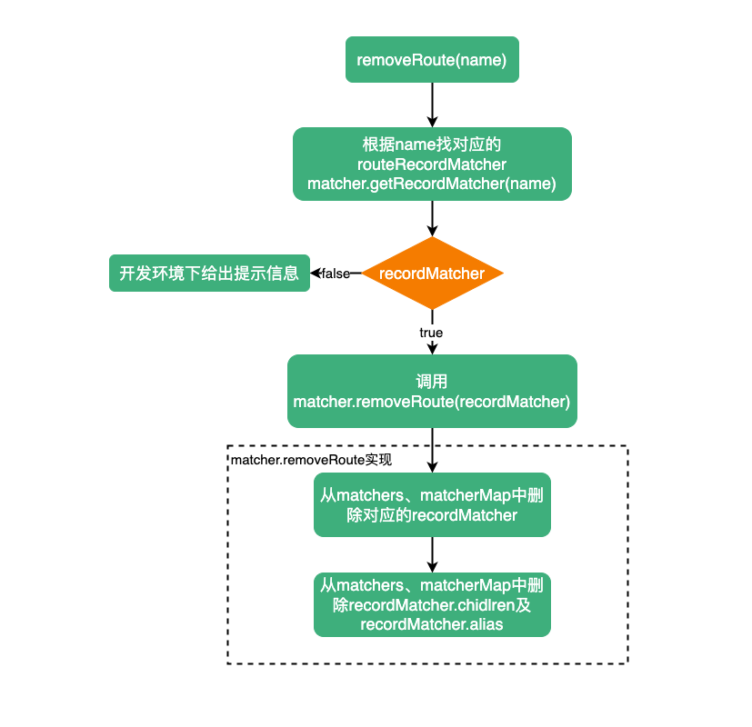

# removeRoute

::: tip
通过名称删除现有路由
:::

`removeRoute`接收一个`name`（现有路由名称）属性。

```ts
function removeRoute(name: RouteRecordName) {
  // 根据name获取对应的routeRecordMatcher
  const recordMatcher = matcher.getRecordMatcher(name)
  if (recordMatcher) {
    // 如果存在recordMatcher，调用matcher.removeRoute
    matcher.removeRoute(recordMatcher)
  } else if (__DEV__) {
    warn(`Cannot remove non-existent route "${String(name)}"`)
  }
}
```

对于`matcher.removeRoute`，参考[matcher.removeRoute](https://maxlz1.github.io/blog/vue-router/routerMatcher.html#removeroute)

`removeRoute`流程：


