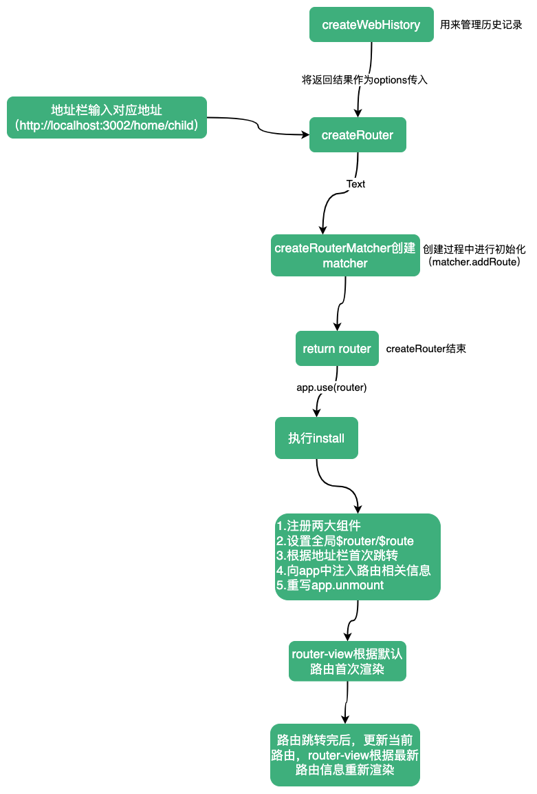

截止目前，已经将`vue-router`的整个源码根据其暴露的`API`分析了一遍，现在我们通过实例将整个过程组合起来，加深对`vue-router`的理解。

首先规定我们的路由表：

```ts
const routes = [
  {
    path: '/',
    redirect: '/home',
  },
  {
    path: '/home',
    components: {
      default: Home,
      other: Other
    },
    children: [
      {
        path: 'child',
        component: Child
      }
    ]
  },
  {
    path: '/:data(.*)',
    component: NotFound,
    name: 'NotFound'
  },
]
```

```html
<!-- Home -->
<template>
  <div>Home</div>
  <RouterView />
</template>

<!-- Other -->
<template>
  <div>Other</div>
</template>

<!-- Child -->
<template>
  <div>Child</div>
</template>

<!-- NotFound -->
<template>
  <div>NotFound</div>
</template>

<!-- App -->
<template>
  <div>root</div>
  <router-link class="link" to="/">/</router-link>
  <router-link class="link" to="/home">/home</router-link>
  <router-link class="link" to="/home/child">/home/child</router-link>
  <router-link class="link" to="/xxx">/xxx</router-link>
  <router-view name="default" />
  <br />
  <router-view name="other" />
</template>
```

现在我们访问`http://localhost:3002/home/child`，并观察其执行过程。

首先需要使用`createWebHistory`/`createWebHashHistory`/`createMemoryHistory`之一创建一个`history`。`history`的作用是用来保存路由跳转过程中历史记录，在创建`history`的过程中会添加两个监听事件`popstate`、`beforeunload`，一旦历史记录发生变化，触发`popstate`事件，`beforeunload`的作用是在页面关闭或刷新时，记录页面的滚动位置。

然后执行`createRouter`方法，创建一个`router`。在`createRouter`中还会创建一个`routerMatcher`，大部分路由操作都依靠`routerMatcher`，`routerMatcher`中通过一个数组和`Map`维护，数组和`Map`中存储的一些路由信息，这些信息包括路径的正则表达式、路径的分数、经过标准化的路由信息等信息。在创建`routerMatcher`的过程中添加路由表（`matcher.addRoute`）。 然后在`createRouter`最后声明一个`router`对象，将其返回。`router`中包含了供用户使用的大部分API。此时`createRouter`执行完毕。

因为我们声明`router`后，会调用`app.use(router)`。在`use`方法中会执行`router.install(app)`。在`install`的过程中会做几件比较重要的事：

1. 注册`RouterLink`、`RouterView`组件
2. 设置全局属性`$router`、`$route`
3. 根据地址栏进行首次的路由跳转
4. 向`app`中注入一些路由相关信息，如路由实例、响应式的当前路由信息对象
5. 拦截`app.unmount`方法，在卸载之前重置一些属性、删除一些监听函数

执行完`install`后，`App.vue`中的`router-view`开始首次渲染，因为此时`currentRoute`是默认的（`START_LOCATION_NORMALIZED`），所以第一次渲染是空的。（依次`App.vue router-view(default)`=>`App.vue router-view(other)`）

当`install`中的第一次跳转完成后，`currentRoute`发生变化，`App.vue`中的`router-view`开始第二次渲染，`name`为`default`的`router-view`首先渲染为`Home`，紧接着`Home`中的`router-view`开始首次渲染，这次渲染可以直接从`currentRoute`中获取到需要渲染的组件，所以`Home`中的`router-view`首次渲染就得到了匹配的路由组件。当`Home`渲染完，接着`App.vue`中`name`为`other`的`router-view`会接着完成渲染。

至此，整个流程完毕。


