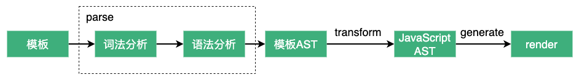

# 初识编译器

## 什么是编译器

**编译器**可以理解为一段将一种语言"翻译"成另一种语言的程序。一个完整的编译过程通常会包含词法分析、语法分析、语义分析、中间代码生成、优化、目标代码生成等步骤。

## vue3中的编译器作用

我们清楚组件的渲染是通过渲染函数`render`实现的，但在`vue`中可以通过`template`定义DOM结构，`template`中会包含一些`HTML`标签、插值表达式、组件标签、指令等，它是无法直接在`JavaScript`环境下运行的，所以需要将`template`转为渲染函数，这个过程就是**编译**。所以`vue`中的编译器的主要工作就是将模板编译为渲染函数。

如果你看过之间介绍[组件实例的创建过程](https://maxlz1.github.io/blog/vue3-analysis/renderer/componentInstance.html#setupstatefulcomponent)的文章，你可能记得在执行完`setup`后会执行一个`finishComponentSetup`函数，在`finishComponentSetup`中有一个重要的操作就是检查组件实例中是否存在`render`函数，如果不存在则需要根据`template`编译出渲染函数。

```ts {34,41}
function finishComponentSetup () {
  // ...
  
  if (!instance.render) {
    if (!isSSR && compile && !Component.render) {
      const template =
        (__COMPAT__ &&
          instance.vnode.props &&
          instance.vnode.props['inline-template']) ||
        Component.template
      if (template) {
        if (__DEV__) {
          startMeasure(instance, `compile`)
        }
        const { isCustomElement, compilerOptions } = instance.appContext.config
        const { delimiters, compilerOptions: componentCompilerOptions } =
          Component
        const finalCompilerOptions: CompilerOptions = extend(
          extend(
            {
              isCustomElement,
              delimiters
            },
            compilerOptions
          ),
          componentCompilerOptions
        )
        if (__COMPAT__) {
          finalCompilerOptions.compatConfig = Object.create(globalCompatConfig)
          if (Component.compatConfig) {
            extend(finalCompilerOptions.compatConfig, Component.compatConfig)
          }
        }
        Component.render = compile(template, finalCompilerOptions)
        if (__DEV__) {
          endMeasure(instance, `compile`)
        }
      }
    }

    instance.render = (Component.render || NOOP) as InternalRenderFunction

    if (installWithProxy) {
      installWithProxy(instance)
    }
  }
  // ...
}
```

## vue3中编译器的编译过程

vue3中编译器的整个编译过程可以概括为：解析`template`生成模板抽象语法树`AST`（`parse`过程）、将`AST`转换为`JavaScript AST`（`transform`过程）、根据`JavaScript AST`生成`JavaScript`代码（`generate`过程），即组件渲染函数。



`AST`是抽象语法树，是使用`JavaScript Object`来描述模板结构的一种方式。如：

```html
<ul :class="ulClass">
  <li v-for="item in data" :key="item.id">{{ item.text }}</li>
</ul>
```

对应的`AST`为：

```ts
const ast = {
  type: NodeTypes.ROOT, // 根节点
  children: [
    // ul
    {
      type: NodeTypes.ELEMENT, // 标签类型
      tag: 'ul',
      props: [
        {
          type: NodeTypes.DIRECTIVE, // 指令类型
          name: 'bind', // 指令名
          // 指令参数
          arg: {
            type: NodeTypes.SIMPLE_EXPRESSION,
            content: 'class',
            isStatic: true // 是否是静态的
          },
          // 指令表达式
          exp: {
            type: NodeTypes.SIMPLE_EXPRESSION,
            content: 'ulClass',
            isStatic: false
          }
        }
      ],
      children: [
        // li
        {
          type: NodeTypes.ELEMENT,
          tag: 'li',
          props: [
            {
              type: NodeTypes.DIRECTIVE,
              name: 'for',
              arg: undefined,
              exp: {
                type: NodeTypes.SIMPLE_EXPRESSION,
                content: 'item in data',
                isStatic: false
              }
            },
            {
              type: NodeTypes.DIRECTIVE,
              name: 'bind',
              arg: {
                type: NodeTypes.SIMPLE_EXPRESSION,
                content: 'key',
                isStatic: true
              },
              exp: {
                type: NodeTypes.SIMPLE_EXPRESSION,
                content: 'item.id',
                isStatic: false
              }
            },
          ],
          children: [
            {
              type: NodeTypes.INTERPOLATION, // 插值类型
              content: {
                type: NodeTypes.SIMPLE_EXPRESSION,
                content: 'item.text', // 插值表达式
                isStatic: false
              }
            }
          ]
        }
      ]
    }
  ]
}
```

## 总结

`vue3`中编译器的主要作用是是根据模板编译出渲染函数。编译过程可概括为：由`template`解析出模板`AST`、将模板`AST`转换为`JavaScript AST`、根据`JavaScript AST`生成`渲染函数。

`vue3`的编译器在编译过程中，还会进行编译优化，如`vnode.patchFlag`、`Block`、静态提升等。
