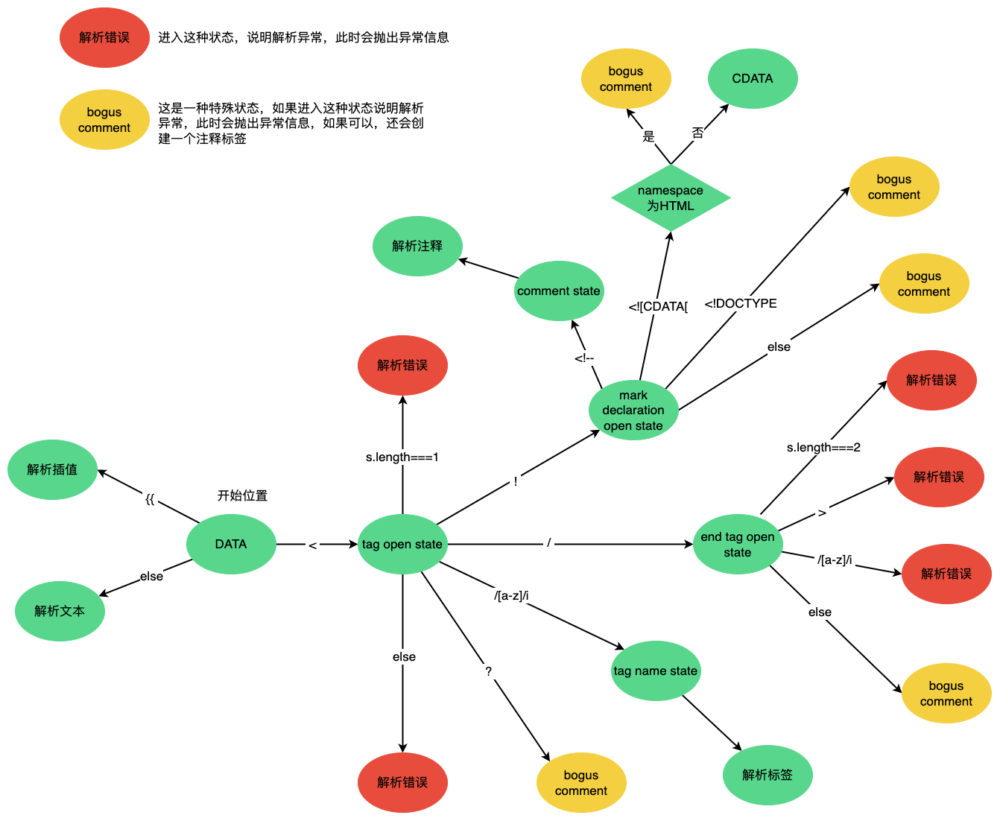
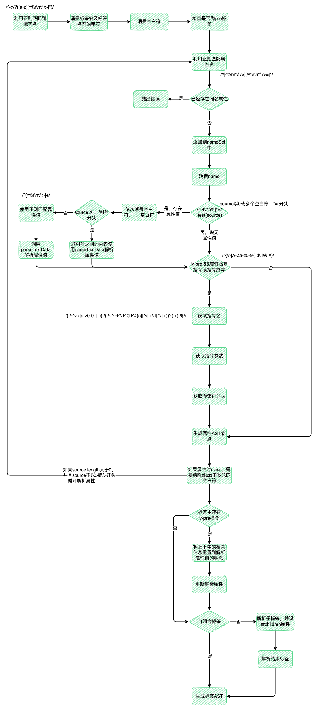
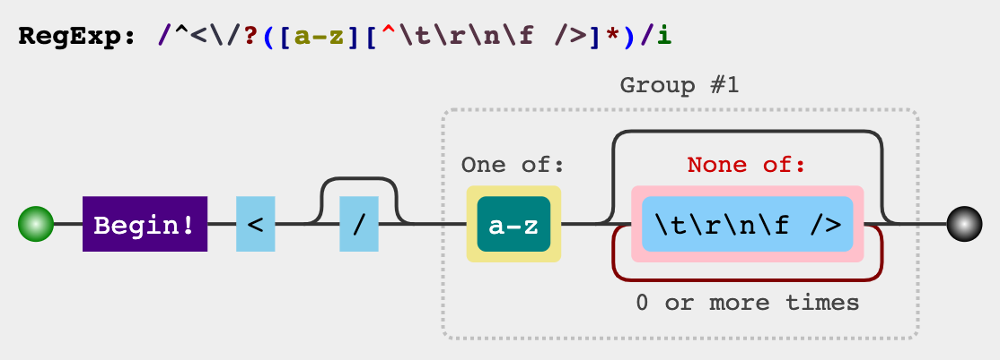
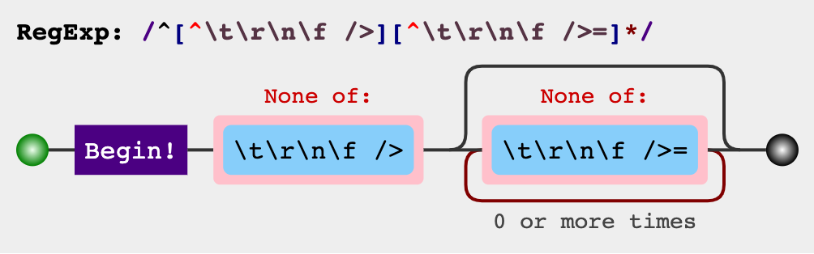
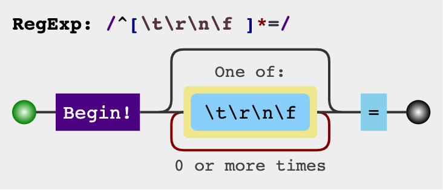
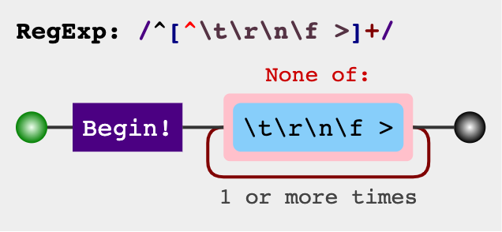
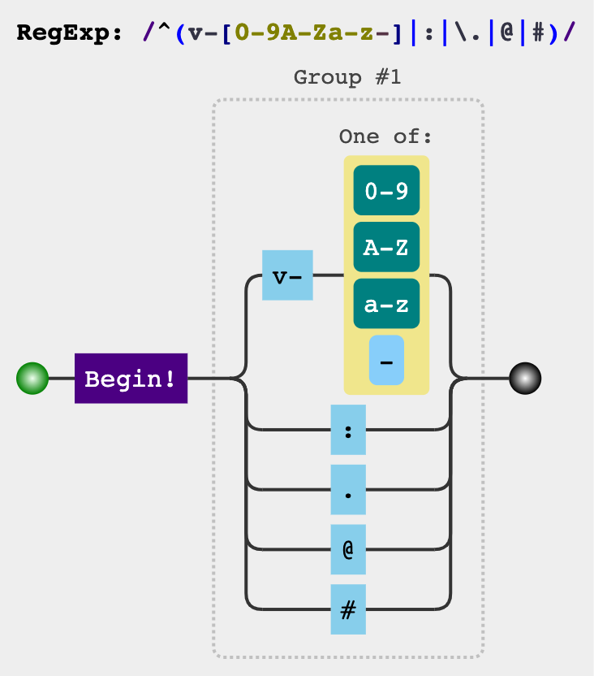
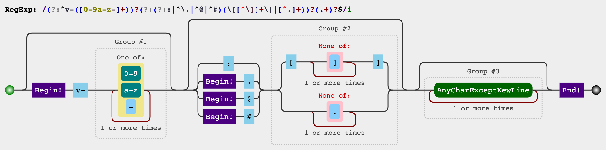

# 模板的解析

在前文中，我们将模板的编译过程概括为三个阶段：由`template`解析出模板`AST`、将模板`AST`转换为`JavaScript AST`、根据`JavaScript AST`生成`渲染函数。

本文我们就从第一个阶段开始，分析如何将`template`解析为`AST`，即`parse`过程。

`template`的解析过程其实就是一个状态机，它的状态转移过程和[WHATWG](https://html.spec.whatwg.org/multipage/parsing.html)中`HTML`的解析标准是相似的。

你可以直接使用`@vue/compiler-dom`包解析`template`。

```html
<script type="importmap">
  {
    "imports": {
      "compiler-dom": "https://unpkg.com/@vue/compiler-dom@3.2.37/dist/compiler-dom.esm-browser.js"
    }
  }
</script>

<template id="demo">
  <ul :class="ulClass">
    <li v-for="item in data" :key="item.id">{{ item.text }}</li>
  </ul>
</template>

<script type="module">
  import { parse } from 'compiler-dom'
  
  const template = document.querySelector('#demo').innerHTML
  
  console.log(parse(template))
</script>
```

## parse

`parse`方法会调用一个`baseParse`方法进行解析`template`。
```ts
export function parse(template: string, options: ParserOptions = {}): RootNode {
  return baseParse(template, extend({}, parserOptions, options))
}
```

`baseParse`：
```ts
export function baseParse(
  content: string,
  options: ParserOptions = {}
): RootNode {
  // 创建上下文
  const context = createParserContext(content, options)
  // 获取游标
  const start = getCursor(context)
  // 创建根节点，同时解析content生成孩子节点
  return createRoot(
    parseChildren(context, TextModes.DATA, []),
    // 获取需要解析的源码片段
    getSelection(context, start)
  )
}
```

在`baseParse`中首先使用`createParserContext`创建一个上下文对象。

```ts
function createParserContext(
  content: string,
  rawOptions: ParserOptions
): ParserContext {
  const options = extend({}, defaultParserOptions)

  let key: keyof ParserOptions
  // 如果rawOptions[key]为undefined，则应用defaultParserOptions[key]
  for (key in rawOptions) {
    options[key] =
      rawOptions[key] === undefined
        ? defaultParserOptions[key]
        : rawOptions[key]
  }
  return {
    options, // 解析options
    column: 1, // 当前列
    line: 1, // 当前行
    offset: 0, // 当前偏移量
    originalSource: content, // 原始template
    source: content, // 随着不断解析，不断进行更换
    inPre: false, // 是否为<pre>标签，在<pre>标签内的内容，会保留空格和换行
    inVPre: false, // 是否存在v-pre指令，拥有v-pre指令的元素及其子元素，会跳过他们的编译
    onWarn: options.onWarn
  }
}
```

`getCursor`方法在解析`template`中是个常用的方法，它可以获取某一时刻上下文中的位置信息。

```ts
function getCursor(context: ParserContext): Position {
  const { column, line, offset } = context
  return { column, line, offset }
}
```

最后使用`createRoot`方法创建一个`AST`根节点。在创建根节点前，会先使用`parseChildren`解析子节点。

## TextModes

模板的解析本质是个状态机，其状态迁移流程和HTML的解析过程十分类似。在不同状态下，解析器的解析行为是不同的。例如在`<textarea>`中的标签并不会被作为标签被解析，而是将其解析为文本，在`<div>`中的标签会被作为标签解析。

以下是一些特殊的状态：

```ts
export const enum TextModes {
  //          | Elements | Entities | End sign              | Inside of
  DATA, //    | ✔        | ✔        | End tags of ancestors |
  RCDATA, //  | ✘        | ✔        | End tag of the parent | <textarea>
  RAWTEXT, // | ✘        | ✘        | End tag of the parent | <style>,<script>
  CDATA,
  ATTRIBUTE_VALUE
}
```

- `DATA`状态下，解析器可以解析标签和字符实体。[WHATWG DATA state](https://html.spec.whatwg.org/multipage/parsing.html#data-state)
- `RCDATA`状态下，解析器不可以解析标签，但可以解析字符实体。[WHATWG RCDATA state](https://html.spec.whatwg.org/multipage/parsing.html#rcdata-state)
- `RAWTEXT`状态下，解析器既不可以解析标签，也不可以解析字符实体。[WHATWG RAWTEXT state](https://html.spec.whatwg.org/multipage/parsing.html#rawtext-state)
- `CDATA`状态下，和`RAWTEXT`类似，解析器既不可以解析标签，也不可以解析字符实体，解析器会把任何字符都当做普通字符处理。[WHATWG CDATA state](https://html.spec.whatwg.org/multipage/parsing.html#cdata-section-state)
- `ATTRIBUTE_VALUE`

## parseChildren

`parseChildren`函数是整个解析过程的核心函数，它接收三个参数：`context`上下文（包含解析过程中的一些状态）、`mode`当前所处的状态、`ancestors`一个父节点栈。

<details>
  <summary><code>parseChildren</code>源码</summary>

```ts
function parseChildren(
  context: ParserContext,
  mode: TextModes,
  ancestors: ElementNode[]
): TemplateChildNode[] {
  // 获取父节点
  const parent = last(ancestors)
  const ns = parent ? parent.ns : Namespaces.HTML
  const nodes: TemplateChildNode[] = []

  while (!isEnd(context, mode, ancestors)) {
    __TEST__ && assert(context.source.length > 0)
    const s = context.source
    let node: TemplateChildNode | TemplateChildNode[] | undefined = undefined

    if (mode === TextModes.DATA || mode === TextModes.RCDATA) {
      // 不在v-pre指令中，并且s以{{开头
      // 处理插值
      if (!context.inVPre && startsWith(s, context.options.delimiters[0])) {
        // '{{'
        node = parseInterpolation(context, mode)
      }
      // mode为TextModes.DATA，并且s以<开头
      else if (mode === TextModes.DATA && s[0] === '<') {
        // https://html.spec.whatwg.org/multipage/parsing.html#tag-open-state
        // 如果长度为1，解析错误
        if (s.length === 1) {
          emitError(context, ErrorCodes.EOF_BEFORE_TAG_NAME, 1)
        } else if (s[1] === '!') { // 如果以<!开头
          if (startsWith(s, '<!--')) { // 以<!--开头，按照注释进进行解析
            node = parseComment(context)
          } else if (startsWith(s, '<!DOCTYPE')) { // 以<!DOCTYPE开头，会按照注释进行解析
            node = parseBogusComment(context)
          } else if (startsWith(s, '<![CDATA[')) { // 以<![CDATA[开头
            // ns不为Namespaces.HTML，按照CDATA进行解析，否则按照注释进行解析
            if (ns !== Namespaces.HTML) {
              node = parseCDATA(context, ancestors)
            } else {
              emitError(context, ErrorCodes.CDATA_IN_HTML_CONTENT)
              node = parseBogusComment(context)
            }
          } else { // 其他情况，按照注释进行解析
            emitError(context, ErrorCodes.INCORRECTLY_OPENED_COMMENT)
            node = parseBogusComment(context)
          }
        } else if (s[1] === '/') { // 以</开头
          // https://html.spec.whatwg.org/multipage/parsing.html#end-tag-open-state
          // 如果长度为2，解析错误
          if (s.length === 2) {
            emitError(context, ErrorCodes.EOF_BEFORE_TAG_NAME, 2)
          } else if (s[2] === '>') { // 以</>开头，解析错误
            emitError(context, ErrorCodes.MISSING_END_TAG_NAME, 2)
            advanceBy(context, 3)
            continue
          } else if (/[a-z]/i.test(s[2])) { // 以</[a-z]开头，解析错误
            emitError(context, ErrorCodes.X_INVALID_END_TAG)
            parseTag(context, TagType.End, parent)
            continue
          } else {
            emitError(
              context,
              ErrorCodes.INVALID_FIRST_CHARACTER_OF_TAG_NAME,
              2
            )
            node = parseBogusComment(context)
          }
        } else if (/[a-z]/i.test(s[1])) { // 以<[a-z]开头，按照标签节点进行解析
          node = parseElement(context, ancestors)

          // 2.x <template> with no directive compat
          if (
            __COMPAT__ &&
            isCompatEnabled(
              CompilerDeprecationTypes.COMPILER_NATIVE_TEMPLATE,
              context
            ) &&
            node &&
            node.tag === 'template' &&
            !node.props.some(
              p =>
                p.type === NodeTypes.DIRECTIVE &&
                isSpecialTemplateDirective(p.name)
            )
          ) {
            __DEV__ &&
              warnDeprecation(
                CompilerDeprecationTypes.COMPILER_NATIVE_TEMPLATE,
                context,
                node.loc
              )
            node = node.children
          }
        } else if (s[1] === '?') { // 以<?开头，解析错误
          emitError(
            context,
            ErrorCodes.UNEXPECTED_QUESTION_MARK_INSTEAD_OF_TAG_NAME,
            1
          )
          node = parseBogusComment(context)
        } else {
          emitError(context, ErrorCodes.INVALID_FIRST_CHARACTER_OF_TAG_NAME, 1)
        }
      }
    }
    // 如果node不存在，说明mode不为DATA或RCDATA
    // 这时按文本进行解析
    if (!node) {
      node = parseText(context, mode)
    }
    // 将node放入nodes中
    if (isArray(node)) {
      for (let i = 0; i < node.length; i++) {
        pushNode(nodes, node[i])
      }
    } else {
      pushNode(nodes, node)
    }
  }

  // 处理空格
  let removedWhitespace = false
  if (mode !== TextModes.RAWTEXT && mode !== TextModes.RCDATA) {
    const shouldCondense = context.options.whitespace !== 'preserve'
    for (let i = 0; i < nodes.length; i++) {
      const node = nodes[i]
      if (!context.inPre && node.type === NodeTypes.TEXT) {
        if (!/[^\t\r\n\f ]/.test(node.content)) {
          const prev = nodes[i - 1]
          const next = nodes[i + 1]
          // Remove if:
          // - the whitespace is the first or last node, or:
          // - (condense mode) the whitespace is adjacent to a comment, or:
          // - (condense mode) the whitespace is between two elements AND contains newline
          if (
            !prev ||
            !next ||
            (shouldCondense &&
              (prev.type === NodeTypes.COMMENT ||
                next.type === NodeTypes.COMMENT ||
                (prev.type === NodeTypes.ELEMENT &&
                  next.type === NodeTypes.ELEMENT &&
                  /[\r\n]/.test(node.content))))
          ) {
            removedWhitespace = true
            nodes[i] = null as any
          } else {
            // Otherwise, the whitespace is condensed into a single space
            node.content = ' '
          }
        } else if (shouldCondense) {
          // in condense mode, consecutive whitespaces in text are condensed
          // down to a single space.
          node.content = node.content.replace(/[\t\r\n\f ]+/g, ' ')
        }
      }
      // Remove comment nodes if desired by configuration.
      else if (node.type === NodeTypes.COMMENT && !context.options.comments) {
        removedWhitespace = true
        nodes[i] = null as any
      }
    }
    if (context.inPre && parent && context.options.isPreTag(parent.tag)) {
      // remove leading newline per html spec
      // https://html.spec.whatwg.org/multipage/grouping-content.html#the-pre-element
      const first = nodes[0]
      if (first && first.type === NodeTypes.TEXT) {
        first.content = first.content.replace(/^\r?\n/, '')
      }
    }
  }

  return removedWhitespace ? nodes.filter(Boolean) : nodes
}
```
</details>

`parseChildren`的过程就是一个状态机，其状态迁移过程可以简单表示如下：

::: v-pre
- 如果字符串以`{{`开头，则表示它是个插值节点，调用`parseInterpolation`解析插值节点。
- 如果遇到`<`。
  - 如果字符串长度为1，抛出错误（错误信息为`Unexpected EOF in tag`）。
  - 如果下一个字符为`!`。
    - 如果字符串以`<!--`开头，则表示它是一个注释节点，调用`parseComment`解析注释节点。
    - 如果字符串以`<!DOCTYPE`开头，则会按照注释进行处理`<!`与`>`之间的内容。
    - 如果字符串以`<![CDATA[`开头。如果命名空间为`HTML`，抛出错误（错误信息为`CDATA section is allowed only in XML context`）；否则调用`parseCDATA`函数按`CDATA`节点处理。
    - 其他情况，抛出错误（错误信息为`Incorrectly opened comment`）。
  - 如果下一个字符为`/`。
    - 如果字符串长度为2，抛出错误（错误信息为`Unexpected EOF in tag`）。
    - 如果下一个字符为`>`，抛出错误（错误信息为`End tag name was expected`）。
    - 如果下一个字符匹配`/[a-z]/i`，抛出错误（错误信息为`Invalid end tag`）。为什么这里抛出错误？因为每解析到一个开始标签，就会消费一个对应的闭合标签，所以如果在此处碰到闭合标签，说明缺少对应的开始标签。
    - 其他情况，抛出错误（错误信息为`Illegal tag name. Use '&lt;' to print '<'.`）。
  - 如果下一个字符匹配`/[a-z]/i`，则表示它是个标签节点，调用`parseElement`解析标签。
  - 如果下一个字符为`?`，抛出错误（错误信息为`'<?' is allowed only in XML context`）。
  - 其他情况，抛出错误（错误信息为`Illegal tag name. Use '&lt;' to print '<'.`）。
:::

下图示`praseChildren`的状态转移过程，其中`xxx state`引用的是WHATWG中的定义的状态



**状态机何时结束？**

在`while`循环过程中，通过一个`isEnd`函数来判断状态机是否应该停止。

```ts
function isEnd(
  context: ParserContext,
  mode: TextModes,
  ancestors: ElementNode[]
): boolean {
  const s = context.source

  switch (mode) {
    // DATA模式下，支持解析标签
    // 所以只要父节点栈中存在与source中的标签名一致的节点，则本轮解析完毕
    // 为什么需要从父节点栈中从栈顶向栈底寻找？
    // 这是因为如果标签是错乱的，也需要尽可能找到开始标签。
    // 如<div><p></div></p>，此时会解析出div标签，p标签在parseElement过程中，由于未匹配闭合标签，所以抛出错误
    case TextModes.DATA:
      if (startsWith(s, '</')) {
        // 如果source以</开头，并且父节点栈中存在对应的开始标签，则本轮解析完毕
        for (let i = ancestors.length - 1; i >= 0; --i) {
          if (startsWithEndTagOpen(s, ancestors[i].tag)) {
            return true
          }
        }
      }
      break

    // 由于RCDATA和RAWTEXT不支持解析标签
    // 所以只要判断父节点栈中的最后一个节点标签名与此时source中的标签名是否一致即可
    case TextModes.RCDATA:
    case TextModes.RAWTEXT: {
      const parent = last(ancestors)
      // 存在父节点，并且source中的标签名与父节点标签名一致
      if (parent && startsWithEndTagOpen(s, parent.tag)) {
        return true
      }
      break
    }

    case TextModes.CDATA:
      // source以]]>开头，则本轮解析完毕
      if (startsWith(s, ']]>')) {
        return true
      }
      break
  }

  // source消耗完毕，则解析完毕
  return !s
}
```

### `parseInterpolation`解析插值

```ts
function parseInterpolation(
  context: ParserContext,
  mode: TextModes
): InterpolationNode | undefined {
  // 获取插值分隔符，默认"{{"、"}}"
  const [open, close] = context.options.delimiters
  __TEST__ && assert(startsWith(context.source, open))

  // 获取关闭插值分隔符的索引
  const closeIndex = context.source.indexOf(close, open.length)
  // 如果没有关闭插值分隔符，说明插值分隔符未关闭
  if (closeIndex === -1) {
    emitError(context, ErrorCodes.X_MISSING_INTERPOLATION_END)
    return undefined
  }

  // 获取开始的游标
  const start = getCursor(context)
  // 将开始的插值分隔符消费掉，并更新context.source/offset/line/column
  advanceBy(context, open.length)
  // 插值开始位置
  const innerStart = getCursor(context)
  // 插值结束位置
  const innerEnd = getCursor(context)
  // 插值的长度
  const rawContentLength = closeIndex - open.length
  // 获取插值内容，"{{"与"}}"中间的内容
  const rawContent = context.source.slice(0, rawContentLength)
  // 解析插值内容
  const preTrimContent = parseTextData(context, rawContentLength, mode)
  // 删除两端空格
  const content = preTrimContent.trim()
  // 如果插值中存在前置空格，需要更新start位置
  const startOffset = preTrimContent.indexOf(content)
  if (startOffset > 0) {
    advancePositionWithMutation(innerStart, rawContent, startOffset)
  }
  // 更新结束位置
  const endOffset =
    rawContentLength - (preTrimContent.length - content.length - startOffset)
  advancePositionWithMutation(innerEnd, rawContent, endOffset)
  // 消费关闭的插值分隔符
  advanceBy(context, close.length)

  // 生成节点并返回
  return {
    type: NodeTypes.INTERPOLATION,
    content: {
      type: NodeTypes.SIMPLE_EXPRESSION,
      isStatic: false,
      constType: ConstantTypes.NOT_CONSTANT,
      // 去除空格后的插值
      content,
      // 使用getSelection获取innerStart-innerEnd之间的内容
      loc: getSelection(context, innerStart, innerEnd)
    },
    // 包含插值分隔符的内容
    loc: getSelection(context, start)
  }
}
```

解析插值时，首先进行插值分隔符是否完整，如果缺失关闭分隔符（默认`}}`），则抛出错误。如果插值完整，则会解析出不包含前后空格的插值表达式，并生成节点返回。

这里有几个比较重要的方法`advanceBy`、`advancePositionWithMutation`。`advanceBy`方法会消费上下文中`source`指定的长度，即将`source`从头开始删除指定长度的字符，并进行重新赋值。`advancePositionWithMutation`方法可以更新传入位置对象中的游标信息。

```ts
function advanceBy(context: ParserContext, numberOfCharacters: number): void {
  const { source } = context
  __TEST__ && assert(numberOfCharacters <= source.length)
  // 将context中的游标信息，向后移动numberOfCharacters步
  advancePositionWithMutation(context, source, numberOfCharacters)
  // 删除source的前numberOfCharacters个字符并重新赋值
  context.source = source.slice(numberOfCharacters)
}

export function advancePositionWithMutation(
  pos: Position,
  source: string,
  numberOfCharacters: number = source.length
): Position {
  // 行数
  let linesCount = 0
  // 最后一行的位置
  let lastNewLinePos = -1
  for (let i = 0; i < numberOfCharacters; i++) {
    // 如果第i个字符是换行符，行数+1，更新lastNewLinePos为i
    if (source.charCodeAt(i) === 10 /* newline char code */) {
      linesCount++
      lastNewLinePos = i
    }
  }
  
  // 更新偏移量，直接+numberOfCharacters即可
  pos.offset += numberOfCharacters
  // 更新行数
  pos.line += linesCount
  // 更新列数
  // 如果lastNewLinePos为-1，说明未发生换行，column = column + numberOfCharacters
  // 否则列数为numberOfCharacters - lastNewLinePos，因为是新行，所以列数就等于需要偏移的字符数 - 发生最后一次换行的字符索引
  // 如偏移字符数为4，索引2处发生最后一次换行，那么此时列数其实就是索引2后面的字符数，即4 - 2
  pos.column =
    lastNewLinePos === -1
      ? pos.column + numberOfCharacters
      : numberOfCharacters - lastNewLinePos

  return pos
}
```

### parseTextData

在解析插值表达式时，并不是直接将去除前后空格之后的内容作为插值表达式，而是调用了一个`parseTextData`方法。

```ts
function parseTextData(
  context: ParserContext,
  length: number,
  mode: TextModes
): string {
  // 获取原始内容
  const rawText = context.source.slice(0, length)
  // 消费length数量的字符
  advanceBy(context, length)
  // 如果mode为RAWTEXT或CDATA，或rawText中不包含&，直接返回rawText
  if (
    mode === TextModes.RAWTEXT ||
    mode === TextModes.CDATA ||
    !rawText.includes('&')
  ) {
    return rawText
  } else { // 否则会调用context.options.decodeEntities方法进行解析
    // DATA or RCDATA containing "&"". Entity decoding required.
    return context.options.decodeEntities(
      rawText,
      mode === TextModes.ATTRIBUTE_VALUE
    )
  }
}
```

`parseTextData`中会首先调用`advanceBy`消费掉指定数量的字符，然后判断`mode`是否为`RAWTEXT`或`CDATA`或文本中不包含`&`字符，如果符合条件，直接返回原始文本，否则调用`context.options.decodeEntities`进行解码。

这是因为`RAWTEXT`或`CDATA`模式下，不支持字符实体的解析，所以可以直接返回原始文本；而`DATA`或`RCDATA`模式下，是可以解析字符实体的，所以调用`context.options.decodeEntities`进行解码。

### parseText解析文本

```ts
function parseText(context: ParserContext, mode: TextModes): TextNode {
  __TEST__ && assert(context.source.length > 0)

  // 如果在CDATA模式下，遇到]]>后，解析结束
  // 否则遇到<或开始的插值分隔符，解析结束
  const endTokens =
    mode === TextModes.CDATA ? [']]>'] : ['<', context.options.delimiters[0]]

  // 获取结束解析索引
  let endIndex = context.source.length
  for (let i = 0; i < endTokens.length; i++) {
    // context.source中的结束标识符的索引
    // 这里从索引1处开始查找，因为索引0处的字符决定了需要解析文本，所以索引0处的字符不可能是结束表示符
    // 如果同时存在<和开始的插值分隔符，则取靠左的结束索引
    const index = context.source.indexOf(endTokens[i], 1)
    if (index !== -1 && endIndex > index) {
      endIndex = index
    }
  }

  __TEST__ && assert(endIndex > 0)

  // 获取开始的游标
  const start = getCursor(context)
  // 调用parseTextData解析文本
  const content = parseTextData(context, endIndex, mode)

  return {
    type: NodeTypes.TEXT,
    content,
    loc: getSelection(context, start)
  }
}
```

::: v-pre
在解析文本过程中，如果在`CDATA`模式下，遇到`]]>`结束解析，否则遇到`<`或开始插值分隔符（默认`{{`）结束解析。
:::

### parseComment解析注释

```ts
function parseComment(context: ParserContext): CommentNode {
  __TEST__ && assert(startsWith(context.source, '<!--'))

  const start = getCursor(context)
  let content: string

  // 使用正则匹配注释的结束标识符
  const match = /--(\!)?>/.exec(context.source)
  // 如果没有结束标识符，说明注释节点没有被正确关闭，此时抛出错误
  if (!match) {
    content = context.source.slice(4)
    advanceBy(context, context.source.length)
    emitError(context, ErrorCodes.EOF_IN_COMMENT)
  } else {
    // 如果结束标识符索引小于等于3，说明注释节点不合法
    // 因为进入parseComment方法时，说明注释节点至少存在"<!--"，如果束标识符索引小于等于3，说明注释节点时不合法的，如<!--->
    if (match.index <= 3) {
      emitError(context, ErrorCodes.ABRUPT_CLOSING_OF_EMPTY_COMMENT)
    }
    // <!-- xx --!>，不合法
    if (match[1]) {
      emitError(context, ErrorCodes.INCORRECTLY_CLOSED_COMMENT)
    }
    // 注释的内容
    content = context.source.slice(4, match.index)

    // 注释中如果存在"<!--"，抛出错误
    const s = context.source.slice(0, match.index)
    let prevIndex = 1,
      nestedIndex = 0
    while ((nestedIndex = s.indexOf('<!--', prevIndex)) !== -1) {
      // 消费掉"<!--"
      advanceBy(context, nestedIndex - prevIndex + 1)
      // 如果"<!--"的索引位置+4小于s的长度，说明注释中存在嵌套<!--。
      if (nestedIndex + 4 < s.length) {
        emitError(context, ErrorCodes.NESTED_COMMENT)
      }
      prevIndex = nestedIndex + 1
    }
    // 消费完整的注释节点
    advanceBy(context, match.index + match[0].length - prevIndex + 1)
  }

  return {
    type: NodeTypes.COMMENT,
    content,
    loc: getSelection(context, start)
  }
}
```

对于注释节点的解析，首先利用正则表达式`/--(\!)?>/`进行字符串匹配，如果没有匹配到结果，说明注释节点未关闭。如果存在匹配结果，但匹配到的开始索引小于等于3，说明注释是不合法的，因为注释节点的开始部分`<!--`的最大索引为3，如果结束部分的索引小等于3，说明`-`字符不足4个，如`<!--->`、`<!-->`；如果正则匹配到了`!`的话，注释节点也是不合法的；如果注释节点中存在`<!--`字符，也会抛出错误。

### parseElement解析标签

<details>
  <summary><code>parseElement</code>源码</summary>

```ts
function parseElement(
  context: ParserContext,
  ancestors: ElementNode[]
): ElementNode | undefined {
  __TEST__ && assert(/^<[a-z]/i.test(context.source))

  // 是否为pre标签
  const wasInPre = context.inPre
  // 是否在v-pre中
  const wasInVPre = context.inVPre
  // 父节点
  const parent = last(ancestors)
  // 解析tag
  const element = parseTag(context, TagType.Start, parent)
  // element是否为pre边界
  const isPreBoundary = context.inPre && !wasInPre
  // element是否为v-pre的边界
  const isVPreBoundary = context.inVPre && !wasInVPre

  // 如果标签是自闭和标签或是void标签（area,base,br,col,embed,hr,img,input,link,meta,param,source,track,wbr）
  if (element.isSelfClosing || context.options.isVoidTag(element.tag)) {
    
    if (isPreBoundary) {
      context.inPre = false
    }
    if (isVPreBoundary) {
      context.inVPre = false
    }
    return element
  }

  // Children.
  ancestors.push(element)
  // 获取此时的mode
  const mode = context.options.getTextMode(element, parent)
  // 递归解析子节点
  const children = parseChildren(context, mode, ancestors)
  // 弹出element
  ancestors.pop()

  // 2.x inline-template compat
  if (__COMPAT__) {
    const inlineTemplateProp = element.props.find(
      p => p.type === NodeTypes.ATTRIBUTE && p.name === 'inline-template'
    ) as AttributeNode
    if (
      inlineTemplateProp &&
      checkCompatEnabled(
        CompilerDeprecationTypes.COMPILER_INLINE_TEMPLATE,
        context,
        inlineTemplateProp.loc
      )
    ) {
      const loc = getSelection(context, element.loc.end)
      inlineTemplateProp.value = {
        type: NodeTypes.TEXT,
        content: loc.source,
        loc
      }
    }
  }

  // 设置子节点
  element.children = children

  // 解析结束标签
  if (startsWithEndTagOpen(context.source, element.tag)) {
    parseTag(context, TagType.End, parent)
  } else {
    // 结束标签丢失
    emitError(context, ErrorCodes.X_MISSING_END_TAG, 0, element.loc.start)
    if (context.source.length === 0 && element.tag.toLowerCase() === 'script') {
      const first = children[0]
      if (first && startsWith(first.loc.source, '<!--')) {
        emitError(context, ErrorCodes.EOF_IN_SCRIPT_HTML_COMMENT_LIKE_TEXT)
      }
    }
  }

  element.loc = getSelection(context, element.loc.start)

  if (isPreBoundary) {
    context.inPre = false
  }
  if (isVPreBoundary) {
    context.inVPre = false
  }
  return element
}
```
</details>

标签的解析主要分为四个步骤：

1. 解析标签名
2. 解析属性
3. 解析子节点
4. 解析闭合标签

如果节点是自闭合标签或`void`标签（包括`area`、`base`、`br`、`col`、`embed`、`hr`、`img`、`input`,`link`、`meta`、`param`、`source`、`track`、`wbr`），3、4步是不需要进行的。

### parseTag

<details>
  <summary><code>parseTag</code>源码</summary>

```ts
function parseTag(
  context: ParserContext,
  type: TagType,
  parent: ElementNode | undefined
): ElementNode | undefined {
  __TEST__ && assert(/^<\/?[a-z]/i.test(context.source))
  __TEST__ &&
    assert(
      type === (startsWith(context.source, '</') ? TagType.End : TagType.Start)
    )

  // Tag open.
  const start = getCursor(context)
  // 使用正则匹配标签
  // 正则解释：
  // 以"<"开头，紧跟着可以有一个"/"，然后紧跟着字母，然后其后不能是空白或"/"、">"
  const match = /^<\/?([a-z][^\t\r\n\f />]*)/i.exec(context.source)!
  // 标签名
  const tag = match[1]
  // 获取命名空间
  const ns = context.options.getNamespace(tag, parent)

  // 消费掉标签及标签之前的字符
  advanceBy(context, match[0].length)
  // 消费空白符，包括制表符、换行符、回车符、换页符、空格
  advanceSpaces(context)

  // 如果存在v-pre属性，需要借助这两个状态重新解析属性
  const cursor = getCursor(context)
  const currentSource = context.source

  // 检查是否为pre标签
  if (context.options.isPreTag(tag)) {
    context.inPre = true
  }

  // 解析属性
  let props = parseAttributes(context, type)

  // 如果存在v-pre指令需要重新解析属性
  if (
    type === TagType.Start &&
    !context.inVPre &&
    props.some(p => p.type === NodeTypes.DIRECTIVE && p.name === 'pre')
  ) {
    context.inVPre = true
    // 重置context中的source及游标信息到解析属性之前的状态
    extend(context, cursor)
    context.source = currentSource
    // 重新解析属性并过滤v-pre属性
    props = parseAttributes(context, type).filter(p => p.name !== 'v-pre')
  }

  // Tag close.
  let isSelfClosing = false
  // 如果此时source长度为0，说明标签未关闭
  if (context.source.length === 0) {
    emitError(context, ErrorCodes.EOF_IN_TAG)
  } else {
    // 是否为自闭合标签
    isSelfClosing = startsWith(context.source, '/>')
    // 如果现在解析的闭合标签，但是标签又为自闭和标签，name标签是不合法的
    if (type === TagType.End && isSelfClosing) {
      emitError(context, ErrorCodes.END_TAG_WITH_TRAILING_SOLIDUS)
    }
    // 消费闭合字符，如果是自闭合标签，消费"/>"，否则消费">"
    advanceBy(context, isSelfClosing ? 2 : 1)
  }

  // 如果解析的是闭合标签，此时可以return了
  if (type === TagType.End) {
    return
  }

  // 2.x deprecation checks
  // v-if与v-for优先级发生变化，进行提示
  if (
    __COMPAT__ &&
    __DEV__ &&
    isCompatEnabled(
      CompilerDeprecationTypes.COMPILER_V_IF_V_FOR_PRECEDENCE,
      context
    )
  ) {
    let hasIf = false
    let hasFor = false
    for (let i = 0; i < props.length; i++) {
      const p = props[i]
      if (p.type === NodeTypes.DIRECTIVE) {
        if (p.name === 'if') {
          hasIf = true
        } else if (p.name === 'for') {
          hasFor = true
        }
      }
      if (hasIf && hasFor) {
        warnDeprecation(
          CompilerDeprecationTypes.COMPILER_V_IF_V_FOR_PRECEDENCE,
          context,
          getSelection(context, start)
        )
        break
      }
    }
  }

  // 确定标签类型，默认ElementTypes.ELEMENT
  // 如果没有v-pre指令
  //    - 标签名为slot，那么标签类型则为 ElementTypes.SLOT
  //    - 标签名为template，并且标签属性中存在if,else,else-if,for,slot中的任意一个或多个，那么标签类型为ElementTypes.TEMPLATE
  //    - 标签名为组件，那么标签类型为ElementTypes.COMPONENT
  let tagType = ElementTypes.ELEMENT
  if (!context.inVPre) {
    if (tag === 'slot') {
      tagType = ElementTypes.SLOT
    } else if (tag === 'template') {
      if (
        props.some(
          p =>
            p.type === NodeTypes.DIRECTIVE && isSpecialTemplateDirective(p.name)
        )
      ) {
        tagType = ElementTypes.TEMPLATE
      }
    } else if (isComponent(tag, props, context)) {
      tagType = ElementTypes.COMPONENT
    }
  }

  return {
    type: NodeTypes.ELEMENT,
    ns,
    tag,
    tagType,
    props,
    isSelfClosing,
    children: [],
    loc: getSelection(context, start),
    codegenNode: undefined // to be created during transform phase
  }
}
```
</details>


<details>
  <summary><code>parseAttributes</code>源码</summary>

```ts
function parseAttributes(
  context: ParserContext,
  type: TagType
): (AttributeNode | DirectiveNode)[] {
  const props = []
  const attributeNames = new Set<string>()
  // 循环解析属性
  // 循环条件为：source长度大于0且不以">"和"/>"开头
  while (
    context.source.length > 0 &&
    !startsWith(context.source, '>') &&
    !startsWith(context.source, '/>')
  ) {
    // 如果source以"/"开头，抛出错误
    if (startsWith(context.source, '/')) {
      emitError(context, ErrorCodes.UNEXPECTED_SOLIDUS_IN_TAG)
      advanceBy(context, 1)
      advanceSpaces(context)
      continue
    }
    // 如果现在是在解析闭合标签，抛出错误
    if (type === TagType.End) {
      emitError(context, ErrorCodes.END_TAG_WITH_ATTRIBUTES)
    }
    
    // 解析属性
    const attr = parseAttribute(context, attributeNames)

    // 去除class属性的多余空白符
    // 包括去除首尾空格，减少class之间的空格
    // 可以减小css的大小
    if (
      attr.type === NodeTypes.ATTRIBUTE &&
      attr.value &&
      attr.name === 'class'
    ) {
      attr.value.content = attr.value.content.replace(/\s+/g, ' ').trim()
    }

    // 将解析好的属性放入props中
    if (type === TagType.Start) {
      props.push(attr)
    }

    // 如果此时的source开头不存在任何空白符，那么抛出错误。
    // 属性之间必须要有空白符
    if (/^[^\t\r\n\f />]/.test(context.source)) {
      emitError(context, ErrorCodes.MISSING_WHITESPACE_BETWEEN_ATTRIBUTES)
    }
    advanceSpaces(context)
  }
  return props
}
```
</details>

<details>
  <summary><code>parseAttribute</code>源码：</summary>

```ts
function parseAttribute(
  context: ParserContext,
  nameSet: Set<string>
): AttributeNode | DirectiveNode {
  __TEST__ && assert(/^[^\t\r\n\f />]/.test(context.source))

  // Name.
  const start = getCursor(context)
  // 匹配属性名
  // 正则解释
  // ^[^\t\r\n\f />]：不能以空白字符，或"/"、">"字符开头
  // [^\t\r\n\f />=]*：匹配0或多个非空白、"/"、">"、"="字符
  const match = /^[^\t\r\n\f />][^\t\r\n\f />=]*/.exec(context.source)!
  // 属性名
  const name = match[0]
  
  // 已经存在重复的属性名，抛出错误
  if (nameSet.has(name)) {
    emitError(context, ErrorCodes.DUPLICATE_ATTRIBUTE)
  }
  // 添加到set中
  nameSet.add(name)

  // 如果属性名以"="开头，抛出错误
  if (name[0] === '=') {
    emitError(context, ErrorCodes.UNEXPECTED_EQUALS_SIGN_BEFORE_ATTRIBUTE_NAME)
  }
  
  // 如果name中存在"、'、<字符，抛出错误
  {
    const pattern = /["'<]/g
    let m: RegExpExecArray | null
    while ((m = pattern.exec(name))) {
      emitError(
        context,
        ErrorCodes.UNEXPECTED_CHARACTER_IN_ATTRIBUTE_NAME,
        m.index
      )
    }
  }

  // 消费name
  advanceBy(context, name.length)

  // Value
  let value: AttributeValue = undefined

  // 检查此时source是否以(0或多个空白符 + "=")开头
  if (/^[\t\r\n\f ]*=/.test(context.source)) {
    // 消费空白符
    advanceSpaces(context)
    // 消费=
    advanceBy(context, 1)
    // 消费空白符
    advanceSpaces(context)
    // 解析属性值
    value = parseAttributeValue(context)
    // 如果未解析出属性值，抛出错误
    if (!value) {
      emitError(context, ErrorCodes.MISSING_ATTRIBUTE_VALUE)
    }
  }
  
  const loc = getSelection(context, start)

  // 如果不在v-pre指令中且name是指令或指令缩写
  // 以v-xxx、v--、:、.、@、#开头
  if (!context.inVPre && /^(v-[A-Za-z0-9-]|:|\.|@|#)/.test(name)) {
    const match =
      /(?:^v-([a-z0-9-]+))?(?:(?::|^\.|^@|^#)(\[[^\]]+\]|[^\.]+))?(.+)?$/i.exec(
        name
      )!

    let isPropShorthand = startsWith(name, '.')
    // 指令名
    // 如果存在match[1]，取match[1]
    // 否则，如果name以":"或"."开头，则为bind；如果以"@"开头，则为on；其他情况（以"#"开头）为slot
    let dirName =
      match[1] ||
      (isPropShorthand || startsWith(name, ':')
        ? 'bind'
        : startsWith(name, '@')
        ? 'on'
        : 'slot')
    let arg: ExpressionNode | undefined

    // 存在match[2]，(\[[^\]]+\]|[^\.]+)部分匹配到的内容
    // 例如
    // v-model:value，match[2]为value
    // @click，match[2]为click
    // v-html，match[2]为undefined
    if (match[2]) {
      const isSlot = dirName === 'slot'
      const startOffset = name.lastIndexOf(match[2])
      // 获取参数名在原始source中的位置信息及对应的原始字符串
      const loc = getSelection(
        context,
        getNewPosition(context, start, startOffset),
        getNewPosition(
          context,
          start,
          startOffset + match[2].length + ((isSlot && match[3]) || '').length
        )
      )
      let content = match[2]
      // 是否为静态属性
      let isStatic = true

      // 如果content以"["开头，说明是动态属性
      if (content.startsWith('[')) {
        isStatic = false

        // 如果content没有以"]"结束，抛出错误
        if (!content.endsWith(']')) {
          emitError(
            context,
            ErrorCodes.X_MISSING_DYNAMIC_DIRECTIVE_ARGUMENT_END
          )
          content = content.slice(1)
        } else {
          // 获取动态属性
          content = content.slice(1, content.length - 1)
        }
      } else if (isSlot) {
        // v-slot与vue2保持一致，允许v-slot:item.name="xxx"
        content += match[3] || ''
      }

      arg = {
        type: NodeTypes.SIMPLE_EXPRESSION,
        content,
        isStatic,
        constType: isStatic
          ? ConstantTypes.CAN_STRINGIFY
          : ConstantTypes.NOT_CONSTANT,
        loc
      }
    }

    // value以"或'开头，需要修改value.loc的中的位置信息（去除前后引号）
    if (value && value.isQuoted) {
      const valueLoc = value.loc
      valueLoc.start.offset++
      valueLoc.start.column++
      valueLoc.end = advancePositionWithClone(valueLoc.start, value.content)
      valueLoc.source = valueLoc.source.slice(1, -1)
    }

    // 修饰符列表
    const modifiers = match[3] ? match[3].slice(1).split('.') : []
    if (isPropShorthand) modifiers.push('prop')

    // 2.x compat v-bind:foo.sync -> v-model:foo
    if (__COMPAT__ && dirName === 'bind' && arg) {
      if (
        modifiers.includes('sync') &&
        checkCompatEnabled(
          CompilerDeprecationTypes.COMPILER_V_BIND_SYNC,
          context,
          loc,
          arg.loc.source
        )
      ) {
        dirName = 'model'
        modifiers.splice(modifiers.indexOf('sync'), 1)
      }

      if (__DEV__ && modifiers.includes('prop')) {
        checkCompatEnabled(
          CompilerDeprecationTypes.COMPILER_V_BIND_PROP,
          context,
          loc
        )
      }
    }

    return {
      type: NodeTypes.DIRECTIVE,
      name: dirName,
      exp: value && {
        type: NodeTypes.SIMPLE_EXPRESSION,
        content: value.content,
        isStatic: false,
        constType: ConstantTypes.NOT_CONSTANT,
        loc: value.loc
      },
      arg,
      modifiers,
      loc
    }
  }

  // 缺少指令名或非法指令名，抛出错误
  if (!context.inVPre && startsWith(name, 'v-')) {
    emitError(context, ErrorCodes.X_MISSING_DIRECTIVE_NAME)
  }

  return {
    type: NodeTypes.ATTRIBUTE,
    name,
    value: value && {
      type: NodeTypes.TEXT,
      content: value.content,
      loc: value.loc
    },
    loc
  }
}
```
</details>

<details>
  <summary><code>parseAttributeValue</code>源码</summary>

```ts
function parseAttributeValue(context: ParserContext): AttributeValue {
  const start = getCursor(context)
  let content: string

  const quote = context.source[0]
  const isQuoted = quote === `"` || quote === `'`
  // source以"或'开头
  if (isQuoted) {
    // 消费引号
    advanceBy(context, 1)

    // 末尾引号索引
    const endIndex = context.source.indexOf(quote)
    // 如果不存在，直接解析context.source.length个字符
    // 否则解析0-endIndex个字符，即endIndex个字符，然后消费最后一个引号
    if (endIndex === -1) {
      content = parseTextData(
        context,
        context.source.length,
        TextModes.ATTRIBUTE_VALUE
      )
    } else {
      content = parseTextData(context, endIndex, TextModes.ATTRIBUTE_VALUE)
      advanceBy(context, 1)
    }
  } else {
    // 不以引号开头
    // 以非空白符、非">"字符开头的1-n个字符
    const match = /^[^\t\r\n\f >]+/.exec(context.source)
    // 不存在value
    if (!match) {
      return undefined
    }
    
    // 如果匹配到的value存在"'<=`中的任意字符，抛出错误
    const unexpectedChars = /["'<=`]/g
    let m: RegExpExecArray | null
    while ((m = unexpectedChars.exec(match[0]))) {
      emitError(
        context,
        ErrorCodes.UNEXPECTED_CHARACTER_IN_UNQUOTED_ATTRIBUTE_VALUE,
        m.index
      )
    }
    // 解析value
    content = parseTextData(context, match[0].length, TextModes.ATTRIBUTE_VALUE)
  }

  return { content, isQuoted, loc: getSelection(context, start) }
}
```
</details>


标签解析流程图：



几个关键正则的解释：

- 标签名：`/^<\/?([a-z][^\t\r\n\f />]*)/i`
  
  必须以`<`开头，后面紧跟0至1个`/`，然后紧跟一个字母，其后是0至多个非空白符、非`/`字符、非`>`字符。`Group #1`中匹配到的就是标签名。

- 属性名：`/^[^\t\r\n\f />][^\t\r\n\f />=]*/`
  
  以非空白符、非`/`字符、非`>`字符开头，其后紧跟0至多个非空白符、非`/`字符、非`>`字符、非`=`字符。字符串能够匹配该正则，就作为属性名。

- 是否存在属性值：`/^[\t\r\n\f ]*=/`
  
  以0至多个非空白符开头，后面紧跟一个`=`字符。如果字符串可以匹配该正则，那么`=`后可能存在属性值。

- 属性值：`/^[^\t\r\n\f >]+/`
  
  以1至多个非空白符、非`>`符开头。如果字符串能够匹配该正则，那么字符串可以被作为属性值。

- 是否为指令或指令缩写：`/^(v-[A-Za-z0-9-]|:|\.|@|#)/`
  
  以`v-(大写、小写)字母`、`v-数字`、`v--`、`:`、`.`、`@`、`#`开头。如果属性名能够匹配该正则，那么属性名可以被作为指令。

- 指令名及指令参数名、修饰符：`/(?:^v-([a-z0-9-]+))?(?:(?::|^\.|^@|^#)(\[[^\]]+\]|[^\.]+))?(.+)?$/i`
  
  将正则分三个部分：`(^v-([a-z0-9-]+))?`、`((:|^\.|^@|^#)(\[[^\]]+\]|[^\.]+))?`、`(.+)?$`

  `(?:pattern)`表示匹配结果不会作为结果输出，所以我们可以只关心`pattern`部分。

  第一部分：以`"v-" + 1至多个字母或数字或"-"字符`开头，后面的`?`表示匹配0至1次

  第二部分：第一部分之后匹配一个`:`字符，或以`.`、`@`、`#`字符开头。然后紧跟着`"["字符 + 1至多个非"]"字符 + "]"字符`格式的字符或1至多个非`.`字符

  第三部分：匹配1至多个任意字符（除了`\n`、`\r`、`\u2028`、`\u2029`），并至此字符串结束。第三部分匹配到的字符，被作为修饰符。

  其中指令名为`([a-z0-9-]+)`部分匹配到的字符串，即`Group #1`部分。指令参数为`(\[[^\]]+\]|[^\.]+)`部分匹配到的字符串，即`Group #2`部分，其中`\[[^\]]+\]`匹配的是动态参数，`[^\.]+`匹配到的是静态参数。
  
  例如，对于字符串`v-model:[attributeName].trim`字符串，`([a-z0-9-]+)`匹配到`model`，为指令名；`(\[[^\]]+\]|[^\.]+)`匹配到`[attributeName]`，`attributeName`被作为动态参数；`(.+)?$`匹配到`.trim`，`trim`被作为修饰符。

## 总结

`template`解析为`AST`的过程本质是个状态机，在`template`的解析过程中不断更新状态，完成解析，对于某些部分，会利用正则表达式进行匹配，以减少代码量。
