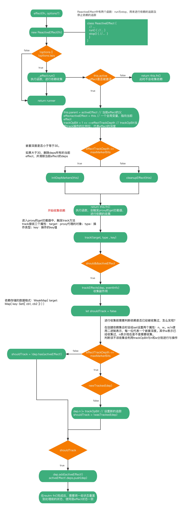

# track

> 在`reactive`与`ref`中，提到了依赖收集与触发依赖两个操作，那么这两个操作是如何实现的呢？
> 
> 在介绍依赖收集和触发依赖之前，先介绍一个`effect`函数。`effect`函数是个副作用函数，他接受一个函数参数，`effect`可以跟踪传入的函数依赖，在依赖变更时，重新运行该函数。

## `effect`

```ts
const foo = reactive({ bar: 1 })
let dummy
effect(() => {
  dummy = foo.bar
})
console.log(dummy) // 1
foo.bar = 2
console.log(dummy) // 2
```

上述代码第一次打印`1`，第二次打印`2`，效果类似`watchEffect`，那么`effect`到底是如何实现这种效果的呢？我们看下`effect`的源码：

`effect`流程：



#### `effect`
文件位置：`packages/reactivity/src/effect.ts`
```ts
export function effect<T = any>(
  fn: () => T,
  options?: ReactiveEffectOptions
): ReactiveEffectRunner {
  // 如果当前fn已经被effect包装过了，获取被包装了的原始函数
  if ((fn as ReactiveEffectRunner).effect) {
    fn = (fn as ReactiveEffectRunner).effect.fn
  }

  // 创建effect对象
  const _effect = new ReactiveEffect(fn)
  // 将options合并到efffect对象中
  if (options) {
    extend(_effect, options)
    if (options.scope) recordEffectScope(_effect, options.scope)
  }
  // 不是懒加载立即执行
  if (!options || !options.lazy) {
    _effect.run()
  }
  // 绑定run函数的this对象和effect对象。此步骤是为了用户在主动执行runner时，this指针指向的是effect对象
  const runner = _effect.run.bind(_effect) as ReactiveEffectRunner
  runner.effect = _effect
  return runner
}
```

可以看到`effect`可以接收两个，其中第二个参数为可选参数，可以不传。第一个参数是一个函数`fn`，第二个参数是个对象，该对象可以有如下属性：
- `lazy`：`boolean`，是否懒加载，如果是`true`，调用`effect`不会立即执行监听函数，需要用户手动执行
- `scheduler`：`function`，一个调度函数，如果存在调度函数，在触发依赖时，执行该调度函数
- `scope`：一个作用域对象，后续深究
- `allowRecurse`：`boolean`，允许递归
- `onStop`：`function`，`effect`被停止时的钩子

`effect`函数主要作用是创建`ReactiveEffect`对象，合并`ReactiveEffect`对象与`options`，根据是不是懒加载选择是不是立即执行，然后返回一个`runner`函数。

::: warning
在一开始会检查参数`fn`是否已经被`effect`处理过，如果处理过，会拿到处理前的`fn`，进行再此包装，也就是说下面的打印操作会执行两次。
```ts
effect(effect(() => {
  console.log(1)
}))
```
:::

`effect`返回的`runner`函数是什么？我们紧接着看`ReactiveEffect`的实现。

#### `ReactiveEffect`

```ts
export class ReactiveEffect<T = any> {
  // 当前effect是否被激活，如果调用stop(),该值变为false
  active = true
  // 记录当前effect收集到的依赖
  deps: Dep[] = []
  // 父级的effect，最顶级的effect为undefined。（嵌套effect）
  parent: ReactiveEffect | undefined = undefined

  /**
   * Can be attached after creation
   * @internal
   */
  computed?: ComputedRefImpl<T>
  
  // 是否允许递归响应
  allowRecurse?: boolean

  // 停止监听钩子
  onStop?: () => void
  // 收集依赖时的钩子
  onTrack?: (event: DebuggerEvent) => void
  // 触发依赖时的钩子
  onTrigger?: (event: DebuggerEvent) => void

  constructor(
    // 传入的函数
    public fn: () => T,
    // 调度器
    public scheduler: EffectScheduler | null = null,
    scope?: EffectScope
  ) {
    // 记录effect作用域，effect中暂时未用到，暂不深究
    recordEffectScope(this, scope)
  }
  
  run() {
    // 如果effect未被激活，直接执行原始函数
    if (!this.active) {
      return this.fn()
    }
    let parent: ReactiveEffect | undefined = activeEffect
    let lastShouldTrack = shouldTrack
    while (parent) {
      if (parent === this) {
        return
      }
      parent = parent.parent
    }
    try {
      // 设置当前的parent为上一个activeEffect
      this.parent = activeEffect
      // 设置activeEffect为当前ReactiveEffect实例，activeEffect是个全局变量
      activeEffect = this
      shouldTrack = true

      // effectTrackDepth为当前track操作的深度
      // trackOpBit为使用二进制表示当前track的深度（00000000000000000000000000000010表示当前track的深度为2）
      trackOpBit = 1 << ++effectTrackDepth

      // 嵌套深度在maxMarkerBits范围内，如果超出清空
      if (effectTrackDepth <= maxMarkerBits) {
        initDepMarkers(this)
      } else {
        cleanupEffect(this)
      }
      // 执行fn，并返回结果
      return this.fn()
    } finally {
      // 重置状态
      if (effectTrackDepth <= maxMarkerBits) {
        finalizeDepMarkers(this)
      }

      trackOpBit = 1 << --effectTrackDepth

      activeEffect = this.parent
      shouldTrack = lastShouldTrack
      this.parent = undefined
    }
  }

  // 停止对函数的监听
  stop() {
    if (this.active) {
      // 清除依赖
      cleanupEffect(this)
      // 执行onStop钩子
      if (this.onStop) {
        this.onStop()
      }
      // 将active置为false
      this.active = false
    }
  }
}
```

可以看出`effect`返回的`runner`函数就是`ReactiveEffect`的`run`函数。在`run`函数中会执行`fn`，以进行依赖的收集。具体流程如下：

1. 首先判断当前`effect`是否是激活状态，如果不是激活状态，直接运行`fn`并返回结果，这时是不会进行依赖的收集的。
2. 初始化一些属性：当前`effect`的父`effect`（`this.parent`）、当前激活的`effect`（`activeEffect`）、`effectTrackDepth`（嵌套深度，从1开始）、`trackOpBit`（`track`的操作比特位）
3. 如果`effect`嵌套深度没有超过30，对当前`effect`的所有依赖进行标记，标记某一层的依赖已经被收集过。通过设置`dep`的`w`属性，以`w`的二进制的某一位为`1`，表示该层的依赖已经被收集过。如果超过30，从`deps`中删除当前的`effect`并清空`deps`
4. 最后执行`fn`，并将结果返回

在`fn`的执行过程中，会访问到响应式数据某些属性，这时会触发`proxy`的`get`或`has`等其他拦截器，在`get`拦截器中进行依赖的收集。
```ts
function createGetter(isReadonly = false, shallow = false) {
  return function get(target: Target, key: string | symbol, receiver: object) {
    // ...

    if (!isReadonly) {
      // 进行依赖收集
      track(target, TrackOpTypes.GET, key)
    }

    // ...
  }
}
```

## `track`
`track`方法接收三个参数：`target`：原始对象；`type`：操作类型；`key`：操作的`key`。可以看到`track`方法中首先要判断依赖是否需要收集，这里利用两个变量：`shuoldTrack`、`activeEffect`。

这两个变量都是全局变量，`shouldTrack`表示该不该收集，它的状态由`pauseTracking()`、`enableTracking()`、`resetTracking()`、`ReactiveEffect.prototype.run()`几个方法控制。`activeEffect`是当前被激活的`effect`，在调用`ReactiveEffect.prototype.run()`时会将`ReactiveEffect`实例赋值给`activeEffect`，并在`fn()`执行完成后，将`this.parent`赋值给`activeEffect`。


```ts
export function track(target: object, type: TrackOpTypes, key: unknown) {
  // 判断是否被收集
  if (shouldTrack && activeEffect) {
    // 尝试从targetMap获取dep
    let depsMap = targetMap.get(target)
    if (!depsMap) {
      targetMap.set(target, (depsMap = new Map()))
    }
    let dep = depsMap.get(key)
    if (!dep) {
      depsMap.set(key, (dep = createDep()))
    }

    const eventInfo = __DEV__
      ? { effect: activeEffect, target, type, key }
      : undefined

    // 开始收集
    trackEffects(dep, eventInfo)
  }
}

export function trackEffects(
  dep: Dep,
  debuggerEventExtraInfo?: DebuggerEventExtraInfo
) {
  let shouldTrack = false
  // 嵌套深度不超过maxMarkerBits时，使用位运算决定shouldTrack的值
  if (effectTrackDepth <= maxMarkerBits) {
    if (!newTracked(dep)) {
      dep.n |= trackOpBit // set newly tracked
      shouldTrack = !wasTracked(dep)
    }
  } else {
    // 嵌套深度超过maxMarkerBits时，使用set.has决定shouldTrack的值
    shouldTrack = !dep.has(activeEffect!)
  }

  if (shouldTrack) {
    // 向dep中添加effect
    dep.add(activeEffect!)
    activeEffect!.deps.push(dep)
    if (__DEV__ && activeEffect!.onTrack) {
      activeEffect!.onTrack(
        Object.assign(
          {
            effect: activeEffect!
          },
          debuggerEventExtraInfo
        )
      )
    }
  }
}
```

::: details  为什么在`fn()`执行完成后要把`this.parent`赋值给`activeEffect`？

作用是在处于同层的`effect`执行完`run`方法后，`activeEffect`的指向应该是这些`effect.parent`，也就是同层`effect`每执行完一个`run`，都将`activeEffect`的指向还原到执行`run()`方法之前的指向。

```ts
const foo = reactive({ bar: 1 })
effect(() => {
  // 假设此时activeEffect指向effect1，effect1.parent = undefined
  console.log(foo.bar)
  
  effect(() => {
    // 假设activeEffect指向effect2，effect2.parent = effect1
    console.log(foo.bar)
  })

  // 执行完effect2.run()，activeEffect指向effect2.parent，也就是effect1

  effect(() => {
    // 假设activeEffect指向effect3，effect3.parent = effect1
    console.log(foo.bar)
  })

  // 执行完effect2.run()，activeEffect指向effect3.parent，也就是effect1
})
```
:::

如果此时是需要依赖收集，那么就开始尝试从`targetMap`获取对应的依赖，如果没有对应的依赖，就创建对应数据结构。这里的`targetMap`是个`WeakMap`，它的`key`是传入`proxy`中的原始`target`，`value`存储的是个`Map`，这个`Map`的`key`是`get`等操作拦截的`key`，`value`是个`set`，`set`中存储的是`ReactiveEffect`实例。下面是关于`targetMap`的类型定义。

```ts
// packages/reactivity/src/dep.ts
export type Dep = Set<ReactiveEffect> & TrackedMarkers

// packages/reactivity/src/effect.ts
type KeyToDepMap = Map<any, Dep>
const targetMap = new WeakMap<any, KeyToDepMap>()
```

在创建`dep`时，不单单是创建了一个`dep`，还给`dep`添加了两个属性：`n`、`w`，并将其初始化为0。

::: details n、w这两个属性有什么用处呢？
```ts
export const createDep = (effects?: ReactiveEffect[]): Dep => {
  const dep = new Set<ReactiveEffect>(effects) as Dep
  dep.w = 0
  dep.n = 0
  return dep
}
```

利用`w`、`n`可以判断`effect`该不该被收集，本质利用位运算进行加速，相比`set.has`会有提升

`w`使用二进制标记，每一位表示不同`effect`嵌套层级中，该依赖是否已被跟踪过(即在上一轮副作用函数执行时已经被访问过)。
`n`使用二进制标记，每一位表示不同effect嵌套层级中，该依赖是否为新增(即在本轮副作用函数执行中被访问过)

```ts
let run = false
const original = { prop: 'value' }
const obj = reactive(original)
const fn = () => {
  console.log(run ? obj.prop : 'other')
}

const runner = effect(fn)

runner()

run = true
runner()
// 依次打印 other other value
```

分析上述代码：
1. 创建`effect`过程中，因为没有指定`lazy`，所以会立即执行`fn`。此时`trackOpBit`为`2`（`00000000000000000000000000000010`），`effectTrackDepth`为`1`
2. 在`fn`的执行过程中命中`obj`的`get`拦截器，在`get`拦截器中收集此次创建的`effect`，因为是第一次收集，所以会创建存储依赖的数据结构（`WeakMap{ original: Map{ prop: dep{length: 0, n: 0, w: 0} } }`）
3. 执行`trackEffects`，在`trackEffects`判断该不该收集`activeEffect`：`effectTrackDepth`小于`maxMarkerBits`（`30`），`dep.n & trackOpBit === 0`，现在需要依赖收集，然后`dep.n |= trackOpBit`，此时`dep:{ n: 2, w: 0 }`，`dep.w & trackOpBit === 0`，说明`activeEffect`还没有被收集
4. 开始收集`activeEffect`：`dep.add(activeEffect)`、`activeEffect.deps.push(dep)`
5. `fn`执行完成，第一次打印`other`
6. `fn`执行完成后，将`trackOpBit`、`effectTrackDepth`恢复到之前状态，`trackOpBit = 1 << --effectTrackDepth`。此时`trackOpBit`为`1`，`effectTrackDepth`为`0`
7. 开始执行第一个`runner`
8. 首先执行`trackOpBit = 1 << ++effectTrackDepth`，`trackOpBit`变为`2`，`effectTrackDepth`变为`1`，执行`initDepMarkers`，因为此时`effect.deps`不为空，所以会将`effect.deps`中的每个`dep`进行`deps[i].w |= trackOpBit`，来标记已经被收集，执行完成后，`prop`对应的`dep：{ n: 2, w: 2 }`
9. 在`trackEffects`中，`dep.n & trackOpBit > 0`，不是个新的依赖，不需要收集。
10. `runner`执行完成，第二次打印`other`
11. `runner`执行完成后，执行`trackOpBit = 1 << --effectTrackDepth`。此时`trackOpBit`为`1`，`effectTrackDepth`为`0`
12. 开始执行第二个`runner`
13. 首先执行`trackOpBit = 1 << ++effectTrackDepth`，`trackOpBit`变为`2`，`effectTrackDepth`变为`1`，执行`initDepMarkers`，因为此时`effect.deps`不为空，所以会将`effect.deps`中的每个`dep`进行`deps[i].w |= trackOpBit`，来标记已经被收集，执行完成后，`prop`对应的`dep：{ n: 2, w: 2 }`
14. `runner`执行完成，第三次打印`value`
11. `runner`执行完成后，执行`trackOpBit = 1 << --effectTrackDepth`。此时`trackOpBit`为`1`，`effectTrackDepth`为`0`

:::

