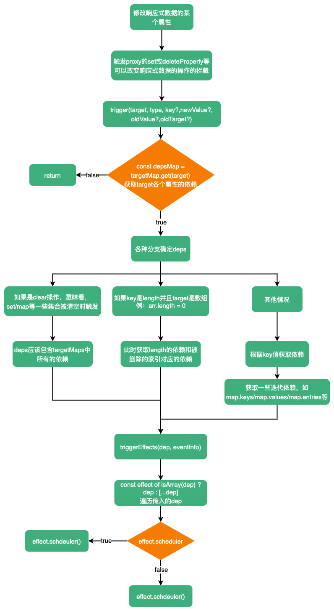

# trigger

在依赖被收集完成后，一旦响应式数据的某些属性改变后，就需要将对应的依赖进行触发。这个触发的过程发生在`proxy`的`set`、`deleteProperty`拦截器、，或集合的`get`拦截器（拦截`clear`、`add`、`set`等操作）

触发依赖（`trigger`）流程：



```ts
export function trigger(
  target: object,
  type: TriggerOpTypes,
  key?: unknown,
  newValue?: unknown,
  oldValue?: unknown,
  oldTarget?: Map<unknown, unknown> | Set<unknown>
) {
  // 获取target对相应的所有依赖，一个map对象 
  const depsMap = targetMap.get(target)
  // 如果没有，说明没有依赖，直接return
  if (!depsMap) {
    // never been tracked
    return
  }

  // 获取需要触发的依赖
  let deps: (Dep | undefined)[] = []
  if (type === TriggerOpTypes.CLEAR) {
    // collection being cleared
    // trigger all effects for target
    deps = [...depsMap.values()]
  } else if (key === 'length' && isArray(target)) {
    depsMap.forEach((dep, key) => {
      if (key === 'length' || key >= (newValue as number)) {
        deps.push(dep)
      }
    })
  } else {
    // schedule runs for SET | ADD | DELETE
    if (key !== void 0) {
      deps.push(depsMap.get(key))
    }

    // also run for iteration key on ADD | DELETE | Map.SET
    // 获取一些迭代的依赖，如map.keys、map.values、map.entries等
    switch (type) {
      case TriggerOpTypes.ADD:
        if (!isArray(target)) {
          deps.push(depsMap.get(ITERATE_KEY))
          if (isMap(target)) {
            deps.push(depsMap.get(MAP_KEY_ITERATE_KEY))
          }
        } else if (isIntegerKey(key)) {
          // new index added to array -> length changes
          deps.push(depsMap.get('length'))
        }
        break
      case TriggerOpTypes.DELETE:
        if (!isArray(target)) {
          deps.push(depsMap.get(ITERATE_KEY))
          if (isMap(target)) {
            deps.push(depsMap.get(MAP_KEY_ITERATE_KEY))
          }
        }
        break
      case TriggerOpTypes.SET:
        if (isMap(target)) {
          deps.push(depsMap.get(ITERATE_KEY))
        }
        break
    }
  }

  const eventInfo = __DEV__
    ? { target, type, key, newValue, oldValue, oldTarget }
    : undefined

  // 开始触发依赖
  if (deps.length === 1) {
    if (deps[0]) {
      if (__DEV__) {
        triggerEffects(deps[0], eventInfo)
      } else {
        triggerEffects(deps[0])
      }
    }
  } else {
    const effects: ReactiveEffect[] = []
    for (const dep of deps) {
      if (dep) {
        effects.push(...dep)
      }
    }
    if (__DEV__) {
      triggerEffects(createDep(effects), eventInfo)
    } else {
      triggerEffects(createDep(effects))
    }
  }
}

export function triggerEffects(
  dep: Dep | ReactiveEffect[],
  debuggerEventExtraInfo?: DebuggerEventExtraInfo
) {
  // spread into array for stabilization
  for (const effect of isArray(dep) ? dep : [...dep]) {
    // effect不等于activeEffect 或effect允许递归
    // 为什么effect不等于activeEffect才能执行？
    if (effect !== activeEffect || effect.allowRecurse) {
      if (__DEV__ && effect.onTrigger) {
        effect.onTrigger(extend({ effect }, debuggerEventExtraInfo))
      }
      // 有scheduler执行scheduler，没有执行run方法
      if (effect.scheduler) {
        effect.scheduler()
      } else {
        effect.run()
      }
    }
  }
}
```

当修改响应式对象，如`obj.xxx = xx`、`map.set(x, x)`等可以修改响应式对象的操作，会被`proxy`对应的拦截器所拦截，假设这里进入`set`拦截器。在`set`拦截器中进行触发依赖的操作：`trigger(target, type, key?, newValue?, oldValue?, oldTarget?)`，`trigger`函数接收6个参数，后四个参数可选。

- `target`：代理的原始对象
- `type`：操作类型。是个枚举类`TriggerOpTypes`，共有四种操作类型：
  - `TriggerOpTypes.SET`：如`obj.xx = xx`（修改属性）、`map.set(xx, xx)`（修改操作不是新增操作）、`arr[index] = xx`(`index < arr.length`)、`arr.length = 0`
  - `TriggerOpTypes.ADD`：如`obj.xx = xx`（新增属性）、`set.add(xx)`、`map.set(xx, xx)`（新增操作）、`arr[index] = xx`(`index >= arr.length`)
  - `TriggerOpTypes.DELETE`：如`delete obj.xx`、`set/map.delete(xx)`
  - `TriggerOpTypes.CLEAR`：如`map/set.clear()`
- `key`：操作的`key`，如`obj.foo = 1`，`key`为`foo`。
- `newValue`：新的值，如`obj.foo = 1`，`newValue`为`1`。
- `oldValue`：旧的值，如`obj.foo = 1`，`oldValue`为修改前的`obj.foo`。
- `oldTarget`：只在开发模式下有用

在`trigger`中首先要获取`target`对应的所有依赖`depsMap`，如果没有的直接`return`。获取到的`depsMap`并不是每个依赖都需要触发，所以接下来就是选出需要触发的依赖，那么怎么选择呢？这里有几个分支：

1. `type === TriggerOpTypes.CLEAR`：意味着`map/set`被清空，这时所有依赖都需要被触发。
2. `key === 'length' && isArray(target)`：当操作的的是`array`的`length`属性，如`arr.length = 1`，这时要获取的依赖包括：`length`的依赖、索引大于等于`1`的依赖。
3. 其他情况：
   1. 首先从`depsMap`中获取对应`key`的依赖，`depsMap.get(key)`。
   2. 然后再找一些迭代的依赖，如`keys、values、entries`操作。怎么找这些依赖呢？，首先根据`type`分成三个分支：
      - `TriggerOpTypes.ADD`：如果不是数组，获取`ITERATE_KEY`的依赖，如果是`Map`获取`MAP_KEY_ITERATE_KEY`的依赖；如果是数组并且`key`是索引，获取`length`对应的依赖
      - `TriggerOpTypes.DELETE`：如果不是数组，获取`ITERATE_KEY`的依赖，如果是`Map`获取`MAP_KEY_ITERATE_KEY`的依赖
      - `TriggerOpTypes.SET`：如果是`Map`，获取`ITERATE_KEY`的依赖

::: details 当找迭代的依赖时为什么key是ITERATE_KEY或MAP_KEY_ITERATE_KEY？什么情况下获取需要获取ITERATE_KEY？什么情况下后去MAP_KEY_ITERATE_KEY的依赖？
这个问题要和收集依赖时如何存储对应着看，这里列出收集依赖时对应的源码：

```ts
function size(target: IterableCollections, isReadonly = false) {
  target = (target as any)[ReactiveFlags.RAW]
  // 当调用map/set.size()，使用的key值是ITERATE_KEY
  !isReadonly && track(toRaw(target), TrackOpTypes.ITERATE, ITERATE_KEY)
  return Reflect.get(target, 'size', target)
}

function createForEach(isReadonly: boolean, isShallow: boolean) {
  return function forEach(
    this: IterableCollections,
    callback: Function,
    thisArg?: unknown
  ) {
    // ...
    // 当使用set/map.forEach()，使用的key是ITERATE_KEY
    !isReadonly && track(rawTarget, TrackOpTypes.ITERATE, ITERATE_KEY)
    // ...
  }
}

function createIterableMethod(method: string | symbol, isReadonly: boolean, isShallow: boolean) {
  return function (this: IterableCollections, ...args: unknown[]): Iterable & Iterator {
    // ...
    const isKeyOnly = method === 'keys' && targetIsMap
    // values/entries/[Symbol.iterator]/使用的key是ITERATE_KEY，map.keys使用的key是MAP_KEY_ITERATE_KEY
    !isReadonly &&
    track(
      rawTarget,
      TrackOpTypes.ITERATE,
      isKeyOnly ? MAP_KEY_ITERATE_KEY : ITERATE_KEY
    )
    // ...
  }
}

function ownKeys(target: object): (string | symbol)[] {
  // Object.keys()/Object.getOwnPropertyNames()/Object.getOwnPropertySymbols()/for...in使用ITERATE_KEY前提是target不是数组
  track(target, TrackOpTypes.ITERATE, isArray(target) ? 'length' : ITERATE_KEY)
  return Reflect.ownKeys(target)
}
```

综上可以看出：

- 使用`ITERATE_KEY`存储依赖的情况有这么几种：获取集合的`size`、集合的`forEach`操作、集合的迭代操作（包括`keys`（非Map）、`values`、`entries`、`Symbol.iterator`（`for...of`））
- 使用`MAP_KEY_ITERATE_KEY`存储依赖的情况只有一种：`map.keys()`

如果对响应式数据的改动是一种新增操作的话，受影响的操作有：集合的`size`、集合的`forEach`、集合的迭代操作。
如果改动时删除操作，受影响的操作有：集合的`size`、集合的`forEach`、集合的迭代操作。
如果改动修改操作，因为只有`map.set()`可以实现修改集合的操作，所以受影响的操作只有`Map`的迭代操作和`forEach`
:::

获取完需要执行的依赖后，接下来就是执行依赖，调用`triggerEffects()`，遍历上述过程中收集的`deps`，遍历执行。遍历过程中，如果`effect`中有`scheduler`调度器，执行调度器，没有调度器执行`run`方法。
