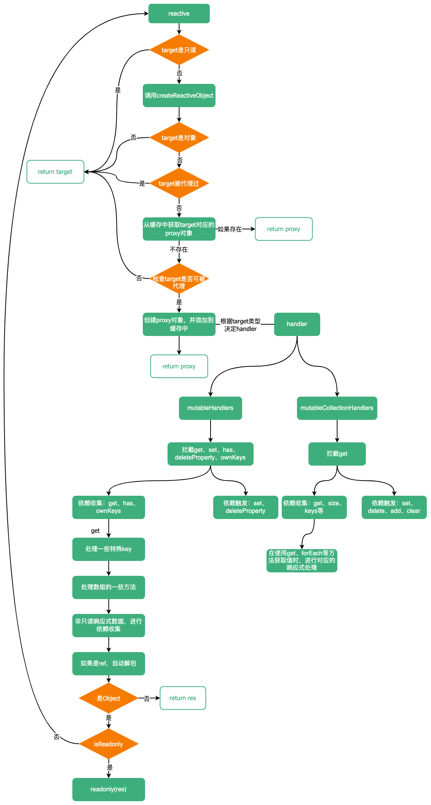

# reactive
::: tip
`reactive`所在模块为响应式模块`reactivity`
:::

::: info
通过`reactive`可以声明一个响应式数据。主要通过`proxy`进行懒惰式得处理。
:::

::: warning
注意如果`reactive`的`object`，指定了`__v_skip:true`属性（`markRaw(target)`就是通过这种方法指定`target`
永远不能转为`proxy`）或`object`本身不可被扩展，那么`object`不能被代理
:::

```ts
const original = {
  foo: 1,
  __v_skip: true // 标记original不需要代理
}
const observed = reactive(original)
console.log(original === observed) // true

const freezeObj = Object.freeze({
  foo: 1
})
const observed2 = reactive(a)
console.log(freezeObj === observed2) // true
```

`reactive`流程图：


`reactive`源码，文件位置：`packages/reactivity/src/reactive.ts`
```ts 
export function reactive(target: object) {
  // 如果target是个只读的代理对象直接将其返回
  if (isReadonly(target)) {
    return target
  }
  // 
  return createReactiveObject(
    target,
    false,
    mutableHandlers,
    mutableCollectionHandlers,
    reactiveMap
  )
}

function createReactiveObject(
  target: Target,
  isReadonly: boolean,
  baseHandlers: ProxyHandler<any>,
  collectionHandlers: ProxyHandler<any>,
  proxyMap: WeakMap<Target, any>
) {
  // 先检查target是否为一个对象
  if (!isObject(target)) {
    if (__DEV__) {
      console.warn(`value cannot be made reactive: ${String(target)}`)
    }
    return target
  }
  // target is already a Proxy, return it.
  // exception: calling readonly() on a reactive object
  if (
    target[ReactiveFlags.RAW] &&
    !(isReadonly && target[ReactiveFlags.IS_REACTIVE])
  ) {
    return target
  }
  // target already has corresponding Proxy
  // 尝试从缓存中获取代理对象
  const existingProxy = proxyMap.get(target)
  if (existingProxy) {
    return existingProxy
  }
  // only a whitelist of value types can be observed.
  // 判断taget是否允许被代理
  const targetType = getTargetType(target)
  if (targetType === TargetType.INVALID) {
    return target
  }
  
  const proxy = new Proxy(
    target,
    targetType === TargetType.COLLECTION ? collectionHandlers : baseHandlers
  )
  proxyMap.set(target, proxy)
  return proxy
}
```

`reactive`接收一个`target`对象。首先会对`target`进行判断，如果`target`是个只读的代理对象，直接将其返回。再检查`target`是不是`object`，
如果不是`object`，返回`target`。也就是说，`reactive`只有接收对象才会对其进行代理。

在进行代理之前，会先尝试从缓存（`proxyMap`一个`WeakMap`实例）中获取代理对象，如果缓存中有，直接返回缓存中的代理对象，没有再继续判断
`target`的类型，通过`target`的类型判断`target`是不是可以被代理。

通过`getTargetType`判断`target`的类型。`getTargetType`可能有三种返回结果：`TargetType.INVALID`、`TargetType.COMMON`、
`TargetType.COLLECTION`

- `TargetType.INVALID`：代表`target`不能被代理
- `TargetType.COMMON`：代表`target`是`Array`或`Object`
- `TargetType.COLLECTION`：代表`target`是`Map`、`Set`、`WeakMap`、`WeakSet`

`target`不能被代理的情况有三种：
1. 显示声明对象不可被代理：通过个对象添加`__v_skip: true`属性
2. 对象为不可扩展对象：如通过`Object.freeze`、`Object.seal`、`Object.preventExtensions`的对象
3. 除了`Object`、`Array`、`Map`、`Set`、`WeakMap`、`WeakSet`之外的其他类型的对象，如`Date`、`RegExp`、`Promise`等

```ts
const enum TargetType {
  INVALID = 0,
  COMMON = 1,
  COLLECTION = 2
}

export const objectToString = Object.prototype.toString
export const toTypeString = (value: unknown): string =>
  objectToString.call(value)

export const toRawType = (value: unknown): string => {
  // extract "RawType" from strings like "[object RawType]"
  return toTypeString(value).slice(8, -1)
}

function targetTypeMap(rawType: string) {
  switch (rawType) {
    case 'Object':
    case 'Array':
      return TargetType.COMMON
    case 'Map':
    case 'Set':
    case 'WeakMap':
    case 'WeakSet':
      return TargetType.COLLECTION
    default:
      return TargetType.INVALID
  }
}

function getTargetType(value: Target) {
  // 如果标记value不用被代理或value不可被扩展（Object.seal、Object.freeze、Object.preventExtensions可将一个对象变为不可扩展）
  return value[ReactiveFlags.SKIP] || !Object.isExtensible(value)
    ? TargetType.INVALID
    : targetTypeMap(toRawType(value))
}
```

当类型校验通过后，就可以使用`Proxy`去代理`target`了。当`new Proxy(target, handler)`时，这里的`handler`有两种：
一种是针对`Object`、`Array`的`mutableHandlers`，一种是针对集合（`Set`、`Map`、`WeakMap`、`WeakSet`）的
`mutableCollectionHandlers`

### `mutableHandlers`
文件位置：`packages/reactivity/src/baseHandlers.ts`
```ts
export const mutableHandlers: ProxyHandler<object> = {
  get,
  set,
  deleteProperty,
  has,
  ownKeys
}
```

可以看到`mutableHandlers`有`get`、`set`、`deleteProperty`、`has`、`ownKeys`五个属性，分别拦截了`proxy.attr`、
`proxy.attr = 1`、`delete proxy.attr`、`key in proxy`、(`for...in`/`Object.getOwnPropertyNames(proxy)`/
`Object.getOwnPropertySymbols(proxy)`/`Object.keys(proxy)`)操作。

- `get`：通过`createGetter`创建一个`get`函数，`createGetter`方法接收两个参数：`isReadonly`是否只读、`shallow`是否浅层的响应式。
在`get`函数中会进行依赖的收集以及嵌套响应式数据的处理等操作。

首先判断`key`值是不是`vue`添加的一些属性，如`__v_isReactive`、`__v_isReadonly`等，如果是这些属性，不需要其他操作直接返回对应值即可。
然后检测拦截的`target`是不是数组，对数组的一些方法进行特殊处理。紧接着调用`Reflect.get`获得`res`，判断如果`key`
是`Symbol`的内置值或者`key`不需要被追踪，直接返回`res`。相反紧接着下面的操作：如果不是只读，进行依赖的收集，收集完依赖后，判断
是不是浅层响应式，如果是直接返回`res`，如果不是，再看`res`是不是`ref`类型，如果是`ref`，尝试解包并返回结果，如果不是，紧接着判断
`res`是不是对象，如果是对象的话，就需要对其进行响应式处理。

**为什么单独处理`target`是数组？**

数组的原生`includes`、`indexOf`、`lastIndexOf`方法对索引敏感，可能被依赖收集，所以需要进行依赖的收集。如：
```ts
const obj = {}
const arr = reactive([obj, {}])

let index: number = -1
effect(() => {
  index = arr.indexOf(obj)
})
console.log(index) // 0
arr.reverse()
console.log(index) // 1
```

`push`、`pop`、`shift`、`unshift`、`splice`会改变自身长度，需要避免`length`被依赖收集，可能造成死循环
```ts
const arr = reactive([])
effect(() => {
  arr.push(1)
})
effect(() => {
  arr.push(2)
})
console.log(arr.length) // 2
```

```ts
const arrayInstrumentations = /*#__PURE__*/ createArrayInstrumentations()

function createArrayInstrumentations() {
  const instrumentations: Record<string, Function> = {}
    // instrument identity-sensitive Array methods to account for possible reactive
    // values
  ;(['includes', 'indexOf', 'lastIndexOf'] as const).forEach(key => {
    instrumentations[key] = function (this: unknown[], ...args: unknown[]) {
      const arr = toRaw(this) as any
      for (let i = 0, l = this.length; i < l; i++) {
        track(arr, TrackOpTypes.GET, i + '')
      }
      // we run the method using the original args first (which may be reactive)
      const res = arr[key](...args)
      if (res === -1 || res === false) {
        // if that didn't work, run it again using raw values.
        return arr[key](...args.map(toRaw))
      } else {
        return res
      }
    }
  })
  // instrument length-altering mutation methods to avoid length being tracked
  // which leads to infinite loops in some cases (#2137)
  ;(['push', 'pop', 'shift', 'unshift', 'splice'] as const).forEach(key => {
    instrumentations[key] = function (this: unknown[], ...args: unknown[]) {
      pauseTracking()
      const res = (toRaw(this) as any)[key].apply(this, args)
      resetTracking()
      return res
    }
  })
  return instrumentations
}

const get = /*#__PURE__*/ createGetter()

function createGetter(isReadonly = false, shallow = false) {
  return function get(target: Target, key: string | symbol, receiver: object) {
    // vue框架添加的一些属性，直接返回对应值
    if (key === ReactiveFlags.IS_REACTIVE) {
      return !isReadonly
    } else if (key === ReactiveFlags.IS_READONLY) {
      return isReadonly
    } else if (key === ReactiveFlags.IS_SHALLOW) {
      return shallow
    } else if (
      key === ReactiveFlags.RAW &&
      receiver ===
      (isReadonly
          ? shallow
            ? shallowReadonlyMap
            : readonlyMap
          : shallow
            ? shallowReactiveMap
            : reactiveMap
      ).get(target)
    ) {
      return target
    }

    const targetIsArray = isArray(target)

    // 处理数组
    if (!isReadonly && targetIsArray && hasOwn(arrayInstrumentations, key)) {
      return Reflect.get(arrayInstrumentations, key, receiver)
    }

    const res = Reflect.get(target, key, receiver)

    // builtInSymbols: new Set(Object.getOwnPropertyNames(Symbol).map(key => Symbol[key]).filter(val => typeof val === 'symbol'))
    // 如果key是symbol类型，并且key是Symbol内置的值，直接返回res
    // 如果不是symbol，并且key不需要被追踪，直接返回res
    if (isSymbol(key) ? builtInSymbols.has(key) : isNonTrackableKeys(key)) {
      return res
    }

    // 如果不是只读，进行依赖收集。因为只读的target，属性不可被修改，无需进行依赖收集
    if (!isReadonly) {
      track(target, TrackOpTypes.GET, key)
    }

    // 如果是浅层的响应式，不需要嵌套响应式，直接返回res。
    if (shallow) {
      return res
    }

    // 如果res是个ref,自动解包。自动解包的前提是target不是数组，或target是数组但key不是个整数的key
    if (isRef(res)) {
      // ref unwrapping - does not apply for Array + integer key.
      const shouldUnwrap = !targetIsArray || !isIntegerKey(key)
      return shouldUnwrap ? res.value : res
    }

    // 如果res是个对象，进行嵌套响应式处理，这里也就说明为什么Proxy是懒惰式的创建响应式对象，只要访问对应的key，才会继续创建响应式对象，否则不用创建
    if (isObject(res)) {
      // Convert returned value into a proxy as well. we do the isObject check
      // here to avoid invalid value warning. Also need to lazy access readonly
      // and reactive here to avoid circular dependency.
      return isReadonly ? readonly(res) : reactive(res)
    }

    return res
  }
}
```

- `set`：通过`createSetter`创建一个`set`函数，该函数接收一个参数：`shallow`是不是浅层响应式。在`set`函数中需要触发采集的依赖。

```ts
const set = /*#__PURE__*/ createSetter()

function createSetter(shallow = false) {
  return function set(
    target: object,
    key: string | symbol,
    value: unknown,
    receiver: object
  ): boolean {
    let oldValue = (target as any)[key]
    if (isReadonly(oldValue) && isRef(oldValue) && !isRef(value)) {
      return false
    }
    if (!shallow && !isReadonly(value)) {
      if (!isShallow(value)) {
        value = toRaw(value)
        oldValue = toRaw(oldValue)
      }
      if (!isArray(target) && isRef(oldValue) && !isRef(value)) {
        oldValue.value = value
        return true
      }
    } else {
      // in shallow mode, objects are set as-is regardless of reactive or not
    }

    // 用于判断是新增还是修改操作
    const hadKey =
      isArray(target) && isIntegerKey(key)
        ? Number(key) < target.length
        : hasOwn(target, key)
    const result = Reflect.set(target, key, value, receiver)
    // don't trigger if target is something up in the prototype chain of original
    if (target === toRaw(receiver)) {
      // 触发依赖
      if (!hadKey) {
        trigger(target, TriggerOpTypes.ADD, key, value)
      } else if (hasChanged(value, oldValue)) {
        trigger(target, TriggerOpTypes.SET, key, value, oldValue)
      }
    }
    return result
  }
}
```

- `deleteProperty`：删除某个属性时，也触发相关依赖
```ts
function deleteProperty(target: object, key: string | symbol): boolean {
  const hadKey = hasOwn(target, key)
  const oldValue = (target as any)[key]
  const result = Reflect.deleteProperty(target, key)
  if (result && hadKey) {
    trigger(target, TriggerOpTypes.DELETE, key, undefined, oldValue)
  }
  return result
}
```

- `has`：`key in peoxy`操作时，进行依赖收集
```ts
function has(target: object, key: string | symbol): boolean {
  const result = Reflect.has(target, key)
  if (!isSymbol(key) || !builtInSymbols.has(key)) {
    track(target, TrackOpTypes.HAS, key)
  }
  return result
}
```

- `ownKeys`：`for...in`/`Object.getOwnPropertyNames(proxy)`/`Object.getOwnPropertySymbols(proxy)`/`Object.keys(proxy)`操作时，收集依赖
```ts
function ownKeys(target: object): (string | symbol)[] {
  track(target, TrackOpTypes.ITERATE, isArray(target) ? 'length' : ITERATE_KEY)
  return Reflect.ownKeys(target)
}
```

### `mutableCollectionHandlers`

文件位置：`packages/reactivity/src/collectionHandlers.ts`

```ts
function createInstrumentations() {
  const mutableInstrumentations: Record<string, Function> = {
    get(this: MapTypes, key: unknown) {
      return get(this, key)
    },
    get size() {
      return size(this as unknown as IterableCollections)
    },
    has,
    add,
    set,
    delete: deleteEntry,
    clear,
    forEach: createForEach(false, false)
  }

  const shallowInstrumentations: Record<string, Function> = {
    get(this: MapTypes, key: unknown) {
      return get(this, key, false, true)
    },
    get size() {
      return size(this as unknown as IterableCollections)
    },
    has,
    add,
    set,
    delete: deleteEntry,
    clear,
    forEach: createForEach(false, true)
  }

  const readonlyInstrumentations: Record<string, Function> = {
    get(this: MapTypes, key: unknown) {
      return get(this, key, true)
    },
    get size() {
      return size(this as unknown as IterableCollections, true)
    },
    has(this: MapTypes, key: unknown) {
      return has.call(this, key, true)
    },
    add: createReadonlyMethod(TriggerOpTypes.ADD),
    set: createReadonlyMethod(TriggerOpTypes.SET),
    delete: createReadonlyMethod(TriggerOpTypes.DELETE),
    clear: createReadonlyMethod(TriggerOpTypes.CLEAR),
    forEach: createForEach(true, false)
  }

  const shallowReadonlyInstrumentations: Record<string, Function> = {
    get(this: MapTypes, key: unknown) {
      return get(this, key, true, true)
    },
    get size() {
      return size(this as unknown as IterableCollections, true)
    },
    has(this: MapTypes, key: unknown) {
      return has.call(this, key, true)
    },
    add: createReadonlyMethod(TriggerOpTypes.ADD),
    set: createReadonlyMethod(TriggerOpTypes.SET),
    delete: createReadonlyMethod(TriggerOpTypes.DELETE),
    clear: createReadonlyMethod(TriggerOpTypes.CLEAR),
    forEach: createForEach(true, true)
  }

  const iteratorMethods = ['keys', 'values', 'entries', Symbol.iterator]
  iteratorMethods.forEach(method => {
    mutableInstrumentations[method as string] = createIterableMethod(
      method,
      false,
      false
    )
    readonlyInstrumentations[method as string] = createIterableMethod(
      method,
      true,
      false
    )
    shallowInstrumentations[method as string] = createIterableMethod(
      method,
      false,
      true
    )
    shallowReadonlyInstrumentations[method as string] = createIterableMethod(
      method,
      true,
      true
    )
  })

  return [
    mutableInstrumentations,
    readonlyInstrumentations,
    shallowInstrumentations,
    shallowReadonlyInstrumentations
  ]
}

const [
  mutableInstrumentations,
  readonlyInstrumentations,
  shallowInstrumentations,
  shallowReadonlyInstrumentations
] = /* #__PURE__*/ createInstrumentations()

function createInstrumentationGetter(isReadonly: boolean, shallow: boolean) {
  const instrumentations = shallow
    ? isReadonly
      ? shallowReadonlyInstrumentations
      : shallowInstrumentations
    : isReadonly
      ? readonlyInstrumentations
      : mutableInstrumentations

  return (
    target: CollectionTypes,
    key: string | symbol,
    receiver: CollectionTypes
  ) => {
    if (key === ReactiveFlags.IS_REACTIVE) {
      return !isReadonly
    } else if (key === ReactiveFlags.IS_READONLY) {
      return isReadonly
    } else if (key === ReactiveFlags.RAW) {
      return target
    }

    return Reflect.get(
      hasOwn(instrumentations, key) && key in target
        ? instrumentations
        : target,
      key,
      receiver
    )
  }
}

export const mutableCollectionHandlers: ProxyHandler<CollectionTypes> = {
  get: /*#__PURE__*/ createInstrumentationGetter(false, false)
}
```

对于`Map`、`Set`、`WeakMap`、`WeakSet`只需要拦截其`get`方法，因为这些集合的增删改查等操作都是通过`api`完成的。如
`set.add`、`map.set`、`waekMap.delete`等方法，都会触发`proxy`的`get`拦截。

:::warning
如果向`Map`、`Set`、`WeakMap`、`WeakSet`实例中添加一些自定义属性，那么这些自定义的属性不会被跟踪。
```ts
const set = reactive(new Set())
let dummy
effect(() => {
  dummy = set.customProp
})
console.log(dummy) // undefined
set.customProp = 'Hello'
console.log(dummy) // undefined
```

因为在`get`拦截器中返回的结果是`Reflect.get(hasOwn(instrumentations, key) && key in target ? instrumentations: target, key, receiver)`，
首先检查`key`是`instrumentations`的属性，并且存在于`target`中。如果符合条件，进入对应的方法中，进行追踪，如果否的话直接取`target`的`key`值，不会继
续追踪下去。 用户自定义的属性显然是在`instrumentations`不存在的，所以会直接返回对应的值。
:::

在`get`拦截器中使用`createInstrumentations`创建的`mutableInstrumentations`（相当于将`add`、`push`等方法进行重写），
以便能够进行依赖的收集和触发依赖操作。其中`get`、`size`、`has`、`forEach`、`keys`、`values`、`entries`方法会进行依赖的收集；
`add`、`set`、`delete`、`clear`会触发依赖

