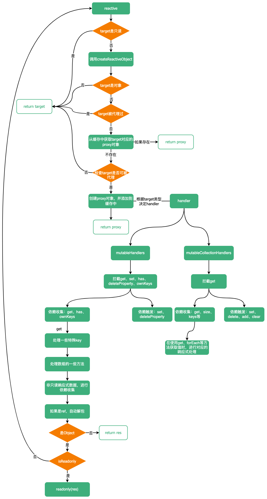

# reactive

前文中我们分析了`reactive`对`Object`类型的数据处理，这篇文章继续介绍对集合的处理。

## mutableCollectionHandlers
```ts
export const mutableCollectionHandlers: ProxyHandler<CollectionTypes> = {
  get: /*#__PURE__*/ createInstrumentationGetter(false, false)
}
```

对于集合，读取操作和修改操作都是通过调用方法（`size`除外）进行，所以只需要捕获其`get`方法即可。`get`捕获器通过`createInstrumentationGetter`函数生成。

```ts
function createInstrumentationGetter(isReadonly: boolean, shallow: boolean) {
  const instrumentations = shallow
    ? isReadonly
      ? shallowReadonlyInstrumentations
      : shallowInstrumentations
    : isReadonly
    ? readonlyInstrumentations
    : mutableInstrumentations

  return (
    target: CollectionTypes,
    key: string | symbol,
    receiver: CollectionTypes
  ) => {
    // 处理特殊的key
    if (key === ReactiveFlags.IS_REACTIVE) {
      return !isReadonly
    } else if (key === ReactiveFlags.IS_READONLY) {
      return isReadonly
    } else if (key === ReactiveFlags.RAW) {
      return target
    }

    return Reflect.get(
      hasOwn(instrumentations, key) && key in target
        ? instrumentations
        : target,
      key,
      receiver
    )
  }
}
```

`createInstrumentationGetter`函数接收两个参数：`isReadonly`（是否是只读响应式）、`shallow`（是否是浅层响应式）。

首先根据`isReadonly`和`shallow`的值，获取对应的`instrumentations`。
```ts
const instrumentations = shallow
  ? isReadonly
    ? shallowReadonlyInstrumentations
    : shallowInstrumentations
  : isReadonly
  ? readonlyInstrumentations
  : mutableInstrumentations
```

`instrumentations`是什么呢？

`instrumentations`就是个对象，它通过`createInstrumentations`生成，内部重写了集合的一些方法。`createInstrumentations`方法创建四个`instrumentations`：
- `mutableInstrumentations`：处理可修改的响应式集合数据
- `readonlyInstrumentations`：处理只读的响应式集合数据
- `shallowInstrumentations`：处理浅层响应式集合数据
- `shallowReadonlyInstrumentations`：处理浅层只读响应式集合数据

```ts
const [
  mutableInstrumentations,
  readonlyInstrumentations,
  shallowInstrumentations,
  shallowReadonlyInstrumentations
] = /* #__PURE__*/ createInstrumentations()
```

### mutableInstrumentations

```ts
const mutableInstrumentations: Record<string, Function> = {
  get(this: MapTypes, key: unknown) {
    return get(this, key)
  },
  get size() {
    return size(this as unknown as IterableCollections)
  },
  has,
  add,
  set,
  delete: deleteEntry,
  clear,
  forEach: createForEach(false, false)
}
```

#### get

`get`函数可接收四个参数：`target`目标集合、`key`、`isReadonly`是否是只读响应式、`isShallow`是否是浅层响应式。

```ts
function get(
  target: MapTypes,
  key: unknown,
  isReadonly = false,
  isShallow = false
) {
  // readonly(reactive(Map)) 应该返回值的readonly + reactive
  target = (target as any)[ReactiveFlags.RAW]
  const rawTarget = toRaw(target)
  const rawKey = toRaw(key)
  // 如果key与其原始对象不一致，说明key是响应式数据
  if (key !== rawKey) {
    // 如果不是只读的话，收集key的依赖
    !isReadonly && track(rawTarget, TrackOpTypes.GET, key)
  }
  // 收集key的原始值的依赖
  !isReadonly && track(rawTarget, TrackOpTypes.GET, rawKey)
  const { has } = getProto(rawTarget)
  // 确定包装函数
  // 如果是浅层响应式，包装函数返回入参：(value) => value
  // 如果是只读的响应式，包装函数就是会将value转为readonly
  // 否则使用reactive将value转为reactive
  const wrap = isShallow ? toShallow : isReadonly ? toReadonly : toReactive
  // target的原始值自身包含key值
  if (has.call(rawTarget, key)) {
    return wrap(target.get(key)) 
  } else if (has.call(rawTarget, rawKey)) { // target的原始值自身包含key的原始值
    return wrap(target.get(rawKey))
  } else if (target !== rawTarget) { // target与原始值不同, 说明target是个响应式数据，那么继续调用target.get。例如readonly(reactive(Map))
    target.get(key)
  }
}
```

::: details 可以发现，如果通过get方法获取一个响应式数据对应的值时，会有两次依赖的收集，为什么这么做呢？
其实这样做的目的是使通过响应式数据的原始值设置`Map`时，能够照常触发依赖。例如下面这个例子：
```ts
const key = ref('a')
const map = reactive(new Map())
map.set(key, 'a')

effect(() => {
  console.log(map.get(key))
})
map.set(key, 'b')
map.set(toRaw(key), 'c')
```
以上代码会依次打印`a b c`。无论通过`key`还是`key`的原始值进行修改`Map`，都能够触发依赖。
:::

#### size

```ts
function size(target: IterableCollections, isReadonly = false) {
  // 取原始值
  target = (target as any)[ReactiveFlags.RAW]
  // 收集依赖
  !isReadonly && track(toRaw(target), TrackOpTypes.ITERATE, ITERATE_KEY)
  return Reflect.get(target, 'size', target)
}
```

#### has

```ts
function has(this: CollectionTypes, key: unknown, isReadonly = false): boolean {
  const target = (this as any)[ReactiveFlags.RAW]
  // 取target/key的原始值
  const rawTarget = toRaw(target)
  const rawKey = toRaw(key)
  // 如果key是响应式对象，收集依赖
  if (key !== rawKey) {
    !isReadonly && track(rawTarget, TrackOpTypes.HAS, key)
  }
  // 收集依赖key的原始值对应依赖
  !isReadonly && track(rawTarget, TrackOpTypes.HAS, rawKey)
  return key === rawKey
    ? target.has(key)
    : target.has(key) || target.has(rawKey)
}
```

#### add

```ts
function add(this: SetTypes, value: unknown) {
  // 获取value与this的原始对象
  value = toRaw(value)
  const target = toRaw(this)
  const proto = getProto(target)
  const hadKey = proto.has.call(target, value)
  // target中不存在value时，才能触发依赖
  if (!hadKey) {
    target.add(value)
    trigger(target, TriggerOpTypes.ADD, value, value)
  }
  // 返回this，因为Set的add操纵可以链式操作
  return this
}
```

#### set

```ts
function set(this: MapTypes, key: unknown, value: unknown) {
  value = toRaw(value)
  const target = toRaw(this)
  const { has, get } = getProto(target)

  // 先检查target中是否存在key，无论key值是不是响应数据
  // 如果不存在，再检查是否存在key的原始数据
  let hadKey = has.call(target, key)
  if (!hadKey) {
    key = toRaw(key)
    hadKey = has.call(target, key)
  } else if (__DEV__) {
    checkIdentityKeys(target, has, key)
  }

  const oldValue = get.call(target, key)
  target.set(key, value)
  // 如果不存在key 说明是新增操作，反之为修改操作
  if (!hadKey) {
    trigger(target, TriggerOpTypes.ADD, key, value)
  } else if (hasChanged(value, oldValue)) {
    trigger(target, TriggerOpTypes.SET, key, value, oldValue)
  }
  // 返回this，因为Map的set操纵可以链式操作
  return this
}
```

::: details 为什么两次检查key的存在？
保证使用响应式数据作为key向Map中添加数据和使用响应式数据的原始值作为key向Map中修改数据时，修改的是同一个key的数据。例如下面这个例子
```ts
const key = reactive({})
const map = reactive(new Map())
map.set(toRaw(key), 'c')
map.set(key, 'b')

console.log(map.size) // 1
```
:::

#### delete

```ts
function deleteEntry(this: CollectionTypes, key: unknown) {
  const target = toRaw(this)
  const { has, get } = getProto(target)
  let hadKey = has.call(target, key)
  // 如果target中没有key，再寻找是否有key的原始值，与set相同
  if (!hadKey) {
    key = toRaw(key)
    hadKey = has.call(target, key)
  } else if (__DEV__) {
    checkIdentityKeys(target, has, key)
  }

  const oldValue = get ? get.call(target, key) : undefined
  // 进行删除
  const result = target.delete(key)
  if (hadKey) {
    trigger(target, TriggerOpTypes.DELETE, key, undefined, oldValue)
  }
  return result
}
```

#### clear

```ts
function clear(this: IterableCollections) {
  const target = toRaw(this)
  const hadItems = target.size !== 0
  const oldTarget = __DEV__
    ? isMap(target)
      ? new Map(target)
      : new Set(target)
    : undefined
  // forward the operation before queueing reactions
  const result = target.clear()
  // 如果集合中本就没有值，clear操作不会触发依赖
  if (hadItems) {
    trigger(target, TriggerOpTypes.CLEAR, undefined, undefined, oldTarget)
  }
  return result
}
```

#### forEach
`forEach`函数由`createForEach`创建。`createForEach`接收两个参数：`isReadonly`（是否是只读响应式）、`isShallow`（是否是浅层响应式）。
```ts
function createForEach(isReadonly: boolean, isShallow: boolean) {
  return function forEach(
    this: IterableCollections,
    callback: Function,
    thisArg?: unknown
  ) {
    const observed = this as any
    const target = observed[ReactiveFlags.RAW]
    const rawTarget = toRaw(target)
    const wrap = isShallow ? toShallow : isReadonly ? toReadonly : toReactive
    !isReadonly && track(rawTarget, TrackOpTypes.ITERATE, ITERATE_KEY)
    return target.forEach((value: unknown, key: unknown) => {
      // 包装value及key，使在forEach中访问到的key与value的响应性质与this保持一致
      return callback.call(thisArg, wrap(value), wrap(key), observed)
    })
  }
}
```

### shallowInstrumentations

`shallowInstrumentations`与`shallowInstrumentations`相似，只不过在生成`get`和`createForEach`函数时，传递的参数不一样。
```ts
const shallowInstrumentations: Record<string, Function> = {
  get(this: MapTypes, key: unknown) {
    return get(this, key, false, true)
  },
  get size() {
    return size(this as unknown as IterableCollections)
  },
  has,
  add,
  set,
  delete: deleteEntry,
  clear,
  forEach: createForEach(false, true)
}
```

### readonlyInstrumentations

```ts
const readonlyInstrumentations: Record<string, Function> = {
  get(this: MapTypes, key: unknown) {
    return get(this, key, true)
  },
  get size() {
    return size(this as unknown as IterableCollections, true)
  },
  has(this: MapTypes, key: unknown) {
    return has.call(this, key, true)
  },
  add: createReadonlyMethod(TriggerOpTypes.ADD),
  set: createReadonlyMethod(TriggerOpTypes.SET),
  delete: createReadonlyMethod(TriggerOpTypes.DELETE),
  clear: createReadonlyMethod(TriggerOpTypes.CLEAR),
  forEach: createForEach(true, false)
}
```

`readonlyInstrumentations`对象是用来处理只读响应式数据的，所以所有可修改集合的操作都会通过操作失败。这些可以修改集合的操作函数都会被一个`createReadonlyMethod`函数生成。

`createReadonlyMethod`函数接接收一个`type`参数，并返回一个匿名函数。
```ts
function createReadonlyMethod(type: TriggerOpTypes): Function {
  return function (this: CollectionTypes, ...args: unknown[]) {
    if (__DEV__) {
      const key = args[0] ? `on key "${args[0]}" ` : ``
      console.warn(
        `${capitalize(type)} operation ${key}failed: target is readonly.`,
        toRaw(this)
      )
    }
    return type === TriggerOpTypes.DELETE ? false : this
  }
}
```

### shallowReadonlyInstrumentations

```ts
const shallowReadonlyInstrumentations: Record<string, Function> = {
  get(this: MapTypes, key: unknown) {
    return get(this, key, true, true)
  },
  get size() {
    return size(this as unknown as IterableCollections, true)
  },
  has(this: MapTypes, key: unknown) {
    return has.call(this, key, true)
  },
  add: createReadonlyMethod(TriggerOpTypes.ADD),
  set: createReadonlyMethod(TriggerOpTypes.SET),
  delete: createReadonlyMethod(TriggerOpTypes.DELETE),
  clear: createReadonlyMethod(TriggerOpTypes.CLEAR),
  forEach: createForEach(true, true)
}
```

除了重写了以上几个方法外，还对`keys`、`values`等方法也进行了重写：

```ts
const iteratorMethods = ['keys', 'values', 'entries', Symbol.iterator]
iteratorMethods.forEach(method => {
  mutableInstrumentations[method as string] = createIterableMethod(
    method,
    false,
    false
  )
  readonlyInstrumentations[method as string] = createIterableMethod(
    method,
    true,
    false
  )
  shallowInstrumentations[method as string] = createIterableMethod(
    method,
    false,
    true
  )
  shallowReadonlyInstrumentations[method as string] = createIterableMethod(
    method,
    true,
    true
  )
})
```

`keys`、`values`、`entries`、`Symbol.iterator`的重写函数均通过一个`createIterableMethod`函数生成。

::: details Symbol.iterator是什么？
集合的`Symbol.iterator`函数可以用来获取迭代器对象，正是因为集合实现了`Symbol.iterator`方法，所以可以使用`for...of`进行迭代。而这里需要重写`Symbol.iterator`方法，目的是为了是现在使用`for...of`迭代代理对象。如下：

```ts
const map = reactive(new Map([['a', 1], ['b', 2]]))

for(const [key, value] of map) {
  console.log(key, value)
}
```
:::

`createIterableMethod`接收三个参数：`method`、`isReadonly`、`isShallow`。
```ts
function createIterableMethod(
  method: string | symbol,
  isReadonly: boolean,
  isShallow: boolean
) {
  return function (
    this: IterableCollections,
    ...args: unknown[]
  ): Iterable & Iterator {
    const target = (this as any)[ReactiveFlags.RAW]
    const rawTarget = toRaw(target)
    const targetIsMap = isMap(rawTarget)
    // 根据isPair判断迭代时的参数
    const isPair =
      method === 'entries' || (method === Symbol.iterator && targetIsMap)
    const isKeyOnly = method === 'keys' && targetIsMap
    // 获取迭代器
    const innerIterator = target[method](...args)
    // 包装函数
    const wrap = isShallow ? toShallow : isReadonly ? toReadonly : toReactive
    // 依赖收集
    !isReadonly &&
      track(
        rawTarget,
        TrackOpTypes.ITERATE,
        isKeyOnly ? MAP_KEY_ITERATE_KEY : ITERATE_KEY
      )
    // 返回一个同时满足迭代器协议和可迭代协议的对象
    return {
      // 迭代器协议
      next() {
        // 调用原始对象的迭代器的next方法获取value与done
        const { value, done } = innerIterator.next()
        return done
          ? { value, done }
          : {
              // 包装key、value
              value: isPair ? [wrap(value[0]), wrap(value[1])] : wrap(value),
              done
            }
      },
      // 实现可迭代协议，意味着可以使用for...of迭代map.keys/values/entries()
      [Symbol.iterator]() {
        return this
      }
    }
  }
}
```

## 总结

`reactive`通过`Proxy`代理原始对象，通过拦截代理对象的操作进行依赖的收集与触发。当对代理对象进行读取操作时，进行依赖的收集；对代理对象进行修改操作则触发依赖，无论是读取操作还是修改操作，其实都是操作的原始对象，为了在执行修改操作时不污染原始对象，都会先调用`toRaw`获取`value`的原始值，然后再进行修改。

`reactive`的实现是懒惰的，如果不访问代理对象的属性，那么永远不会将代理对象的属性转为代理对象。

`reactive`流程：

