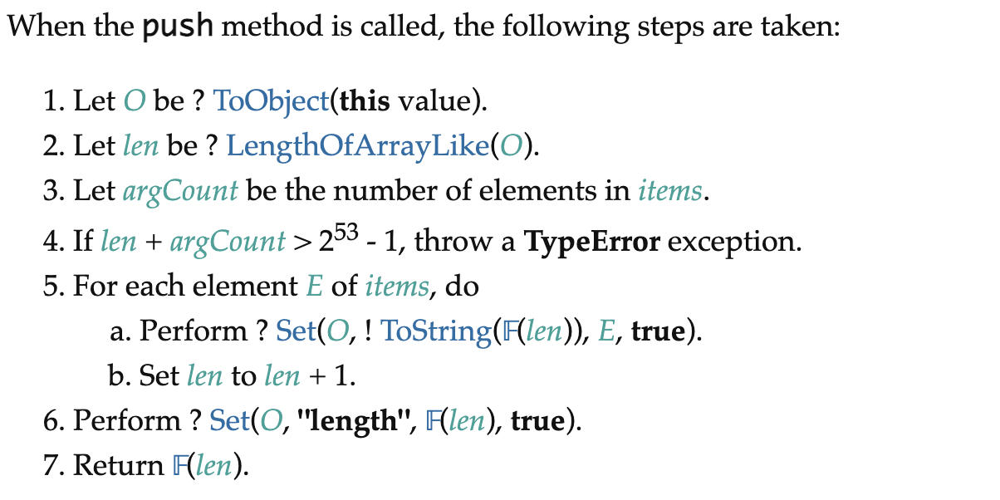

# reactive

返回一个对象的响应式代理。

## 使用

```ts
const obj = {
  count: 1,
  flag: true,
  obj: {
    str: ''
  }
}

const reactiveObj = reactive(obj)
```

## 源码解析

### reactive
```ts
export function reactive(target: object) {
  // 如果target是个只读proxy，直接return
  if (isReadonly(target)) {
    return target
  }
  return createReactiveObject(
    target,
    false,
    mutableHandlers,
    mutableCollectionHandlers,
    reactiveMap
  )
}
```

`reactive`首先判断`target`是不是只读的`proxy`，如果是的话，直接返回`target`；否则调用一个`createReactiveObject`方法。

### createReactiveObject
```ts
function createReactiveObject(
  target: Target,
  isReadonly: boolean,
  baseHandlers: ProxyHandler<any>,
  collectionHandlers: ProxyHandler<any>,
  proxyMap: WeakMap<Target, any>
) {
  if (!isObject(target)) {
    if (__DEV__) {
      console.warn(`value cannot be made reactive: ${String(target)}`)
    }
    return target
  }
  // target is already a Proxy, return it.
  // exception: calling readonly() on a reactive object
  if (
    target[ReactiveFlags.RAW] &&
    !(isReadonly && target[ReactiveFlags.IS_REACTIVE])
  ) {
    return target
  }
  // target already has corresponding Proxy
  const existingProxy = proxyMap.get(target)
  if (existingProxy) {
    return existingProxy
  }
  // only a whitelist of value types can be observed.
  const targetType = getTargetType(target)
  if (targetType === TargetType.INVALID) {
    return target
  }
  const proxy = new Proxy(
    target,
    targetType === TargetType.COLLECTION ? collectionHandlers : baseHandlers
  )
  proxyMap.set(target, proxy)
  return proxy
}
```

`createReactiveObject`接收五个参数：`target`被代理的对象，`isReadonly`是不是只读的，`baseHandlers`proxy的捕获器，`collectionHandlers`针对集合的proxy捕获器，`proxyMap`一个用于缓存proxy的`WeakMap`对象

如果`target`不是`Object`，则进行提示，并返回`target`。
```ts
if (!isObject(target)) {
  if (__DEV__) {
    console.warn(`value cannot be made reactive: ${String(target)}`)
  }
  return target
}
```

`isObject`：
```ts
export const isObject = (val: unknown): val is Record<any, any> =>
  val !== null && typeof val === 'object'
```

如果`target`已经是个`proxy`，直接返回`target`。`reactive(readonly(obj))`是个例外。
```ts
if (
  target[ReactiveFlags.RAW] &&
  !(isReadonly && target[ReactiveFlags.IS_REACTIVE])
) {
  return target
}
```

然后尝试从`proxyMap`中获取缓存的`proxy`对象，如果存在的话，直接返回`proxyMap`中对应的`proxy`。否则创建`proxy`。
```ts
const existingProxy = proxyMap.get(target)
if (existingProxy) {
  return existingProxy
}
```

::: details 为什么要缓存代理对象？
这里缓存对象的存在意义是，**一方面避免对同一个对象进行多次代理造成的资源浪费**，**另一方面可以保证相同对象被代理多次后，代理对象保持一致**。例如下面这里例子：
```ts
const obj = {}
const objReactive = reactive([obj])
console.log(objReactive.includes(objReactive[0]))
```
如果没有`proxyMap`这个缓存对象，在`includes`中由于会访问到数组索引，所以会创建一个`obj`的响应式对象，而在`includes`的参数中，又访问了依次`objReactive`的0索引，所以又会创建个新的`obj`代理对象。两次创建的代理对象由于地址不一致，造成`objReactive.includes(objReactive[0])`输出为`false`。而有了这个缓存对象，当第二次要创建代理对象时，会直接从缓存中获取，这样就保证了相同对象的代理对象地址一致性的问题。
:::

并不是任何对象都可以被`proxy`所代理。这里会通过`getTargetType`方法来进行判断。
```ts
const targetType = getTargetType(target)
if (targetType === TargetType.INVALID) {
  return target
}
```

`getTargetType`：
```ts
function getTargetType(value: Target) {
  return value[ReactiveFlags.SKIP] || !Object.isExtensible(value)
    ? TargetType.INVALID
    : targetTypeMap(toRawType(value))
}

function targetTypeMap(rawType: string) {
  switch (rawType) {
    case 'Object':
    case 'Array':
      return TargetType.COMMON
    case 'Map':
    case 'Set':
    case 'WeakMap':
    case 'WeakSet':
      return TargetType.COLLECTION
    default:
      return TargetType.INVALID
  }
}
```

`getTargetType`有三种可能的返回结果
- `TargetType.INVALID`：代表`target`不能被代理
- `TargetType.COMMON`：代表`target`是`Array`或`Object`
- `TargetType.COLLECTION`：代表`target`是`Map`、`Set`、`WeakMap`、`WeakSet`中的一种

`target`不能被代理的情况有三种：
1. 显示声明对象不可被代理（通过向对象添加`__v_skip: true`属性）或使用`markRaw`标记的对象
2. 对象为不可扩展对象：如通过`Object.freeze`、`Object.seal`、`Object.preventExtensions`的对象
3. 除了`Object`、`Array`、`Map`、`Set`、`WeakMap`、`WeakSet`之外的其他类型的对象，如`Date`、`RegExp`、`Promise`等

如果`targetType !== TargetType.INVALID`，那么则可以进行`target`的代理操作了。
```ts
const proxy = new Proxy(
  target,
  targetType === TargetType.COLLECTION ? collectionHandlers : baseHandlers
)
proxyMap.set(target, proxy)
return proxy
```

当`new Proxy(target, handler)`时，这里的`handler`有两种：一种是针对`Object`、`Array`的`baseHandlers`，一种是针对集合（`Set`、`Map`、`WeakMap`、`WeakSet`）的`collectionHandlers`。

::: details 为什么这里要分两种handler呢?
首先，我们要知道在`handler`中我们要进行依赖的收集和依赖的触发。那么什么情况进行依赖收集和触发依赖呢？当我们对代理对象执行**读取操作**应该收集对应依赖，而当我们对代理对象执行**修改操作**时应该触发依赖。

那么什么样的操作被称为读取操作和修改操作呢？

|     | 读取操作 |   修改操作  |
|-----|--|-----|
|  Object   | `obj.a`、`for...in...`、`key in obj` |  `obj.a=1`、`delete obj.a`   |
|  Array  | `for...of...`、`for...in...`、`arr[index]`、`arr.length`、`arr.indexOf/lastIndexOf/includes(item)`、`arr.some/every/forEach`等 |  `arr[0]=1`、`arr.length=0`、`arr.pop/push/unshift/shift`、`arr.splice/fill/sort`等   |
|   集合  | `map/set.size`、`map.get(key)`、`map/set.has(key)`、`map/set.forEach`、`map.keys/values()`等 |  `set.add(value)`、`map.add(key, value)`、`set/map.clear()`、`set/map.delete(key)`   |

对于`Object`、`Array`、集合这几种数据类型，如果使用`proxy`捕获它们的读取或修改操作，其实是不一样的。比如捕获修改操作进行依赖触发时，`Object`可以直接通过`set`（或`deleteProperty`）捕获器，而`Array`是可以通过`pop`、`push`等方法进行修改数组的，所以需要捕获它的`get`操作进行单独处理，同样对于集合来说，也需要通过捕获`get`方法来处理修改操作。
:::

接下来看下创建`reactive`所需要的两个`handler`：`mutableHandlers`（`Object`与`Array`的`handler`）、`mutableCollectionHandlers`（集合的`handler`）。

### mutableHandlers

```ts
export const mutableHandlers: ProxyHandler<object> = {
  get,
  set,
  deleteProperty,
  has,
  ownKeys
}
```

对于`Object`和`Array`，设置了5个捕获器，分别为：`get`、`set`、`deleteProperty`、`has`、`ownKeys`。

#### get捕获器
`get`捕获器为属性读取操作的捕获器，它可以捕获`obj.pro`、`array[index]`、`array.indexOf()`、`arr.length`、`Reflect.get()`、`Object.create(obj).foo`（访问继承者的属性）等操作。

```ts
const get = /*#__PURE__*/ createGetter()

function createGetter(isReadonly = false, shallow = false) {
  return function get(target: Target, key: string | symbol, receiver: object) {
    if (key === ReactiveFlags.IS_REACTIVE) {
      return !isReadonly
    } else if (key === ReactiveFlags.IS_READONLY) {
      return isReadonly
    } else if (key === ReactiveFlags.IS_SHALLOW) {
      return shallow
    } else if (
      key === ReactiveFlags.RAW &&
      receiver ===
      (isReadonly
          ? shallow
            ? shallowReadonlyMap
            : readonlyMap
          : shallow
            ? shallowReactiveMap
            : reactiveMap
      ).get(target)
    ) {
      return target
    }

    const targetIsArray = isArray(target)

    if (!isReadonly && targetIsArray && hasOwn(arrayInstrumentations, key)) {
      return Reflect.get(arrayInstrumentations, key, receiver)
    }

    const res = Reflect.get(target, key, receiver)

    if (isSymbol(key) ? builtInSymbols.has(key) : isNonTrackableKeys(key)) {
      return res
    }

    if (!isReadonly) {
      track(target, TrackOpTypes.GET, key)
    }

    if (shallow) {
      return res
    }

    if (isRef(res)) {
      const shouldUnwrap = !targetIsArray || !isIntegerKey(key)
      return shouldUnwrap ? res.value : res
    }

    if (isObject(res)) {
      return isReadonly ? readonly(res) : reactive(res)
    }

    return res
  }
}
```

`get`捕获器通过一个`createGetter`函数创建。`createGetter`接收两个参数：`isReadonly`是否为只读的响应式数据、`shallow`是否是浅层响应式数据。

在`get`捕获器中，会先处理几个特殊的`key`：
- `ReactiveFlags.IS_REACTIVE`：是不是`reactive`
- `ReactiveFlags.IS_READONLY`：是不是只读的
- `ReactiveFlags.IS_SHALLOW`：是不是浅层响应式
- `ReactiveFlags.RAW`：原始值

```ts
if (key === ReactiveFlags.IS_REACTIVE) {
  return !isReadonly
} else if (key === ReactiveFlags.IS_READONLY) {
  return isReadonly
} else if (key === ReactiveFlags.IS_SHALLOW) {
  return shallow
} else if (
  key === ReactiveFlags.RAW &&
  receiver ===
  (isReadonly
      ? shallow
        ? shallowReadonlyMap
        : readonlyMap
      : shallow
        ? shallowReactiveMap
        : reactiveMap
  ).get(target)
) {
  return target
}
```

::: details 在获取原始值，有个额外的条件：receiver全等于target的代理对象。为什么要有这个额外条件呢？
**这样做是为了避免从原型链上获取不属于自己的原始对象**。来看下面一个例子：
```ts
const parent = { p:1 }

const parentReactive = reactive(parent)
const child = Object.create(parentReactive)

console.log(toRaw(parentReactive) === parent) // true
console.log(toRaw(child) === parent) // false
```

声明一个变量`parent`并将`parent`使用`proxy`代理，然后使用`Object.create`创建一个对象并将原型指向`parent`的代理对象`parentReactive`。

这时`parentReactive`的原始对象还是`parent`，这是毫无疑问的。

如果尝试获取`child`的原始对象，因为`child`本身是不存在`ReactiveFlags.RAW`属性的，所以会沿着原型链向上找，找到`parentReactive`时，被`parentReactive`的`get`拦截器捕获（此时`target`是`parent`、`receiver`是`child`），如果没有这条额判断，那么会直接返回`target`，也就是`parent`，此时意味着`child`的原始对象是`parent`，这显然是不合理的。恰恰就是这个额外条件排除了这种情况。
:::

然后检查`target`是不是数组，如果是数组，需要对一些方法（针对`includes`、`indexOf`、`lastIndexOf`、`push`、`pop`、`shift`、`unshift`、`splice`）进行特殊处理。
```ts
const targetIsArray = isArray(target)

if (!isReadonly && targetIsArray && hasOwn(arrayInstrumentations, key)) {
  return Reflect.get(arrayInstrumentations, key, receiver)
}
```

通过判断`key`是不是`arrayInstrumentations`自身包含的属性，处理特殊的数组方法。`arrayInstrumentations`是使用`createArrayInstrumentations`创建的一个对象，该对象属性包含要特殊处理的数组方法：`includes`、`indexOf`、`lastIndexOf`、`push`、`pop`、`shift`、`unshift`、`splice`。

::: details 为什么要针对这些方法进行特殊处理？
为了弄明白这个问题，我们声明了一个简单的`myReactive`，它可以深度创建`proxy`。
```ts
const obj = {}

function myReactive(obj) {
  return new Proxy(obj, {
    get(target, key, receiver) {
      const res = Reflect.get(target, key, receiver)
      if (typeof res === 'object' && res !== null) {
        return myReactive(obj)
      }
      return res
    }
  })
}
const arr = myReactive([obj])

console.log(arr.includes(obj))
console.log(arr.indexOf(obj))
console.log(arr.lastIndexOf(obj))
```
当代码执行后，三个打印均为`false`，但按照`reactive`的逻辑，这三个打印应该打印`true`。为什么会出现这个问题呢？当调用`includes`、`indexOf`、`lastIndexOf`这些方法时，会遍历`arr`，遍历`arr`的过程取到的是`reactive`对象，如果拿这个`reactive`对象和`obj`原始对象比较，肯定找不到，所以需要重写这三个方法。

`push`、`pop`、`shift`、`unshift`、`splice`这些方法为什么要特殊处理呢？仔细看这几个方法的执行，都会改变数组的长度。以`push`为例，我们查看[ECMAScript](https://262.ecma-international.org/13.0/#sec-intro)对`push`的执行流程说明：

在第二步中会读取数组的`length`属性，在第六步会设置`length`属性。我们知道在属性的读取过程中会进行依赖的收集，在属性的修改过程中会触发依赖（执行`effect.run`）。如果按照这样的逻辑会发生什么问题呢？我们还是以一个例子说明：
```ts
const arr = reactive([])
effect(() => {
  arr.push(1)
})
```
当向`arr`中进行`push`操作，首先读取到`arr.length`，将`length`对应的依赖`effect`收集起来，由于`push`操作会设置`length`，所以在设置`length`的过程中会触发`length`的依赖，执行`effect.run()`，而在`effect.run()`中会执行`this.fn()`，又会调用`arr.push`操作，这样就会造成一个死循环。

为了解决这两个问题，需要重写这几个方法。
:::

`arrayInstrumentations`：
```ts
const arrayInstrumentations = /*#__PURE__*/ createArrayInstrumentations()

function createArrayInstrumentations() {
  const instrumentations: Record<string, Function> = {}
  ;(['includes', 'indexOf', 'lastIndexOf'] as const).forEach(key => {
    instrumentations[key] = function (this: unknown[], ...args: unknown[]) {
      const arr = toRaw(this) as any
      for (let i = 0, l = this.length; i < l; i++) {
        // 每个索引都需要进行收集依赖
        track(arr, TrackOpTypes.GET, i + '')
      }
      // 在原始对象上调用方法
      const res = arr[key](...args)
      // 如果没有找到，可能参数中有响应对象，将参数转为原始对象，再调用方法
      if (res === -1 || res === false) {
        return arr[key](...args.map(toRaw))
      } else {
        return res
      }
    }
  })
  
  ;(['push', 'pop', 'shift', 'unshift', 'splice'] as const).forEach(key => {
    instrumentations[key] = function (this: unknown[], ...args: unknown[]) {
      // 暂停依赖收集
      // 因为push等操作是修改数组的，所以在push过程中不进行依赖的收集是合理的，只要它能够触发依赖就可以
      pauseTracking()
      const res = (toRaw(this) as any)[key].apply(this, args)
      resetTracking()
      return res
    }
  })
  return instrumentations
}
```

回到`get`捕获器中，处理玩数组的几个特殊方法后，会使用`Reflect.get`获取结果`res`。如果`res`是`symbol`类型，并且`key`是`Symbol`内置的值，直接返回`res`；如果`res`不是`symbol`类型，且`key`不再`__proto__`（避免对原型进行依赖追踪）、`__v_isRef`、`__isVue`中。
```ts
const res = Reflect.get(target, key, receiver)

// builtInSymbols: new Set(Object.getOwnPropertyNames(Symbol).map(key => Symbol[key]).filter(val => typeof val === 'symbol'))
if (isSymbol(key) ? builtInSymbols.has(key) : isNonTrackableKeys(key)) {
  return res
}
```

如果不是只读响应式，就可以调用`track`进行依赖的收集。
```ts
if (!isReadonly) {
  track(target, TrackOpTypes.GET, key)
}
```

::: details 为什么非只读情况才收集依赖？
因为对于只读的响应式数据，是无法对其进行修改的，所以收集它的依赖时没有用的，只会造成资源的浪费。
:::

如果是浅层响应式，返回`res`。
```ts
if (shallow) {
  return res
}
```

如果`res`是`ref`，`target`不是数组的情况下，会自动解包。
```ts
if (isRef(res)) {
  const shouldUnwrap = !targetIsArray || !isIntegerKey(key)
  // 如果target不是数组或key不是整数，自动解包
  return shouldUnwrap ? res.value : res
}
```

如果`res`是`Object`，进行深层响应式处理。从这里就能看出，`Proxy`是懒惰式的创建响应式对象，只有访问对应的`key`，才会继续创建响应式对象，否则不用创建。
```ts
if (isObject(res)) {
  return isReadonly ? readonly(res) : reactive(res)
}
```

最后，返回`res`
```ts
return res
```

#### set捕获器

`set`捕获器可以捕获`obj.str=''`、`arr[0]=1`、`arr.length=2`、`Reflect.set()`、`Object.create(obj).foo = 'foo'`（修改继承者的属性）操作。
```ts
const set = /*#__PURE__*/ createSetter()

function createSetter(shallow = false) {
  return function set(
    target: object,
    key: string | symbol,
    value: unknown,
    receiver: object
  ): boolean {
    let oldValue = (target as any)[key]
    if (isReadonly(oldValue) && isRef(oldValue) && !isRef(value)) {
      return false
    }
    if (!shallow && !isReadonly(value)) {
      if (!isShallow(value)) {
        value = toRaw(value)
        oldValue = toRaw(oldValue)
      }
      if (!isArray(target) && isRef(oldValue) && !isRef(value)) {
        oldValue.value = value
        return true
      }
    } else {
      // in shallow mode, objects are set as-is regardless of reactive or not
    }

    const hadKey =
      isArray(target) && isIntegerKey(key)
        ? Number(key) < target.length
        : hasOwn(target, key)
    const result = Reflect.set(target, key, value, receiver)
    if (target === toRaw(receiver)) {
      if (!hadKey) {
        trigger(target, TriggerOpTypes.ADD, key, value)
      } else if (hasChanged(value, oldValue)) {
        trigger(target, TriggerOpTypes.SET, key, value, oldValue)
      }
    }
    return result
  }
}
```

`set`捕获器通过一个`createSetter`函数创建。`createSetter`接收一个`shallow`参数，返回一个`function`。

`set`拦截器中首先获取旧值。如果旧值是只读的`ref`类型，而新的值不是`ref`，则返回`false`，不允许修改。
```ts
let oldValue = (target as any)[key]
if (isReadonly(oldValue) && isRef(oldValue) && !isRef(value)) {
  return false
}

// 如果不是浅层响应式并且新的值不是readonly
if (!shallow && !isReadonly(value)) {
  // 新值不是浅层响应式，新旧值取其对应的原始值
  if (!isShallow(value)) {
    value = toRaw(value)
    oldValue = toRaw(oldValue)
  }
  // 如果target不是数组并且旧值是ref类型，新值不是ref类型，直接修改oldValue.value为value
  if (!isArray(target) && isRef(oldValue) && !isRef(value)) {
    oldValue.value = value
    return true
  }
} else {
  // in shallow mode, objects are set as-is regardless of reactive or not
  // 如果是浅层响应式，对象按原样设置
}
```

::: details 为什么需要取新值和旧值的原始值？
避免设置属性的过程中造成原始数据的污染。来看下面一个例子：
```ts
const obj1 = {}
const obj2 = { a: obj1 }
const obj2Reactive = reactive(obj2)

obj2Reactive.a = reactive(obj1)

console.log(obj2.a === obj1) // true
```
如果我们不对`value`取原始值，在修改`obj2Reactive`的`a`属性时，会将响应式对象添加到`obj2`中，如此原始数据`obj2`中会被混入响应式数据，原始数据就被污染了，为了避免这种情况，就需要取`value`的原始值，将`value`的原始值添加到`obj2`中。

那为什么对`oldValue`取原始值，因为在后续修改操作触发依赖前需要进行新旧值的比较时，而在比较时，我们不可能拿响应式数据与原始数据进行比较，我们需要拿新值和旧值的原始数据进行比较，只有新值与旧值的原始数据不同，才会触发依赖。
:::

接下来就是调用`Reflect.set`进行赋值。
```ts
// key是不是target本身的属性
const hadKey =
  isArray(target) && isIntegerKey(key)
    ? Number(key) < target.length
    : hasOwn(target, key)
const result = Reflect.set(target, key, value, receiver)
```

然后触发依赖。
```ts
// 对于处在原型链上的target不触发依赖
if (target === toRaw(receiver)) {
  // 触发依赖，根据hadKey值决定是新增属性还是修改属性
  if (!hadKey) {
    trigger(target, TriggerOpTypes.ADD, key, value)
  } else if (hasChanged(value, oldValue))  // 如果是修改操作，比较新旧值
    trigger(target, TriggerOpTypes.SET, key, value, oldValue)
  }
}
// 返回result
return result
```

#### deleteProperty捕获器

`deleteProperty`捕获器用来捕获`delete obj.str`、`Reflect.deletedeleteProperty`操作。
```ts
function deleteProperty(target: object, key: string | symbol): boolean {
  // key是否是target自身的属性
  const hadKey = hasOwn(target, key)
  // 旧值
  const oldValue = (target as any)[key]
  // 调用Reflect.deleteProperty从target上删除属性
  const result = Reflect.deleteProperty(target, key)
  // 如果删除成功并且target自身有key，则触发依赖
  if (result && hadKey) {
    trigger(target, TriggerOpTypes.DELETE, key, undefined, oldValue)
  }
  // 返回result
  return result
}
```

#### has捕获器
`has`捕获器可以捕获`for...in...`、`key in obj`、`Reflect.has()`操作。

```ts
function has(target: object, key: string | symbol): boolean {
  const result = Reflect.has(target, key)
  // key不是symbol类型或不是symbol的内置属性，进行依赖收集
  if (!isSymbol(key) || !builtInSymbols.has(key)) {
    track(target, TrackOpTypes.HAS, key)
  }
  return result
}
```

#### ownKeys捕获器
`ownKeys`捕获器可以捕获`Object.keys()`、`Object.getOwnPropertyNames()`、`Object.getOwnPropertySymbols()`、`Reflect.ownKeys()`操作

```ts
function ownKeys(target: object): (string | symbol)[] {
  // 如果target是数组，收集length的依赖
  track(target, TrackOpTypes.ITERATE, isArray(target) ? 'length' : ITERATE_KEY)
  return Reflect.ownKeys(target)
}
```

### 其他reactive

除了`reactive`，`readonly`、`shallowReadonly`、`shallowReactive`均是通过`createReactiveObject`创建的。不同是传递的参数不同。

```ts
export function readonly<T extends object>(
  target: T
): DeepReadonly<UnwrapNestedRefs<T>> {
  return createReactiveObject(
    target,
    true,
    readonlyHandlers,
    readonlyCollectionHandlers,
    readonlyMap
  )
}

export function shallowReadonly<T extends object>(target: T): Readonly<T> {
  return createReactiveObject(
    target,
    true,
    shallowReadonlyHandlers,
    shallowReadonlyCollectionHandlers,
    shallowReadonlyMap
  )
}

export function shallowReactive<T extends object>(
  target: T
): ShallowReactive<T> {
  return createReactiveObject(
    target,
    false,
    shallowReactiveHandlers,
    shallowCollectionHandlers,
    shallowReactiveMap
  )
}
```

这里主要看一下`readonlyHandlers`的实现。

```ts
export const readonlyHandlers: ProxyHandler<object> = {
  get: readonlyGet,
  set(target, key) {
    if (__DEV__) {
      warn(
        `Set operation on key "${String(key)}" failed: target is readonly.`,
        target
      )
    }
    return true
  },
  deleteProperty(target, key) {
    if (__DEV__) {
      warn(
        `Delete operation on key "${String(key)}" failed: target is readonly.`,
        target
      )
    }
    return true
  }
}
```

因为被`readonly`处理的数据不会被修改，所以所有的修改操作都不会被允许，修改操作不会进行意味着也就不会进行依赖的触发，对应地也就不需要进行依赖的收集，所以`ownKeys`、`has`也就没必要拦截了。

关于集合的处理将在后面文章继续分析。
