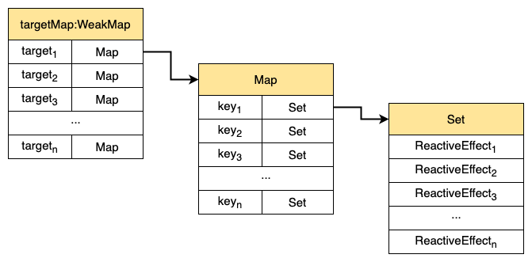
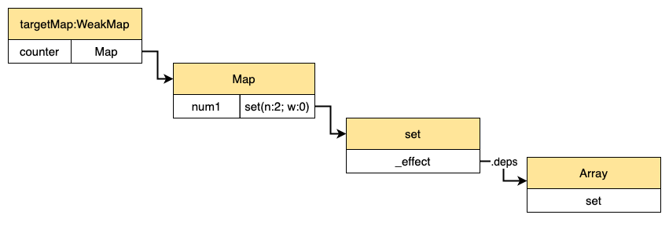
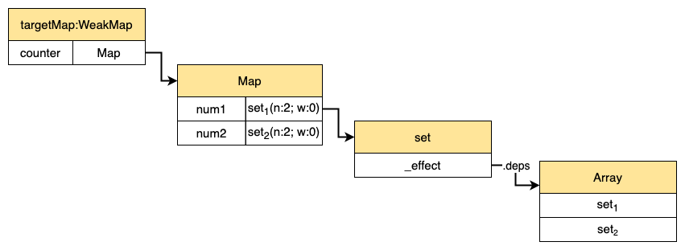
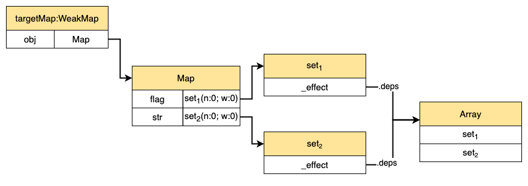
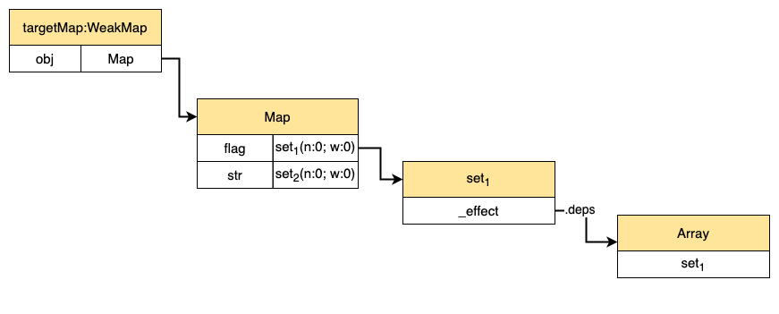

# vue3的响应系统分析

::: tip
`vue3`的响应式处理主要集中在`packages/reactivity/src/effect.ts`文件中。
:::

## effect

在`vue3`中，会使用一个`effect`方法注册副作用函数。为什么要注册副作用函数呢？

如果响应式数据更新，我们希望副作用函数中的相关数据也能同步更新。要实现这种效果，就需要我们做两个工作：

- 在**读取**响应式数据时，收集副作用函数。
- 在**设置**响应式数据时，触发副作用函数。

那么我们如何在设置响应式数据时，触发相关的副作用函数呢？这就需要我们在收集副作用函数时，使用某种数据结构把他暂存起来，等到需要到他的时候，就可以取出来。

`effect`的作用就是将我们注册的副作用函数暂存。下面我们来看`effect`的实现：

```ts
export function effect<T = any>(
  fn: () => T,
  options?: ReactiveEffectOptions
): ReactiveEffectRunner {
  if ((fn as ReactiveEffectRunner).effect) {
    fn = (fn as ReactiveEffectRunner).effect.fn
  }

  const _effect = new ReactiveEffect(fn)
  if (options) {
    extend(_effect, options)
    if (options.scope) recordEffectScope(_effect, options.scope)
  }
  if (!options || !options.lazy) {
    _effect.run()
  }
  const runner = _effect.run.bind(_effect) as ReactiveEffectRunner
  runner.effect = _effect
  return runner
}
```

`effect`可以接收两个参数，其中第二个参数为可选参数，可以不传。第一个参数是一个副作用函数`fn`，第二个参数是个对象，该对象可以有如下属性：

- `lazy`：`boolean`，是否懒加载，如果是`true`，调用`effect`不会立即执行监听函数，需要用户手动执行
- `scheduler`：一个调度函数，如果存在调度函数，在触发依赖时，执行该调度函数
- `scope`：一个`EffectScope`作用域对象
- `allowRecurse`：`boolean`，允许递归
- `onStop`：`effect`被停止时的钩子

在`effect`中会首先检查`fn.effect`属性，如果存在`fn.effect`，那么说明`fn`已经被`effect`处理过了，然后使用`fn.effect.fn`作为`fn`。

```ts
if ((fn as ReactiveEffectRunner).effect) {
  fn = (fn as ReactiveEffectRunner).effect.fn
}
```

```ts
const fn = () => {}
const runner1 = effect(fn)
const runner2 = effect(runner1)

runner1.effect.fn === fn // true
runner2.effect.fn === fn // true
```

然后`new`了一个`ReactiveEffect`对象。

```ts
const _effect = new ReactiveEffect(fn)
```

接着如果存在`option`对象的话，会将`options`，合并到`_effect`中。如果存在`options.scope`，会调用`recordEffectScope`将`_effect`放入`options.scope`。如果不存在`options`或`options.lazy === false`，那么会执行`_effect.run()`，进行依赖的收集。

```ts
if (options) {
  extend(_effect, options)
  if (options.scope) recordEffectScope(_effect, options.scope)
}
if (!options || !options.lazy) {
  _effect.run()
}
```

最后，会将`_effect.run`中的`this`指向它本身，这样做的目的是用户在主动执行`runner`时，`this`指针指向的是`_effect`对象，然后将`_effect`作为`runner`的`effect`属性，并将`runner`返回。

```ts
const runner = _effect.run.bind(_effect) as ReactiveEffectRunner
runner.effect = _effect
return runner
```

在`effect`中创建了一个`ReactiveEffect`对象，这个`ReactiveEffect`是什么呢？接下来继续看`ReactiveEffect`的实现。

## ReactiveEffect

```ts
export class ReactiveEffect<T = any> {
  active = true
  deps: Dep[] = []
  parent: ReactiveEffect | undefined = undefined

  computed?: ComputedRefImpl<T>
  allowRecurse?: boolean

  onStop?: () => void
  // dev only
  onTrack?: (event: DebuggerEvent) => void
  // dev only
  onTrigger?: (event: DebuggerEvent) => void

  constructor(
    public fn: () => T,
    public scheduler: EffectScheduler | null = null,
    scope?: EffectScope
  ) {
    recordEffectScope(this, scope)
  }

  run() {
    if (!this.active) {
      return this.fn()
    }
    let parent: ReactiveEffect | undefined = activeEffect
    let lastShouldTrack = shouldTrack
    while (parent) {
      if (parent === this) {
        return
      }
      parent = parent.parent
    }
    try {
      this.parent = activeEffect
      activeEffect = this
      shouldTrack = true

      trackOpBit = 1 << ++effectTrackDepth

      if (effectTrackDepth <= maxMarkerBits) {
        initDepMarkers(this)
      } else {
        cleanupEffect(this)
      }
      return this.fn()
    } finally {
      if (effectTrackDepth <= maxMarkerBits) {
        finalizeDepMarkers(this)
      }

      trackOpBit = 1 << --effectTrackDepth

      activeEffect = this.parent
      shouldTrack = lastShouldTrack
      this.parent = undefined
    }
  }

  stop() {
    if (this.active) {
      cleanupEffect(this)
      if (this.onStop) {
        this.onStop()
      }
      this.active = false
    }
  }
}
```

`ReactiveEffect`是使用`es6 class`定义的一个类。它的构造器可以接受三个参数：`fn`（副作用函数）、`scheduler`（调度器）、`scope`（一个`EffectScope`作用域对象），在构造器中调用了一个`recordEffectScope`方法，这个方法会将当前`ReactiveEffect`对象（`this`）放入对应的`EffectScope`作用域（`scope`）中。

```ts
constructor(
  public fn: () => T,
  public scheduler: EffectScheduler | null = null,
  scope?: EffectScope
) {
  recordEffectScope(this, scope)
}
```

`ReactiveEffect`中有两个方法：`run`、`stop`。

### run

在`run`的执行过程中，会首先判断`ReactiveEffect`的激活状态（`active`），如果未激活（`this.active === false`），那么会立马执行`this.fn`并返回他的执行结果。

```ts
if (!this.active) {
  return this.fn()
}
```

然后声明了两个变量：`parent`（默认`activeEffect`）、`lastShouldTrack`（默认`shouldTrack`，一个全局变量，默认为`true`）。紧接着会使用`while`循环寻找`parent.parent`，一旦`parent`与`this`相等，立即结束循环。

```ts
let parent: ReactiveEffect | undefined = activeEffect
let lastShouldTrack = shouldTrack
while (parent) {
  if (parent === this) {
    return
  }
  parent = parent.parent
}
```

紧接着把`activeEffect`赋值给`this.parent`，把`this`赋值给`this.parent`。

```ts
try {
  // 设置当前的parent为上一个activeEffect
  this.parent = activeEffect
  // 设置activeEffect为当前ReactiveEffect实例，activeEffect是个全局变量
  activeEffect = this
  shouldTrack = true
  // ...
}
// ...
```

这样做的目的是，建立一个嵌套`effect`的关系，来看下面一个例子：

```ts
const obj = reactive({a: 1})

effect(() => {
  console.log(obj.a)
  effect(() => {
    console.log(obj.a)
  })
})
```

当执行第一层`_effect.run`时，因为默认的`activeEffect`为`undefined`，所以第一层`effect`中的`_effect.parent=undefined`，紧接着把`this`赋值给`activeEffect`，这时`activeEffect`指向的第一层的`_effect`。

在第一层中的`_effect.run`执行过程中，最后会执行`this.fn()`，在执行`this.fn()`的过程中，会创建第二层`effect`的`ReactiveEffect`对象，然后执行`_effect.run`，因为在第一层中`_effect.run`运行过程中，已经将第一层的`_effect`赋给了`activeEffect`，所以第二层中的`_effect.parent`指向了第一层的`_effect`，紧接着又将第二次的`_effect`赋给了`activeEffect`。这样以来第一层`effect`与第二层`effect`就建立了联系。

当与父`effect`建立联系后，有这么一行代码：

```ts
trackOpBit = 1 << ++effectTrackDepth
```

其中`effectTrackDepth`是个全局变量为`effect`的深度，层数从1开始计数，`trackOpBit`使用二进制标记依赖收集的状态（如`00000000000000000000000000000010`表示所处深度为1）。

紧接着会进行一个条件的判断：如果`effectTrackDepth`未超出最大标记位（`maxMarkerBits = 30`），会调用`initDepMarkers`方法将`this.deps`中的所有`dep`标记为已经被`track`的状态；否则使用`cleanupEffect`移除`deps`中的所有`dep`。

```ts
if (effectTrackDepth <= maxMarkerBits) {
  initDepMarkers(this)
} else {
  cleanupEffect(this)
}
```

这里为什么要标记已经被`track`的状态或直接移除所有`dep`？我们来看下面一个例子：

```ts
const obj = reactive({ str: 'objStr', flag: true })

effect(() => {
  const c = obj.flag ? obj.str : 'no found'
  console.log(c)
})

obj.flag = false

obj.str = 'test'
```

在首次`track`时，`targetMap`结构如下（`targetMap`在下文中有介绍）：


这时`targetMap[toRaw(obj)]`（这里`targetMap`的键是`obj`的原始对象）中分别保存着`str`、`flag`共两份依赖。当执行`obj.flag=false`后，会触发`flag`对应的依赖，此时打印`not found`。

当`obj.flag`变为`false`之后，副作用函数就不会受`obj.str`的影响了，之后的操作，无论`obj.str`如何变化，都不应该影响到副作用函数。这里标记`dep`为已被`track`或移除`dep`的作用就是实现这种效果。由于`obj.flag`的修改，会触发`flag`对应的副作用函数（执行`run`函数），此时`this.deps`中保存着`str`与`flag`的对应的两份依赖，所以调用`initDepMarkers`后，会将这两份依赖标记为已收集，当`this.fn()`执行完毕后，会根据`dep`某些属性，将`str`所对应的依赖移除。这样无论修改`str`为和值，都没有对应的依赖触发。

**所以`initDepMarkers（在finally移除）/cleanupEffect`的作用是移除多余的依赖。**


回到`run`函数中，最后需要执行`this.fn()`，并将结果返回。这样就可以进行依赖的收集。在`return fn()`之后继续进入`finally`，在`finally`中需要恢复一些状态：`finalizeDepMarkers`根据一些状态移除多余的依赖、将`effectTrackDepth`回退一层，`activeEffect`指向当前`ReactiveEffect`的`parent`、`shouldTrack = lastShouldTrack`、`this.parent`置为`undefined`

```ts
try {
  // ...
  
  return this.fn()
} finally {
  if (effectTrackDepth <= maxMarkerBits) {
    finalizeDepMarkers(this)
  }

  trackOpBit = 1 << --effectTrackDepth

  activeEffect = this.parent
  shouldTrack = lastShouldTrack
  this.parent = undefined
}
```

`run`函数的作用就是会调用`fn`，并返回其结果，在执行`fn`的过程中会命中响应式对象的某些拦截操作，在拦截过程中进行依赖的收集。

### stop

当调用`stop`函数后，会调用`cleanupEffect`将`ReactiveEffect`中所有的依赖删除，然后执行`onStop`钩子，最后将`this.active`置为`false`。

```ts
stop() {
if (this.active) {
    cleanupEffect(this)
    if (this.onStop) {
      this.onStop()
    }
    this.active = false
  }
}
```

## 依赖收集

通过上面对`effect`的分析，在`effect`中如果未设置`options.lazy = false`的话，会直接执行`_effect.run()`，而在`run()`方法中最后最终会调用副作用函数`fn`。在`fn`的执行过程中，会读取某个响应式数据，而我们的响应式数据是被`Proxy`代理过的，一旦读取响应式数据的某个属性，就会触发`Proxy`的`get`操作（不一定是`get`，这里以`get`为例进行说明）。在拦截过程中会触发一个`track`函数。

```ts
export function track(target: object, type: TrackOpTypes, key: unknown) {
  if (shouldTrack && activeEffect) {
    let depsMap = targetMap.get(target)
    if (!depsMap) {
      targetMap.set(target, (depsMap = new Map()))
    }
    let dep = depsMap.get(key)
    if (!dep) {
      depsMap.set(key, (dep = createDep()))
    }

    const eventInfo = __DEV__
      ? { effect: activeEffect, target, type, key }
      : undefined

    trackEffects(dep, eventInfo)
  }
}
```

`track`函数接收三个参数：`target`（响应式对象的原始对象）、`type`（触发依赖操作的方式，有三种取值：`TrackOpTypes.GET`、`TrackOpTypes.HAS`、`TrackOpTypes.ITERATE`）、`key`（触发依赖收集的`key`）。

`track`中一上来就对`shouldTrack`和`activeEffect`进行了判断，只有`shouldTrack`为`true`且存在`activeEffect`时才可以进行依赖收集。

如果可以进行依赖收集的话，会从`targetMap`中获取`target`对应的值，这里`targetMap`保存着所有响应式数据所对应的副作用函数，它是个`WeakMap`类型的全局变量，`WeakMap`的键是响应式数据的原始对象`target`，值是个`Map`，而`Map`的键是原始对象的`key`，`Map`的值时一个由副作用函数（一个`ReactiveEffect`实例）组成的`Set`集合。

为什么`target`要使用`WeakMap`，而不是`Map`？因为`WeakMap`的键是弱引用，如果`target`被销毁后，那么它对应的值`Map`也会被回收。如果你不了解`WeakMap`的使用，请参考：[MDN](https://developer.mozilla.org/zh-CN/docs/Web/JavaScript/Reference/Global_Objects/WeakMap)

```ts
type KeyToDepMap = Map<any, Dep>
const targetMap = new WeakMap<any, KeyToDepMap>()
```



如果从`targetMap`找不到`target`对应的值，则创建一个`Map`对象，存入`targetMap`中。

```ts
let depsMap = targetMap.get(target)
if (!depsMap) {
  targetMap.set(target, (depsMap = new Map()))
}
```

然后从`depsMap`中获取`key`对应的副作用集合，如果不存在，则创建一个`Set`，存入`depsMap`中。这里创建`Set`的过程中，会为`Set`实例添加两个属性：`n`、`w`。`w`表示在副作用函数执行前`dep`是否已经被收集过了，`n`表示在当前收集（本次`run`执行）过程中`dep`是新收集的。

```ts
let dep = depsMap.get(key)
if (!dep) {
  depsMap.set(key, (dep = createDep()))
}
```

最后调用`trackEffects`方法。

```ts
const eventInfo = __DEV__
  ? { effect: activeEffect, target, type, key }
  : undefined

trackEffects(dep, eventInfo)
```

```ts
export function trackEffects(
  dep: Dep,
  debuggerEventExtraInfo?: DebuggerEventExtraInfo
) {
  let shouldTrack = false
  if (effectTrackDepth <= maxMarkerBits) {
    if (!newTracked(dep)) {
      dep.n |= trackOpBit // set newly tracked
      shouldTrack = !wasTracked(dep)
    }
  } else {
    // 直接判断dep中是否含有activeEffect
    shouldTrack = !dep.has(activeEffect!)
  }

  if (shouldTrack) {
    dep.add(activeEffect!)
    activeEffect!.deps.push(dep)
    if (__DEV__ && activeEffect!.onTrack) {
      activeEffect!.onTrack(
        Object.assign(
          {
            effect: activeEffect!
          },
          debuggerEventExtraInfo
        )
      )
    }
  }
}
```

`trackEffects`接收两个参数：`dep`（`ReactiveEffect`集合），`debuggerEventExtraInfo`（开发环境下`activeEffect.onTrack`钩子所需的参数）。

在`trackEffects`中说先声明了一个默认值为`false`的`shouldTrack`变量，它代表我们需不需要收集`activeEffect`。

如果`shouldTrack`为`true`的话，则将`activeEffect`添加到`dep`中，同时将`dep`放入`activeEffect.deps`中。

`shouldTrack`的确定和`dep`的`n`、`w`属性密切相关。如果`newTracked(dep) === true`，说明在本次`run`方法执行过程中，`dep`已经被收集过了，`shouldTrack`不变；如果`newTracked(dep) === false`，要把`dep`标记为新收集的，虽然`dep`在本次收集过程中是新收集的，但它可能在之前的收集过程中已经被收集了，所以`shouldTrack`的值取决于`dep`是否在之前已经被收集过了。

```ts
// wasTracked(dep)返回true，意味着dep在之前的依赖收集过程中已经被收集过，或者说在之前run执行过程中已经被收集
export const wasTracked = (dep: Dep): boolean => (dep.w & trackOpBit) > 0

// newTracked(dep)返回true，意味着dep是在本次依赖收集过程中新收集到的，或者说在本次run执行过程中新收集到的
export const newTracked = (dep: Dep): boolean => (dep.n & trackOpBit) > 0
```

这里使用以下例子来说明`shouldTrack`的确认过程：

```ts
let sum
const counter = reactive({ num1: 0, num2: 0 })
effect(() => {
  sum = counter.num1 + counter.num1 + counter.num2
})
```

在上面例子中共经历3次依赖收集的过程。

1. 第一次因为访问到`counter.num1`，被`counter`的`get`拦截器拦截，因为最开始`targetMap`是空的，所以在第一次收集过程中会进行初始化，此时`targetMap[toRaw(counter)].num1.n/w=0`，当决定`shouldTrack`的值时，因为`newTracked(dep)===false`，所以`shouldTrack=!wasTracked`，显然`wasTracked(dep)===false`，`shouldTrack`值被确定为`true`，意味着依赖应该被收集，`track`执行完成后的`targetMap`结构为
   
2. 第二次同样访问到`counter.num1`，被`counter`的`get`拦截器拦截，并开始收集依赖，但在这次收集过程中，因为`newTracked(dep) === true`，所以`shouldTrack`为`false`，本次不会进行依赖的收集
3. 第三次访问到`counter.num2`，过程与第一次相同，当本次`track`执行完毕后，`targetMap`结构为
   
4. 3次依赖收集完毕，意味着`fn`执行完毕，进入`finally`中，执行`finalizeDepMarkers`，此时会将`_effect.deps`中的`dep.n`恢复至0


## 触发依赖

在依赖被收集完成后，一旦响应式数据的某些属性改变后，就会触发对应的依赖。这个触发的过程发生在`proxy`的`set`、`deleteProperty`拦截器、，或集合的`get`拦截器（拦截`clear`、`add`、`set`等操作）。

在触发依赖时，会执行一个`trigger`函数：

```ts
export function trigger(
  target: object,
  type: TriggerOpTypes,
  key?: unknown,
  newValue?: unknown,
  oldValue?: unknown,
  oldTarget?: Map<unknown, unknown> | Set<unknown>
) {
   // 获取target对相应的所有依赖，一个map对象 
   const depsMap = targetMap.get(target)
   // 如果没有，说明没有依赖，直接return
   if (!depsMap) {
      return
   }

   // 获取需要触发的依赖
   let deps: (Dep | undefined)[] = []
   if (type === TriggerOpTypes.CLEAR) {
      // collection being cleared
      // trigger all effects for target
      deps = [...depsMap.values()]
   } else if (key === 'length' && isArray(target)) {
      depsMap.forEach((dep, key) => {
         if (key === 'length' || key >= (newValue as number)) {
            deps.push(dep)
         }
      })
   } else {
      // schedule runs for SET | ADD | DELETE
      if (key !== void 0) {
         deps.push(depsMap.get(key))
      }

      // 获取一些迭代的依赖，如map.keys、map.values、map.entries等
      switch (type) {
         case TriggerOpTypes.ADD:
            if (!isArray(target)) {
               deps.push(depsMap.get(ITERATE_KEY))
               if (isMap(target)) {
                  deps.push(depsMap.get(MAP_KEY_ITERATE_KEY))
               }
            } else if (isIntegerKey(key)) {
               // new index added to array -> length changes
               deps.push(depsMap.get('length'))
            }
            break
         case TriggerOpTypes.DELETE:
            if (!isArray(target)) {
               deps.push(depsMap.get(ITERATE_KEY))
               if (isMap(target)) {
                  deps.push(depsMap.get(MAP_KEY_ITERATE_KEY))
               }
            }
            break
         case TriggerOpTypes.SET:
            if (isMap(target)) {
               deps.push(depsMap.get(ITERATE_KEY))
            }
            break
      }
   }

   const eventInfo = __DEV__
           ? { target, type, key, newValue, oldValue, oldTarget }
           : undefined

   // 开始触发依赖
   if (deps.length === 1) {
      if (deps[0]) {
         if (__DEV__) {
            triggerEffects(deps[0], eventInfo)
         } else {
            triggerEffects(deps[0])
         }
      }
   } else {
      const effects: ReactiveEffect[] = []
      for (const dep of deps) {
         if (dep) {
            effects.push(...dep)
         }
      }
      if (__DEV__) {
         triggerEffects(createDep(effects), eventInfo)
      } else {
         triggerEffects(createDep(effects))
      }
   }
}
```

`trigger`可接收六个参数：

- `target`：响应式数据的原始对象
- `type`：操作类型。是个枚举类`TriggerOpTypes`，共有四种操作类型：
   - `TriggerOpTypes.SET`：如`obj.xx = xx`（修改属性）、`map.set(xx, xx)`（修改操作不是新增操作）、`arr[index] = xx`(`index < arr.length`)、`arr.length = 0`
   - `TriggerOpTypes.ADD`：如`obj.xx = xx`（新增属性）、`set.add(xx)`、`map.set(xx, xx)`（新增操作）、`arr[index] = xx`(`index >= arr.length`)
   - `TriggerOpTypes.DELETE`：如`delete obj.xx`、`set/map.delete(xx)`
   - `TriggerOpTypes.CLEAR`：如`map/set.clear()`
- `key`：可选，触发`trigger`的键，如`obj.foo = 1`，`key`为`foo`。
- `newValue`：可选，新的值，如`obj.foo = 1`，`newValue`为`1`。
- `oldValue`：可选，旧的值，如`obj.foo = 1`，`oldValue`为修改前的`obj.foo`。
- `oldTarget`：可选，旧的原始对象，只在开发模式下有用。

在`trigger`中首先要获取`target`对应的所有依赖`depsMap`，如果没有的直接`return`。

```ts
const depsMap = targetMap.get(target)
if (!depsMap) {
 return
}
```

接下来需要根据`key`与`type`获取触发的依赖（使用`deps`存放需要触发的依赖），这里分为如下几个分支：

- `type === TriggerOpTypes.CLEAR`：意味着调用了`map/set.clear()`，`map/set`被清空，这时与`map/set`相关的所有依赖都需要被触发。
```ts
deps = [...depsMap.values()]
```
- `key === 'length' && isArray(target)`：当操作的的是`array`的`length`属性，如`arr.length = 1`，这时要获取的依赖包括：`length`属性的依赖以及索引大于等于新的`length`的依赖。
```ts
depsMap.forEach((dep, key) => {
   if (key === 'length' || key >= (newValue as number)) {
     deps.push(dep)
   }
})
```
- 其他情况：
  - 首先从`depsMap`中获取对应`key`的依赖，`depsMap.get(key)`。
   ```ts
   if (key !== void 0) { // void 0 等价于undefined
    deps.push(depsMap.get(key))
   }
   ```
  - 然后再找一些迭代的依赖，如`keys、values、entries`操作。
  - `TriggerOpTypes.ADD`：如果不是数组，获取`ITERATE_KEY`的依赖，如果是`Map`获取`MAP_KEY_ITERATE_KEY`的依赖；如果是数组并且`key`是索引，获取`length`对应的依赖
   ```ts
   if (!isArray(target)) { // target不是数组
      deps.push(depsMap.get(ITERATE_KEY))
      if (isMap(target)) {
         deps.push(depsMap.get(MAP_KEY_ITERATE_KEY))
      }
   } else if (isIntegerKey(key)) { // key是整数，获取length对应的依赖
      deps.push(depsMap.get('length'))
   }
   ```
  - `TriggerOpTypes.DELETE`：如果不是数组，获取`ITERATE_KEY`的依赖，如果是`Map`获取`MAP_KEY_ITERATE_KEY`的依赖
   ```ts
   if (!isArray(target)) {
    deps.push(depsMap.get(ITERATE_KEY))
    if (isMap(target)) {
      deps.push(depsMap.get(MAP_KEY_ITERATE_KEY))
    }
   }
   ```
  - `TriggerOpTypes.SET`：如果是`Map`，获取`ITERATE_KEY`的依赖
   ```ts
   if (isMap(target)) {
    deps.push(depsMap.get(ITERATE_KEY))
   }
   ```

这里简单介绍下`ITERATE_KEY`和`MAP_KEY_ITERATE_KEY`存储的依赖是由什么操作引起的

`ITERATE_KEY`中的依赖是由这些操作触发进行收集：获取集合的`size`、集合的`forEach`操作、集合的迭代操作（包括`keys`（非Map）、`values`、`entries`、`Symbol.iterator`（`for...of`））

`MAP_KEY_ITERATE_KEY`中的依赖的由`map.keys()`触发进行收集。

对应上面其他情况中的几个分支：

- 如果对响应式数据的改动是一种新增操作的话，受影响的操作有：集合的`size`、集合的`forEach`、集合的迭代操作。
- 如果改动是删除操作，受影响的操作有：集合的`size`、集合的`forEach`、集合的迭代操作。
- 如果改动是修改操作，因为只有`map.set()`可以实现修改集合的操作，所以受影响的操作只有`Map`的迭代操作和`forEach`

当收集完需要触发的依赖，下一步就是要触发依赖：

```ts
if (deps.length === 1) {
 if (deps[0]) {
   if (__DEV__) {
     triggerEffects(deps[0], eventInfo)
   } else {
     triggerEffects(deps[0])
   }
 }
} else {
 const effects: ReactiveEffect[] = []
 for (const dep of deps) {
   if (dep) {
     effects.push(...dep)
   }
 }
 if (__DEV__) {
   triggerEffects(createDep(effects), eventInfo)
 } else {
   triggerEffects(createDep(effects))
 }
}
```

这里有两个分支：
- 如果`deps.length`为1，且存在`des[0]`，则调用`triggerEffects(deps[0])`
- 否则将遍历`deps`并解构，将每一个`effect`放入一个`effects`中，然后在调用`triggerEffects`时，利用`Set`去重：`triggerEffects(createDep(effects))`

`triggerEffects`函数可以接收两个参数：`dep`一个数组或Set集合，保存着需要触发的依赖、`debuggerEventExtraInfo`在开发环境下，`effect.onTrigger`所需的一些信息。
```ts
export function triggerEffects(
  dep: Dep | ReactiveEffect[],
  debuggerEventExtraInfo?: DebuggerEventExtraInfo
) {
  for (const effect of isArray(dep) ? dep : [...dep]) {
    if (effect !== activeEffect || effect.allowRecurse) {
      if (__DEV__ && effect.onTrigger) {
        effect.onTrigger(extend({ effect }, debuggerEventExtraInfo))
      }
      if (effect.scheduler) {
        effect.scheduler()
      } else {
        effect.run()
      }
    }
  }
}
```

在`triggerEffects`中，会遍历`dep`，如果`dep`中的`effect`不是当前活跃的`effect`（`activeEffect`）或`effect.allowRecurse`为`true`，则会根据是否有`effect.scheduler`，执行`effect.scheduler`或`effect.run`。 至此，依赖触发过程结束。


接下来详细看下在`this.fn()`执行完毕后，多余的依赖是如何根据`n`、`w`属性移除的（此处值只考虑深度在31层以内的，超出31（包含31）层会直接调用`cleanupEffect`方法删除，比较简单，此处不进行详细说明）：
我们还是以前面的例子来分析：

```ts
const obj = reactive({ str: 'objStr', flag: true })

effect(() => {
  const c = obj.flag ? obj.str : 'no found'
  console.log(c)
})

obj.flag = false

obj.str = 'test'
```

1. `effect`执行过程中，创建`ReactiveEffect`实例，这里以`_effect`表示，因为未指定`lazy`，所以会执行`_effect.run()`
2. 执行`this.fn()`，在`fn`执行过程中会访问到`obj`的`flag`和`str`属性，从而被`obj`的`get`拦截器进行拦截，在拦截过程中会调用`track`进行依赖的收集，`this.fn()`执行完毕后`targetMap`结构如下

3. 然后进入`finally`，执行`finalizeDepMarkers`，因为`wasTracked(dep)`为`false`，所以不会删除依赖，但会执行`dep.n &= ~trackOpBit`，清除比特位。最终`targetMap`结构为：

4. 当执行`obj.flag = false`时，会触发`flag`属性对应的依赖，执行`trigger`，在`trigger`中获取`flag`对应的依赖`set1`，然后调用`triggerEffects`，在`triggerEffects`中，执行`_effect.run`。
5. 在这次`run`执行过程中，会将`_effect.deps`中的依赖集合都标记为已收集状态：

6. 然后执行`this.fn()`，同样执行`fn`的过程中，被`obj`的`get`拦截器拦截，不过这次只拦截了`flag`属性。在`trackEffects`中检测到`newTracked(dep) === false`（此处`dep`就是`set1`），所以执行`dep.n |= trackOpBit`操作，将`set1`标记为本轮收集过程中新的依赖，又因为`wasTracked(dep) === true`，所以`shouldTrack`为`false`，本次不会收集依赖。至此，`targetMap`结构为：

7. 当`this.fn()`执行完毕，进入`finally`，执行`finalizeDepMarkers`。在`finalizeDepMarkers`中会遍历`effect.deps`，根据`n`、`w`属性移除依赖。
8. 首先判断`set1`，因为`wasTracked(dep) === true`、`newTracked(dep) === true`，所以执行`deps[ptr++] = dep`，将`set1`放在`deps`索引为0的位置，同时`ptr`自增1，然后执行`dep.w &= ~trackOpBit`、`dep.n &= ~trackOpBit`。最终`set1.n/w = 0`
9. 接着判断`set2`，因为`wasTracked(dep) === true`、`newTracked(dep) === false`，所以执行`dep.delete(effect)`，将`_effect`从`set2`中删除，然后执行`dep.w &= ~trackOpBit`、`dep.n &= ~trackOpBit`。最终`set2.n/w = 0`，`set2`中无依赖。
10. 遍历完毕，执行`deps.length = ptr`（`ptr`此时为1）。也就是说把`set2`从`deps`中移除了。
10. `finally`执行完毕后，`targetMap`结构为：

可以看到`str`对应的依赖已经没有了。
11. 当执行`obj.str = 'test'`时，触发`trigger`函数，但此时在`targetMap`中已经没有`str`对应的依赖了，所以在`trigger`中直接`return`，结束。

