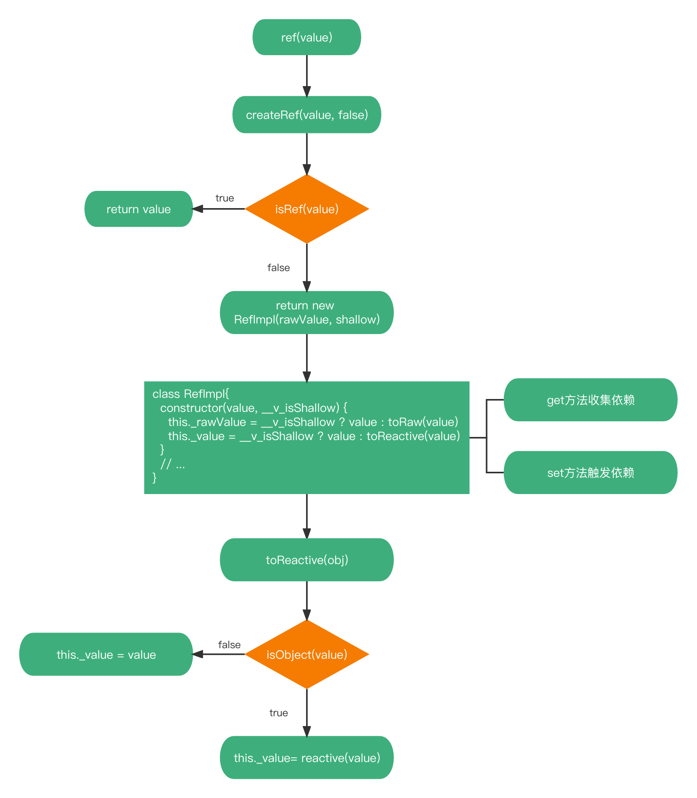

# ref
::: tip
`reactive`所在模块为响应式模块`reactivity`

文件位置：`packages/reactivity/src/ref.ts`
:::

::: info
使用`ref`声明一个响应式且可变的数据，通过`.value`可访问内部值。与`reactive`不同的是，`ref`接收的数据类型可以是基础数据类型，如
`ref(0)`、`ref(true)`
:::

`ref`创建流程：


```ts
export function ref(value?: unknown) {
  return createRef(value, false)
}

function createRef(rawValue: unknown, shallow: boolean) {
  if (isRef(rawValue)) {
    return rawValue
  }
  return new RefImpl(rawValue, shallow)
}
```

`ref`接收一个`value`参数。通过调用`createRef()`，返回一个`RefImpl`实例，`createRef()`接收`value`及`shallow`（是否浅层响应式，
`ref`默认`false`）。`createRef()`中首先判断传入的`rawValue`是不是`ref`类型，如果是直接返回`rawValue`，如果不是返回`new RefImpl()`。

```ts
class RefImpl<T> {
  private _value: T
  private _rawValue: T

  public dep?: Dep = undefined
  public readonly __v_isRef = true

  constructor(value: T, public readonly __v_isShallow: boolean) {
    this._rawValue = __v_isShallow ? value : toRaw(value)
    this._value = __v_isShallow ? value : toReactive(value)
  }

  get value() {
    trackRefValue(this)
    return this._value
  }

  set value(newVal) {
    newVal = this.__v_isShallow ? newVal : toRaw(newVal)
    if (hasChanged(newVal, this._rawValue)) {
      this._rawValue = newVal
      this._value = this.__v_isShallow ? newVal : toReactive(newVal)
      triggerRefValue(this, newVal)
    }
  }
}
```

`RefImpl`的实现很简单，其实就是利用`es6 class`的`get`、`set`存取函数来实现简单数据类型的依赖收集与触发依赖操作。

在`RefImpl`构造器接收两个参数：`value`（需要处理的`value`），`__v_isShallow`（是否浅层响应式），初始化`RefImpl`实例过程中，
在内部设置了两个私有属性：`this._rawValue`，`this._value`。其中`this._rawValue`存储的是原始值（这里的原始值不一定是传入的`value`）；
`this._value`是处理后的值。

```ts
const bar = { foo: 1 }
const barProxy = reactive(bar)
const refImpl = ref(reactive(bar))
console.log(refImpl._rawValue === barProxy) // false
console.log(refImpl._rawValue === bar) // true
```

`this._value = __v_isShallow ? value : toReactive(value)`，对于`this._value`的值，如果是浅层响应式，那么就是`value`，
如果不是调用`toReactive(value)`，创建响应式数据。

```ts
export const toReactive = <T extends unknown>(value: T): T =>
  isObject(value) ? reactive(value) : value
```

`toReactive()`逻辑很简单。如果`value`是个对象的话，使用`reactive`创建响应式对象，如果不是直接返回`value`

再看`RefImpl`的`get`取值器，当调用`ref(value).value`，会调用一个`trackRefValue()`方法，然后返回`this._value`。
`trackRefValue()`其实就是收集依赖，该部分在后续篇章中继续深究。

`RefImpl`的`set`寄存器中会将新的值与旧的值进行比较，如果新旧值不同的话，更新相应的属性，并触发依赖，如果相同则不需要做任何操作

```ts
export function trackRefValue(ref: RefBase<any>) {
  if (shouldTrack && activeEffect) {
    ref = toRaw(ref)
    if (__DEV__) {
      trackEffects(ref.dep || (ref.dep = createDep()), {
        target: ref,
        type: TrackOpTypes.GET,
        key: 'value'
      })
    } else {
      trackEffects(ref.dep || (ref.dep = createDep()))
    }
  }
}
```
