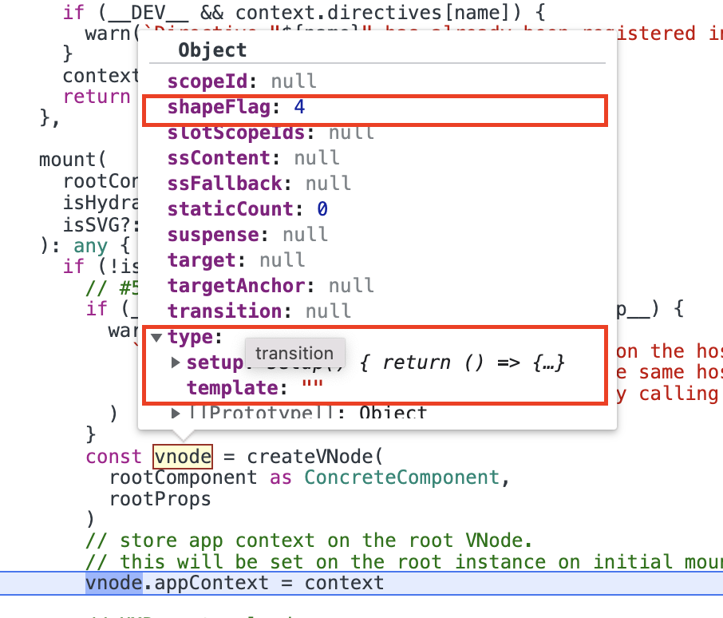
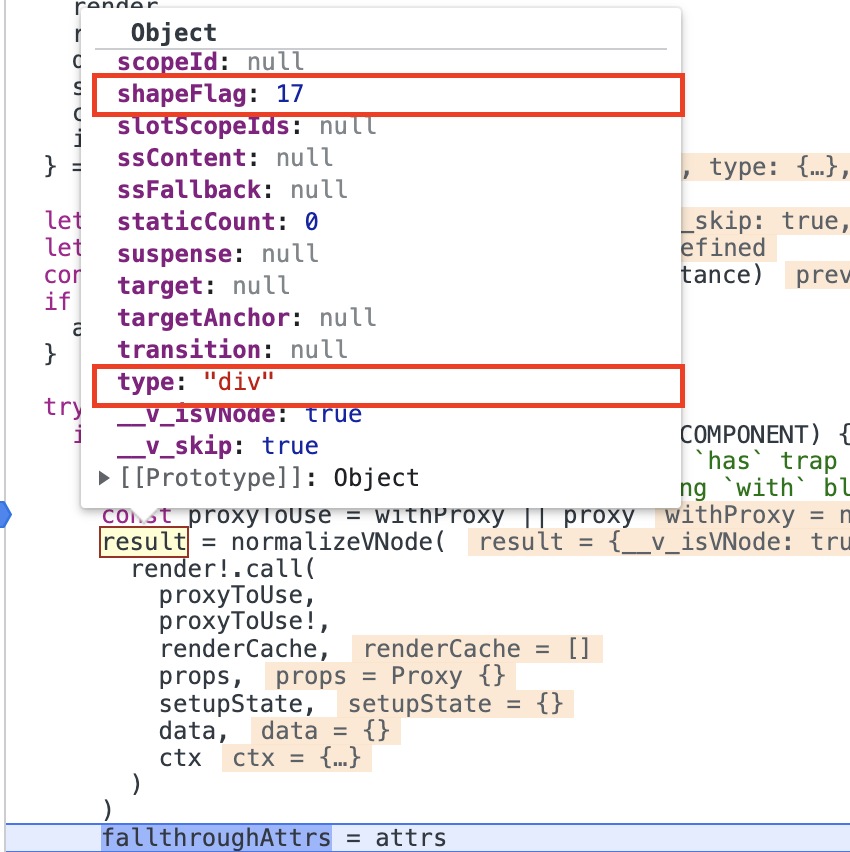
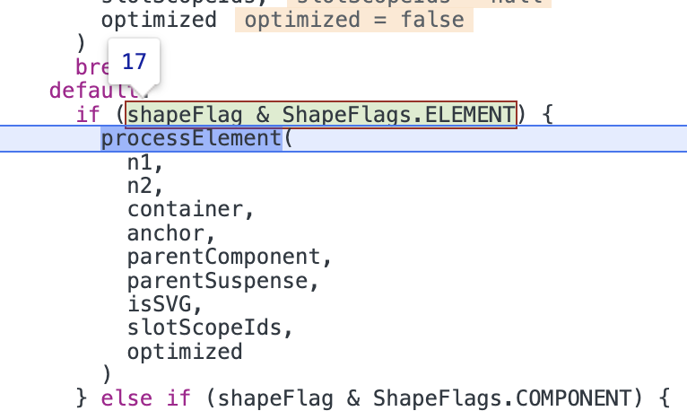
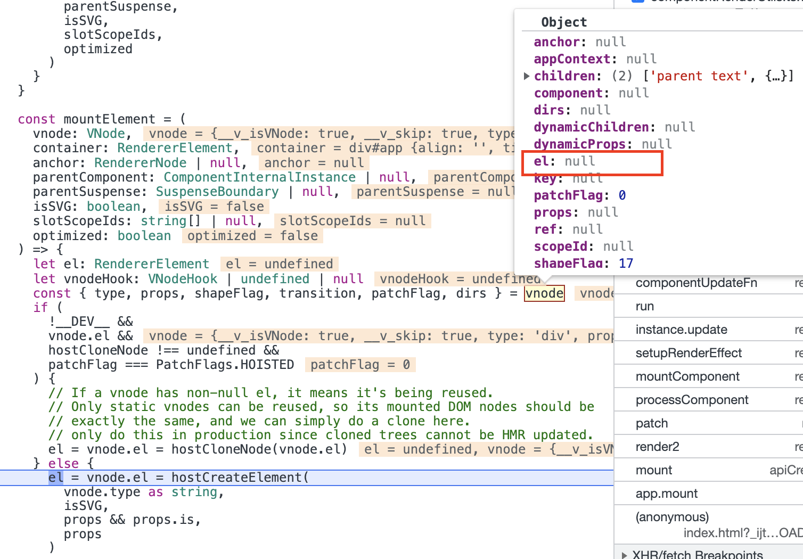
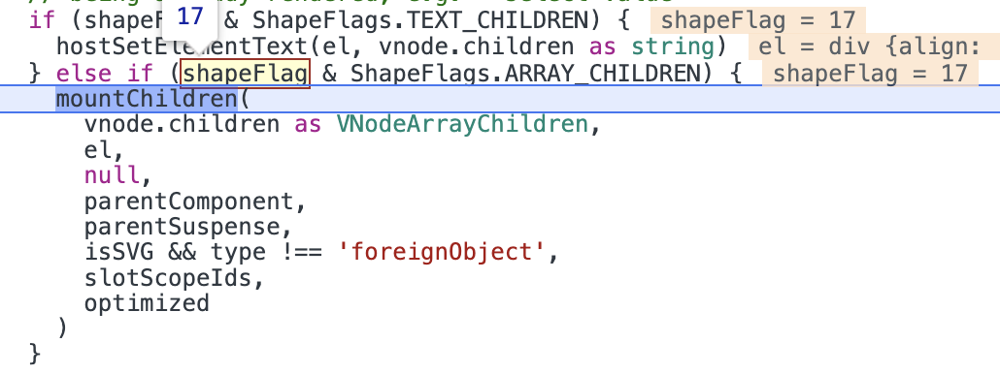
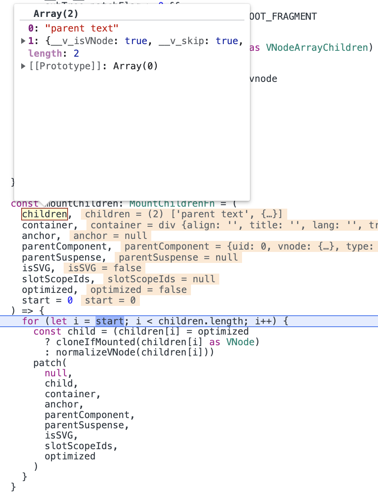
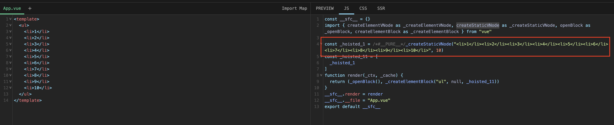
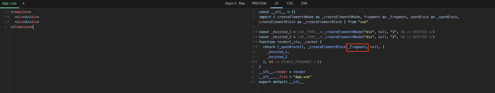
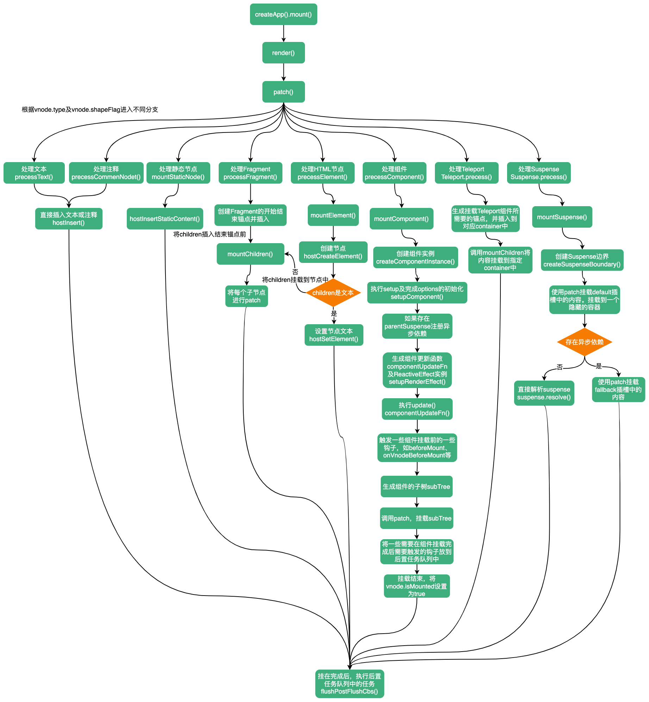

# 应用的挂载

>在`vue`项目的入口文件，我们都需要使用`createApp`创建一个或多个应用实例，并调用应用实例的`mount`方法挂载到指定的DOM元素中。


## 创建实例

使用`createApp`创建一个应用实例。它可以接受两个参数：`rootComponent`（根组件）、`rootProps`（根组件所需的`props`）

```ts
export type CreateAppFunction<HostElement> = (
  rootComponent: Component,
  rootProps?: Data | null
) => App<HostElement>
```

源码位置：`packages/runtime-dom/src/index.ts`

```ts
export const createApp = ((...args) => {
  const app = ensureRenderer().createApp(...args)

  if (__DEV__) {
    injectNativeTagCheck(app)
    injectCompilerOptionsCheck(app)
  }

  const { mount } = app
  app.mount = (containerOrSelector: Element | ShadowRoot | string): any => {
    const container = normalizeContainer(containerOrSelector)
    if (!container) return

    const component = app._component
    if (!isFunction(component) && !component.render && !component.template) {
      component.template = container.innerHTML
      if (__COMPAT__ && __DEV__) {
        for (let i = 0; i < container.attributes.length; i++) {
          const attr = container.attributes[i]
          if (attr.name !== 'v-cloak' && /^(v-|:|@)/.test(attr.name)) {
            compatUtils.warnDeprecation(
              DeprecationTypes.GLOBAL_MOUNT_CONTAINER,
              null
            )
            break
          }
        }
      }
    }

    container.innerHTML = ''
    const proxy = mount(container, false, container instanceof SVGElement)
    if (container instanceof Element) {
      container.removeAttribute('v-cloak')
      container.setAttribute('data-v-app', '')
    }
    return proxy
  }

  return app
}) as CreateAppFunction<Element>
```

在前面文章中介绍渲染器时，我们知道在`createApp`中，首先会创建渲染器，并调用渲染器的`createApp`方法创建一个实例。接下来我们继续看`createApp`后续的处理。

在开发环境下，会调用`injectNativeTagCheck`、`injectCompilerOptionsCheck`两个方法。
```ts
if (__DEV__) {
  injectNativeTagCheck(app)
  injectCompilerOptionsCheck(app)
}
```

其中`injectNativeTagCheck`方法会修改`app.config.isNativeTag`，一个判断`tag`是否为原生标签，会被用于验证组件的名称。
```ts
function injectNativeTagCheck(app: App) {
  Object.defineProperty(app.config, 'isNativeTag', {
    value: (tag: string) => isHTMLTag(tag) || isSVGTag(tag),
    writable: false
  })
}
```

`injectCompilerOptionsCheck`方法主要检查编译参数的设置是否设置正确，检查的前提是`isRuntimeOnly()`，只在运行时时期进行检查，即不存在将模板转为渲染函数的函数`compiler`
```ts
function injectCompilerOptionsCheck(app: App) {
  if (isRuntimeOnly()) {
    const isCustomElement = app.config.isCustomElement
    Object.defineProperty(app.config, 'isCustomElement', {
      get() {
        return isCustomElement
      },
      set() {
        warn(
          `The \`isCustomElement\` config option is deprecated. Use ` +
          `\`compilerOptions.isCustomElement\` instead.`
        )
      }
    })

    const compilerOptions = app.config.compilerOptions
    const msg =
      `The \`compilerOptions\` config option is only respected when using ` +
      `a build of Vue.js that includes the runtime compiler (aka "full build"). ` +
      `Since you are using the runtime-only build, \`compilerOptions\` ` +
      `must be passed to \`@vue/compiler-dom\` in the build setup instead.\n` +
      `- For vue-loader: pass it via vue-loader's \`compilerOptions\` loader option.\n` +
      `- For vue-cli: see https://cli.vuejs.org/guide/webpack.html#modifying-options-of-a-loader\n` +
      `- For vite: pass it via @vitejs/plugin-vue options. See https://github.com/vitejs/vite/tree/main/packages/plugin-vue#example-for-passing-options-to-vuecompiler-dom`

    Object.defineProperty(app.config, 'compilerOptions', {
      get() {
        warn(msg)
        return compilerOptions
      },
      set() {
        warn(msg)
      }
    })
  }
}
```

然后对`app`的`mount`方法进行了重写，并返回了`app`。可见我们调用`createApp`的`mount`方法就是此处的`mount`。接下来我们看应用是如何进行挂载的

## 应用的挂载

`mount`函数接收一个参数：`containerOrSelector`（一个容器，它可以是选择器、ShadowDom，也可以是个DOM节点）。

```ts
app.mount = (containerOrSelector: Element | ShadowRoot | string): any => {
  const container = normalizeContainer(containerOrSelector)
  if (!container) return

  const component = app._component
  if (!isFunction(component) && !component.render && !component.template) {
    component.template = container.innerHTML
    if (__COMPAT__ && __DEV__) {
      for (let i = 0; i < container.attributes.length; i++) {
        const attr = container.attributes[i]
        if (attr.name !== 'v-cloak' && /^(v-|:|@)/.test(attr.name)) {
          compatUtils.warnDeprecation(
            DeprecationTypes.GLOBAL_MOUNT_CONTAINER,
            null
          )
          break
        }
      }
    }
  }

  container.innerHTML = ''
  const proxy = mount(container, false, container instanceof SVGElement)
  if (container instanceof Element) {
    container.removeAttribute('v-cloak')
    container.setAttribute('data-v-app', '')
  }
  return proxy
}
```

因为`containerOrSelector`可能是的类型可能是字符串、`ELement`、`ShadowRoot`，所以调用`normalizeContainer`方法对参数进行标准化处理。

```ts
function normalizeContainer(
  container: Element | ShadowRoot | string
): Element | null {
  if (isString(container)) {
    const res = document.querySelector(container)
    if (__DEV__ && !res) {
      warn(
        `Failed to mount app: mount target selector "${container}" returned null.`
      )
    }
    return res
  }
  if (
    __DEV__ &&
    window.ShadowRoot &&
    container instanceof window.ShadowRoot &&
    container.mode === 'closed'
  ) {
    warn(
      `mounting on a ShadowRoot with \`{mode: "closed"}\` may lead to unpredictable bugs`
    )
  }
  return container as any
}
```

如果没有找到对应的`container`直接`return`。

然后获取`app`的根组件`app._component`。如果根组件不是个`function`，也没有对应的`render`、`tempalte`属性，会将`container.innerHTML`作为根组件的`template`属性。

```ts
const component = app._component
if (!isFunction(component) && !component.render && !component.template) {
  // 将container.innerHTML作为根组件的template属性
  component.template = container.innerHTML
  // 2.x兼容
  if (__COMPAT__ && __DEV__) {
    for (let i = 0; i < container.attributes.length; i++) {
      const attr = container.attributes[i]
      if (attr.name !== 'v-cloak' && /^(v-|:|@)/.test(attr.name)) {
        compatUtils.warnDeprecation(
          DeprecationTypes.GLOBAL_MOUNT_CONTAINER,
          null
        )
        break
      }
    }
  }
}
```

紧接着，将`container`中的内容设置为空，并调用`mount`方法生成一个`proxy`。如果`container`是个`Element`，会移除其`v-cloak`属性，并添加一个值为空的`data-v-app`属性，最后返回`proxy`。
```ts
container.innerHTML = ''
const proxy = mount(container, false, container instanceof SVGElement)
if (container instanceof Element) {
  container.removeAttribute('v-cloak')
  container.setAttribute('data-v-app', '')
}
return proxy
```

`v-clock`主要用于DOM内模板，在模板未编译完成之间，用户可能先看到原始双大括号标签，直到挂载的组件将它们替换为渲染的内容。所以通过添加`v-cloak`配合`[v-cloak] { display: none }`CSS将其暂时隐藏起来，等到实例挂载完成后，再将`v-cloak`移除。

## mount

`mount`方法可以接收三个参数：`rootContainer`（根容器）、`isHydrate`（是否注水）、`isSVG`（根容器是否为SVG）
```ts
mount(
  rootContainer: HostElement,
  isHydrate?: boolean,
  isSVG?: boolean
): any {
  if (!isMounted) {
    if (__DEV__ && (rootContainer as any).__vue_app__) {
      warn(
        `There is already an app instance mounted on the host container.\n` +
        ` If you want to mount another app on the same host container,` +
        ` you need to unmount the previous app by calling \`app.unmount()\` first.`
      )
    }
    const vnode = createVNode(
      rootComponent as ConcreteComponent,
      rootProps
    )
    vnode.appContext = context

    if (__DEV__) {
      context.reload = () => {
        render(cloneVNode(vnode), rootContainer, isSVG)
      }
    }

    if (isHydrate && hydrate) {
      hydrate(vnode as VNode<Node, Element>, rootContainer as any)
    } else {
      render(vnode, rootContainer, isSVG)
    }
    isMounted = true
    app._container = rootContainer
    ;(rootContainer as any).__vue_app__ = app

    if (__DEV__ || __FEATURE_PROD_DEVTOOLS__) {
      app._instance = vnode.component
      devtoolsInitApp(app, version)
    }

    return getExposeProxy(vnode.component!) || vnode.component!.proxy
  } else if (__DEV__) {
    warn(
      `App has already been mounted.\n` +
      `If you want to remount the same app, move your app creation logic ` +
      `into a factory function and create fresh app instances for each ` +
      `mount - e.g. \`const createMyApp = () => createApp(App)\``
    )
  }
}
```

在`mount`中首先会判断是否已经挂载，如果没过载过，则进行挂载。

在挂载过程中，会先检查`rootContainer.__vue_app__`属性，如果存在`rootContainer.__vue_app__`，说明`rootContainer`已经挂载一个实例了，此时会进行一个提示。
```ts
if (__DEV__ && (rootContainer as any).__vue_app__) {
  warn(
    `There is already an app instance mounted on the host container.\n` +
    ` If you want to mount another app on the same host container,` +
    ` you need to unmount the previous app by calling \`app.unmount()\` first.`
  )
}
```

紧接着创建根组件的`vnode`，并将上下文对象保存到设置`vnode`的`appContext`。这里的`rootComponent`就是`createApp`时传入的`rootComponent`。
```ts
const vnode = createVNode(
  rootComponent as ConcreteComponent,
  rootProps
)
vnode.appContext = context
```

然后渲染`vnode`，如果是同构渲染使用`hydrate`，否在调用`render`进行渲染，渲染完成后，将`isMounted`设置为`true`，表示已经挂载完毕，同时将`rootContainer`保存到`app`实例的`_container`中，并将`app`实例保存在`rootContainer`的`__vue_app__`属性中。
```ts
if (isHydrate && hydrate) {
  hydrate(vnode as VNode<Node, Element>, rootContainer as any)
} else {
  render(vnode, rootContainer, isSVG)
}
isMounted = true
app._container = rootContainer
;(rootContainer as any).__vue_app__ = app
```

最后返回组件所暴露的一些属性或方法。`vnode.component.proxy`是组件实例`this`的代理对象
```ts
return getExposeProxy(vnode.component!) || vnode.component!.proxy
```

`getExposeProxy`方法会返回`instance.exposeProxy`
```ts
export function getExposeProxy(instance: ComponentInternalInstance) {
  if (instance.exposed) {
    return (
      instance.exposeProxy ||
      (instance.exposeProxy = new Proxy(proxyRefs(markRaw(instance.exposed)), {
        get(target, key: string) {
          if (key in target) {
            return target[key]
          } else if (key in publicPropertiesMap) {
            return publicPropertiesMap[key](instance)
          }
        }
      }))
    )
  }
}
```

## render
挂载过程调用了一个`render`方法或`hydrate`进行渲染。此处我们继续看下`render`函数如何将`vnode`渲染为真实DOM的。

在介绍渲染器时，我们知道渲染器中有个`createApp`方法，这个方法会在创建`app`实例时被首先调用。`createApp`方法通过一个`createAppAPI`函数生成，这个函数接收两个参数：`render`、`hydrate`，这里的`render`就是在挂载过程中调用的渲染函数。
```ts
function baseCreateRenderer(
  options: RendererOptions,
  createHydrationFns?: typeof createHydrationFunctions
): any {
  // ...
  return {
    render,
    hydrate,
    createApp: createAppAPI(render, hydrate)
  }
}
```

来看下`render`函数的实现：
```ts
const render: RootRenderFunction = (vnode, container, isSVG) => {
  if (vnode == null) {
    if (container._vnode) {
      unmount(container._vnode, null, null, true)
    }
  } else {
    patch(container._vnode || null, vnode, container, null, null, null, isSVG)
  }
  flushPostFlushCbs()
  container._vnode = vnode
}
```

`render`函数接收三个参数：：`vnode`（需要挂载的虚拟DOM）、`container`（需要渲染到的容器）、`isSVG`（被渲染到的容器是否为SVG）

当被传入的`vnode`为`null`时，说明什么都不渲染，这时会检查`container`中是否存在`_vnode`，如果存在调用`unmount`卸载函数。如果传入的`vnode`不为`null`，会调用`patch`函数进行更新，也可以称为打补丁。最后执行`flushPostFlushCbs()`（如果此时有等待中的前置任务和后置任务，需要执行这些任务，如通过`watchEffect`、`watchPostEffect`添加的`effect`，还有`mounted`等钩子），并将`vnode`添加到`container._vnode`中。

由于在挂载过程中，会向`render`传入根组件的`vnode`，所以继续调用`patch`方法。

## patch

`patch`函数可以接收9个参数：
- `n1`：旧的`vnode`
- `n2`：新的`vnode`
- `container`：需要更新的容器
- `anchor`：锚点
- `parentComponent`：父组件
- `parentSuspense`：父Suspence
- `isSVG`：容器是否为SVG
- `slotScopeIds`
- `optimized`：是否开启优化模式

<details>
<summary><code>patch</code>完整代码</summary>

```ts
const patch: PatchFn = (
  n1,
  n2,
  container,
  anchor = null,
  parentComponent = null,
  parentSuspense = null,
  isSVG = false,
  slotScopeIds = null,
  optimized = __DEV__ && isHmrUpdating ? false : !!n2.dynamicChildren
) => {
  if (n1 === n2) {
    return
  }

  // patching & not same type, unmount old tree
  if (n1 && !isSameVNodeType(n1, n2)) {
    anchor = getNextHostNode(n1)
    unmount(n1, parentComponent, parentSuspense, true)
    n1 = null
  }

  if (n2.patchFlag === PatchFlags.BAIL) {
    optimized = false
    n2.dynamicChildren = null
  }

  const { type, ref, shapeFlag } = n2
  switch (type) {
    case Text:
      processText(n1, n2, container, anchor)
      break
    case Comment:
      processCommentNode(n1, n2, container, anchor)
      break
    case Static:
      if (n1 == null) {
        mountStaticNode(n2, container, anchor, isSVG)
      } else if (__DEV__) {
        patchStaticNode(n1, n2, container, isSVG)
      }
      break
    case Fragment:
      processFragment(
        n1,
        n2,
        container,
        anchor,
        parentComponent,
        parentSuspense,
        isSVG,
        slotScopeIds,
        optimized
      )
      break
    default:
      if (shapeFlag & ShapeFlags.ELEMENT) {
        processElement(
          n1,
          n2,
          container,
          anchor,
          parentComponent,
          parentSuspense,
          isSVG,
          slotScopeIds,
          optimized
        )
      } else if (shapeFlag & ShapeFlags.COMPONENT) {
        processComponent(
          n1,
          n2,
          container,
          anchor,
          parentComponent,
          parentSuspense,
          isSVG,
          slotScopeIds,
          optimized
        )
      } else if (shapeFlag & ShapeFlags.TELEPORT) {
        ;(type as typeof TeleportImpl).process(
          n1 as TeleportVNode,
          n2 as TeleportVNode,
          container,
          anchor,
          parentComponent,
          parentSuspense,
          isSVG,
          slotScopeIds,
          optimized,
          internals
        )
      } else if (__FEATURE_SUSPENSE__ && shapeFlag & ShapeFlags.SUSPENSE) {
        ;(type as typeof SuspenseImpl).process(
          n1,
          n2,
          container,
          anchor,
          parentComponent,
          parentSuspense,
          isSVG,
          slotScopeIds,
          optimized,
          internals
        )
      } else if (__DEV__) {
        warn('Invalid VNode type:', type, `(${typeof type})`)
      }
  }

  // set ref
  if (ref != null && parentComponent) {
    setRef(ref, n1 && n1.ref, parentSuspense, n2 || n1, !n2)
  }
}
```
</details>

首先比较`n1`与`n2`，如果`n1`与`n2`相同，代表着新节点没有发生更新，所以直接`return`。在第一次挂载过程中，由于旧`vnode`是空的，所以会继续进行下面的操作。
```ts
if (n1 === n2) {
  return
}
```

如果旧节点不为空，而且新旧节点的节点类型不同，则需要卸载旧节点。
```ts
if (n1 && !isSameVNodeType(n1, n2)) {
  // 获取锚点
  anchor = getNextHostNode(n1)
  // 卸载旧节点
  unmount(n1, parentComponent, parentSuspense, true)
  // 将旧节点置为空
  n1 = null
}
```

::: info 判断两个节点类型是否一样
比较两个节点的`type`和`key`是否一致。
```ts
export function isSameVNodeType(n1: VNode, n2: VNode): boolean {
  if (
    __DEV__ &&
    n2.shapeFlag & ShapeFlags.COMPONENT &&
    hmrDirtyComponents.has(n2.type as ConcreteComponent)
  ) {
    // HMR only: if the component has been hot-updated, force a reload.
    return false
  }
  return n1.type === n2.type && n1.key === n2.key
}
```
:::

如果新节点的`patchFlag`为`PatchFlags.BAIL`，意味着`diff`过程退出优化模式，这时会将`optimized`设置为`false`，并将新节点的`dynamicChildren`设置为`null`
```ts
if (n2.patchFlag === PatchFlags.BAIL) {
  optimized = false
  n2.dynamicChildren = null
}
```

接着就是根据新节点的`type`及`shapeFlag`属性进行不同的分支：

```ts
const { type, ref, shapeFlag } = n2
switch (type) {
  case Text: // 处理文本节点
    processText(n1, n2, container, anchor)
    break
  case Comment: // 处理注释节点
    processCommentNode(n1, n2, container, anchor)
    break
  case Static: // 处理静态节点
    if (n1 == null) {
      mountStaticNode(n2, container, anchor, isSVG)
    } else if (__DEV__) {
      patchStaticNode(n1, n2, container, isSVG)
    }
    break
  case Fragment: // 处理片段
    processFragment(
      n1,
      n2,
      container,
      anchor,
      parentComponent,
      parentSuspense,
      isSVG,
      slotScopeIds,
      optimized
    )
    break
  default:
    if (shapeFlag & ShapeFlags.ELEMENT) { // 处理HTML节点
      processElement(
        n1,
        n2,
        container,
        anchor,
        parentComponent,
        parentSuspense,
        isSVG,
        slotScopeIds,
        optimized
      )
    } else if (shapeFlag & ShapeFlags.COMPONENT) { // 处理组件，包括有状态组件及函数式组件
      processComponent(
        n1,
        n2,
        container,
        anchor,
        parentComponent,
        parentSuspense,
        isSVG,
        slotScopeIds,
        optimized
      )
    } else if (shapeFlag & ShapeFlags.TELEPORT) { // 处理teleport
      ;(type as typeof TeleportImpl).process(
        n1 as TeleportVNode,
        n2 as TeleportVNode,
        container,
        anchor,
        parentComponent,
        parentSuspense,
        isSVG,
        slotScopeIds,
        optimized,
        internals
      )
    } else if (__FEATURE_SUSPENSE__ && shapeFlag & ShapeFlags.SUSPENSE) { // 处理suspense
      ;(type as typeof SuspenseImpl).process(
        n1,
        n2,
        container,
        anchor,
        parentComponent,
        parentSuspense,
        isSVG,
        slotScopeIds,
        optimized,
        internals
      )
    } else if (__DEV__) {
      warn('Invalid VNode type:', type, `(${typeof type})`)
    }
}
```

在应用挂载时，这里可能进入不同分支。我们这里以`createApp(ComponentXXX)`为例。

在`render`过程中，创建根`vnode`时，由于其`type`是`Object`，所以`vnode.shapeFlag`属性为`ShapeFlags.STATEFUL_COMPONENT`（`ShapeFlags.COMPONENT = ShapeFlags.STATEFUL_COMPONENT | ShapeFlags.FUNCTIONAL_COMPONENT`），所以第一次`patch`，会执行`processComponent`。

## processComponent

`processComponent`函数接收与`patch`相同的参数
```ts
const processComponent = (
  n1: VNode | null,
  n2: VNode,
  container: RendererElement,
  anchor: RendererNode | null,
  parentComponent: ComponentInternalInstance | null,
  parentSuspense: SuspenseBoundary | null,
  isSVG: boolean,
  slotScopeIds: string[] | null,
  optimized: boolean
) => {
  n2.slotScopeIds = slotScopeIds
  if (n1 == null) {
    if (n2.shapeFlag & ShapeFlags.COMPONENT_KEPT_ALIVE) {
      ;(parentComponent!.ctx as KeepAliveContext).activate(
        n2,
        container,
        anchor,
        isSVG,
        optimized
      )
    } else {
      mountComponent(
        n2,
        container,
        anchor,
        parentComponent,
        parentSuspense,
        isSVG,
        optimized
      )
    }
  } else {
    updateComponent(n1, n2, optimized)
  }
}
```

可以看到当旧节点为空时，如果新节点对应的组件已经被`keep-alive`了，则调用`parentComponent.ctx.activate`方法进行激活组件，否则调用`mountComponent`方法挂载组件；如果旧节点不为空，则会调用`updateComponent`方法更新组件。因为应用挂载时，第一次`patch`过程旧节点是空的，组件也没有被`keep-alive`，所以会继续执行`mountComponent`方法。

## mountComponent

`mountComponent`接收参数和`processComponent`类似，只不过`mountComponent`参数中没有旧节点，只有`initialVNode`待被初始化的节点，即新节点。

<details>
  <summary><code>mountComponent</code>完整代码</summary>

```ts
const mountComponent: MountComponentFn = (
  initialVNode,
  container,
  anchor,
  parentComponent,
  parentSuspense,
  isSVG,
  optimized
) => {
  const compatMountInstance =
    __COMPAT__ && initialVNode.isCompatRoot && initialVNode.component
  const instance: ComponentInternalInstance =
    compatMountInstance ||
    (initialVNode.component = createComponentInstance(
      initialVNode,
      parentComponent,
      parentSuspense
    ))

  if (__DEV__ && instance.type.__hmrId) {
    registerHMR(instance)
  }

  if (__DEV__) {
    pushWarningContext(initialVNode)
    startMeasure(instance, `mount`)
  }

  if (isKeepAlive(initialVNode)) {
    ;(instance.ctx as KeepAliveContext).renderer = internals
  }

  // resolve props and slots for setup context
  if (!(__COMPAT__ && compatMountInstance)) {
    if (__DEV__) {
      startMeasure(instance, `init`)
    }
    setupComponent(instance)
    if (__DEV__) {
      endMeasure(instance, `init`)
    }
  }

  // setup() is async. This component relies on async logic to be resolved
  // before proceeding
  if (__FEATURE_SUSPENSE__ && instance.asyncDep) {
    parentSuspense && parentSuspense.registerDep(instance, setupRenderEffect)

    // Give it a placeholder if this is not hydration
    // TODO handle self-defined fallback
    if (!initialVNode.el) {
      const placeholder = (instance.subTree = createVNode(Comment))
      processCommentNode(null, placeholder, container!, anchor)
    }
    return
  }

  setupRenderEffect(
    instance,
    initialVNode,
    container,
    anchor,
    parentSuspense,
    isSVG,
    optimized
  )

  if (__DEV__) {
    popWarningContext()
    endMeasure(instance, `mount`)
  }
}
```
</details>

在挂载组件过程中，第一步就是创建组件实例：

```ts
const compatMountInstance =
  __COMPAT__ && initialVNode.isCompatRoot && initialVNode.component
const instance: ComponentInternalInstance =
  compatMountInstance ||
  (initialVNode.component = createComponentInstance(
    initialVNode,
    parentComponent,
    parentSuspense
  ))
```

创建完组件实例后，会针对`KeepAlive`的`vnode`进行一些特殊化处理，即为`instance.ctx`添加一个`renderer`。这里忽略一些仅在开发环境下生效的代码。

```ts
if (isKeepAlive(initialVNode)) {
  ;(instance.ctx as KeepAliveContext).renderer = internals
}
```

然后会调用一个`setupComponent`关键函数，该函数作用是在做一些组件初始化的工作，包括`props`、`slots`等的初始化、执行`setup`函数、`options`的初始化。
```ts
if (!(__COMPAT__ && compatMountInstance)) {
  if (__DEV__) {
    startMeasure(instance, `init`)
  }
  setupComponent(instance)
  if (__DEV__) {
    endMeasure(instance, `init`)
  }
}
```

**关于组件实例的创建过程及`setupComponent`的执行可以参考：[组件实例的创建过程](https://maxlz1.github.io/blog/vue3-analysis/renderer/componentInstance.html)**

接着，会处理`Suspense`。如果存在`parentSuspense`，异步`setup`的返回值会作为依赖注册到`parentSuspense`中。
```ts
if (__FEATURE_SUSPENSE__ && instance.asyncDep) {
  parentSuspense && parentSuspense.registerDep(instance, setupRenderEffect)

  // 如果initialVNode.el不为空创建一个占位符
  // TODO handle self-defined fallback
  if (!initialVNode.el) {
    const placeholder = (instance.subTree = createVNode(Comment))
    processCommentNode(null, placeholder, container!, anchor)
  }
  return
}
```

然后调用一个`setupRenderEffect`函数。

```ts
setupRenderEffect(
  instance,
  initialVNode,
  container,
  anchor,
  parentSuspense,
  isSVG,
  optimized
)
```

## setupRenderEffect

<details>
  <summary><code>setupRenderEffect</code>完整代码</summary>

```ts
const setupRenderEffect: SetupRenderEffectFn = (
  instance,
  initialVNode,
  container,
  anchor,
  parentSuspense,
  isSVG,
  optimized
) => {
  const componentUpdateFn = () => {
    if (!instance.isMounted) {
      let vnodeHook: VNodeHook | null | undefined
      const { el, props } = initialVNode
      const { bm, m, parent } = instance
      const isAsyncWrapperVNode = isAsyncWrapper(initialVNode)

      toggleRecurse(instance, false)
      // beforeMount hook
      if (bm) {
        invokeArrayFns(bm)
      }
      // onVnodeBeforeMount
      if (
        !isAsyncWrapperVNode &&
        (vnodeHook = props && props.onVnodeBeforeMount)
      ) {
        invokeVNodeHook(vnodeHook, parent, initialVNode)
      }
      if (
        __COMPAT__ &&
        isCompatEnabled(DeprecationTypes.INSTANCE_EVENT_HOOKS, instance)
      ) {
        instance.emit('hook:beforeMount')
      }
      toggleRecurse(instance, true)

      if (el && hydrateNode) {
        // vnode has adopted host node - perform hydration instead of mount.
        const hydrateSubTree = () => {
          if (__DEV__) {
            startMeasure(instance, `render`)
          }
          instance.subTree = renderComponentRoot(instance)
          if (__DEV__) {
            endMeasure(instance, `render`)
          }
          if (__DEV__) {
            startMeasure(instance, `hydrate`)
          }
          hydrateNode!(
            el as Node,
            instance.subTree,
            instance,
            parentSuspense,
            null
          )
          if (__DEV__) {
            endMeasure(instance, `hydrate`)
          }
        }

        if (isAsyncWrapperVNode) {
          ;(initialVNode.type as ComponentOptions).__asyncLoader!().then(
            // note: we are moving the render call into an async callback,
            // which means it won't track dependencies - but it's ok because
            // a server-rendered async wrapper is already in resolved state
            // and it will never need to change.
            () => !instance.isUnmounted && hydrateSubTree()
          )
        } else {
          hydrateSubTree()
        }
      } else {
        if (__DEV__) {
          startMeasure(instance, `render`)
        }
        const subTree = (instance.subTree = renderComponentRoot(instance))
        if (__DEV__) {
          endMeasure(instance, `render`)
        }
        if (__DEV__) {
          startMeasure(instance, `patch`)
        }
        patch(
          null,
          subTree,
          container,
          anchor,
          instance,
          parentSuspense,
          isSVG
        )
        if (__DEV__) {
          endMeasure(instance, `patch`)
        }
        initialVNode.el = subTree.el
      }
      // mounted hook
      if (m) {
        queuePostRenderEffect(m, parentSuspense)
      }
      // onVnodeMounted
      if (
        !isAsyncWrapperVNode &&
        (vnodeHook = props && props.onVnodeMounted)
      ) {
        const scopedInitialVNode = initialVNode
        queuePostRenderEffect(
          () => invokeVNodeHook(vnodeHook!, parent, scopedInitialVNode),
          parentSuspense
        )
      }
      if (
        __COMPAT__ &&
        isCompatEnabled(DeprecationTypes.INSTANCE_EVENT_HOOKS, instance)
      ) {
        queuePostRenderEffect(
          () => instance.emit('hook:mounted'),
          parentSuspense
        )
      }

      // activated hook for keep-alive roots.
      // #1742 activated hook must be accessed after first render
      // since the hook may be injected by a child keep-alive
      if (
        initialVNode.shapeFlag & ShapeFlags.COMPONENT_SHOULD_KEEP_ALIVE ||
        (parent &&
          isAsyncWrapper(parent.vnode) &&
          parent.vnode.shapeFlag & ShapeFlags.COMPONENT_SHOULD_KEEP_ALIVE)
      ) {
        instance.a && queuePostRenderEffect(instance.a, parentSuspense)
        if (
          __COMPAT__ &&
          isCompatEnabled(DeprecationTypes.INSTANCE_EVENT_HOOKS, instance)
        ) {
          queuePostRenderEffect(
            () => instance.emit('hook:activated'),
            parentSuspense
          )
        }
      }
      instance.isMounted = true

      if (__DEV__ || __FEATURE_PROD_DEVTOOLS__) {
        devtoolsComponentAdded(instance)
      }

      // #2458: deference mount-only object parameters to prevent memleaks
      initialVNode = container = anchor = null as any
    } else {
      // updateComponent
      // This is triggered by mutation of component's own state (next: null)
      // OR parent calling processComponent (next: VNode)
      let { next, bu, u, parent, vnode } = instance
      let originNext = next
      let vnodeHook: VNodeHook | null | undefined
      if (__DEV__) {
        pushWarningContext(next || instance.vnode)
      }

      // Disallow component effect recursion during pre-lifecycle hooks.
      toggleRecurse(instance, false)
      if (next) {
        next.el = vnode.el
        updateComponentPreRender(instance, next, optimized)
      } else {
        next = vnode
      }

      // beforeUpdate hook
      if (bu) {
        invokeArrayFns(bu)
      }
      // onVnodeBeforeUpdate
      if ((vnodeHook = next.props && next.props.onVnodeBeforeUpdate)) {
        invokeVNodeHook(vnodeHook, parent, next, vnode)
      }
      if (
        __COMPAT__ &&
        isCompatEnabled(DeprecationTypes.INSTANCE_EVENT_HOOKS, instance)
      ) {
        instance.emit('hook:beforeUpdate')
      }
      toggleRecurse(instance, true)

      // render
      if (__DEV__) {
        startMeasure(instance, `render`)
      }
      const nextTree = renderComponentRoot(instance)
      if (__DEV__) {
        endMeasure(instance, `render`)
      }
      const prevTree = instance.subTree
      instance.subTree = nextTree

      if (__DEV__) {
        startMeasure(instance, `patch`)
      }
      patch(
        prevTree,
        nextTree,
        // parent may have changed if it's in a teleport
        hostParentNode(prevTree.el!)!,
        // anchor may have changed if it's in a fragment
        getNextHostNode(prevTree),
        instance,
        parentSuspense,
        isSVG
      )
      if (__DEV__) {
        endMeasure(instance, `patch`)
      }
      next.el = nextTree.el
      if (originNext === null) {
        // self-triggered update. In case of HOC, update parent component
        // vnode el. HOC is indicated by parent instance's subTree pointing
        // to child component's vnode
        updateHOCHostEl(instance, nextTree.el)
      }
      // updated hook
      if (u) {
        queuePostRenderEffect(u, parentSuspense)
      }
      // onVnodeUpdated
      if ((vnodeHook = next.props && next.props.onVnodeUpdated)) {
        queuePostRenderEffect(
          () => invokeVNodeHook(vnodeHook!, parent, next!, vnode),
          parentSuspense
        )
      }
      if (
        __COMPAT__ &&
        isCompatEnabled(DeprecationTypes.INSTANCE_EVENT_HOOKS, instance)
      ) {
        queuePostRenderEffect(
          () => instance.emit('hook:updated'),
          parentSuspense
        )
      }

      if (__DEV__ || __FEATURE_PROD_DEVTOOLS__) {
        devtoolsComponentUpdated(instance)
      }

      if (__DEV__) {
        popWarningContext()
      }
    }
  }

  // create reactive effect for rendering
  const effect = (instance.effect = new ReactiveEffect(
    componentUpdateFn,
    () => queueJob(update),
    instance.scope // track it in component's effect scope
  ))

  const update: SchedulerJob = (instance.update = () => effect.run())
  update.id = instance.uid
  // allowRecurse
  // #1801, #2043 component render effects should allow recursive updates
  toggleRecurse(instance, true)

  if (__DEV__) {
    effect.onTrack = instance.rtc
      ? e => invokeArrayFns(instance.rtc!, e)
      : void 0
    effect.onTrigger = instance.rtg
      ? e => invokeArrayFns(instance.rtg!, e)
      : void 0
    update.ownerInstance = instance
  }

  update()
}
```
</details>

`setupRenderEffect`看似很长，但将`componentUpdateFn`折叠起来，逻辑就清晰多了。

```ts
const setupRenderEffect: SetupRenderEffectFn = (
  instance,
  initialVNode,
  container,
  anchor,
  parentSuspense,
  isSVG,
  optimized
) => {
  // 组件更新的副作用函数
  const componentUpdateFn = () => {
    // ...
  }

  // 创建一个关于渲染的ReactiveEffect
  const effect = (instance.effect = new ReactiveEffect(
    componentUpdateFn,
    () => queueJob(update), // 一个调度器，依赖被触发时会执行（将updata加入到queue队列中）
    instance.scope // 在组件作用域内进行依赖追踪
  ))

  // 一个更新函数，这个更新函数中会执行effect.run方法
  const update: SchedulerJob = (instance.update = () => effect.run())
  update.id = instance.uid
  
  // 组件渲染允许递归更新
  toggleRecurse(instance, true)

  if (__DEV__) {
    effect.onTrack = instance.rtc
      ? e => invokeArrayFns(instance.rtc!, e)
      : void 0
    effect.onTrigger = instance.rtg
      ? e => invokeArrayFns(instance.rtg!, e)
      : void 0
    update.ownerInstance = instance
  }

  // 手动执行更新函数
  update()
}
```

`setupRenderEffect`主要，使用组件更新函数创建一个`ReactiveEffect`对象，然后声明一个`update`函数，并手动调用`update`函数。

由于`update`函数中执行了`effect.run()`，我们知道`ReactiveEffect`的实例方法`run`最终会调用副作用函数，以进行依赖的收集。所以继续执行`componentUpdateFn`函数。

### componentUpdateFn

在`componentUpdateFn`中分了两个分支：`instance`未挂载及`instance`已经挂载。

因为此时`instance`还未挂载，所以进入`instance`未挂载分支，进行挂载组件。

接下来，我们详细看下组件时如何进行挂载的。

首先声明一些变量：
```ts
let vnodeHook: VNodeHook | null | undefined
const { el, props } = initialVNode
// bm：beforeMount钩子
// m：mounted钩子
// parent父组件实例
const { bm, m, parent } = instance
// 是否为AsyncComponentWrapper，通过defineAsyncComponent定义的组件会被AsyncComponentWrapper包裹
const isAsyncWrapperVNode = isAsyncWrapper(initialVNode)

toggleRecurse(instance, false)
```

然后执行`beforeMount`及`onVnodeBeforeMount`钩子：
```ts
// beforeMount钩子
if (bm) {
  invokeArrayFns(bm)
}
// onVnodeBeforeMount钩子
if (
  !isAsyncWrapperVNode &&
  (vnodeHook = props && props.onVnodeBeforeMount)
) {
  invokeVNodeHook(vnodeHook, parent, initialVNode)
}
// vue2中以hook:beforeMount方式添加的钩子函数
if (
  __COMPAT__ &&
  isCompatEnabled(DeprecationTypes.INSTANCE_EVENT_HOOKS, instance)
) {
  instance.emit('hook:beforeMount')
}
toggleRecurse(instance, true)
```

接着会执行`renderComponentRoot`函数，获取当前组件的子虚拟`dom`树，并挂载子树。

```ts
if (el && hydrateNode) {
  // ...
} else {
  if (__DEV__) {
    startMeasure(instance, `render`)
  }
  // 获取实例的子节点
  const subTree = (instance.subTree = renderComponentRoot(instance))
  if (__DEV__) {
    endMeasure(instance, `render`)
  }
  if (__DEV__) {
    startMeasure(instance, `patch`)
  }
  // 递归挂载subTree
  patch(
    null,
    subTree,
    container,
    anchor,
    instance,
    parentSuspense,
    isSVG
  )
  if (__DEV__) {
    endMeasure(instance, `patch`)
  }
  initialVNode.el = subTree.el
}
```
<details>
  <summary><code>renderComponentRoot</code>完整代码</summary>

```ts
export function renderComponentRoot(
  instance: ComponentInternalInstance
): VNode {
  const {
    type: Component,
    vnode,
    proxy,
    withProxy,
    props,
    propsOptions: [propsOptions],
    slots,
    attrs,
    emit,
    render,
    renderCache,
    data,
    setupState,
    ctx,
    inheritAttrs
  } = instance

  let result
  let fallthroughAttrs
  // 设置当前正在渲染的实例
  const prev = setCurrentRenderingInstance(instance)
  if (__DEV__) {
    accessedAttrs = false
  }

  // 执行render函数
  try {
    if (vnode.shapeFlag & ShapeFlags.STATEFUL_COMPONENT) { // 有状态组件
      const proxyToUse = withProxy || proxy
      // 执行render函数
      result = normalizeVNode(
        render!.call(
          proxyToUse,
          proxyToUse!,
          renderCache,
          props,
          setupState,
          data,
          ctx
        )
      )
      fallthroughAttrs = attrs
    } else { // 函数式组件
      const render = Component as FunctionalComponent
      // in dev, mark attrs accessed if optional props (attrs === props)
      if (__DEV__ && attrs === props) {
        markAttrsAccessed()
      }
      // 执行render函数
      result = normalizeVNode(
        render.length > 1
          ? render(
              props,
              __DEV__
                ? {
                    get attrs() {
                      markAttrsAccessed()
                      return attrs
                    },
                    slots,
                    emit
                  }
                : { attrs, slots, emit }
            )
          : render(props, null as any /* we know it doesn't need it */)
      )
      // 如果函数式组件定义了props，fallthroughAttrs就是attrs，否则fallthroughAttrs中只包含class、style及on开头的属性
      fallthroughAttrs = Component.props
        ? attrs
        : getFunctionalFallthrough(attrs)
    }
  } catch (err) {
    blockStack.length = 0
    handleError(err, instance, ErrorCodes.RENDER_FUNCTION)
    result = createVNode(Comment)
  }

  // 合并attr
  // in dev mode, comments are preserved, and it's possible for a template
  // to have comments along side the root element which makes it a fragment
  let root = result
  let setRoot: SetRootFn = undefined
  if (
    __DEV__ &&
    result.patchFlag > 0 &&
    result.patchFlag & PatchFlags.DEV_ROOT_FRAGMENT
  ) {
    ;[root, setRoot] = getChildRoot(result)
  }
  
  // 允许透传attr
  if (fallthroughAttrs && inheritAttrs !== false) {
    const keys = Object.keys(fallthroughAttrs)
    const { shapeFlag } = root
    if (keys.length) {
      if (shapeFlag & (ShapeFlags.ELEMENT | ShapeFlags.COMPONENT)) { // root是普通HTML元素或组件
        if (propsOptions && keys.some(isModelListener)) { // keys中存在onUpdate:开头的属性
          // 该操作会保留fallthroughAttrs中非onUpdate:开头的属性及以onUpdate:开头但不在propsOptions中的属性
          fallthroughAttrs = filterModelListeners(
            fallthroughAttrs,
            propsOptions
          )
        }
        // 复制root，目的是合并root.props与fallthroughAttrs
        root = cloneVNode(root, fallthroughAttrs)
      } else if (__DEV__ && !accessedAttrs && root.type !== Comment) { // 其他情况，如果root不是注释，attrs不会被继承
        const allAttrs = Object.keys(attrs)
        const eventAttrs: string[] = []
        const extraAttrs: string[] = []
        for (let i = 0, l = allAttrs.length; i < l; i++) {
          const key = allAttrs[i]
          if (isOn(key)) {
            // ignore v-model handlers when they fail to fallthrough
            if (!isModelListener(key)) {
              // remove `on`, lowercase first letter to reflect event casing
              // accurately
              eventAttrs.push(key[2].toLowerCase() + key.slice(3))
            }
          } else {
            extraAttrs.push(key)
          }
        }
        if (extraAttrs.length) {
          warn(
            `Extraneous non-props attributes (` +
              `${extraAttrs.join(', ')}) ` +
              `were passed to component but could not be automatically inherited ` +
              `because component renders fragment or text root nodes.`
          )
        }
        if (eventAttrs.length) {
          warn(
            `Extraneous non-emits event listeners (` +
              `${eventAttrs.join(', ')}) ` +
              `were passed to component but could not be automatically inherited ` +
              `because component renders fragment or text root nodes. ` +
              `If the listener is intended to be a component custom event listener only, ` +
              `declare it using the "emits" option.`
          )
        }
      }
    }
  }

  // 兼容模式下开启INSTANCE_ATTRS_CLASS_STYLE，会将style与class添加到root.props中
  if (
    __COMPAT__ &&
    isCompatEnabled(DeprecationTypes.INSTANCE_ATTRS_CLASS_STYLE, instance) &&
    vnode.shapeFlag & ShapeFlags.STATEFUL_COMPONENT &&
    root.shapeFlag & (ShapeFlags.ELEMENT | ShapeFlags.COMPONENT)
  ) {
    const { class: cls, style } = vnode.props || {}
    if (cls || style) {
      if (__DEV__ && inheritAttrs === false) {
        warnDeprecation(
          DeprecationTypes.INSTANCE_ATTRS_CLASS_STYLE,
          instance,
          getComponentName(instance.type)
        )
      }
      // 将class与style添加到root.props中
      root = cloneVNode(root, {
        class: cls,
        style: style
      })
    }
  }

  // 继承指令
  if (vnode.dirs) {
    if (__DEV__ && !isElementRoot(root)) {
      warn(
        `Runtime directive used on component with non-element root node. ` +
          `The directives will not function as intended.`
      )
    }
    // 克隆root，因为root可能是个提升的节点
    root = cloneVNode(root)
    // 添加指令
    root.dirs = root.dirs ? root.dirs.concat(vnode.dirs) : vnode.dirs
  }
  // 继承transition
  if (vnode.transition) {
    if (__DEV__ && !isElementRoot(root)) {
      warn(
        `Component inside <Transition> renders non-element root node ` +
          `that cannot be animated.`
      )
    }
    root.transition = vnode.transition
  }

  if (__DEV__ && setRoot) {
    setRoot(root)
  } else {
    result = root
  }

  // 设置当前渲染中的实例
  setCurrentRenderingInstance(prev)
  // 返回根节点
  return result
}
```
</details>

`renderComponentRoot`函数中最重要的就是执行`instance`的`render`方法，生成`instance`的子`vnode`树。这个过程还会处理[透传 Attribute](https://cn.vuejs.org/guide/components/attrs.html#fallthrough-attributes)。


## 示例

下面我们以一个例子来理解应用挂载的流程：

```html
<script type="importmap">
  {
    "imports": {
      "vue": "https://unpkg.com/vue@3.2.37/dist/vue.esm-browser.prod.js"
    }
  }
</script>

<div id="app"></div>

<script type="module">
  import { createApp, h, defineComponent, ref } from 'vue'
  
  const ComA = defineComponent({
    setup() {
      return () => h('span', 'ComA')
    }
  })
  
  createApp({
    setup() {
      return () => h('div', [ 'parent text', h(ComA) ])
    }
  }).mount('#app')
</script>
```

- 首先使用`createApp`创建`app`示例，并调用其`mount`方法进行加载。
- 在`app.mount`方法中，因为此时`app`还未进行加载，所以调用`render`函数进行渲染。在调用`render`函数前会先生成根`vnode`。
  
  

  注意此时根`vnode`的`type`为`Object`，及它的`shapeFlag`为`4`（即`ShapeFlags.STATEFUL_COMPONENT`），这决定了在`patch`过程进入哪个分支。

- 创建完`vnode`后，执行`render`方法，在`render`方法中会执行`patch`方法。
  - 在`patch`方法中，根据`vnode.type`及`vnode.shapeFlag`属性，进入`shapeFlag & ShapeFlags.COMPONENT`分支，执行`processComponent`方法。
  - 在`processComponent`中，由于`n1`为`null`，继续进入`mountComponent`方法。
  - 进入`mountComponent`方法中就是组件正式挂载的流程了。其中首先就是根据`vnode`创建组件实例，然后调用`setupComponent`函数执行`setup`函数及`options`的初始化等操作。
  - 执行完`setupComponent`函数后，会执行`setupRenderEffect`。在`setupRenderEffect`声明组件的渲染函数`componentUpdateFn`，并创建一个`ReactiveEffect`实例和一个`update`更新函数。紧跟着调用`update`函数，在`update`函数中执行`effect.run`，在`effect.run`中会执行副作用函数（即组件渲染函数），继续调用组件渲染函数`componentUpdateFn`。
  - 在`componentUpdateFn`中进入`!instance.isMounted`分支，调用`renderComponentRoot`函数生成当前组件实例的子`vnode`树。
    - 在`renderComponentRoot`中执行`render`函数，生成`vnode`树。注意此时`vnode`的`type`为`div`，`shapFlag`为`17`（`ShapeFlag.ELEMENT | ShapeFlag.ARRAY_CHILDREN`）。此时没有透传`attr`需要处理，所以透传`attr`过程就跳过了。

      

  - 此时根组件的子`vdom`树`subTree`已经生成，接着调用`patch`方法挂载`subTree`。
  - 这次进入`patch`，根据`vnode`的`type`及`shapeFlag`属性，进入`shapeFlag & ShapeFlags.ELEMENT`分支，执行`processElement`。
  
    

    - 在`processElement`中，由于`n1`为`null`，所以执行`mountElement`。
    - 进入`mountElement`中，`vnode.el`为`null`，执行`hostCreateElement`函数创建`DOM`（`div`）。

      

    - 接着，因为`vnode.shapeFlag`为`17`，`17 & 16 !== 0`（`shapeFlag & ShapeFlags.ARRAY_CHILDREN`），所以会继续执行`mountChildren`方法挂载子节点。

      

    - `mountChildren`方法会遍历`children`，并对每个孩子节点执行`patch`方法。

      

    - 此时`children`中有两个节点。第一个节点为一个`type`为`Text`的`vnode`（在`mountChildren`中调用`patch`前会对`vnode`进行标准化。在标准化的过程中会将字符串转为`type`为`Text`的`vnode`），在`patch`过程中会调用`processText`，最终将字符串插入到`div`中；第二个节点为一个`type`为`Object`的`vnode`，它的挂载过程和根组件挂载过程类似，这里就不详细说明了，其最终结果就是渲染出的`span`标签插入到`div`标签中。
    - 执行`hostInsert`将`div`插入`div#app`中。
  
- `render`执行完毕， 调用`flushPostFlushCbs`，执行一些`mounted`钩子或`watch`等操作。


## processText

`processText`方法用来处理静态文本节点。该类节点对应`vdom`的`type`为`Text`（一个`Symbol`对象）。

例如以下模板经过编译后，`text`所对应的`vdom`的`type`就是`Text`。那么它在`patch`的过程就会进入`processText`中。[SFC Playground](https://sfc.vuejs.org/#eNp9jt0KwjAMhV9l5Hpr70cZiK+Rm6lRN2xa0mwKY+9uK6Ki4F3OD1/OApsYzTwRtOCUfLz0Sh0yqtsGHwMTa6d0U2ffGtnZVxdqGHIg2vg+mjEFzqgFuarwGSSEtno4xcu/ikY4q8bUWpuO+zJgTCbIyebLyMQ6eDKUfLOTcE0kGYxQfzBsNmeSRogPJCT/mF/VH27BrsgrrHdorV9M)

```vue
<template>
  <Component>text</Component>
</template>
```

`processText`源码：
```ts
const processText: ProcessTextOrCommentFn = (n1, n2, container, anchor) => {
  if (n1 == null) { // n1为null，意味着这是个挂载操作
    // 在浏览器环境中hostInsert利用insertBefore方法进行添加子节点
    hostInsert(
      (n2.el = hostCreateText(n2.children as string)),
      container,
      anchor // 锚点，新创建的text节点被添加到该节点的前面
    )
  } else { // n1不为null，代表这是个更新操作
    const el = (n2.el = n1.el!)
    if (n2.children !== n1.children) { // 新旧节点的chidren不同时才会更新
      hostSetText(el, n2.children as string)
    }
  }
}
```

## processCommentNode

`processCommentNode`方法用来处理注释节点。该类节点对应`vdom`的`type`为`Comment`（一个`Symbol`对象）。使用`createCommentVNode`方法可以创建一个注释节点。

以下模板经过编译后，会使用`createCommentVNode`创建一个注释节点。[SFC Playground](https://sfc.vuejs.org/#eNp9jcEKwjAMhl+l5ry29zEE8TV6mRp1w7QlyeZh7N1tRUQUvCVf8n//Aruc3TwhtNApUr71itsQjek21pp9IsKoxtrCOv9+gAYGyonVUp/dKCmW/FJj4XWQAK15kspKQd0DXFWztN7L+VhbR3GJL75MjqeoA6FDIXvgdBfkIg7QfDh8gTOyZYwnZOR/zq/XH2/VriGusD4ACFhY0A==)
```vue
<template>
  <!-- Comment -->
</template>
```

`processCommentNode`源码：
```ts
const processCommentNode: ProcessTextOrCommentFn = (
    n1,
    n2,
    container,
    anchor
  ) => {
    if (n1 == null) { // 挂载注释节点
      hostInsert(
        (n2.el = hostCreateComment((n2.children as string) || '')),
        container,
        anchor
      )
    } else {
      // 不支持动态注释
      n2.el = n1.el
    }
  }
```

## Static类型的vnode处理

`Static`类型的`vnode`所代表的并不一定是一个`DOM`节点，而是表示**一个至多个连续静态**`DOM`节点。对于`Static`类型的`vnode`，会直接进行批量插入。

```vue
<template>
	<ul>
    <li>1</li>
    <li>2</li>
    <li>3</li>
    <li>4</li>
    <li>5</li>
    <li>6</li>
    <li>7</li>
    <li>8</li>
    <li>9</li>
    <li>10</li>
  </ul>
</template>
```

上方模板经过编译后，你会发现`ul`中的`li`会使用`createStaticVNode`创建一个`Static`类型的`vnode`。[SFC Playground](https://sfc.vuejs.org/#eNp9kMsOwiAQRX/FzNqC70dDTPwPNj5GbVMoGWhdNP13oTHVjIksgHOZnMzQwdE50TYIOaiAxlWngAdtdVBNFc9JXKoqDnMl4/7hBeMl4xXjNeMN4y3jHeM94/lsDJQcOlVybB+mUBhXU8jMyYnS1zZO16Va/X7wGvLJkKQsjp9YwyME53Mp/e2S/qT0oqa7jDdBjQ2FQYHeZGeqnx4pijVMvxwyhi1SRmivSEj/nKz0x5u0vbY99C+FdIQR)



在`patch`中对于`Static`类型的`vnode`的处理：
```ts
if (n1 == null) {
  mountStaticNode(n2, container, anchor, isSVG)
} else if (__DEV__) {
  patchStaticNode(n1, n2, container, isSVG)
}
```

挂载`Static`类型`vnode`：
```ts
const mountStaticNode = (
  n2: VNode,
  container: RendererElement,
  anchor: RendererNode | null,
  isSVG: boolean
) => {
  // static nodes are only present when used with compiler-dom/runtime-dom
  // which guarantees presence of hostInsertStaticContent.
  ;[n2.el, n2.anchor] = hostInsertStaticContent!(
    n2.children as string,
    container,
    anchor,
    isSVG,
    n2.el,
    n2.anchor
  )
}
```

## processFragment

`processFragment`用来处理`Fragment`类型的`vnode`。`vue3`的`template`支持多个根组件，对于这多个根组件会使用一个`Fragment`类型的`vnode`进行表示。

如下面模板经过编译后，组件的根组件就是个`Fragment`类型的`vnode`。[SFC Playground](https://sfc.vuejs.org/#eNp9jk0KwkAMha9Ssm5n0GUZCt4jm2qjtjg/ZNK6KHN3Z4qKKLhK3svLl6xwCEEtM0ELRsiGWy/UoUMxw7h0O6NLQVdVm96/tNHvMNQw2uBZGtsHNUXvMmstK/gcRIS22pzi5WNFI1xFQmy1judT+WCKyvNF507x7GS0pCja5sj+HokzGKH+YOhsLsQNkxuIif8xv6I/3IJN6BKkBw24Xb0=)
```ts
<template>
	<div>1</div>
  <div>2</div>
</template>
```



`Fragment`类型`vnode`的处理：
```ts
const processFragment = (
  n1: VNode | null,
  n2: VNode,
  container: RendererElement,
  anchor: RendererNode | null,
  parentComponent: ComponentInternalInstance | null,
  parentSuspense: SuspenseBoundary | null,
  isSVG: boolean,
  slotScopeIds: string[] | null,
  optimized: boolean
) => {
  // fragment的开始结束锚点
  const fragmentStartAnchor = (n2.el = n1 ? n1.el : hostCreateText(''))!
  const fragmentEndAnchor = (n2.anchor = n1 ? n1.anchor : hostCreateText(''))!

  let { patchFlag, dynamicChildren, slotScopeIds: fragmentSlotScopeIds } = n2

  if (
    __DEV__ &&
    // #5523 dev root fragment may inherit directives
    (isHmrUpdating || patchFlag & PatchFlags.DEV_ROOT_FRAGMENT)
  ) {
    // HMR updated / Dev root fragment (w/ comments), force full diff
    patchFlag = 0
    optimized = false
    dynamicChildren = null
  }

  // check if this is a slot fragment with :slotted scope ids
  if (fragmentSlotScopeIds) {
    slotScopeIds = slotScopeIds
      ? slotScopeIds.concat(fragmentSlotScopeIds)
      : fragmentSlotScopeIds
  }

  if (n1 == null) { // 挂载
    // 插入fragment的开始结束锚点
    hostInsert(fragmentStartAnchor, container, anchor)
    hostInsert(fragmentEndAnchor, container, anchor)
    // 挂载子节点
    mountChildren(
      n2.children as VNodeArrayChildren,
      container,
      fragmentEndAnchor,
      parentComponent,
      parentSuspense,
      isSVG,
      slotScopeIds,
      optimized
    )
  } else {
    // ...
  }
}
```

## processElement

`processElement`用来处理原生`HTML`节点。

```ts
const processElement = (
  n1: VNode | null,
  n2: VNode,
  container: RendererElement,
  anchor: RendererNode | null,
  parentComponent: ComponentInternalInstance | null,
  parentSuspense: SuspenseBoundary | null,
  isSVG: boolean,
  slotScopeIds: string[] | null,
  optimized: boolean
) => {
  isSVG = isSVG || (n2.type as string) === 'svg'
  if (n1 == null) {
    mountElement(
      n2,
      container,
      anchor,
      parentComponent,
      parentSuspense,
      isSVG,
      slotScopeIds,
      optimized
    )
  } else {
    patchElement(
      n1,
      n2,
      parentComponent,
      parentSuspense,
      isSVG,
      slotScopeIds,
      optimized
    )
  }
}
```

`mountElement`源码：
```ts
const mountElement = (
  vnode: VNode,
  container: RendererElement,
  anchor: RendererNode | null,
  parentComponent: ComponentInternalInstance | null,
  parentSuspense: SuspenseBoundary | null,
  isSVG: boolean,
  slotScopeIds: string[] | null,
  optimized: boolean
) => {
  let el: RendererElement
  let vnodeHook: VNodeHook | undefined | null
  const { type, props, shapeFlag, transition, patchFlag, dirs } = vnode
  if (
    !__DEV__ &&
    vnode.el &&
    hostCloneNode !== undefined &&
    patchFlag === PatchFlags.HOISTED
  ) { 
    // 如果vnode存在el属性，意味着vnode被重用了。
    // 如果vnode是静态节点，我们可以通过拷贝vnode.el，重用vnode.el
    el = vnode.el = hostCloneNode(vnode.el)
  } else { // 否则根据vnode创建DOM，并将DOM添加到vnode.el中
    el = vnode.el = hostCreateElement(
      vnode.type as string,
      isSVG,
      props && props.is,
      props
    )

    // 先挂载children，因为某些props可能依赖孩子节点，如<select value>
    if (shapeFlag & ShapeFlags.TEXT_CHILDREN) { // 子节点是文本，直接创建文本DOM
      hostSetElementText(el, vnode.children as string)
    } else if (shapeFlag & ShapeFlags.ARRAY_CHILDREN) { // 自己节点是数组，调用mountChildren挂载子节点
      mountChildren(
        vnode.children as VNodeArrayChildren,
        el,
        null,
        parentComponent,
        parentSuspense,
        isSVG && type !== 'foreignObject',
        slotScopeIds,
        optimized
      )
    }
    // 执行vnode中的所有指令的created钩子
    if (dirs) {
      invokeDirectiveHook(vnode, null, parentComponent, 'created')
    }
    // 为DOM添加props
    if (props) {
      for (const key in props) {
        if (key !== 'value' && !isReservedProp(key)) { // key不是value，也不是vue中保留的props，如空字符串、ref、key等
          hostPatchProp(
            el,
            key,
            null,
            props[key],
            isSVG,
            vnode.children as VNode[],
            parentComponent,
            parentSuspense,
            unmountChildren
          )
        }
      }
      // 一些属性应该在value之前被设置，如min/max
      if ('value' in props) {
        hostPatchProp(el, 'value', null, props.value)
      }
      // vnode挂载前钩子
      if ((vnodeHook = props.onVnodeBeforeMount)) {
        invokeVNodeHook(vnodeHook, parentComponent, vnode)
      }
    }
    // scopeId
    setScopeId(el, vnode, vnode.scopeId, slotScopeIds, parentComponent)
  }
  if (__DEV__ || __FEATURE_PROD_DEVTOOLS__) {
    Object.defineProperty(el, '__vnode', {
      value: vnode,
      enumerable: false
    })
    Object.defineProperty(el, '__vueParentComponent', {
      value: parentComponent,
      enumerable: false
    })
  }
  // 执行vnode中的所有指令的beforeMount钩子
  if (dirs) {
    invokeDirectiveHook(vnode, null, parentComponent, 'beforeMount')
  }
  // #1583 For inside suspense + suspense not resolved case, enter hook should call when suspense resolved
  // #1689 For inside suspense + suspense resolved case, just call it
  // 执行transition的beforeEnter钩子
  const needCallTransitionHooks =
    (!parentSuspense || (parentSuspense && !parentSuspense.pendingBranch)) &&
    transition &&
    !transition.persisted
  if (needCallTransitionHooks) {
    transition!.beforeEnter(el)
  }
  // 插入el
  hostInsert(el, container, anchor)
  // 有需要执行的vnodeMounted钩子或transition.enter钩子或指令的mounted钩子时
  // 将这些钩子的执行放入pendingPostFlushCbs队列中，等到DOM更新后执行
  if (
    (vnodeHook = props && props.onVnodeMounted) ||
    needCallTransitionHooks ||
    dirs
  ) {
    queuePostRenderEffect(() => {
      vnodeHook && invokeVNodeHook(vnodeHook, parentComponent, vnode)
      needCallTransitionHooks && transition!.enter(el)
      dirs && invokeDirectiveHook(vnode, null, parentComponent, 'mounted')
    }, parentSuspense)
  }
}
```

## 挂载Teleport

`Teleport`组件在被转为`vnode`后，其`shapeFlag`为`ShapeFlags.TELEPORT`。对于`Teleport`的挂载，处理如下：

```ts
export const TeleportImpl = {
  __isTeleport: true,
  process(
    n1: TeleportVNode | null,
    n2: TeleportVNode,
    container: RendererElement,
    anchor: RendererNode | null,
    parentComponent: ComponentInternalInstance | null,
    parentSuspense: SuspenseBoundary | null,
    isSVG: boolean,
    slotScopeIds: string[] | null,
    optimized: boolean,
    internals: RendererInternals
  ) {
    const {
      mc: mountChildren,
      pc: patchChildren,
      pbc: patchBlockChildren,
      o: { insert, querySelector, createText, createComment }
    } = internals

    // 是否禁用Teleport
    const disabled = isTeleportDisabled(n2.props)
    let { shapeFlag, children, dynamicChildren } = n2

    if (__DEV__ && isHmrUpdating) {
      optimized = false
      dynamicChildren = null
    }

    if (n1 == null) { // 挂载Teleport
      // teleport DOM位置（行内位置）：
      // <div>placeholder | teleport | mainAnchor</div>
      // target中的位置
      // <target>teleport | targetAnchor</target>
      
      // teleport开始的位置
      const placeholder = (n2.el = __DEV__
        ? createComment('teleport start')
        : createText(''))
      // teleport结束的位置
      const mainAnchor = (n2.anchor = __DEV__
        ? createComment('teleport end')
        : createText(''))
      // 将placeholder、mainAnchor先后插入到container中
      insert(placeholder, container, anchor)
      insert(mainAnchor, container, anchor)
      // 需要挂载的到的目标
      const target = (n2.target = resolveTarget(n2.props, querySelector))
      // 挂载目标的锚点，被挂载的内容会被挂载在锚点前面
      const targetAnchor = (n2.targetAnchor = createText(''))
      if (target) {
        // 向目标中插入锚点
        insert(targetAnchor, target)
        // #2652 we could be teleporting from a non-SVG tree into an SVG tree
        isSVG = isSVG || isTargetSVG(target)
      } else if (__DEV__ && !disabled) {
        warn('Invalid Teleport target on mount:', target, `(${typeof target})`)
      }

      const mount = (container: RendererElement, anchor: RendererNode) => {
        // Teleport总是具有数组孩子，所有调用mountChildren进行挂载
        if (shapeFlag & ShapeFlags.ARRAY_CHILDREN) {
          mountChildren(
            children as VNodeArrayChildren,
            container,
            anchor,
            parentComponent,
            parentSuspense,
            isSVG,
            slotScopeIds,
            optimized
          )
        }
      }
      
      // 如果禁用了teleport，内容会被挂载到container中
      // 否则挂载到target中
      if (disabled) {
        mount(container, mainAnchor)
      } else if (target) {
        mount(target, targetAnchor)
      }
    } else {
      // ...
    }
  },
  
  // ...
}
```

## 挂载Suspence

`Suspense`组件在被转为`vnode`后，其`shapeFlag`为`ShapeFlags.SUSPENSE`。对于`Suspense`的挂载，处理如下：

```ts
export const SuspenseImpl = {
  name: 'Suspense',
  __isSuspense: true,
  process(
    n1: VNode | null,
    n2: VNode,
    container: RendererElement,
    anchor: RendererNode | null,
    parentComponent: ComponentInternalInstance | null,
    parentSuspense: SuspenseBoundary | null,
    isSVG: boolean,
    slotScopeIds: string[] | null,
    optimized: boolean,
    // platform-specific impl passed from renderer
    rendererInternals: RendererInternals
  ) {
    if (n1 == null) {
      mountSuspense(
        n2,
        container,
        anchor,
        parentComponent,
        parentSuspense,
        isSVG,
        slotScopeIds,
        optimized,
        rendererInternals
      )
    } else {
      patchSuspense(
        n1,
        n2,
        container,
        anchor,
        parentComponent,
        isSVG,
        slotScopeIds,
        optimized,
        rendererInternals
      )
    }
  },
  
  // ...
}
```

`Suspence`的挂载通过`mountSuspense`函数进行：
```ts
function mountSuspense(
  vnode: VNode,
  container: RendererElement,
  anchor: RendererNode | null,
  parentComponent: ComponentInternalInstance | null,
  parentSuspense: SuspenseBoundary | null,
  isSVG: boolean,
  slotScopeIds: string[] | null,
  optimized: boolean,
  rendererInternals: RendererInternals
) {
  const {
    p: patch,
    o: { createElement }
  } = rendererInternals
  // 一个暂时存放suspense内容的div
  const hiddenContainer = createElement('div')
  // 创建suspense的边界
  const suspense = (vnode.suspense = createSuspenseBoundary(
    vnode,
    parentSuspense,
    parentComponent,
    container,
    hiddenContainer,
    anchor,
    isSVG,
    slotScopeIds,
    optimized,
    rendererInternals
  ))

  // 挂载suspense中default插槽对应的vnode。注意这里挂载到的是hiddenContainer
  patch(
    null,
    (suspense.pendingBranch = vnode.ssContent!),
    hiddenContainer,
    null,
    parentComponent,
    suspense,
    isSVG,
    slotScopeIds
  )
  // suspense存在异步依赖
  if (suspense.deps > 0) {
    // 触发pending、fallback事件
    triggerEvent(vnode, 'onPending')
    triggerEvent(vnode, 'onFallback')

    // 挂载 fallback vnode，这里直接挂载到container上了
    patch(
      null,
      vnode.ssFallback!,
      container,
      anchor,
      parentComponent,
      null, // fallback tree will not have suspense context
      isSVG,
      slotScopeIds
    )
    // 设置suspense中当前被激活的分支
    setActiveBranch(suspense, vnode.ssFallback!)
  } else {
    // Suspense没有异步依赖，只需要解析即可
    suspense.resolve()
  }
}

function setActiveBranch(suspense: SuspenseBoundary, branch: VNode) {
  // 指定当前被激活的分支
  suspense.activeBranch = branch
  const { vnode, parentComponent } = suspense
  // suspense对应vnode的el指向当前激活分支对应的el
  const el = (vnode.el = branch.el)
  // 如果suspense是组件的根节点，递归更新HOC el
  if (parentComponent && parentComponent.subTree === vnode) {
    parentComponent.vnode.el = el
    updateHOCHostEl(parentComponent, el)
  }
}
```

## 总结

应用实例的挂载流程：


