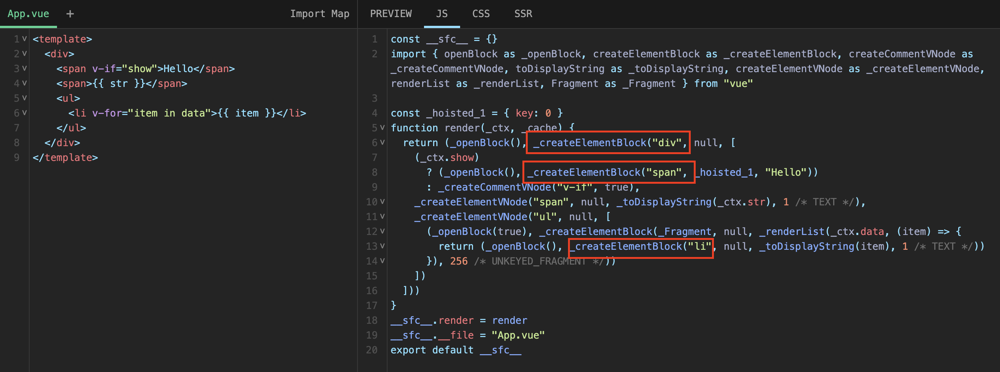
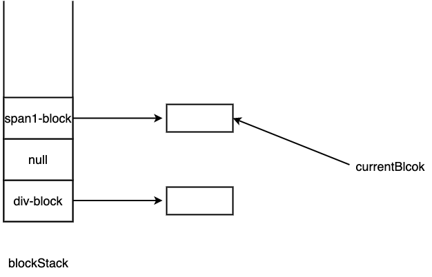
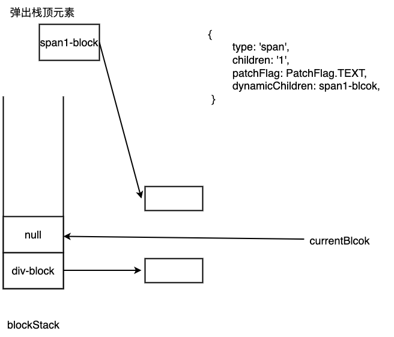
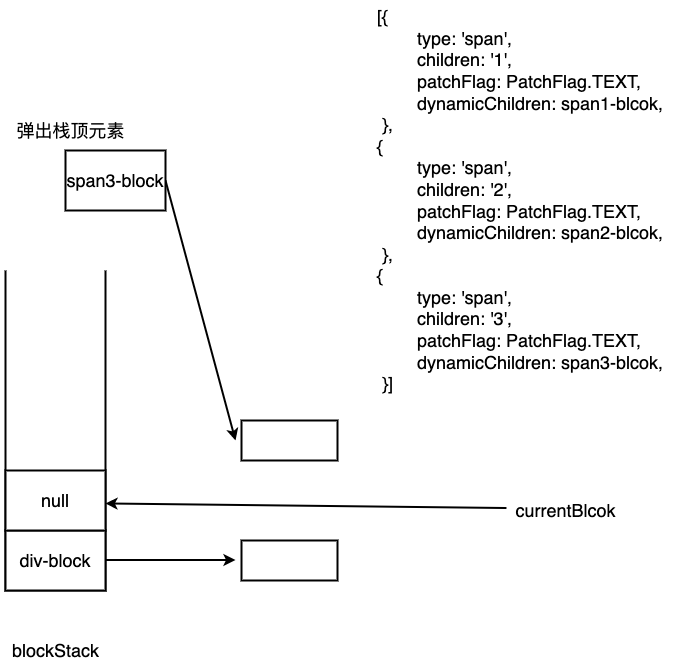
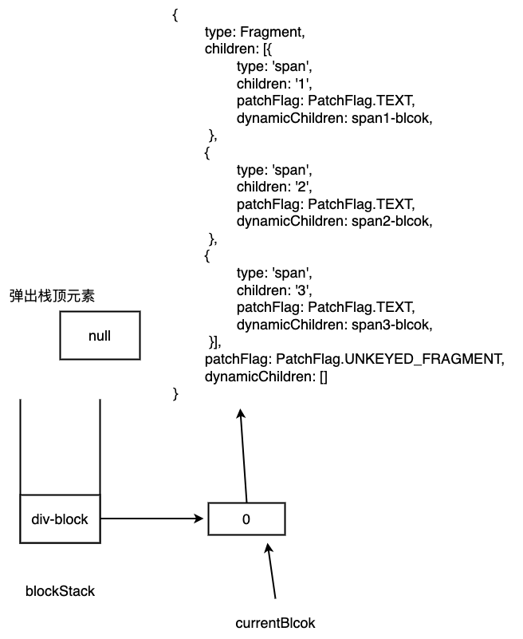
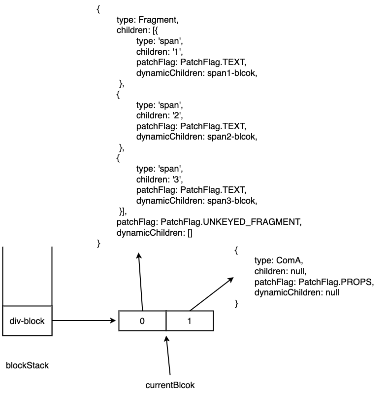
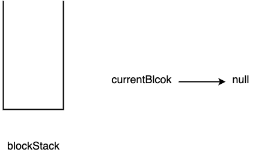

# Block

## 什么是Block？

`Block`是一种特殊的`vnode`，它和普通`vnode`相比，多出一个额外的`dynamicChildren`属性，用来存储动态节点。

什么是动态节点？观察下面这个`vnode`，`children`中的第一个`vnode`的`children`是动态的，第二个`vnode`的`class`是动态的，这两个`vnode`都是动态节点。动态节点都会有个`patchFlag`属性，用来表示节点的什么属性时动态的。

```ts
const vnode = {
  type: 'div',
  children: [
    { type: 'span', children: ctx.foo, patchFlag: PatchFlags.TEXT },
    { type: 'span', children: 'foo', props: { class: normalizeClass(cls) }, patchFlag: PatchFlags.CLASS },
    { type: 'span', children: 'foo' }
  ]
}
```

作为`Block`，会将其所有子代动态节点收集到`dynamicChildren`中（子代的子代动态元素也会被收集到`dynamicChildren`中）。

```ts
const vnode = {
  type: 'div',
  children: [
    { type: 'span', children: ctx.foo, patchFlag: PatchFlags.TEXT },
    { type: 'span', children: 'foo', props: { class: normalizeClass(cls) }, patchFlag: PatchFlags.CLASS },
    { type: 'span', children: 'foo' }
  ],
  dynamicChildren: [
    { type: 'span', children: ctx.foo, patchFlag: PatchFlags.TEXT },
    { type: 'span', children: 'foo', props: { class: normalizeClass(cls) }, patchFlag: PatchFlags.CLASS }
  ]
}
```

## 哪些节点会作为Block？

模板中的根节点、带有`v-for`、`v-if/v-else-if/v-else`的节点会被作为`Block`。如下示例：

[SFC Playground](https://sfc.vuejs.org/#eNp9jz1uwzAMha8icI6l3VANdOshtKg13SjQHyjZGQzdvZSbFmkDRNPTI99HcofXnOW2IoygK4bsbcXJRFP17DYWgp8u2UaxDW55MVDO6WpgekPvk1a9ct817bsolURrf2urvynW3jFrScQwxyOFi2K21TKUw4fT0979ZNUtrNX3Slr9LgoncCEnqkOwWV5KinzH3puZfRSKgVEcTvf40P43cK41l1Gpsnz06y9FJvpUrCStsbqAEksY3ildCxKDDZzuGIrNDWkgjDMS0jPmv9YHbsc2Exu0L5VehK4=)



## dynamicChildren的收集

观察`tempalte`被编译后的代码，你会发现在创建`Block`之前会执行一个`openBlock`函数。

```ts
// 一个block栈用于存储
export const blockStack: (VNode[] | null)[] = []
// 一个数组，用于存储动态节点，最终会赋给dynamicChildren
export let currentBlock: VNode[] | null = null

export function openBlock(disableTracking = false) {
  blockStack.push((currentBlock = disableTracking ? null : []))
}
```

`openBlock`中，如果`disableTracking`为`true`，会将`currentBlock`设置为`null`；否则创建一个新的数组并赋值给`currentBlock`，并`push`到`blockStack`中。

再看`createBlock`，`createBlock`调用一个`setupBlock`方法。

```ts
export function createBlock(
  type: VNodeTypes | ClassComponent,
  props?: Record<string, any> | null,
  children?: any,
  patchFlag?: number,
  dynamicProps?: string[]
): VNode {
  return setupBlock(
    createVNode(
      type,
      props,
      children,
      patchFlag,
      dynamicProps,
      true /* isBlock: prevent a block from tracking itself */
    )
  )
}
```

`setupBlock`接收一个`vnode`参数。

```ts
function setupBlock(vnode: VNode) {
  // isBlockTreeEnabled > 0时，将currentBlock赋值给vnode.dynamicChildren
  // 否则置为null
  vnode.dynamicChildren =
    isBlockTreeEnabled > 0 ? currentBlock || (EMPTY_ARR as any) : null
  // 关闭block
  closeBlock()
  // 父block收集子block
  // 如果isBlockTreeEnabled > 0，并且currentBlock不为null，将vnode放入currentBlock中
  if (isBlockTreeEnabled > 0 && currentBlock) {
    currentBlock.push(vnode)
  }
  // 返回vnode
  return vnode
}
```

`closeBlock`：

```ts
export function closeBlock() {
  // 弹出栈顶block
  blockStack.pop()
  // 将currentBlock设置为父block
  currentBlock = blockStack[blockStack.length - 1] || null
}
```

在理解`dynamicChildren`的收集过程之前，我们应该先清楚对于嵌套`vnode`的创建顺序是从内向外执行的。如：

```ts
export default defineComponent({
  render() {
    return createVNode('div', null, [
      createVNode('ul', null, [
        createVNode('li', null, [
          createVNode('span', null, 'foo')
        ])
      ])
    ])
  }
})
```

`vnode`的创建过程为：`span`->`li`->`ul`->`div`。

在每次创建`Block`之前，都需要调用`openBlock`创建一个新数组赋值给`currentBlock`，并放入`blockStack`栈顶。接着调用`createBlock`，在`createBlock`中会先创建`vnode`，并将`vnode`作为参数传递给`setupBlock`。

创建`vnode`时，如果满足某些条件会将`vnode`收集到`currentBlock`中。

```ts
// 收集当前动态节点到currentBlock中
if (
  isBlockTreeEnabled > 0 &&
  // 避免收集自己
  !isBlockNode &&
  // 存在parent block
  currentBlock &&
  // vnode.patchFlag需要大于0或shapeFlag中存在ShapeFlags.COMPONENT
  // patchFlag的存在表明该节点需要修补更新。
  // 组件节点也应该总是打补丁，因为即使组件不需要更新，它也需要将实例持久化到下一个 vnode，以便以后可以正确卸载它
  (vnode.patchFlag > 0 || shapeFlag & ShapeFlags.COMPONENT) &&
  vnode.patchFlag !== PatchFlags.HYDRATE_EVENTS
) {
  currentBlock.push(vnode)
}
```
接着在`setupBlock`中，将`currentBlock`赋值给`vnode.dynamicChildren`属性，然后调用`closeBlock`关闭`block`（弹出`blockStack`栈顶元素，并将`currentBlock`执行`blockStack`的最后一个元素，即刚弹出`block`的父`block`），接着将`vnode`收集到父`block`中。

### 示例

为了更清除`dynamicChildren`的收集流程，我们通过一个例子继续进行分析。

```vue
<template>
  <div>
    <span v-for="item in data">{{ item }}</span>
    <ComA :count="count"></ComA>
  </div>
</template>

<script setup>
import { ref, reactive } from 'vue'
const data = reactive([1, 2, 3])
const count = ref(0)
</script>
```

以上示例，经过编译器编译后生成的代码如下。[SFC Playground](https://sfc.vuejs.org/#eNp9UMtOxDAM/BUrl12ktuFxq7qVVnwG4VBaF7IiDzlpOVT5d5xUi1YgcUnsyXhm4k2cvW/WBUUruojGfw4Re2UBukmvpeAy+MHCWs+OTkpopoG2MA1xUKLfNihISp3MvOvMszNnaEe32MhD5WZ2JzO+G8jdoZM3vtyGkbSPEDAunhFtvKMIGxDOFR/DGPWKkGAmZ+DA0Q/Kjs6GWBLB6YdzfHmo4LGCp9e7K6PEKJT5eM8oRy5uvajEblSbwTeX4CwvZMsx+cPlISjRQkEyxra5V+IjRh9aKcM85jVeQuPoXXLVEFtpgw0GU7+R+wpILKxEdaMhGVyRakI7ISH9p/mL+kc3yyZlk0jfoEuf1A==)

```ts
import { renderList as _renderList, Fragment as _Fragment, openBlock as _openBlock, createElementBlock as _createElementBlock, toDisplayString as _toDisplayString, resolveComponent as _resolveComponent, createVNode as _createVNode } from "vue"

import { ref, reactive } from 'vue'

const __sfc__ = {
  __name: 'App',
  setup(__props) {

    const data = reactive([1, 2, 3])
    const count = ref(0)

    return (_ctx, _cache) => {
      const _component_ComA = _resolveComponent("ComA")

      return (_openBlock(), _createElementBlock("div", null, [
        (_openBlock(true), _createElementBlock(_Fragment, null, _renderList(data, (item) => {
          return (_openBlock(), _createElementBlock("span", null, _toDisplayString(item), 1 /* TEXT */))
        }), 256 /* UNKEYED_FRAGMENT */)),
        _createVNode(_component_ComA, { count: count.value }, null, 8 /* PROPS */, ["count"])
      ]))
    }
  }

}
__sfc__.__file = "App.vue"
export default __sfc__
```

当渲染函数（这里的渲染函数就是`setup`的返回值）被执行时，其执行流程如下：
1. 执行`_openBlock()`创建一个新的数组（称其为`div-block`），并`push`到`blockStack`栈顶
2. 执行`_openBlock(true)`，由于参数为`true`，所以不会创建新的数组，而是将`null`赋值给`currentBlock`，并`push`到`blockStack`栈顶
3. 执行`_renderList`，`_renderList`会遍历`data`，并执行第二个`renderItem`参数，即`(item) => { ... }`。
4. 首先`item`为`1`，执行`renderItem`，执行`_openBlock()`创建一个新的数组（称其为`span1-block`），并`push`到`blockStack`栈顶。此时`blockStack`、`currentBlock`状态如下如：

5. 接着执行`_createElementBlock("span", null, _toDisplayString(item), 1 /* TEXT */)`，在`_createElementBlock`中会先调用`createBaseVNode`创建`vnode`，在创建`vnode`时因为这是个`block vnode`（`isBlockNode`参数为`true`），所以不会被收集到`currentBlock`中
6. 创建好`vnode`后，执行`setupBlock`，将`currentBlock`赋值给`vnode.dynamicChildren`。
7. 执行`closeBlock()`，弹出`blcokStack`的栈顶元素，并将`currentBlock`指向`blcokStack`中的最后一个元素。如下图所示：

8. 由于此时`currentBlock`为`null`，所以跳过`currentBlock.push(vnode)`。
9. `item = 2、item = 3`时，过程与`4-7`步骤相同。当`item = 3`时，`block`创建完毕后的状态如下：

10. 此时，`list`渲染完毕，接着调用`_createElementBlock(_Fragment)`。
11. 执行`_createElementBlock`的过程中，因为`isBlockNode`参数为`true`且`currentBlock`为`null`，所以不会被`currentBlock`收集
12. 执行`setupBlock`，将`EMPTY_ARR`（空数组）赋值给`vnode.dynamicChildren`，并调用`closeBlock()`，弹出栈顶元素，使`currentBlcok`指向最新的栈顶元素。由于此时`currentBlock`不为`null`，所以执行`currentBlock.push(vnode)`

13. 执行`_createVNode(_component_ComA)`，创建`vnode`过程中，因为`vnode.patchFlag === PatchFlag.PROPS`，所以会将`vnode`添加到`currentBlock`中。

14. 执行`_createElementBlock('div')`。先创建`vnode`，因为`isBlockNode`为`true`，所以不会收集到`currentBlock`中。
15. 执行`setupBlock()`，将`currentBlock`赋给`vnode.dynamicChildren`。然后执行`closeBlock()`，弹出栈顶元素，此时`blockStack`长度为0，所以`currentBlock`会指向`null`


最终生成的`vnode`：
``` json
{
  type: "div",
  children:
    [
      {
        type: Fragment,
        children: [{
          type: "span",
          children: "1",
          patchFlag: PatchFlag.TEXT,
          dynamicChildren: [],
        },
          {
            type: "span",
            children: "2",
            patchFlag: PatchFlag.TEXT,
            dynamicChildren: [],
          },
          {
            type: "span",
            children: "3",
            patchFlag: PatchFlag.TEXT,
            dynamicChildren: [],
          }],
        patchFlag: PatchFlag.UNKEYED_FRAGMENT,
        dynamicChildren: []
      },
      {
        type: ComA,
        children: null,
        patchFlag: PatchFlag.PROPS,
        dynamicChildren: null
      }
    ]
  ,
  patchFlag:0,
  dynamicChildren: [
    {
      type: Fragment,
      children: [{
        type: "span",
        children: "1",
        patchFlag: PatchFlag.TEXT,
        dynamicChildren: [],
      },
        {
          type: "span",
          children: "2",
          patchFlag: PatchFlag.TEXT,
          dynamicChildren: [],
        },
        {
          type: "span",
          children: "3",
          patchFlag: PatchFlag.TEXT,
          dynamicChildren: [],
        }],
      patchFlag: PatchFlag.UNKEYED_FRAGMENT,
      dynamicChildren: []
    },
    {
      type: ComA,
      children: null,
      patchFlag: PatchFlag.PROPS,
      dynamicChildren: null
    }
  ]
}
```

## Block的作用

如果你了解[Diff](https://maxlz1.github.io/blog/vue3-analysis/renderer/diff.html)过程，你应该知道在`Diff`过程中，即使`vnode`没有发生变化，也会进行一次比较。而`Block`的出现减少了这种不必要的的比较，由于`Block`中的动态节点都会被收集到`dynamicChildren`中，所以`Block`间的`patch`可以直接比较`dynamicChildren`中的节点，减少了非动态节点之间的比较。

`Block`之间进行`patch`时，会调用一个`patchBlockChildren`方法来对`dynamicChildren`进行`patch`。

```ts
const patchElement = (
  n1: VNode,
  n2: VNode,
  parentComponent: ComponentInternalInstance | null,
  parentSuspense: SuspenseBoundary | null,
  isSVG: boolean,
  slotScopeIds: string[] | null,
  optimized: boolean
) => {
  // ...
  let { patchFlag, dynamicChildren, dirs } = n2

  if (dynamicChildren) {
    patchBlockChildren(
      n1.dynamicChildren!,
      dynamicChildren,
      el,
      parentComponent,
      parentSuspense,
      areChildrenSVG,
      slotScopeIds
    )
    if (__DEV__ && parentComponent && parentComponent.type.__hmrId) {
      traverseStaticChildren(n1, n2)
    }
  } else if (!optimized) {
    patchChildren(
      n1,
      n2,
      el,
      null,
      parentComponent,
      parentSuspense,
      areChildrenSVG,
      slotScopeIds,
      false
    )
  }
  
  // ...
}
```

`patchElement`中如果新节点存在`dynamicChildren`，说明此时新节点是个`Block`，那么会调用`patchBlockChildren`方法对`dynamicChildren`进行`patch`；否则如果`optimized`为`false`调用`patchChildren`，`patchChildren`中可能会调用`patchKeyedChildren/patchUnkeyedChildren`进行`Diff`。

```ts
const patchBlockChildren: PatchBlockChildrenFn = (
  oldChildren,
  newChildren,
  fallbackContainer,
  parentComponent,
  parentSuspense,
  isSVG,
  slotScopeIds
) => {
  for (let i = 0; i < newChildren.length; i++) {
    const oldVNode = oldChildren[i]
    const newVNode = newChildren[i]
    // 确定父容器
    const container =
      oldVNode.el &&
      (oldVNode.type === Fragment ||
        !isSameVNodeType(oldVNode, newVNode) ||
        oldVNode.shapeFlag & (ShapeFlags.COMPONENT | ShapeFlags.TELEPORT))
        ? hostParentNode(oldVNode.el)!
        : fallbackContainer
    patch(
      oldVNode,
      newVNode,
      container,
      null,
      parentComponent,
      parentSuspense,
      isSVG,
      slotScopeIds,
      true
    )
  }
}
```

## 总结

`Block`是`vue3`中一种性能优化的手段。`Block`本质是一种特殊的`vnode`，它与普通`vnode`相比，多出了一个`dynamicChildren`属性，这个属性中保存了所有`Block`子代的动态节点。`Block`进行`patch`可以直接对`dynamicChildren`中的动态节点进行`patch`，避免了静态节点之间的比较。

`Block`的创建过程：

1. 每次创建`Block`节点之前，需要调用`openBlcok`方法，创建一个新的数组赋值给`currentBlock`，并`push`到`blockStack`的栈顶。
2. 在创建`vnode`的过程中如果满足一些条件，会将动态节点放到`currentBlock`中。
3. 节点创建完成后，作为参数传入`setupBlock`中。在`setupBlock`中，将`currentBlock`复制给`vnode.dynamicChildren`，并调用`closeBlcok`，弹出`blockStack`栈顶元素，并使`currentBlock`指向最新的栈顶元素。最后如果此时`currentBlock`不为空，将`vnode`收集到`currentBlock`中。
