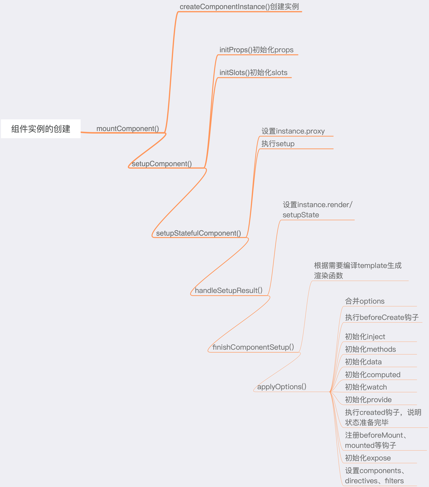

# 组件实例的创建过程

## 组件实例的类型说明

```ts
export interface ComponentInternalInstance {
  // 唯一标识
  uid: number
  type: ConcreteComponent
  // 父组件实例
  parent: ComponentInternalInstance | null
  // 跟组件实例
  root: ComponentInternalInstance
  // app实例上下文
  appContext: AppContext
  // 对应的vnode
  vnode: VNode
  /**
   * The pending new vnode from parent updates
   * @internal
   */
  next: VNode | null
  /**
   * Root vnode of this component's own vdom tree
   */
  subTree: VNode
  /**
   * Render effect instance
   */
  effect: ReactiveEffect
  /**
   * Bound effect runner to be passed to schedulers
   */
  update: SchedulerJob
  // 返回vdom树的渲染函数
  render: InternalRenderFunction | null
  /**
   * SSR render function
   * @internal
   */
  ssrRender?: Function | null
  /**
   * Object containing values this component provides for its descendents
   * @internal
   */
  provides: Data
  /**
   * Tracking reactive effects (e.g. watchers) associated with this component
   * so that they can be automatically stopped on component unmount
   * @internal
   */
  scope: EffectScope
  // 从instance.proxy中获取属性时，缓存key的来源，以减少hasOwnProperty的调用
  accessCache: Data | null
  /**
   * cache for render function values that rely on _ctx but won't need updates
   * after initialized (e.g. inline handlers)
   * @internal
   */
  renderCache: (Function | VNode)[]
  // 注册的组件
  components: Record<string, ConcreteComponent> | null
  // 注册的指令
  directives: Record<string, Directive> | null
  // 注册的filters，仅在v2兼容模式
  filters?: Record<string, Function>
  // 标准化的props options
  propsOptions: NormalizedPropsOptions
  // 标准化的emits options
  emitsOptions: ObjectEmitsOptions | null
  // 组件的inheritAttrs options
  inheritAttrs?: boolean
  /**
   * is custom element?
   */
  isCE?: boolean
  /**
   * custom element specific HMR method
   */
  ceReload?: (newStyles?: string[]) => void

  // the rest are only for stateful components ---------------------------------

  // 组件中的this指向
  proxy: ComponentPublicInstance | null

  // 通过expose()暴露的属性
  exposed: Record<string, any> | null
  exposeProxy: Record<string, any> | null
  
  // 使用with块的运行时编译的渲染函数的上下文代理对象
  // 当在线编译模板时，生成的渲染函数使用了with
  withProxy: ComponentPublicInstance | null
  // 组件实例代理的目标，组件中this的代理目标
  ctx: Data

  // state
  // data options的返回值，会使用reactive处理为响应式数据
  data: Data
  // 组件已解析的的props对象
  props: Data
  // 组件所有透传 attributes 的对象
  attrs: Data
  // 组件的插槽对象
  slots: InternalSlots
  refs: Data
  // emit函数
  emit: EmitFn
  /**
   * used for keeping track of .once event handlers on components
   * @internal
   */
  emitted: Record<string, boolean> | null
  // 缓存props的默认值
  propsDefaults: Data
  // setup返回值（如果是对象）的代理对象，使用proxyRefs进行代理，可自动脱ref
  setupState: Data
  /**
   * devtools access to additional info
   * @internal
   */
  devtoolsRawSetupState?: any
  // setup上下文
  setupContext: SetupContext | null

  /**
   * suspense related
   * @internal
   */
  suspense: SuspenseBoundary | null
  /**
   * suspense pending batch id
   * @internal
   */
  suspenseId: number
  /**
   * @internal
   */
  asyncDep: Promise<any> | null
  /**
   * @internal
   */
  asyncResolved: boolean

  // lifecycle
  isMounted: boolean
  isUnmounted: boolean
  isDeactivated: boolean
  
  // 以下是一些生命周期钩子函数
  [LifecycleHooks.BEFORE_CREATE]: LifecycleHook
  [LifecycleHooks.CREATED]: LifecycleHook
  [LifecycleHooks.BEFORE_MOUNT]: LifecycleHook
  [LifecycleHooks.MOUNTED]: LifecycleHook
  [LifecycleHooks.BEFORE_UPDATE]: LifecycleHook
  [LifecycleHooks.UPDATED]: LifecycleHook
  [LifecycleHooks.BEFORE_UNMOUNT]: LifecycleHook
  [LifecycleHooks.UNMOUNTED]: LifecycleHook
  [LifecycleHooks.RENDER_TRACKED]: LifecycleHook
  [LifecycleHooks.RENDER_TRIGGERED]: LifecycleHook
  [LifecycleHooks.ACTIVATED]: LifecycleHook
  [LifecycleHooks.DEACTIVATED]: LifecycleHook
  [LifecycleHooks.ERROR_CAPTURED]: LifecycleHook
  [LifecycleHooks.SERVER_PREFETCH]: LifecycleHook<() => Promise<unknown>>

  /**
   * For caching bound $forceUpdate on public proxy access
   */
  f?: () => void
  /**
   * For caching bound $nextTick on public proxy access
   */
  n?: () => Promise<void>
}
```

## createComponentInstance

在`vue3`中通过`createComponentInstance`方法创建组件实例。`createComponentInstance`接收三个参数：`vnode`、`parent`（父组件实例）、`suspense`

```ts
export function createComponentInstance(
  vnode: VNode,
  parent: ComponentInternalInstance | null,
  suspense: SuspenseBoundary | null
) {
  const type = vnode.type as ConcreteComponent
  // app实例的上下文对象
  const appContext =
    (parent ? parent.appContext : vnode.appContext) || emptyAppContext

  const instance: ComponentInternalInstance = {
    uid: uid++,
    vnode,
    type,
    parent,
    appContext,
    root: null!, // to be immediately set
    next: null,
    subTree: null!, // will be set synchronously right after creation
    effect: null!,
    update: null!, // will be set synchronously right after creation
    scope: new EffectScope(true /* detached */),
    render: null,
    proxy: null,
    exposed: null,
    exposeProxy: null,
    withProxy: null,
    provides: parent ? parent.provides : Object.create(appContext.provides),
    accessCache: null!,
    renderCache: [],

    components: null,
    directives: null,

    // 标准化props options及emits options
    propsOptions: normalizePropsOptions(type, appContext),
    emitsOptions: normalizeEmitsOptions(type, appContext),

    emit: null!, // to be set immediately
    emitted: null,

    propsDefaults: EMPTY_OBJ,

    inheritAttrs: type.inheritAttrs,

    ctx: EMPTY_OBJ,
    data: EMPTY_OBJ,
    props: EMPTY_OBJ,
    attrs: EMPTY_OBJ,
    slots: EMPTY_OBJ,
    refs: EMPTY_OBJ,
    setupState: EMPTY_OBJ,
    setupContext: null,

    suspense,
    suspenseId: suspense ? suspense.pendingId : 0,
    asyncDep: null,
    asyncResolved: false,

    isMounted: false,
    isUnmounted: false,
    isDeactivated: false,

    // 一些生命周期钩子 
    bc: null,
    c: null,
    bm: null,
    m: null,
    bu: null,
    u: null,
    um: null,
    bum: null,
    da: null,
    a: null,
    rtg: null,
    rtc: null,
    ec: null,
    sp: null
  }
  // 设置组件实例代理的目标，组件中的this就是instance.ctx的代理对象
  // 开发环境下会创建一个包含$、$el、$data、$attrs等属性的对象，以方便调试
  // 生产环境下，将通过代理的方式去拦截this.$、this.$el、this.$data操作
  if (__DEV__) {
    instance.ctx = createDevRenderContext(instance)
  } else {
    instance.ctx = { _: instance }
  }
  // 设置组件实例的根实例
  instance.root = parent ? parent.root : instance
  // 绑定emit函数的第一个参数为组件实例
  instance.emit = emit.bind(null, instance)

  // 自定义元素的特殊处理
  if (vnode.ce) {
    vnode.ce(instance)
  }

  return instance
}
```

在创建组件实例过程中有步比较重要的操作就是标准化组件实例的`props`与`emits`。

### 标准化props

`normalizePropsOptions`方法可以接受三个参数：`comp`（组件或包含options的某些属性的对象）、`appContext`（`app`实例的上下文对象）、`asMixin`（作为`mixin`处理`props`， 默认`false`）
```ts
export function normalizePropsOptions(
  comp: ConcreteComponent,
  appContext: AppContext,
  asMixin = false
): NormalizedPropsOptions {
  // 从appContext获取缓存的进过处理好的props，如果有，直接返回
  const cache = appContext.propsCache
  const cached = cache.get(comp)
  if (cached) {
    return cached
  }

  const raw = comp.props
  const normalized: NormalizedPropsOptions[0] = {}
  const needCastKeys: NormalizedPropsOptions[1] = []

  // 处理通过mixin/extend注入的props
  let hasExtends = false
  // 如果支持 options api 并且comp不是function
  if (__FEATURE_OPTIONS_API__ && !isFunction(comp)) {
    const extendProps = (raw: ComponentOptions) => {
      if (__COMPAT__ && isFunction(raw)) {
        raw = raw.options
      }
      hasExtends = true
      const [props, keys] = normalizePropsOptions(raw, appContext, true)
      extend(normalized, props)
      if (keys) needCastKeys.push(...keys)
    }
    // 处理全局mixin注入的props
    if (!asMixin && appContext.mixins.length) {
      appContext.mixins.forEach(extendProps)
    }
    // 处理extent注入的props
    if (comp.extends) {
      extendProps(comp.extends)
    }
    // 处理局部mixin注入的props
    if (comp.mixins) {
      comp.mixins.forEach(extendProps)
    }
  }

  // 如果组件不存在props，也没有通过mixin、extends方式注入的props，则缓存一个空数组
  if (!raw && !hasExtends) {
    cache.set(comp, EMPTY_ARR as any)
    return EMPTY_ARR as any
  }

  // 如果组件本身的props是数组时，其中的元素必须为字符串
  if (isArray(raw)) {
    for (let i = 0; i < raw.length; i++) {
      if (__DEV__ && !isString(raw[i])) {
        warn(`props must be strings when using array syntax.`, raw[i])
      }
      // 将字符串props转为驼峰模式
      const normalizedKey = camelize(raw[i])
      // 验证props的命名是否符合要求，不准以$开头的props
      if (validatePropName(normalizedKey)) {
        normalized[normalizedKey] = EMPTY_OBJ
      }
    }
  } else if (raw) {
    if (__DEV__ && !isObject(raw)) {
      warn(`invalid props options`, raw)
    }
    for (const key in raw) {
      // 将key转为驼峰式
      const normalizedKey = camelize(key)
      // 验证props的命名是否符合要求，不准以$开头的props
      if (validatePropName(normalizedKey)) {
        const opt = raw[key]
        // 如果key所对应的opt是数组或方法，则将opt作为type
        const prop: NormalizedProp = (normalized[normalizedKey] =
          isArray(opt) || isFunction(opt) ? { type: opt } : opt)
        if (prop) {
          // 获取Boolean在prop.type中的索引，如果返回-1，代表prop.type中不允许Boolean类型
          const booleanIndex = getTypeIndex(Boolean, prop.type)
          // 获取String在prop.type中的索引
          const stringIndex = getTypeIndex(String, prop.type)
          prop[BooleanFlags.shouldCast] = booleanIndex > -1
          prop[BooleanFlags.shouldCastTrue] =
            stringIndex < 0 || booleanIndex < stringIndex
          // 如果prop类型中存在Boolean或存在默认值，则将key存入needCastKeys中
          if (booleanIndex > -1 || hasOwn(prop, 'default')) {
            needCastKeys.push(normalizedKey)
          }
        }
      }
    }
  }

  // 将normalized和needCastKeys构造成一个数组并缓存到app实例的上下文对象中
  const res: NormalizedPropsOptions = [normalized, needCastKeys]
  cache.set(comp, res)
  return res
}
```

### 标准化emits
```ts
export function normalizeEmitsOptions(
  comp: ConcreteComponent,
  appContext: AppContext,
  asMixin = false
): ObjectEmitsOptions | null {
  // 尝试从emits缓存中获取emit
  const cache = appContext.emitsCache
  const cached = cache.get(comp)
  if (cached !== undefined) {
    return cached
  }

  const raw = comp.emits
  let normalized: ObjectEmitsOptions = {}

  // 处理通过mixin/extend注入的emits
  let hasExtends = false
  if (__FEATURE_OPTIONS_API__ && !isFunction(comp)) {
    const extendEmits = (raw: ComponentOptions) => {
      const normalizedFromExtend = normalizeEmitsOptions(raw, appContext, true)
      // 只要存在通过mixins、extend方式注入的emits，将hasExtends设置为true
      if (normalizedFromExtend) {
        hasExtends = true
        extend(normalized, normalizedFromExtend)
      }
    }
    // 处理通过全局mixin注入的emits选项
    if (!asMixin && appContext.mixins.length) {
      appContext.mixins.forEach(extendEmits)
    }
    // 处理通过extends注入的emits选项
    if (comp.extends) {
      extendEmits(comp.extends)
    }
    // 处理通过局部mixins注入的emits选项
    if (comp.mixins) {
      comp.mixins.forEach(extendEmits)
    }
  }

  // 如果组件本身不存在emits，而且也没有通过mixin、extends等方式注入emits，则缓存一个null
  if (!raw && !hasExtends) {
    cache.set(comp, null)
    return null
  }

  if (isArray(raw)) {
    raw.forEach(key => (normalized[key] = null))
  } else {
    extend(normalized, raw)
  }

  // 将规范后的emits缓存至app实例的上下文对象中
  cache.set(comp, normalized)
  return normalized
}
```

可以看到如果通过全局`mixin`、局部`mixin`、`extends`及组件自身`props`同时定义`key`相同的`props`或`emits`，其优先级顺序为：组件自身`props`或`emits` > 局部`mixin` > `extends` > 全局`mixin`

## setupComponent

在创建完组件实例后，会调用一个`setupComponent`方法。

```ts
export function setupComponent(
  instance: ComponentInternalInstance,
  isSSR = false
) {
  isInSSRComponentSetup = isSSR

  const { props, children } = instance.vnode
  const isStateful = isStatefulComponent(instance)
  // 初始化props
  initProps(instance, props, isStateful, isSSR)
  // 初始化slots
  initSlots(instance, children)

  // 执行setup
  const setupResult = isStateful
    ? setupStatefulComponent(instance, isSSR)
    : undefined
  isInSSRComponentSetup = false
  return setupResult
}
```

`setupComponent`函数主要有三个作用：

1. 初始化`props`，参考：[组件props的初始化过程](https://maxlz1.github.io/blog/vue3-analysis/renderer/initProps.html)
2. 初始化`slots`
3. 执行`setup`

## setupStatefulComponent

<details>
<summary><code>setupStatefulComponent</code>源码</summary>

```ts
function setupStatefulComponent(
  instance: ComponentInternalInstance,
  isSSR: boolean
) {
  const Component = instance.type as ComponentOptions

  if (__DEV__) {
    // 校验组件自身名称
    if (Component.name) {
      validateComponentName(Component.name, instance.appContext.config)
    }
    // 校验局部注册的组件名，components的key
    if (Component.components) {
      const names = Object.keys(Component.components)
      for (let i = 0; i < names.length; i++) {
        validateComponentName(names[i], instance.appContext.config)
      }
    }
    // 校验局部注册的指令
    if (Component.directives) {
      const names = Object.keys(Component.directives)
      for (let i = 0; i < names.length; i++) {
        validateDirectiveName(names[i])
      }
    }
    // compilerOptions仅在使用了完整的构建版本时才有效
    if (Component.compilerOptions && isRuntimeOnly()) {
      warn(
        `"compilerOptions" is only supported when using a build of Vue that ` +
        `includes the runtime compiler. Since you are using a runtime-only ` +
        `build, the options should be passed via your build tool config instead.`
      )
    }
  }
  // 通过this进行访问属性时记录属性的来源
  instance.accessCache = Object.create(null)
  // 组件中this的指向
  instance.proxy = markRaw(new Proxy(instance.ctx, PublicInstanceProxyHandlers))
  if (__DEV__) {
    exposePropsOnRenderContext(instance)
  }
  
  const { setup } = Component
  if (setup) {
    // 创建setup中的上下文对象
    const setupContext = (instance.setupContext =
      setup.length > 1 ? createSetupContext(instance) : null)

    setCurrentInstance(instance)
    pauseTracking()
    const setupResult = callWithErrorHandling(
      setup,
      instance,
      ErrorCodes.SETUP_FUNCTION,
      [__DEV__ ? shallowReadonly(instance.props) : instance.props, setupContext]
    )
    resetTracking()
    unsetCurrentInstance()

    if (isPromise(setupResult)) {
      setupResult.then(unsetCurrentInstance, unsetCurrentInstance)
      if (isSSR) {
        // return the promise so server-renderer can wait on it
        return setupResult
          .then((resolvedResult: unknown) => {
            handleSetupResult(instance, resolvedResult, isSSR)
          })
          .catch(e => {
            handleError(e, instance, ErrorCodes.SETUP_FUNCTION)
          })
      } else if (__FEATURE_SUSPENSE__) {
        // async setup returned Promise.
        // bail here and wait for re-entry.
        instance.asyncDep = setupResult
        if (__DEV__ && !instance.suspense) {
          const name = Component.name ?? 'Anonymous'
          warn(
            `Component <${name}>: setup function returned a promise, but no ` +
              `<Suspense> boundary was found in the parent component tree. ` +
              `A component with async setup() must be nested in a <Suspense> ` +
              `in order to be rendered.`
          )
        }
      } else if (__DEV__) {
        warn(
          `setup() returned a Promise, but the version of Vue you are using ` +
            `does not support it yet.`
        )
      }
    } else {
      handleSetupResult(instance, setupResult, isSSR)
    }
  } else {
    finishComponentSetup(instance, isSSR)
  }
}
```
</details>

在执行`setup`前，会对组件名、组件中注册的组件名、组件中注册的指令名进行校验，检查是否合法。

```ts
if (__DEV__) {
  // 校验组件自身名称
  if (Component.name) {
    validateComponentName(Component.name, instance.appContext.config)
  }
  // 校验局部注册的组件名，components的key
  if (Component.components) {
    const names = Object.keys(Component.components)
    for (let i = 0; i < names.length; i++) {
      validateComponentName(names[i], instance.appContext.config)
    }
  }
  // 校验局部注册的指令
  if (Component.directives) {
    const names = Object.keys(Component.directives)
    for (let i = 0; i < names.length; i++) {
      validateDirectiveName(names[i])
    }
  }
  // compilerOptions仅在使用了完整的构建版本时才有效
  if (Component.compilerOptions && isRuntimeOnly()) {
    warn(
      `"compilerOptions" is only supported when using a build of Vue that ` +
        `includes the runtime compiler. Since you are using a runtime-only ` +
        `build, the options should be passed via your build tool config instead.`
    )
  }
}
```

其中组件名的验证规则是：1.不能是内置`tag`（`slot`、`component`）；2. 不能是原生标签。如果不符合条件，则进行警告提示。
```ts
export function validateComponentName(name: string, config: AppConfig) {
  const appIsNativeTag = config.isNativeTag || NO
  if (isBuiltInTag(name) || appIsNativeTag(name)) {
    warn(
      'Do not use built-in or reserved HTML elements as component id: ' + name
    )
  }
}
```

指令的验证规则是：不能是内置指令，包括`bind`、`cloak`、`else-if`、`else`、`for`、`html`、`if`、`model`、`on`、`once`、`pre`、`show`、`slot`、`text`、`memo`
```ts
export const isBuiltInDirective = /*#__PURE__*/ makeMap(
  'bind,cloak,else-if,else,for,html,if,model,on,once,pre,show,slot,text,memo'
)

export function validateDirectiveName(name: string) {
  if (isBuiltInDirective(name)) {
    warn('Do not use built-in directive ids as custom directive id: ' + name)
  }
}
```

然后对`instance`进行了两步操作：1.修改`instance.accessCache`为一个空对象；2.修改`instance.proxy`为一个代理对象。
```ts
// 通过this进行访问属性时记录属性的来源
instance.accessCache = Object.create(null)
// 组件中this的指向
instance.proxy = markRaw(new Proxy(instance.ctx, PublicInstanceProxyHandlers))
```

`instance.accessCache`会用来缓存通过`this`访问的属性需要从哪里获取。例如：

```ts
export default defineComponent({
  data() {
    const a = ref(0)
    return {
      a
    }
  },
  setup() {
    const b = ref(0)
    return {
      b
    }
  }
})
```

当通过`this.a`访问`a`属性时，会先尝试从`setup`的返回结果中查找，由于`setup`的返回值中不存在`a`属性，所以接着从`data`的返回值中查找，在`data`的返回结果中存在`a`属性，返回`a`属性对应的值，同时会将`a`属性的查找来源标记为`AccessTypes.DATA`，保存到`instance.accessCache`中，当下次要获取`this.a`时，可以直接从`instance.accessCache`中获取到`a`属性的来源，直接到`data`的返回值中获取`a`属性。

`this.b`同`this.a`相同，只不过在`setup`中可以找到`b`属性，所以不会再从`data`返回值中找着了。同样，在`instance.accessCache`中会缓存`b`属性的来源，由于`b`属性时从`setup`返回值中找到的，所以会将其来源标记为`AccessTypes.SETUP`。

关于`this`属性查找的顺序可参考：[详解组件中的this](https://maxlz1.github.io/blog/vue3-analysis/renderer/componentThis.html)

然后就开始执行`setup`。在执行`setup`之前，需要先创建`setup`的上下文对象。注意这里如果在使用`setup`函数时，声明参数时，是不会创建上下文的。

```ts
const setupContext = (instance.setupContext =
    setup.length > 1 ? createSetupContext(instance) : null)
// 设置当前实例
setCurrentInstance(instance)
// 停止依赖收集
pauseTracking()
```

`createSetupContext`:
```ts
export function createSetupContext(
  instance: ComponentInternalInstance
): SetupContext {
  // 创建expose函数
  const expose: SetupContext['expose'] = exposed => {
    // setup中expose应该只能被调用一次
    if (__DEV__ && instance.exposed) {
      warn(`expose() should be called only once per setup().`)
    }
    instance.exposed = exposed || {}
  }

  let attrs: Data
  if (__DEV__) {
    // We use getters in dev in case libs like test-utils overwrite instance
    // properties (overwrites should not be done in prod)
    return Object.freeze({
      get attrs() {
        return attrs || (attrs = createAttrsProxy(instance))
      },
      get slots() {
        return shallowReadonly(instance.slots)
      },
      get emit() {
        return (event: string, ...args: any[]) => instance.emit(event, ...args)
      },
      expose
    })
  } else {
    return {
      get attrs() {
        return attrs || (attrs = createAttrsProxy(instance))
      },
      slots: instance.slots,
      emit: instance.emit,
      expose
    }
  }
}
```

接下来就是执行`setup`。

```ts
const setupResult = callWithErrorHandling(
  setup,
  instance,
  ErrorCodes.SETUP_FUNCTION,
  [__DEV__ ? shallowReadonly(instance.props) : instance.props, setupContext]
)
// 恢复依赖收集
resetTracking()
// 取消当前实例
unsetCurrentInstance()
```

执行完`setup`后，获得`setup`的返回值`setupResult`。然后根据`setupResult`进入不同分支。
```ts
// 如果setupResult是Promise
if (isPromise(setupResult)) {
  // Promise的setupResult执行前首先清空当前组件实例
  setupResult.then(unsetCurrentInstance, unsetCurrentInstance)
  if (isSSR) { // 服务端渲染
    // return the promise so server-renderer can wait on it
    return setupResult
      .then((resolvedResult: unknown) => {
        handleSetupResult(instance, resolvedResult, isSSR)
      })
      .catch(e => {
        handleError(e, instance, ErrorCodes.SETUP_FUNCTION)
      })
  } else if (__FEATURE_SUSPENSE__) { // 支持suspense
    instance.asyncDep = setupResult
    if (__DEV__ && !instance.suspense) {
      const name = Component.name ?? 'Anonymous'
      warn(
        `Component <${name}>: setup function returned a promise, but no ` +
          `<Suspense> boundary was found in the parent component tree. ` +
          `A component with async setup() must be nested in a <Suspense> ` +
          `in order to be rendered.`
      )
    }
  } else if (__DEV__) {
    warn(
      `setup() returned a Promise, but the version of Vue you are using ` +
        `does not support it yet.`
    )
  }
} else {
  handleSetupResult(instance, setupResult, isSSR)
}
```

如果`setupResult`不是`Promise`的话，则会调用一个`handleSetupResult`方法。

```ts
export function handleSetupResult(
  instance: ComponentInternalInstance,
  setupResult: unknown,
  isSSR: boolean
) {
  if (isFunction(setupResult)) { // setupResult是Function，则将其作为渲染函数处理
    if (__SSR__ && (instance.type as ComponentOptions).__ssrInlineRender) {
      // when the function's name is `ssrRender` (compiled by SFC inline mode),
      // set it as ssrRender instead.
      instance.ssrRender = setupResult
    } else {
      instance.render = setupResult as InternalRenderFunction
    }
  } else if (isObject(setupResult)) { // setupResult是Object，将其结果作为setupState
    if (__DEV__ && isVNode(setupResult)) {
      warn(
        `setup() should not return VNodes directly - ` +
          `return a render function instead.`
      )
    }
    // setup returned bindings.
    // assuming a render function compiled from template is present.
    if (__DEV__ || __FEATURE_PROD_DEVTOOLS__) {
      instance.devtoolsRawSetupState = setupResult
    }
    // 使用proxyRefs自动脱ref
    instance.setupState = proxyRefs(setupResult)
    if (__DEV__) {
      exposeSetupStateOnRenderContext(instance)
    }
  } else if (__DEV__ && setupResult !== undefined) { // 其它情况，进行提示
    warn(
      `setup() should return an object. Received: ${
        setupResult === null ? 'null' : typeof setupResult
      }`
    )
  }
  finishComponentSetup(instance, isSSR)
}
```

`finishComponentSetup`中有两步重要的操作：

1. 如果组件实例中没有渲染函数，需要根据模板编译出渲染函数
2. 执行vue2相关`options`

```ts
export function finishComponentSetup(
  instance: ComponentInternalInstance,
  isSSR: boolean,
  skipOptions?: boolean
) {
  const Component = instance.type as ComponentOptions

  if (__COMPAT__) {
    convertLegacyRenderFn(instance)

    if (__DEV__ && Component.compatConfig) {
      validateCompatConfig(Component.compatConfig)
    }
  }

  // 设置组件的渲染函数，通过setup返回值可能已经设置过了
  if (!instance.render) {
    // 如果不在SSR环境下，进行即使编译
    if (!isSSR && compile && !Component.render) {
      const template =
        (__COMPAT__ &&
          instance.vnode.props &&
          instance.vnode.props['inline-template']) ||
        Component.template
      if (template) {
        if (__DEV__) {
          startMeasure(instance, `compile`)
        }
        const { isCustomElement, compilerOptions } = instance.appContext.config
        const { delimiters, compilerOptions: componentCompilerOptions } =
          Component
        const finalCompilerOptions: CompilerOptions = extend(
          extend(
            {
              isCustomElement,
              delimiters
            },
            compilerOptions
          ),
          componentCompilerOptions
        )
        if (__COMPAT__) {
          // pass runtime compat config into the compiler
          finalCompilerOptions.compatConfig = Object.create(globalCompatConfig)
          if (Component.compatConfig) {
            extend(finalCompilerOptions.compatConfig, Component.compatConfig)
          }
        }
        // 编译template为渲染函数
        Component.render = compile(template, finalCompilerOptions)
        if (__DEV__) {
          endMeasure(instance, `compile`)
        }
      }
    }

    // 设置组件的渲染函数
    instance.render = (Component.render || NOOP) as InternalRenderFunction

    // 对于运行时编译的渲染函数中使用了with，需要对ctx的代理对象做一些特殊处理
    if (installWithProxy) {
      installWithProxy(instance)
    }
  }

  // 支持 vue2 de options
  if (__FEATURE_OPTIONS_API__ && !(__COMPAT__ && skipOptions)) {
    setCurrentInstance(instance)
    pauseTracking()
    applyOptions(instance)
    resetTracking()
    unsetCurrentInstance()
  }

  // 如果没有渲染函数进行提示
  if (__DEV__ && !Component.render && instance.render === NOOP && !isSSR) {
    /* istanbul ignore if */
    if (!compile && Component.template) {
      warn(
        `Component provided template option but ` +
          `runtime compilation is not supported in this build of Vue.` +
          (__ESM_BUNDLER__
            ? ` Configure your bundler to alias "vue" to "vue/dist/vue.esm-bundler.js".`
            : __ESM_BROWSER__
            ? ` Use "vue.esm-browser.js" instead.`
            : __GLOBAL__
            ? ` Use "vue.global.js" instead.`
            : ``) /* should not happen */
      )
    } else {
      warn(`Component is missing template or render function.`)
    }
  }
}
```

## applyOptions
`applyOptions`用于初始化`options`。`applyOptions`函数接收一个参数：`instance`组件实例。

<details>
<summary><code>applyOptions</code>完整代码</summary>

```ts
export function applyOptions(instance: ComponentInternalInstance) {
  // 合并options：将全局mixins、局部mixins、extends及自身options合并到一个新的options对象中
  const options = resolveMergedOptions(instance)
  const publicThis = instance.proxy! as any
  const ctx = instance.ctx

  // do not cache property access on public proxy during state initialization
  shouldCacheAccess = false

  // 执行beforeCreate钩子
  if (options.beforeCreate) {
    callHook(options.beforeCreate, instance, LifecycleHooks.BEFORE_CREATE)
  }

  const {
    // state
    data: dataOptions,
    computed: computedOptions,
    methods,
    watch: watchOptions,
    provide: provideOptions,
    inject: injectOptions,
    // lifecycle
    created,
    beforeMount,
    mounted,
    beforeUpdate,
    updated,
    activated,
    deactivated,
    beforeDestroy,
    beforeUnmount,
    destroyed,
    unmounted,
    render,
    renderTracked,
    renderTriggered,
    errorCaptured,
    serverPrefetch,
    // public API
    expose,
    inheritAttrs,
    // assets
    components,
    directives,
    filters
  } = options

  const checkDuplicateProperties = __DEV__ ? createDuplicateChecker() : null

  if (__DEV__) {
    const [propsOptions] = instance.propsOptions
    if (propsOptions) {
      for (const key in propsOptions) {
        checkDuplicateProperties!(OptionTypes.PROPS, key)
      }
    }
  }

  // options initialization order (to be consistent with Vue 2):
  // - props (already done outside of this function)
  // - inject
  // - methods
  // - data (deferred since it relies on `this` access)
  // - computed
  // - watch (deferred since it relies on `this` access)

  if (injectOptions) {
    resolveInjections(
      injectOptions,
      ctx,
      checkDuplicateProperties,
      instance.appContext.config.unwrapInjectedRef
    )
  }

  if (methods) {
    for (const key in methods) {
      const methodHandler = (methods as MethodOptions)[key]
      if (isFunction(methodHandler)) {
        // In dev mode, we use the `createRenderContext` function to define
        // methods to the proxy target, and those are read-only but
        // reconfigurable, so it needs to be redefined here
        if (__DEV__) {
          Object.defineProperty(ctx, key, {
            value: methodHandler.bind(publicThis),
            configurable: true,
            enumerable: true,
            writable: true
          })
        } else {
          ctx[key] = methodHandler.bind(publicThis)
        }
        if (__DEV__) {
          checkDuplicateProperties!(OptionTypes.METHODS, key)
        }
      } else if (__DEV__) {
        warn(
          `Method "${key}" has type "${typeof methodHandler}" in the component definition. ` +
            `Did you reference the function correctly?`
        )
      }
    }
  }

  if (dataOptions) {
    if (__DEV__ && !isFunction(dataOptions)) {
      warn(
        `The data option must be a function. ` +
          `Plain object usage is no longer supported.`
      )
    }
    const data = dataOptions.call(publicThis, publicThis)
    if (__DEV__ && isPromise(data)) {
      warn(
        `data() returned a Promise - note data() cannot be async; If you ` +
          `intend to perform data fetching before component renders, use ` +
          `async setup() + <Suspense>.`
      )
    }
    if (!isObject(data)) {
      __DEV__ && warn(`data() should return an object.`)
    } else {
      instance.data = reactive(data)
      if (__DEV__) {
        for (const key in data) {
          checkDuplicateProperties!(OptionTypes.DATA, key)
          // expose data on ctx during dev
          if (!isReservedPrefix(key[0])) {
            Object.defineProperty(ctx, key, {
              configurable: true,
              enumerable: true,
              get: () => data[key],
              set: NOOP
            })
          }
        }
      }
    }
  }

  // state initialization complete at this point - start caching access
  shouldCacheAccess = true

  if (computedOptions) {
    for (const key in computedOptions) {
      const opt = (computedOptions as ComputedOptions)[key]
      const get = isFunction(opt)
        ? opt.bind(publicThis, publicThis)
        : isFunction(opt.get)
        ? opt.get.bind(publicThis, publicThis)
        : NOOP
      if (__DEV__ && get === NOOP) {
        warn(`Computed property "${key}" has no getter.`)
      }
      const set =
        !isFunction(opt) && isFunction(opt.set)
          ? opt.set.bind(publicThis)
          : __DEV__
          ? () => {
              warn(
                `Write operation failed: computed property "${key}" is readonly.`
              )
            }
          : NOOP
      const c = computed({
        get,
        set
      })
      Object.defineProperty(ctx, key, {
        enumerable: true,
        configurable: true,
        get: () => c.value,
        set: v => (c.value = v)
      })
      if (__DEV__) {
        checkDuplicateProperties!(OptionTypes.COMPUTED, key)
      }
    }
  }

  if (watchOptions) {
    for (const key in watchOptions) {
      createWatcher(watchOptions[key], ctx, publicThis, key)
    }
  }

  if (provideOptions) {
    const provides = isFunction(provideOptions)
      ? provideOptions.call(publicThis)
      : provideOptions
    Reflect.ownKeys(provides).forEach(key => {
      provide(key, provides[key])
    })
  }

  if (created) {
    callHook(created, instance, LifecycleHooks.CREATED)
  }

  function registerLifecycleHook(
    register: Function,
    hook?: Function | Function[]
  ) {
    if (isArray(hook)) {
      hook.forEach(_hook => register(_hook.bind(publicThis)))
    } else if (hook) {
      register((hook as Function).bind(publicThis))
    }
  }

  registerLifecycleHook(onBeforeMount, beforeMount)
  registerLifecycleHook(onMounted, mounted)
  registerLifecycleHook(onBeforeUpdate, beforeUpdate)
  registerLifecycleHook(onUpdated, updated)
  registerLifecycleHook(onActivated, activated)
  registerLifecycleHook(onDeactivated, deactivated)
  registerLifecycleHook(onErrorCaptured, errorCaptured)
  registerLifecycleHook(onRenderTracked, renderTracked)
  registerLifecycleHook(onRenderTriggered, renderTriggered)
  registerLifecycleHook(onBeforeUnmount, beforeUnmount)
  registerLifecycleHook(onUnmounted, unmounted)
  registerLifecycleHook(onServerPrefetch, serverPrefetch)

  if (__COMPAT__) {
    if (
      beforeDestroy &&
      softAssertCompatEnabled(DeprecationTypes.OPTIONS_BEFORE_DESTROY, instance)
    ) {
      registerLifecycleHook(onBeforeUnmount, beforeDestroy)
    }
    if (
      destroyed &&
      softAssertCompatEnabled(DeprecationTypes.OPTIONS_DESTROYED, instance)
    ) {
      registerLifecycleHook(onUnmounted, destroyed)
    }
  }

  if (isArray(expose)) {
    if (expose.length) {
      const exposed = instance.exposed || (instance.exposed = {})
      expose.forEach(key => {
        Object.defineProperty(exposed, key, {
          get: () => publicThis[key],
          set: val => (publicThis[key] = val)
        })
      })
    } else if (!instance.exposed) {
      instance.exposed = {}
    }
  }

  // options that are handled when creating the instance but also need to be
  // applied from mixins
  if (render && instance.render === NOOP) {
    instance.render = render as InternalRenderFunction
  }
  if (inheritAttrs != null) {
    instance.inheritAttrs = inheritAttrs
  }

  // asset options.
  if (components) instance.components = components as any
  if (directives) instance.directives = directives
  if (
    __COMPAT__ &&
    filters &&
    isCompatEnabled(DeprecationTypes.FILTERS, instance)
  ) {
    instance.filters = filters
  }
}
```
</details>

在`applyOptions`中首先会调用一个`resolveMergedOptions`方法，该方法会将组件中的`options`进行合并（将全局`mixins`或局部`mixins`注入或`extends`注入的的`options`与组件自身的`options`合并）并缓存到组件实例中。 详细过程参考：[vue3中options选项的合并策略](https://maxlz1.github.io/blog/vue3-analysis/renderer/optionsMergeStrategies.html)


当解析完组件`options`，会用两个变量`publicThis`、`ctx`，同时将一个全局变量`shouldCacheAccess`改为`false`。`shouldCacheAccess`为`false`的作用是在组件初始化期间，不缓存公共实例上的属性访问来源。

```ts
const publicThis = instance.proxy! as any
const ctx = instance.ctx

shouldCacheAccess = false
```

接下来会按照：`beforeCreate` -> `inject` -> `methods` -> `data` -> `computed` -> `watch` -> `provide` -> `created` -> 注册生命周期钩子 -> `expose` -> `render` -> `components` -> `directives` -> `filters`的顺序进行初始化

### 执行beforeCreate钩子

```ts
if (options.beforeCreate) {
  callHook(options.beforeCreate, instance, LifecycleHooks.BEFORE_CREATE)
}
```

`callHook`：
```ts
function callHook(
  hook: Function,
  instance: ComponentInternalInstance,
  type: LifecycleHooks
) {
  callWithAsyncErrorHandling(
    isArray(hook)
      ? hook.map(h => h.bind(instance.proxy!))
      : hook.bind(instance.proxy!),
    instance,
    type
  )
}
```

在`callHook`中，我们发现用`bind`改变了`hook`的`this`执行，而这个`this`就是指向了`instance.proxy`。这就说明我们在组件中所使用到的`this`其实指向的就是`instance.proxy`。

继续观察`applyOptions`的剩余代码，你会发现`methods`中的各个函数、`data`函数等都会将`this`指向`instance.proxy`.


### 初始化inject

```ts
if (injectOptions) {
  resolveInjections(
    injectOptions,
    ctx,
    checkDuplicateProperties,
    instance.appContext.config.unwrapInjectedRef
  )
}
```

这里调用了一个`resolveInjections`函数，用来获取通过`inject`注入的值。

`resolveInjections`函数接收四个参数：`injectOptions`（组件中的`inject options`）、`ctx`（`instance.ctx`）、`checkDuplicateProperties`（一个检查`inject`的`key`是否重复的函数）、`unwrapRef`（是否自动脱ref）
```ts
export function resolveInjections(
  injectOptions: ComponentInjectOptions,
  ctx: any,
  checkDuplicateProperties = NOOP as any, 
  unwrapRef = false
) {
  // 如果injectOptions是个数组，需要将它标准化为一个对象 { key: key }
  if (isArray(injectOptions)) {
    injectOptions = normalizeInject(injectOptions)!
  }
  // 遍历injectOptions的键
  for (const key in injectOptions) {
    const opt = (injectOptions as ObjectInjectOptions)[key]
    let injected: unknown
    // 如果opt是个对象，调用inject函数获取对应值，key为opt.from或key
    if (isObject(opt)) {
      // 存在默认值
      if ('default' in opt) {
        injected = inject(
          opt.from || key,
          opt.default,
          true /* treat default function as factory */
        )
      } else {
        injected = inject(opt.from || key)
      }
    } else { // opt不是对象时，使用inject函数获取对应值，此时key取opt
      injected = inject(opt)
    }
    // 如果inject注入的值是ref，如果unwrapRef为true，则会自动脱ref（无论读取还是设置属性，都不需要使用.value）
    // inject注入的值会被保存到instance.ctx中
    if (isRef(injected)) {
      if (unwrapRef) {
        // 将数据缓存至instance.ctx中
        Object.defineProperty(ctx, key, {
          enumerable: true,
          configurable: true,
          get: () => (injected as Ref).value,
          set: v => ((injected as Ref).value = v)
        })
      } else {
        if (__DEV__) {
          warn(
            `injected property "${key}" is a ref and will be auto-unwrapped ` +
              `and no longer needs \`.value\` in the next minor release. ` +
              `To opt-in to the new behavior now, ` +
              `set \`app.config.unwrapInjectedRef = true\` (this config is ` +
              `temporary and will not be needed in the future.)`
          )
        }
        // 将数据缓存至instance.ctx中
        ctx[key] = injected
      }
    } else {
      // 将数据缓存至instance.ctx中
      ctx[key] = injected
    }
    // 检查是否有重复的inject key
    if (__DEV__) {
      checkDuplicateProperties!(OptionTypes.INJECT, key)
    }
  }
}
```

在`resolveInjections`中首先对`injectOptions`进行标准化，然后遍历`injectOptions`中的`key`，调用`inect`函数获取`key`对应值。然后将获取到的值保存到`instance.ctx`中，最后检查是否存在重复的`inject key`。整个过程关键就是调用`inject`函数来获取对应的值，这个值应该从哪里去找呢？我们看下`inject`函数的实现。

`inject`方法可以接受三个参数：`key`、`defaultValue`（默认值）、`treatDefaultAsFactory`（默认值是否作为工厂函数，如果为`false`且`defaultValue`是个函数，代表默认值是个函数）
```ts
export function inject(
  key: InjectionKey<any> | string,
  defaultValue?: unknown,
  treatDefaultAsFactory = false
) {
  // fallback to `currentRenderingInstance` so that this can be called in
  // a functional component
  const instance = currentInstance || currentRenderingInstance
  if (instance) {
    // 获取provides
    // 如果是根组件，会从instance.vnode.appContext中获取，instance.vnode.appContext.provides中是通过`app.provide`提供的数据
    // 否则获取父组件中的provides
    const provides =
      instance.parent == null
        ? instance.vnode.appContext && instance.vnode.appContext.provides
        : instance.parent.provides

    // 如果key在provides中返回provides[key]
    if (provides && (key as string | symbol) in provides) {
      return provides[key as string]
    } else if (arguments.length > 1) { // 存在默认值
      // 如果defaultValue是个工厂函数，调用defaultValue，否则直接返回defaultValue
      return treatDefaultAsFactory && isFunction(defaultValue)
        ? defaultValue.call(instance.proxy)
        : defaultValue
    } else if (__DEV__) {
      warn(`injection "${String(key)}" not found.`)
    }
  } else if (__DEV__) {
    warn(`inject() can only be used inside setup() or functional components.`)
  }
}
```

`inject`方法中会从`instance.vnode.appContext.provides`（通过`app.provide`提供的数据）或`instance.parent.provides`中获取`key`对应的值，如果不存在，则会应用设置的默认值（如果设置了默认值的话）。

### 初始化methods

`methods`的初始化工作主要是：将`methods options`中的`method`添加到`instance.ctx`中，同时绑定`method`中的`this`指向`instance.proxy`。
```ts
if (methods) {
  for (const key in methods) {
    const methodHandler = (methods as MethodOptions)[key]
    if (isFunction(methodHandler)) {
      if (__DEV__) {
        Object.defineProperty(ctx, key, {
          value: methodHandler.bind(publicThis),
          configurable: true,
          enumerable: true,
          writable: true
        })
      } else {
        // 将method保存到instance.ctx中，并绑定其this为instance.proxy
        ctx[key] = methodHandler.bind(publicThis)
      }
      if (__DEV__) {
        // 检查重复属性
        checkDuplicateProperties!(OptionTypes.METHODS, key)
      }
    } else if (__DEV__) {
      warn(
        `Method "${key}" has type "${typeof methodHandler}" in the component definition. ` +
          `Did you reference the function correctly?`
      )
    }
  }
}
```

### 初始化data

`data`的初始化，主要包括：`data`函数的执行；`data`函数返回值的校验；将`data`返回值使用`reactive`处理并赋给`instance.data`

```ts
if (dataOptions) {
  // 检查dataOptions是不是function
  if (__DEV__ && !isFunction(dataOptions)) {
    warn(
      `The data option must be a function. ` +
        `Plain object usage is no longer supported.`
    )
  }
  // 执行data
  const data = dataOptions.call(publicThis, publicThis)
  // data不能返回promise
  if (__DEV__ && isPromise(data)) {
    warn(
      `data() returned a Promise - note data() cannot be async; If you ` +
        `intend to perform data fetching before component renders, use ` +
        `async setup() + <Suspense>.`
    )
  }
  // data必须为Object
  if (!isObject(data)) {
    __DEV__ && warn(`data() should return an object.`)
  } else {
    // 将data转为响应式对象
    instance.data = reactive(data)
    if (__DEV__) {
      for (const key in data) {
        // 检查重复key
        checkDuplicateProperties!(OptionTypes.DATA, key)
        // dev开发模式下，将data暴露给instance.ctx中
        if (!isReservedPrefix(key[0])) {
          Object.defineProperty(ctx, key, {
            configurable: true,
            enumerable: true,
            get: () => data[key],
            set: NOOP
          })
        }
      }
    }
  }
}
```

### 初始化computed

`computed`的初始化过程：遍历`computed`中的`key`，获取对应的`get`、`set`函数，然后使用`computed`创建一个计算属性。在`instance.ctx`中添加`key`属性，同时指定`set`、`get`自动脱`ref`。
```ts
if (computedOptions) {
  for (const key in computedOptions) {
    const opt = (computedOptions as ComputedOptions)[key]
    // 获取get函数
    const get = isFunction(opt)
      ? opt.bind(publicThis, publicThis)
      : isFunction(opt.get)
      ? opt.get.bind(publicThis, publicThis)
      : NOOP
    if (__DEV__ && get === NOOP) {
      warn(`Computed property "${key}" has no getter.`)
    }
    // 获取set函数
    const set =
      !isFunction(opt) && isFunction(opt.set)
        ? opt.set.bind(publicThis)
        : __DEV__
        ? () => {
            warn(
              `Write operation failed: computed property "${key}" is readonly.`
            )
          }
        : NOOP
    // 使用computed创建一个计算属性
    const c = computed({
      get,
      set
    })
    // 在instance.ctx中添加key，同时指定set、get（自动脱ref）
    Object.defineProperty(ctx, key, {
      enumerable: true,
      configurable: true,
      get: () => c.value,
      set: v => (c.value = v)
    })
    if (__DEV__) {
      // 检查重复key
      checkDuplicateProperties!(OptionTypes.COMPUTED, key)
    }
  }
}
```

### 初始化watch

`watch`的初始化：遍历`watch`的`key`，使用`createWatcher`创建`watcher
```ts
if (watchOptions) {
  for (const key in watchOptions) {
    createWatcher(watchOptions[key], ctx, publicThis, key)
  }
}
```

`createWatcher`函数接收四个参数：`raw`（key对应的值）、`ctx`（`instance.ctx`）、`publicThis`（`watch`的`handler`的`this`指向）、`key`

```ts
export function createWatcher(
  raw: ComponentWatchOptionItem,
  ctx: Data,
  publicThis: ComponentPublicInstance,
  key: string
) {
  // 获取getter函数
  // 如果key中包含. 说明是嵌套属性，此时getter函数需要递归访问对应属性
  const getter = key.includes('.')
    ? createPathGetter(publicThis, key)
    : () => (publicThis as any)[key]
  // 值为字符串，根据raw到instance.ctx中获取对应的方法
  if (isString(raw)) {
    const handler = ctx[raw]
    // 如果handler是函数，使用watch api进行监听数据变化
    if (isFunction(handler)) {
      watch(getter, handler as WatchCallback)
    } else if (__DEV__) {
      warn(`Invalid watch handler specified by key "${raw}"`, handler)
    }
  } else if (isFunction(raw)) { // 值为Function，直接使用raw作为回调函数，同时绑定this
    watch(getter, raw.bind(publicThis))
  } else if (isObject(raw)) {
    if (isArray(raw)) { // 值为数组，遍历数组创建多个watcher
      raw.forEach(r => createWatcher(r, ctx, publicThis, key))
    } else {
      // 获取raw中的handler
      // 如果raw.handler是函数，绑定this
      // 否则在ctx中获取raw.handler对应的值
      const handler = isFunction(raw.handler)
        ? raw.handler.bind(publicThis)
        : (ctx[raw.handler] as WatchCallback)
      // 如果handler是Function，使用watch api进行监听数据变化
      if (isFunction(handler)) {
        watch(getter, handler, raw)
      } else if (__DEV__) {
        warn(`Invalid watch handler specified by key "${raw.handler}"`, handler)
      }
    }
  } else if (__DEV__) {
    warn(`Invalid watch option: "${key}"`, raw)
  }
}
```

`createWatcher`主要是根据`raw`获取`getter`函数及`handler`回调函数，然后利用`getter`与`handler`通过`watch api`创建监听。

### 初始化provide

`provide`的初始化流程：首先如果`provide`是个函数的话，需要执行它。然后遍历函数的返回结果的自身属性，利用`provide`函数设置`provides`。

```ts
if (provideOptions) {
  // 获取provides
  // 如果provide是function，则执行函数，同时绑定this指向
  const provides = isFunction(provideOptions)
    ? provideOptions.call(publicThis)
    : provideOptions
  // 遍历自身属性
  Reflect.ownKeys(provides).forEach(key => {
    provide(key, provides[key])
  })
}
```

`provide`函数中会利用当时组件实例的父实例的`provides`，创建一个包含父组件`provides`的新的对象，然后将自身的`provides`添加到其中。这样如果使用`inject`获取对应的值时，就可以直接从父实例的`provides`中获取值。
```ts
export function provide<T>(key: InjectionKey<T> | string | number, value: T) {
  if (!currentInstance) {
    if (__DEV__) {
      warn(`provide() can only be used inside setup().`)
    }
  } else {
    // 获取当前实例的provides
    let provides = currentInstance.provides
    // 在创建组件实例时instance.provides会继承父实例的provides（如果存在parent.provides）
    // 当组件自身存在provides时，会以父实例的provides为基础，创建一个新的对象
    // 当使用inject获取值时，就可以直接从父实例中获取对应值
    const parentProvides =
      currentInstance.parent && currentInstance.parent.provides
    if (parentProvides === provides) {
      provides = currentInstance.provides = Object.create(parentProvides)
    }
    // 设置值
    provides[key as string] = value
  }
}
```

至此，已经处理完了所有与组件状态相关的`options`，接下来就会调用`created`钩子函数。

### 执行created函数

```ts
if (created) {
  callHook(created, instance, LifecycleHooks.CREATED)
}
```

### 注册生命周期钩子

```ts
registerLifecycleHook(onBeforeMount, beforeMount)
registerLifecycleHook(onMounted, mounted)
registerLifecycleHook(onBeforeUpdate, beforeUpdate)
registerLifecycleHook(onUpdated, updated)
registerLifecycleHook(onActivated, activated)
registerLifecycleHook(onDeactivated, deactivated)
registerLifecycleHook(onErrorCaptured, errorCaptured)
registerLifecycleHook(onRenderTracked, renderTracked)
registerLifecycleHook(onRenderTriggered, renderTriggered)
registerLifecycleHook(onBeforeUnmount, beforeUnmount)
registerLifecycleHook(onUnmounted, unmounted)
registerLifecycleHook(onServerPrefetch, serverPrefetch)

if (__COMPAT__) {
  if (
    beforeDestroy &&
    softAssertCompatEnabled(DeprecationTypes.OPTIONS_BEFORE_DESTROY, instance)
  ) {
    registerLifecycleHook(onBeforeUnmount, beforeDestroy)
  }
  if (
    destroyed &&
    softAssertCompatEnabled(DeprecationTypes.OPTIONS_DESTROYED, instance)
  ) {
    registerLifecycleHook(onUnmounted, destroyed)
  }
}
```

生命周期钩子会通过一个`registerLifecycleHook`函数进行注册。

`registerLifecycleHook`函数接收两个参数：`register`（一个注册钩子函数的函数）、`hook`（用户设置的钩子函数）
```ts
function registerLifecycleHook(
  register: Function,
  hook?: Function | Function[]
) {
  if (isArray(hook)) {
    hook.forEach(_hook => register(_hook.bind(publicThis)))
  } else if (hook) {
    register((hook as Function).bind(publicThis))
  }
}
```

**register**

`register`会通过`createHook`函数

```ts
export const onBeforeMount = createHook(LifecycleHooks.BEFORE_MOUNT)
export const onMounted = createHook(LifecycleHooks.MOUNTED)
export const onBeforeUpdate = createHook(LifecycleHooks.BEFORE_UPDATE)
export const onUpdated = createHook(LifecycleHooks.UPDATED)
export const onBeforeUnmount = createHook(LifecycleHooks.BEFORE_UNMOUNT)
export const onUnmounted = createHook(LifecycleHooks.UNMOUNTED)
export const onServerPrefetch = createHook(LifecycleHooks.SERVER_PREFETCH)

export type DebuggerHook = (e: DebuggerEvent) => void
export const onRenderTriggered = createHook<DebuggerHook>(
  LifecycleHooks.RENDER_TRIGGERED
)
export const onRenderTracked = createHook<DebuggerHook>(
  LifecycleHooks.RENDER_TRACKED
)
```

`createHook`接收一个`lifecycle`参数，并返回一个函数。这个函数接收两个参数：`hook`、`target`（当前组件实例）
```ts
export const createHook =
  <T extends Function = () => any>(lifecycle: LifecycleHooks) =>
  (hook: T, target: ComponentInternalInstance | null = currentInstance) =>
    // 如果是SSR，createHook返回一个noop
    (!isInSSRComponentSetup || lifecycle === LifecycleHooks.SERVER_PREFETCH) &&
    injectHook(lifecycle, hook, target)
```

```ts
export function injectHook(
  type: LifecycleHooks,
  hook: Function & { __weh?: Function },
  target: ComponentInternalInstance | null = currentInstance,
  prepend: boolean = false
): Function | undefined {
  if (target) {
    // 获取组件实例中对应的钩子函数，如果没有则创建一个空数组
    const hooks = target[type] || (target[type] = [])
    // 缓存被包裹后的钩子函数，以便scheduler可以正确删除钩子
    // __weh表示钩子经过错误处理
    const wrappedHook =
      hook.__weh ||
      (hook.__weh = (...args: unknown[]) => {
        // 如果组件已经被卸载了，直接return
        if (target.isUnmounted) {
          return
        }
        // 停止依赖追踪
        pauseTracking()
        // 设置当前实例
        setCurrentInstance(target)
        // 执行钩子函数
        const res = callWithAsyncErrorHandling(hook, target, type, args)
        // 取消当前实例
        unsetCurrentInstance()
        // 恢复依赖追踪
        resetTracking()
        return res
      })
    // 将被包装后的钩子添加到hooks中
    if (prepend) {
      hooks.unshift(wrappedHook)
    } else {
      hooks.push(wrappedHook)
    }
    return wrappedHook
  } else if (__DEV__) {
    const apiName = toHandlerKey(ErrorTypeStrings[type].replace(/ hook$/, ''))
    warn(
      `${apiName} is called when there is no active component instance to be ` +
        `associated with. ` +
        `Lifecycle injection APIs can only be used during execution of setup().` +
        (__FEATURE_SUSPENSE__
          ? ` If you are using async setup(), make sure to register lifecycle ` +
            `hooks before the first await statement.`
          : ``)
    )
  }
}
```

### 初始化expose

通过`expose`的暴露的数据，会被添加到`instance.exposed`中。当从`instance.exposed`中获取属性或设置属性，会读取、设置`instance.proxy`中对应的属性。
```ts
if (isArray(expose)) {
  if (expose.length) {
    const exposed = instance.exposed || (instance.exposed = {})
    expose.forEach(key => {
      Object.defineProperty(exposed, key, {
        get: () => publicThis[key],
        set: val => (publicThis[key] = val)
      })
    })
  } else if (!instance.exposed) {
    instance.exposed = {}
  }
}
```

### 初始化render

如果存在`render options`，并且`instance.render`是在创建实例时的`NOOP`，才会进行赋值。如果`setup`执行过程中设置了`render`，那么这里是不会生效的。

```ts
if (render && instance.render === NOOP) {
  instance.render = render as InternalRenderFunction
}
if (inheritAttrs != null) {
  instance.inheritAttrs = inheritAttrs
}
```

### 初始化components、directives、filters

```ts
if (components) instance.components = components as any
if (directives) instance.directives = directives
if (
  __COMPAT__ &&
  filters &&
  isCompatEnabled(DeprecationTypes.FILTERS, instance)
) {
  instance.filters = filters
}
```

## 总结

组件实例的创建流程：


