# 组件的更新

## 如何触发组件的更新？

我们知道，组件的某些数据发生变化后，对应DOM中的数据也需要发生变化。例如下面这个例子：

<iframe
  src="https://codesandbox.io/embed/practical-benz-gguiuq?fontsize=14&hidenavigation=1&theme=dark"
  style="width:100%; height:500px; border:0; border-radius: 4px; overflow:hidden;"
  title="practical-benz-gguiuq"
  allow="accelerometer; ambient-light-sensor; camera; encrypted-media; geolocation; gyroscope; hid; microphone; midi; payment; usb; vr; xr-spatial-tracking"
  sandbox="allow-forms allow-modals allow-popups allow-presentation allow-same-origin allow-scripts">
</iframe>

当我们点击按钮`count`加1，同时DOM发生更新。我们并没有取操作DOM，它是如何更新的呢？

在前文介绍组件的加载过程时，我们知道在组件挂载过程中会创建一个组件更新函数`componentUpdateFn`，并利用`componentUpdateFn`创建了一个`ReactiveEffect`实例。

```ts
const setupRenderEffect: SetupRenderEffectFn = (
  instance,
  initialVNode,
  container,
  anchor,
  parentSuspense,
  isSVG,
  optimized
) => {
  const componentUpdateFn = () => {
    // ...
    
    const subTree = (instance.subTree = renderComponentRoot(instance))
    
    // ...
  }

  const effect = (instance.effect = new ReactiveEffect(
    componentUpdateFn,
    () => queueJob(update),
    instance.scope // track it in component's effect scope
  ))

  const update: SchedulerJob = (instance.update = () => effect.run())
  
  // ...

  update()
}
```

在组件挂载过程中，执行了`effect.run`，而在`effect.run`中会执行副作用函数`componentUpdateFn`进行依赖的收集：在`componentUpdateFn`中会执行组件的渲染函数`render`，而`render`的执行过程中，会触发某些响应式数据的`get`、`has`等拦截器，进而`effect`被收集。如果后续数据发生更新（如修改操作触发了响应式数据的`set`拦截器），则会触发`effect`，此时组件就会发生更新。

对于上面这个例子，其更新流程可简单用下面流程图进行表示。

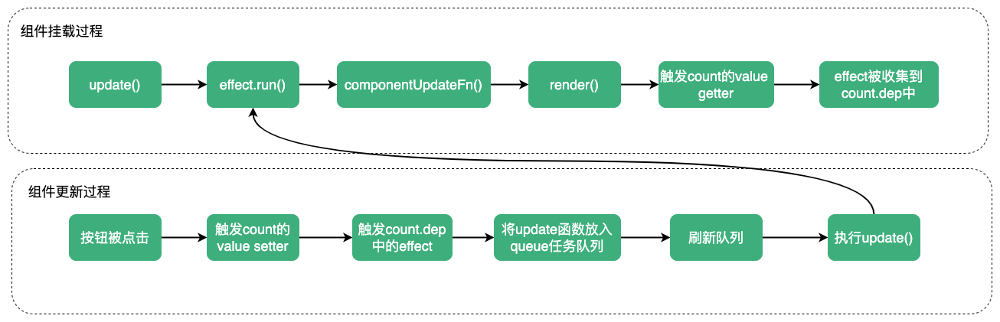

现在我们了解了组件时如何被更新的，接下来，我们看下组件实际的更新过程。

## 组件更新过程

组件的更新会继续执行`componentUpdateFn`函数，我们继续从`componentUpdateFn`看：

```ts
const componentUpdateFn = () => {
  if (!instance.isMounted) {
    // ...
  } else { // 组件的更新
    let { next, bu, u, parent, vnode } = instance
    let originNext = next
    let vnodeHook: VNodeHook | null | undefined
    if (__DEV__) {
      pushWarningContext(next || instance.vnode)
    }

    // 在生命周期前挂钩期间不允许组件effect递归
    toggleRecurse(instance, false)
    
    if (next) { // 存在待更新的vnode（来自父组件的更新）
      next.el = vnode.el
      updateComponentPreRender(instance, next, optimized)
    } else {
      next = vnode
    }

    // 执行beforeUpdate钩子
    if (bu) {
      invokeArrayFns(bu)
    }
    // 执行onVnodeBeforeUpdate钩子
    if ((vnodeHook = next.props && next.props.onVnodeBeforeUpdate)) {
      invokeVNodeHook(vnodeHook, parent, next, vnode)
    }
    // 执行hook:beforeUpdate钩子
    if (
      __COMPAT__ &&
      isCompatEnabled(DeprecationTypes.INSTANCE_EVENT_HOOKS, instance)
    ) {
      instance.emit('hook:beforeUpdate')
    }
    // 恢复组件effect递归状态
    toggleRecurse(instance, true)

    // render
    if (__DEV__) {
      startMeasure(instance, `render`)
    }
    // 组件渲染函数渲染的最新vnode
    const nextTree = renderComponentRoot(instance)
    if (__DEV__) {
      endMeasure(instance, `render`)
    }
    const prevTree = instance.subTree
    // 更新组件的subTree为最新的vnode
    instance.subTree = nextTree

    if (__DEV__) {
      startMeasure(instance, `patch`)
    }
    // 调用patch更新
    patch(
      prevTree,
      nextTree,
      // 旧DOM的父节点
      hostParentNode(prevTree.el!)!,
      // 锚点
      getNextHostNode(prevTree),
      instance,
      parentSuspense,
      isSVG
    )
    if (__DEV__) {
      endMeasure(instance, `patch`)
    }
    next.el = nextTree.el
    if (originNext === null) {
      // self-triggered update. In case of HOC, update parent component
      // vnode el. HOC is indicated by parent instance's subTree pointing
      // to child component's vnode
      updateHOCHostEl(instance, nextTree.el)
    }
    // 将updated、onVnodeUpdated、hook:updated钩子放到后置任务队列
    if (u) {
      queuePostRenderEffect(u, parentSuspense)
    }
    // onVnodeUpdated
    if ((vnodeHook = next.props && next.props.onVnodeUpdated)) {
      queuePostRenderEffect(
        () => invokeVNodeHook(vnodeHook!, parent, next!, vnode),
        parentSuspense
      )
    }
    if (
      __COMPAT__ &&
      isCompatEnabled(DeprecationTypes.INSTANCE_EVENT_HOOKS, instance)
    ) {
      queuePostRenderEffect(
        () => instance.emit('hook:updated'),
        parentSuspense
      )
    }

    if (__DEV__ || __FEATURE_PROD_DEVTOOLS__) {
      devtoolsComponentUpdated(instance)
    }

    if (__DEV__) {
      popWarningContext()
    }
  }
}
```

当组件被挂载后，其组件实例的`isMounted`为`true`，所以在组件更新过程，就会进入`instance.isMount`分支。在更新时会先调用组件的一些更新前钩子`beforeUpdate`等，然后再调用`renderComponentRoot`方法获取最新的`vnode`，接着再调用`patch`，最后将更新后的一些钩子放到后置任务队列中。

对于上面的例子，通过`renderComponentRoot`执行`render`后，得到的最新的`vnode`的`type`为`Fragment`，这决定了在`patch`中进入哪个分支。

进入`patch`方法，根据`n2.type`的值，进入`Fragment`，执行`processFragment`。

### processFragment

```ts
const processFragment = (
  n1: VNode | null,
  n2: VNode,
  container: RendererElement,
  anchor: RendererNode | null,
  parentComponent: ComponentInternalInstance | null,
  parentSuspense: SuspenseBoundary | null,
  isSVG: boolean,
  slotScopeIds: string[] | null,
  optimized: boolean
) => {
  const fragmentStartAnchor = (n2.el = n1 ? n1.el : hostCreateText(''))!
  const fragmentEndAnchor = (n2.anchor = n1 ? n1.anchor : hostCreateText(''))!

  let { patchFlag, dynamicChildren, slotScopeIds: fragmentSlotScopeIds } = n2

  if (
    __DEV__ &&
    (isHmrUpdating || patchFlag & PatchFlags.DEV_ROOT_FRAGMENT)
  ) {
    patchFlag = 0
    optimized = false
    dynamicChildren = null
  }

  if (fragmentSlotScopeIds) {
    slotScopeIds = slotScopeIds
      ? slotScopeIds.concat(fragmentSlotScopeIds)
      : fragmentSlotScopeIds
  }

  if (n1 == null) {
    // ...
  } else {
    if (
      patchFlag > 0 &&
      patchFlag & PatchFlags.STABLE_FRAGMENT &&
      dynamicChildren &&
      n1.dynamicChildren
    ) { // patch block，由模板转成的render函数会生成block
      patchBlockChildren(
        n1.dynamicChildren,
        dynamicChildren,
        container,
        parentComponent,
        parentSuspense,
        isSVG,
        slotScopeIds
      )
      if (__DEV__ && parentComponent && parentComponent.type.__hmrId) {
        traverseStaticChildren(n1, n2)
      } else if (
        n2.key != null ||
        (parentComponent && n2 === parentComponent.subTree)
      ) {
        traverseStaticChildren(n1, n2, true /* shallow */)
      }
    } else { // 普通patch
      patchChildren(
        n1,
        n2,
        container,
        fragmentEndAnchor,
        parentComponent,
        parentSuspense,
        isSVG,
        slotScopeIds,
        optimized
      )
    }
  }
}
```

在`processFragment`中进入更新分支后，又分为两个分支：`block`分支及普通`patch`。其中`block`是用来处理`Block`节点的（被编译器编译后的`render`函数的返回值）。

此处由于我们使用`h`渲染函数进行的渲染，所以此处会进入`patchChildren`。

### patchChildren

`patchChildren`：
```ts
const patchChildren: PatchChildrenFn = (
  n1,
  n2,
  container,
  anchor,
  parentComponent,
  parentSuspense,
  isSVG,
  slotScopeIds,
  optimized = false
) => {
  const c1 = n1 && n1.children
  const prevShapeFlag = n1 ? n1.shapeFlag : 0
  const c2 = n2.children

  const { patchFlag, shapeFlag } = n2
  
  // 此分支用来处理Block
  // 对于渲染函数返回的vnode，patchFlag为0
  if (patchFlag > 0) {
    if (patchFlag & PatchFlags.KEYED_FRAGMENT) {
      patchKeyedChildren(
        c1 as VNode[],
        c2 as VNodeArrayChildren,
        container,
        anchor,
        parentComponent,
        parentSuspense,
        isSVG,
        slotScopeIds,
        optimized
      )
      return
    } else if (patchFlag & PatchFlags.UNKEYED_FRAGMENT) {
      // unkeyed
      patchUnkeyedChildren(
        c1 as VNode[],
        c2 as VNodeArrayChildren,
        container,
        anchor,
        parentComponent,
        parentSuspense,
        isSVG,
        slotScopeIds,
        optimized
      )
      return
    }
  }

  // children有三种可能：文本、数组或没有children
  // 新节点的children是文本
  if (shapeFlag & ShapeFlags.TEXT_CHILDREN) {
    // 如果旧节点的children是数组，会卸载旧节点的children
    if (prevShapeFlag & ShapeFlags.ARRAY_CHILDREN) {
      unmountChildren(c1 as VNode[], parentComponent, parentSuspense)
    }
    // 新旧子节点不一致，直接修改container的文本
    if (c2 !== c1) {
      hostSetElementText(container, c2 as string)
    }
  } else {
    if (prevShapeFlag & ShapeFlags.ARRAY_CHILDREN) { // 如果旧节点的children是数组
      if (shapeFlag & ShapeFlags.ARRAY_CHILDREN) { // 新节点的children也是数组
        // two arrays, cannot assume anything, do full diff
        patchKeyedChildren(
          c1 as VNode[],
          c2 as VNodeArrayChildren,
          container,
          anchor,
          parentComponent,
          parentSuspense,
          isSVG,
          slotScopeIds,
          optimized
        )
      } else { // 没有新的children，卸载旧vnode的children
        unmountChildren(c1 as VNode[], parentComponent, parentSuspense, true)
      }
    } else {
      // prev children was text OR null
      // new children is array OR null
      if (prevShapeFlag & ShapeFlags.TEXT_CHILDREN) { // 旧节点的children是文本，直接设置为空字符串
        hostSetElementText(container, '')
      }
      // 挂载新节点children
      if (shapeFlag & ShapeFlags.ARRAY_CHILDREN) {
        mountChildren(
          c2 as VNodeArrayChildren,
          container,
          anchor,
          parentComponent,
          parentSuspense,
          isSVG,
          slotScopeIds,
          optimized
        )
      }
    }
  }
}
```

`patchChildren`中，首先判断如果新节点的`patchFlag > 0`并且新节点的`children`在`Fragment`中，则会按新旧节点`children`都为数组处理。

如果新节点`children`为文本，旧节点`children`为数组时，则需要卸载旧节点的`chidlren`，否则直接更新`container`的文本为新节点的`children`即可。

如果旧节点`children`是数组，新节点`children`也是数组，则调用`patchKeyedChildren`进行全量`diff`；如果新节点没有`children`，直接卸载旧节点`chidlren`即可。

如果旧节点`children`为空或文本，那么设置`container`内容为空即可；如果新节点`children`树数组，则需要挂载新节点的`children`。

`patchChildren`流程：

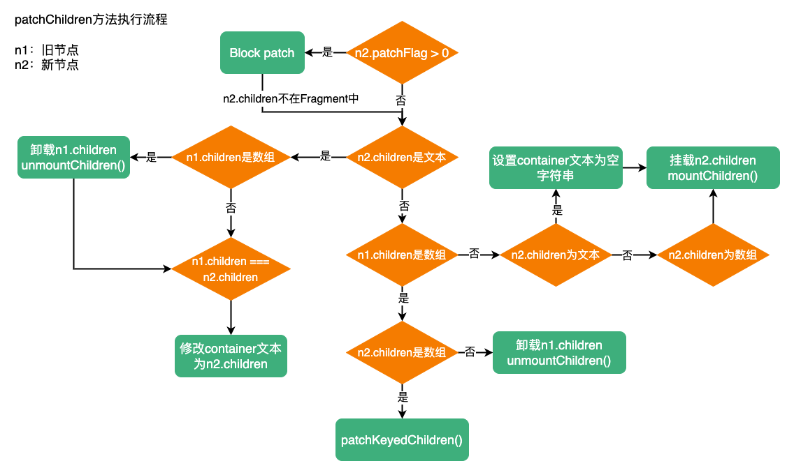

回到上面的例子中，进入`patchChildren`后，由于`n1`和`n2`的`children`都是数组，所以会调用`patchKeyedChildren`进行子节点的全量`patch`。

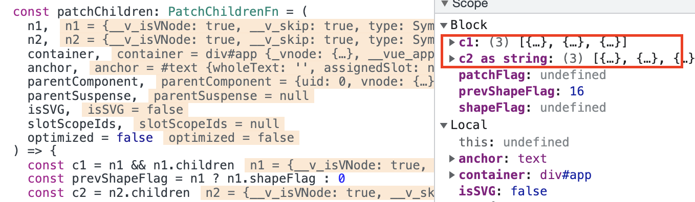

进入`patchKeyedChildren`就是核心的`Diff`过程了，这里对`Diff`算法单独开启了一篇文章，请参考：[vue3 Diff算法](https://maxlz1.github.io/blog/vue3-analysis/renderer/diff.html)。

这里针对该示例，简单描述一下`Diff`过程。

在`patchKeyedChildren`中，处理前置节点时，`c1`与`c2`中新旧节点进行对位`patch`，即`patch(c1[0], c2[0])`、`patch(c1[1], c2[1])`、`patch(c1[2], c2[2])`。

`patch(c1[0], c2[0])`的过程，由于`c2[0].shapeFlag = ShapeFlag.ELEMENT | ShapeFlag.TEXT_CHILDREN`，所以进入`processElement`，在`processElement`由于`n1`不为空，所以执行`patchElement`。

### patchElement

`patchElement`处理新旧HTML节点之间的更新。

```ts
const patchElement = (
  n1: VNode,
  n2: VNode,
  parentComponent: ComponentInternalInstance | null,
  parentSuspense: SuspenseBoundary | null,
  isSVG: boolean,
  slotScopeIds: string[] | null,
  optimized: boolean
) => {
  // 复用旧节点的DOM
  const el = (n2.el = n1.el!)
  let { patchFlag, dynamicChildren, dirs } = n2
  // #1426 take the old vnode's patch flag into account since user may clone a
  // compiler-generated vnode, which de-opts to FULL_PROPS
  // n2可能是通过n1克隆来的，cloneVnode的过程，如果传入额外的props，会使patchFlag中添加PatchFlags.FULL_PROPS
  // 所以这里判断如果旧节点中存在PatchFlags.FULL_PROPS，则添加PatchFlags.FULL_PROPS
  patchFlag |= n1.patchFlag & PatchFlags.FULL_PROPS
  const oldProps = n1.props || EMPTY_OBJ
  const newProps = n2.props || EMPTY_OBJ
  let vnodeHook: VNodeHook | undefined | null

  // disable recurse in beforeUpdate hooks
  parentComponent && toggleRecurse(parentComponent, false)
  
  // 执行新节点的onVnodeBeforeUpdate钩子
  if ((vnodeHook = newProps.onVnodeBeforeUpdate)) {
    invokeVNodeHook(vnodeHook, parentComponent, n2, n1)
  }
  // 执行新节点的指令中的beforeUpdate钩子
  if (dirs) {
    invokeDirectiveHook(n2, n1, parentComponent, 'beforeUpdate')
  }
  parentComponent && toggleRecurse(parentComponent, true)

  if (__DEV__ && isHmrUpdating) {
    patchFlag = 0
    optimized = false
    dynamicChildren = null
  }

  const areChildrenSVG = isSVG && n2.type !== 'foreignObject'
  // 如果存在dynamicChildren执行patchBlockChildren
  // 否则如果optimized为false执行patchChildren
  if (dynamicChildren) {
    patchBlockChildren(
      n1.dynamicChildren!,
      dynamicChildren,
      el,
      parentComponent,
      parentSuspense,
      areChildrenSVG,
      slotScopeIds
    )
    if (__DEV__ && parentComponent && parentComponent.type.__hmrId) {
      traverseStaticChildren(n1, n2)
    }
  } else if (!optimized) {
    patchChildren(
      n1,
      n2,
      el,
      null,
      parentComponent,
      parentSuspense,
      areChildrenSVG,
      slotScopeIds,
      false
    )
  }

  // 开始更新props
  // 快速路径
  if (patchFlag > 0) {
    // 节点存在动态的key需要调用patchProps进行全量diff
    if (patchFlag & PatchFlags.FULL_PROPS) {
      patchProps(
        el,
        n2,
        oldProps,
        newProps,
        parentComponent,
        parentSuspense,
        isSVG
      )
    } else {
      // 更新 class
      if (patchFlag & PatchFlags.CLASS) {
        if (oldProps.class !== newProps.class) {
          hostPatchProp(el, 'class', null, newProps.class, isSVG)
        }
      }

      // 更新style
      if (patchFlag & PatchFlags.STYLE) {
        hostPatchProp(el, 'style', oldProps.style, newProps.style, isSVG)
      }

      // 更新除了class、style的其他props，不包括动态key
      if (patchFlag & PatchFlags.PROPS) {
        // dynamicProps中保存着哪些key是动态属性
        const propsToUpdate = n2.dynamicProps!
        for (let i = 0; i < propsToUpdate.length; i++) {
          const key = propsToUpdate[i]
          const prev = oldProps[key]
          const next = newProps[key]
          // 新旧节点props[key]不同或key是value时进行props的更新
          if (next !== prev || key === 'value') {
            hostPatchProp(
              el,
              key,
              prev,
              next,
              isSVG,
              n1.children as VNode[],
              parentComponent,
              parentSuspense,
              unmountChildren
            )
          }
        }
      }
    }

    // 更新text
    if (patchFlag & PatchFlags.TEXT) {
      // 新旧节点children不同才会更新
      if (n1.children !== n2.children) {
        hostSetElementText(el, n2.children as string)
      }
    }
  } else if (!optimized && dynamicChildren == null) { // 非优化模式，props进行全量diff
    patchProps(
      el,
      n2,
      oldProps,
      newProps,
      parentComponent,
      parentSuspense,
      isSVG
    )
  }

  // 将一些更新后需要触发的钩子放到
  // 注意这里没有组件的update钩子，因为在patchElement中处理的HTML节点，不是组件
  if ((vnodeHook = newProps.onVnodeUpdated) || dirs) {
    queuePostRenderEffect(() => {
      vnodeHook && invokeVNodeHook(vnodeHook, parentComponent, n2, n1)
      dirs && invokeDirectiveHook(n2, n1, parentComponent, 'updated')
    }, parentSuspense)
  }
}
```

`patchElement`主要包含四个步骤：
1. 触发`onVnodeBeforeUpdate`和指令的`beforeUpdate`钩子函数
2. `patch`孩子节点 
3. 更新`props`。如果`patchFlag > 0`，会进入快速路径，根据`patchFlag`更新对应的`props`；否则进行`props`全量`diff`。
4. 将`onVnodeUpdated`和指令的`updated`函数方到后置任务队列

### patchProps

`patchProps`会对新旧节点的`props`进行全量的`diff`。

```ts
const patchProps = (
  el: RendererElement,
  vnode: VNode,
  oldProps: Data,
  newProps: Data,
  parentComponent: ComponentInternalInstance | null,
  parentSuspense: SuspenseBoundary | null,
  isSVG: boolean
) => {
  // 新旧props不相等时才会更新
  if (oldProps !== newProps) { 
    // 遍历新props的key
    for (const key in newProps) {
      // 空字符串及一些key、ref、onVnodeBeforeMount等内置props跳过更新
      if (isReservedProp(key)) continue
      const next = newProps[key]
      const prev = oldProps[key]
      // 新旧props值不同并且key不等于value
      // 延迟更新value
      if (next !== prev && key !== 'value') {
        hostPatchProp(
          el,
          key,
          prev,
          next,
          isSVG,
          vnode.children as VNode[],
          parentComponent,
          parentSuspense,
          unmountChildren
        )
      }
    }
    if (oldProps !== EMPTY_OBJ) {
      // 遍历旧节点，移除不在新props中的属性
      for (const key in oldProps) {
        if (!isReservedProp(key) && !(key in newProps)) {
          hostPatchProp(
            el,
            key,
            oldProps[key],
            null,
            isSVG,
            vnode.children as VNode[],
            parentComponent,
            parentSuspense,
            unmountChildren
          )
        }
      }
    }
    // 更新value
    if ('value' in newProps) {
      hostPatchProp(el, 'value', oldProps.value, newProps.value)
    }
  }
}
```

回到示例中，此时进入`patchElement`的新旧节点分别为`{type:'button', children: 'add count'}`、`{type:'button', children: 'add count'}`，新节点中并不存在`dynamicChildren`属性，所以继续`patchChildren`，在`patchChildren`中根据新节点`shapeFlags`属性，需要更新节点的文本内容，但因为`button`内容其实未发生变化，所以不会发生更新操作。`patch(c1[0], c2[0])`中没有发生任何更新。

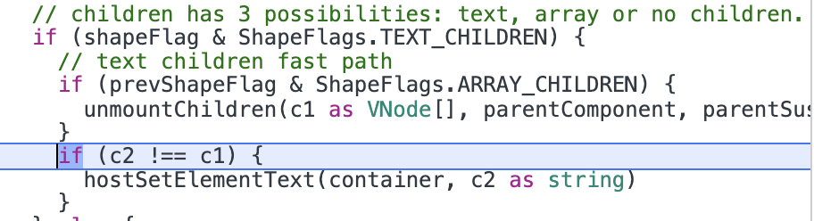

`patch(c1[1], c2[1])`和`patch(c1[0], c2[0])`是相同的，只不过这一次新旧节点的`children`不同了，所以这次会更新`div`的内容为`1`。

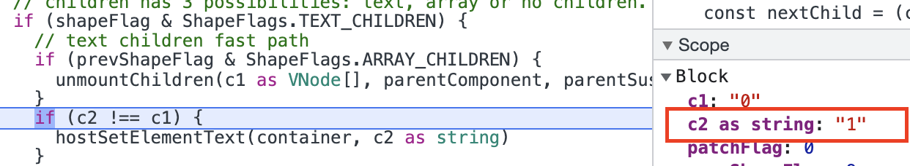

`patch(c1[2], c2[2])`和`patch(c1[0], c2[0])`相同，不会发生更新。

至此，`DOM`的内容更新到最新状态。

## 使用template模板

前面`counter`中我们使用`setup`返回渲染函数来渲染组件，如果我们改用`template`，更新流程是否和使用渲染函数一致呢？下面我们使用`template`替换渲染函数，再分析更新流程。

<iframe
  src="https://codesandbox.io/embed/modest-sound-e4cs2o?fontsize=14&hidenavigation=1&theme=dark"
  style="width:100%; height:500px; border:0; border-radius: 4px; overflow:hidden;"
  title="modest-sound-e4cs2o"
  allow="accelerometer; ambient-light-sensor; camera; encrypted-media; geolocation; gyroscope; hid; microphone; midi; payment; usb; vr; xr-spatial-tracking"
  sandbox="allow-forms allow-modals allow-popups allow-presentation allow-same-origin allow-scripts">
</iframe>

和使用渲染函数一样，在点击按钮后，同样会调用通过编译器生成的渲染函数，生成最新的`vnode`（这里其实是个`Block`），然后进行新旧`vnode`的`patch`

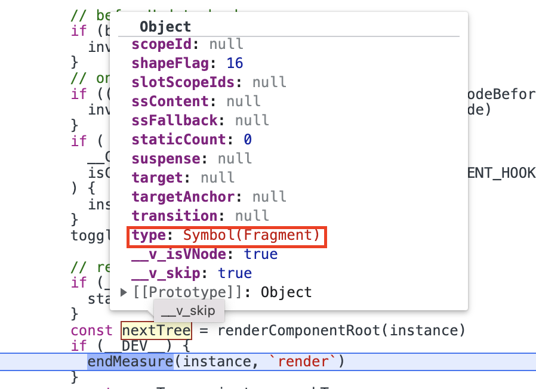

在进入`patch`后，因为新`vnode`的`type`为`Fragment`，所以进入`processFragment`。进入`processFragment`后，由于新节点的`patchFlag`为`PatchFlag.STABLE_FRAGMENT`，并且新旧节点都存在`dynamicChildren`属性，所以会执行`patchBlockChildren`方法。

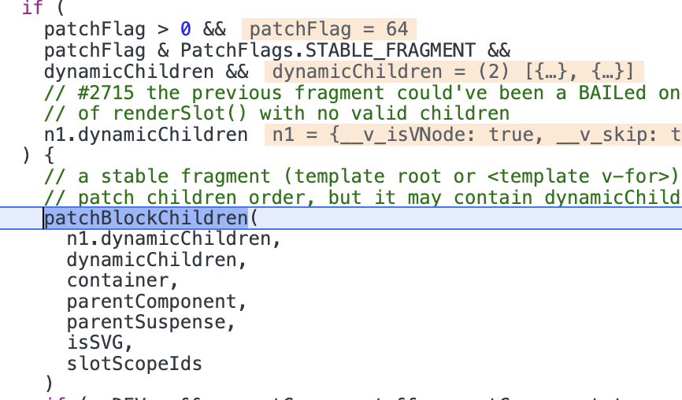

此时`n1.dynamicChildren`与`n2.dynamicChildren`中都有两个动态节点（第二个`div`中没有动态内容，所以不会被收集到`dynamicChildren`中）。分别为`button`与第一个`div`。

### patchBlockChildren

```ts
const patchBlockChildren: PatchBlockChildrenFn = (
  oldChildren,
  newChildren,
  fallbackContainer,
  parentComponent,
  parentSuspense,
  isSVG,
  slotScopeIds
) => {
  for (let i = 0; i < newChildren.length; i++) {
    const oldVNode = oldChildren[i]
    const newVNode = newChildren[i]
    // 确定需要打补丁的容器
    const container =
      // oldVNode may be an errored async setup() component inside Suspense
      // which will not have a mounted element
      oldVNode.el &&
      // - In the case of a Fragment, we need to provide the actual parent
      // of the Fragment itself so it can move its children.
      (oldVNode.type === Fragment ||
        // - In the case of different nodes, there is going to be a replacement
        // which also requires the correct parent container
        !isSameVNodeType(oldVNode, newVNode) ||
        // - In the case of a component, it could contain anything.
        oldVNode.shapeFlag & (ShapeFlags.COMPONENT | ShapeFlags.TELEPORT))
        ? hostParentNode(oldVNode.el)!
        : // In other cases, the parent container is not actually used so we
          // just pass the block element here to avoid a DOM parentNode call.
          fallbackContainer
    patch(
      oldVNode,
      newVNode,
      container,
      null,
      parentComponent,
      parentSuspense,
      isSVG,
      slotScopeIds,
      true
    )
  }
}
```

`patchBlockChildren`中会遍历`dynamicChildren`，进行对位`patch`。

`patch(oldButton, newButton)`、`patch(oldDiv, newDiv)`的过程和使用`h`渲染函数时是一致的，这里就不再细述了。

你会发现但当我们改用`template`替换渲染函数后，第二个`div`并没有经过`patch`。这就是`vue3`编译器优化的效果。`template`经过编译器编译的渲染函数中，生成的组件的根节点是个`Block`，`Block`中的`dynamicChildren`包含了子代所有的动态节点，在发生更新操作时，直接`patch` `dynamicChildren`中的动态节点，避免了静态节点之间的`patch`。

对于`Block`的介绍，可以参考：[Block](https://maxlz1.github.io/blog/vue3-analysis/renderer/block.html)

## 子组件如何触发更新？

下面我们在`counter`中添加一个子组件`ComA`，它接收一个`count`，当点击按钮，子组件也会进行更新，接下来看下子组件是如何触发更新。

<iframe
  src="https://codesandbox.io/embed/compassionate-marco-kwhsb5?fontsize=14&hidenavigation=1&theme=dark"
  style="width:100%; height:500px; border:0; border-radius: 4px; overflow:hidden;"
  title="counter-com"
  allow="accelerometer; ambient-light-sensor; camera; encrypted-media; geolocation; gyroscope; hid; microphone; midi; payment; usb; vr; xr-spatial-tracking"
  sandbox="allow-forms allow-modals allow-popups allow-presentation allow-same-origin allow-scripts" />

`ComA`对应的`vnode`在`patch`阶段会进入`shapeFlag & ShapeFlags.COMPONENT`分支执行`processComponent`方法。

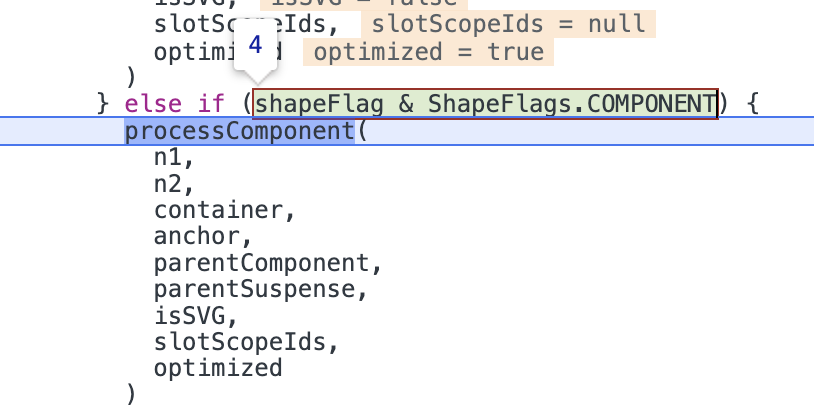

在`processComponent`中因为新旧节点不为空，所以执行`updateComponent`。

### updateComponent

```ts
const updateComponent = (n1: VNode, n2: VNode, optimized: boolean) => {
  const instance = (n2.component = n1.component)!
  // 组件需要更新
  if (shouldUpdateComponent(n1, n2, optimized)) {
    if (
      __FEATURE_SUSPENSE__ &&
      instance.asyncDep &&
      !instance.asyncResolved
    ) { // Suspense更新
      if (__DEV__) {
        pushWarningContext(n2)
      }
      updateComponentPreRender(instance, n2, optimized)
      if (__DEV__) {
        popWarningContext()
      }
      return
    } else {
      // 使instance.next指向新节点
      instance.next = n2
      // 如果更新函数已经在队列中了，需要从队列中删除（前提是位置在当前正在执行的任务之后）
      invalidateJob(instance.update)
      // 执行组件实例的更新函数
      instance.update()
    }
  } else { // 组件不需要更新
    // 将旧节点的el复制给新节点
    n2.el = n1.el
    // 将instance.vnode指向新节点
    instance.vnode = n2
  }
}
```

在`updateComponent`中首先要利用`shouldUpdateComponent`检查组件是否需要更新。如果组件不需要更新，只需将旧节点的`el`替换新节点的`el`，然后将组件实例的`vnode`指向最新的节点即可。如果组件需要更新，则会分两种情况：`Suspense`更新、普通组件更新。

对于`Suspense`组件的更新，会调用`updateComponentPreRender`方法，普通组件的更新会调用组件实例的`update`函数，即组件的更新函数。

<details>
  <summary><code>shouldUpdateComponent</code>源码</summary>

```ts
export function shouldUpdateComponent(
  prevVNode: VNode,
  nextVNode: VNode,
  optimized?: boolean
): boolean {
  const { props: prevProps, children: prevChildren, component } = prevVNode
  const { props: nextProps, children: nextChildren, patchFlag } = nextVNode
  const emits = component!.emitsOptions
  
  if (__DEV__ && (prevChildren || nextChildren) && isHmrUpdating) {
    return true
  }

  // vnode中存在运行时指令或transition强制刷新
  if (nextVNode.dirs || nextVNode.transition) {
    return true
  }

  // 优化模式并且新节点patchFlag大于等于0
  if (optimized && patchFlag >= 0) {
    // 动态的插槽需要更新
    if (patchFlag & PatchFlags.DYNAMIC_SLOTS) {
      return true
    }
    // props具有动态的key
    if (patchFlag & PatchFlags.FULL_PROPS) {
      // 如果旧节点不存在props，是否更新取决于新节点中是否存在props
      if (!prevProps) {
        return !!nextProps
      }
      // 新旧节点都存在props，对比props中的每个key
      return hasPropsChanged(prevProps, nextProps!, emits)
    }
    
    // 具有动态的非style、class props
    else if (patchFlag & PatchFlags.PROPS) {
      // 遍历dynamicProps，检查是否有属性变化
      // dynamicProps中保存了哪些属性是动态的
      const dynamicProps = nextVNode.dynamicProps!
      for (let i = 0; i < dynamicProps.length; i++) {
        const key = dynamicProps[i]
        if (
          nextProps![key] !== prevProps![key] &&
          !isEmitListener(emits, key)
        ) {
          return true
        }
      }
    }
  }
  
  // 此分支使用手动渲染函数所产生的vnode
  else {
    // 如果旧节点存在children或新节点存在children
    if (prevChildren || nextChildren) {
      // 新节点不存在children或新节点存在children但不是稳定的
      if (!nextChildren || !(nextChildren as any).$stable) {
        return true
      }
    }
    // 新旧props相同，则不需要更新
    if (prevProps === nextProps) {
      return false
    }
    // 如果旧节点不存在props，是否更新取决于新节点中是否存在props
    if (!prevProps) {
      return !!nextProps
    }
    // 旧节点存在props，新节点不存在props，需要更新
    if (!nextProps) {
      return true
    }
    return hasPropsChanged(prevProps, nextProps, emits)
  }

  return false
}
```
</details>

回到示例中，在使用`shouldUpdateComponent`函数检查是否需要更新组件时，因为旧`props.key`为`0`，而新`props.key`为`1`，所以组件需要更新。

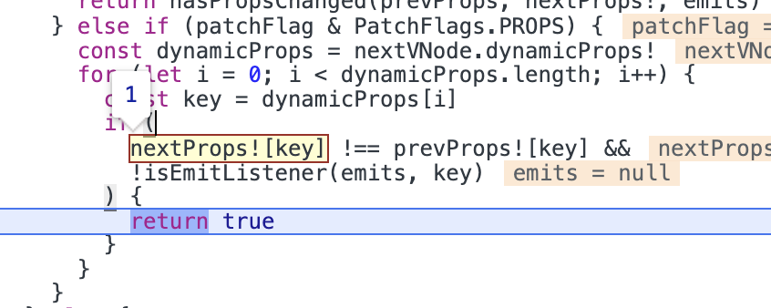

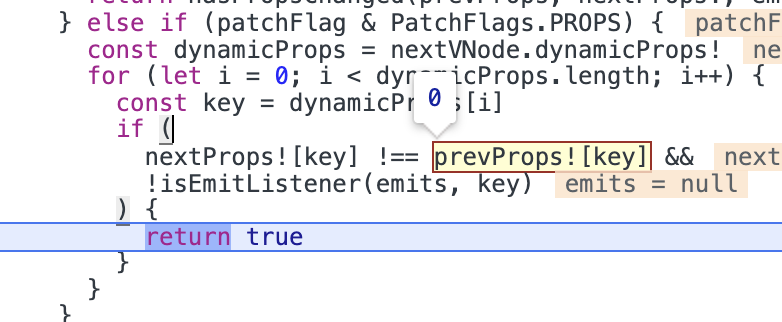

所以在`updateComponent`中会调用`instance.update`函数进行更新。

综上可以看出，子组件是否需要更新，取决于子组件中是否存在自定义的指令或`transition`或子组件中的`props`是否发生变化。


## Teleport的更新

```ts
export const TeleportImpl = {
  __isTeleport: true,
  process(
    n1: TeleportVNode | null,
    n2: TeleportVNode,
    container: RendererElement,
    anchor: RendererNode | null,
    parentComponent: ComponentInternalInstance | null,
    parentSuspense: SuspenseBoundary | null,
    isSVG: boolean,
    slotScopeIds: string[] | null,
    optimized: boolean,
    internals: RendererInternals
  ) {
    const {
      mc: mountChildren,
      pc: patchChildren,
      pbc: patchBlockChildren,
      o: { insert, querySelector, createText, createComment }
    } = internals

    const disabled = isTeleportDisabled(n2.props)
    let { shapeFlag, children, dynamicChildren } = n2

    if (__DEV__ && isHmrUpdating) {
      optimized = false
      dynamicChildren = null
    }

    if (n1 == null) {
      // ...
    } else {
      // update content
      n2.el = n1.el
      const mainAnchor = (n2.anchor = n1.anchor)!
      const target = (n2.target = n1.target)!
      const targetAnchor = (n2.targetAnchor = n1.targetAnchor)!
      // 旧节点中是否已经被禁用
      const wasDisabled = isTeleportDisabled(n1.props)
      const currentContainer = wasDisabled ? container : target
      const currentAnchor = wasDisabled ? mainAnchor : targetAnchor
      isSVG = isSVG || isTargetSVG(target)

      if (dynamicChildren) {
        patchBlockChildren(
          n1.dynamicChildren!,
          dynamicChildren,
          currentContainer,
          parentComponent,
          parentSuspense,
          isSVG,
          slotScopeIds
        )
        // 即使在block tree模式下
        // 我们也需要确保传送中的所有根级节点都继承以前的 DOM 引用
        // 以便它们可以在未来的补丁中移动。
        traverseStaticChildren(n1, n2, true)
      } else if (!optimized) {
        patchChildren(
          n1,
          n2,
          currentContainer,
          currentAnchor,
          parentComponent,
          parentSuspense,
          isSVG,
          slotScopeIds,
          false
        )
      }
      // 如果新节点中已经被禁用
      if (disabled) {
        // 旧节点中未被禁用
        if (!wasDisabled) {
          // 由启用到禁用
          // 移动到container中
          moveTeleport(
            n2,
            container,
            mainAnchor,
            internals,
            TeleportMoveTypes.TOGGLE
          )
        }
      }
      // 新节点中启用状态
      else {
        // target改变
        if ((n2.props && n2.props.to) !== (n1.props && n1.props.to)) {
          const nextTarget = (n2.target = resolveTarget(
            n2.props,
            querySelector
          ))
          // 移动到新的target中
          if (nextTarget) {
            moveTeleport(
              n2,
              nextTarget,
              null,
              internals,
              TeleportMoveTypes.TARGET_CHANGE
            )
          } else if (__DEV__) {
            warn(
              'Invalid Teleport target on update:',
              target,
              `(${typeof target})`
            )
          }
        }
        // target未改变，但旧节点中是禁用状态
        else if (wasDisabled) {
          // 禁用变为启用
          // 移动到target中
          moveTeleport(
            n2,
            target,
            targetAnchor,
            internals,
            TeleportMoveTypes.TOGGLE
          )
        }
      }
    }
  }
  
  // ...
}
```

`Teleport`的更新主要包含两步：

1. `patch`孩子节点
2. 如果`disabled`状态改变或`to`的目标改变，需要移动`DOM`到目标节点中

## Suspense的更新

<details>
<summary><code>patchSuspense</code></summary>

```ts
function patchSuspense(
  n1: VNode,
  n2: VNode,
  container: RendererElement,
  anchor: RendererNode | null,
  parentComponent: ComponentInternalInstance | null,
  isSVG: boolean,
  slotScopeIds: string[] | null,
  optimized: boolean,
  { p: patch, um: unmount, o: { createElement } }: RendererInternals
) {
  const suspense = (n2.suspense = n1.suspense)!
  suspense.vnode = n2
  n2.el = n1.el
  const newBranch = n2.ssContent!
  const newFallback = n2.ssFallback!

  const { activeBranch, pendingBranch, isInFallback, isHydrating } = suspense
  // 存在正在等待的分支
  if (pendingBranch) {
    // 将suspense.pendingBranch设置为新的content
    suspense.pendingBranch = newBranch
    // 如果新旧pendingBranch类型相同，则进行patch
    if (isSameVNodeType(newBranch, pendingBranch)) {
      // same root type but content may have changed.
      patch(
        pendingBranch,
        newBranch,
        suspense.hiddenContainer,
        null,
        parentComponent,
        suspense,
        isSVG,
        slotScopeIds,
        optimized
      )
      // 如果异步依赖全部加载完成，则可以直接解析suspense内容
      if (suspense.deps <= 0) {
        suspense.resolve()
      } else if (isInFallback) { // 在fallback状态，将activeBranch与新节点的ssFallback进行patch
        patch(
          activeBranch,
          newFallback,
          container,
          anchor,
          parentComponent,
          null, // fallback tree will not have suspense context
          isSVG,
          slotScopeIds,
          optimized
        )
        setActiveBranch(suspense, newFallback)
      }
    }
    // 如果新旧pendingBranch类型不同
    else {
      // toggled before pending tree is resolved
      suspense.pendingId++
      if (isHydrating) {
        suspense.isHydrating = false
        suspense.activeBranch = pendingBranch
      } else {
        // 卸载旧的pendingBranch
        unmount(pendingBranch, parentComponent, suspense)
      }
      // 重置异步依赖数量为0
      suspense.deps = 0
      // 丢弃来自pending branch的effects
      suspense.effects.length = 0
      // 使用一个新的div替换旧的hiddenContainer
      suspense.hiddenContainer = createElement('div')

      // 已经在fallback状态，挂载新节点的conent到suspense.hiddenContainer
      if (isInFallback) {
        // already in fallback state
        patch(
          null,
          newBranch,
          suspense.hiddenContainer,
          null,
          parentComponent,
          suspense,
          isSVG,
          slotScopeIds,
          optimized
        )
        // 如果不存在异步依赖，可以直接解析suspense内容
        if (suspense.deps <= 0) {
          suspense.resolve()
        } else { // 否则将新节点的fallback与activeBranch进行patch
          patch(
            activeBranch,
            newFallback,
            container,
            anchor,
            parentComponent,
            null, // fallback tree will not have suspense context
            isSVG,
            slotScopeIds,
            optimized
          )
          setActiveBranch(suspense, newFallback)
        }
      }
      // 存在激活分支并且激活分支与新content类型相同，进行patch
      else if (activeBranch && isSameVNodeType(newBranch, activeBranch)) {
        // toggled "back" to current active branch
        patch(
          activeBranch,
          newBranch,
          container,
          anchor,
          parentComponent,
          suspense,
          isSVG,
          slotScopeIds,
          optimized
        )
        // force resolve
        suspense.resolve(true)
      } else {
        // switched to a 3rd branch
        patch(
          null,
          newBranch,
          suspense.hiddenContainer,
          null,
          parentComponent,
          suspense,
          isSVG,
          slotScopeIds,
          optimized
        )
        if (suspense.deps <= 0) {
          suspense.resolve()
        }
      }
    }
  }
  
  // 不存在正在等待的分支
  else {
    // 存在激活分支并且新的content和激活分支类型相同，将两者进行patch
    if (activeBranch && isSameVNodeType(newBranch, activeBranch)) {
      // root did not change, just normal patch
      patch(
        activeBranch,
        newBranch,
        container,
        anchor,
        parentComponent,
        suspense,
        isSVG,
        slotScopeIds,
        optimized
      )
      setActiveBranch(suspense, newBranch)
    } 
    
    else {
      // root node toggled
      // 触发n2的onPending
      triggerEvent(n2, 'onPending')
      // mount pending branch in off-dom container
      suspense.pendingBranch = newBranch
      suspense.pendingId++
      // 挂载新的content到suspense.hiddenContainer中
      patch(
        null,
        newBranch,
        suspense.hiddenContainer,
        null,
        parentComponent,
        suspense,
        isSVG,
        slotScopeIds,
        optimized
      )
      // 不存在异步依赖，直接解析suspense
      if (suspense.deps <= 0) {
        // incoming branch has no async deps, resolve now.
        suspense.resolve()
      } else {
        const { timeout, pendingId } = suspense
        if (timeout > 0) {
          setTimeout(() => {
            if (suspense.pendingId === pendingId) {
              suspense.fallback(newFallback)
            }
          }, timeout)
        } else if (timeout === 0) {
          suspense.fallback(newFallback)
        }
      }
    }
  }
}
```
</details>


## 总结

当组件内某些响应式状态发生变化后，会触发`instance.update`，由渲染函数生成一个最新的`vnode`。接着调用`patch`方法对新旧节点进行打补丁。

组件更新流程图：

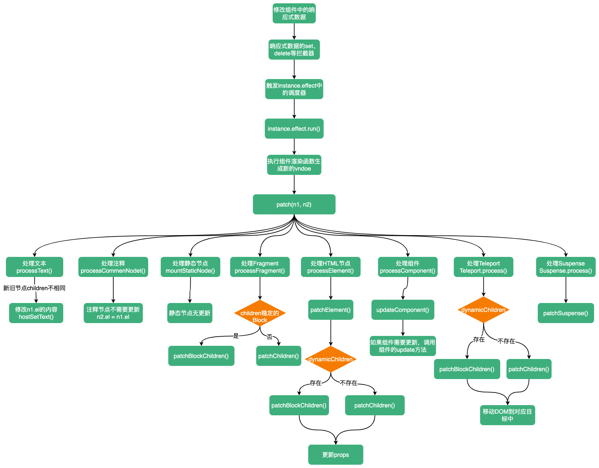
