# Diff算法

在了解`Diff`算法前，我们应该先知道以下概念：

- 虚拟`DOM`：也叫`vnode`/`vdom`。用来代替`DOM`，以表示出整个`DOM`结构。
- `patch`：组件更新过程可以看做往旧的`DOM`中进行打补丁，这个过程可以称为`patch`（其中也会包含挂载过程，挂载过程是一种特殊的`patch`）。
- `patchFlag`和`shapeFlag`：虚拟`DOM`中两个比较重要的属性。[vnode中的shapeFlag和patchFlag](https://maxlz1.github.io/blog/vue3-analysis/renderer/shapeFlagAndPatchFlag.html)
- 最长递增子序列：[维基百科](https://zh.wikipedia.org/wiki/最长递增子序列)、[百度百科](https://baike.baidu.com/item/最长递增子序列)

## 什么是Diff算法？

**Diff 算法**简单来说就是在更新操作时，找到新旧`vnode`的不同，进而实现更新。例如下面这个例子：

<iframe 
  src="https://codesandbox.io/embed/pedantic-cloud-ot6hcu?fontsize=14&hidenavigation=1&theme=dark"
  style="width:100%; height:500px; border:0; border-radius: 4px; overflow:hidden;"
  title="pedantic-cloud-ot6hcu"
  allow="accelerometer; ambient-light-sensor; camera; encrypted-media; geolocation; gyroscope; hid; microphone; midi; payment; usb; vr; xr-spatial-tracking"
  sandbox="allow-forms allow-modals allow-popups allow-presentation allow-same-origin allow-scripts">
</iframe>

当我们点击按钮，`count`加1，这时就会产生一个新的`vnode`，我们需要在这个新的`vnode`与旧的`vnode`间找到差异，并用新的`vnode`中的信息去覆盖这个差异，这个过程就可以称为**Diff**。

这里我们使用两个`vnode`简单模拟下上述按钮点击后的更新过程，首先是用两个`vnode`表示新旧`DOM`结构：

```ts
const oldVnode = {
  type: Fragment,
  children: [
    { type: 'button', children: 'add count' },
    { type: 'div', children: '0' },
  ],
}

const newVnode = {
  type: Fragment,
  children: [
    { type: 'button', children: 'add count' },
    { type: 'div', children: '1' },
  ],
}
```

现在我们要找出`oldVnode`与`newVnode`之前的差异。作为人类我们可以很直观的找出`oldVnode`与`newVnode`的`children`中的`type`为`div`的`children`不同，但计算机并不具备这种能力，我们需要设计一种算法找出这个差异。

简单的方式，我们可能想到递归遍历这两个`vnode`，进行同层比较即可。对于这个简单例子来说，可以用这种方式很方便快速的找出差异，但往往实际开发`vnode`往往是既复杂且层级很深，当使用这种递归方式寻找差异就显得笨拙且低效了。

下面我们看下`vue3`的`Diff`算法的实现。

## Diff算法流程

在介绍`Diff`算法之前，我们要先知道`patch`方法。`vue3`中有个方法`patch`，每次发生更新（挂载）操作都会调用该方法，它的的作用就是根据新节点的一些信息，进入某一个专门处理某一类节点的分支中。例如上面的例子中根据`newVnode.type`的值，就会进入专门处理`Fragment`节点的分支中。

```ts
const patch: PatchFn = (
  n1,
  n2,
  container,
  anchor = null,
  parentComponent = null,
  parentSuspense = null,
  isSVG = false,
  slotScopeIds = null,
  optimized = __DEV__ && isHmrUpdating ? false : !!n2.dynamicChildren
) => {
  if (n1 === n2) {
    return
  }

  // patching & not same type, unmount old tree
  if (n1 && !isSameVNodeType(n1, n2)) {
    anchor = getNextHostNode(n1)
    unmount(n1, parentComponent, parentSuspense, true)
    n1 = null
  }

  if (n2.patchFlag === PatchFlags.BAIL) {
    optimized = false
    n2.dynamicChildren = null
  }

  const { type, ref, shapeFlag } = n2
  switch (type) {
    case Text:
      processText(n1, n2, container, anchor)
      break
    case Comment:
      processCommentNode(n1, n2, container, anchor)
      break
    case Static:
      if (n1 == null) {
        mountStaticNode(n2, container, anchor, isSVG)
      } else if (__DEV__) {
        patchStaticNode(n1, n2, container, isSVG)
      }
      break
    case Fragment:
      processFragment(
        n1,
        n2,
        container,
        anchor,
        parentComponent,
        parentSuspense,
        isSVG,
        slotScopeIds,
        optimized
      )
      break
    default:
      if (shapeFlag & ShapeFlags.ELEMENT) {
        processElement(
          n1,
          n2,
          container,
          anchor,
          parentComponent,
          parentSuspense,
          isSVG,
          slotScopeIds,
          optimized
        )
      } else if (shapeFlag & ShapeFlags.COMPONENT) {
        processComponent(
          n1,
          n2,
          container,
          anchor,
          parentComponent,
          parentSuspense,
          isSVG,
          slotScopeIds,
          optimized
        )
      } else if (shapeFlag & ShapeFlags.TELEPORT) {
        ;(type as typeof TeleportImpl).process(
          n1 as TeleportVNode,
          n2 as TeleportVNode,
          container,
          anchor,
          parentComponent,
          parentSuspense,
          isSVG,
          slotScopeIds,
          optimized,
          internals
        )
      } else if (__FEATURE_SUSPENSE__ && shapeFlag & ShapeFlags.SUSPENSE) {
        ;(type as typeof SuspenseImpl).process(
          n1,
          n2,
          container,
          anchor,
          parentComponent,
          parentSuspense,
          isSVG,
          slotScopeIds,
          optimized,
          internals
        )
      } else if (__DEV__) {
        warn('Invalid VNode type:', type, `(${typeof type})`)
      }
  }

  // set ref
  if (ref != null && parentComponent) {
    setRef(ref, n1 && n1.ref, parentSuspense, n2 || n1, !n2)
  }
}
```

`patch`方法这里就不做详细描述了，其逻辑比较简单。

`Diff`算法重点作用在`vnode`列表之间查找差异，如`oldVnode.children`与`newVnode.children`之间。`vue3`中，寻找着两组节点之间的差异会通过一个`patchChildren`方法。

### patchChildren

其中参数`n1`为旧`vnode`，`n2`为新`vnode`。

<details>
  <summary><code>patchChildren</code>完整代码</summary>

```ts
const patchChildren: PatchChildrenFn = (
  n1,
  n2,
  container,
  anchor,
  parentComponent,
  parentSuspense,
  isSVG,
  slotScopeIds,
  optimized = false
) => {
  const c1 = n1 && n1.children
  const prevShapeFlag = n1 ? n1.shapeFlag : 0
  const c2 = n2.children

  const { patchFlag, shapeFlag } = n2
  // fast path
  if (patchFlag > 0) {
    if (patchFlag & PatchFlags.KEYED_FRAGMENT) {
      // this could be either fully-keyed or mixed (some keyed some not)
      // presence of patchFlag means children are guaranteed to be arrays
      patchKeyedChildren(
        c1 as VNode[],
        c2 as VNodeArrayChildren,
        container,
        anchor,
        parentComponent,
        parentSuspense,
        isSVG,
        slotScopeIds,
        optimized
      )
      return
    } else if (patchFlag & PatchFlags.UNKEYED_FRAGMENT) {
      // unkeyed
      patchUnkeyedChildren(
        c1 as VNode[],
        c2 as VNodeArrayChildren,
        container,
        anchor,
        parentComponent,
        parentSuspense,
        isSVG,
        slotScopeIds,
        optimized
      )
      return
    }
  }

  // children has 3 possibilities: text, array or no children.
  if (shapeFlag & ShapeFlags.TEXT_CHILDREN) {
    // text children fast path
    if (prevShapeFlag & ShapeFlags.ARRAY_CHILDREN) {
      unmountChildren(c1 as VNode[], parentComponent, parentSuspense)
    }
    if (c2 !== c1) {
      hostSetElementText(container, c2 as string)
    }
  } else {
    if (prevShapeFlag & ShapeFlags.ARRAY_CHILDREN) {
      // prev children was array
      if (shapeFlag & ShapeFlags.ARRAY_CHILDREN) {
        // two arrays, cannot assume anything, do full diff
        patchKeyedChildren(
          c1 as VNode[],
          c2 as VNodeArrayChildren,
          container,
          anchor,
          parentComponent,
          parentSuspense,
          isSVG,
          slotScopeIds,
          optimized
        )
      } else {
        // no new children, just unmount old
        unmountChildren(c1 as VNode[], parentComponent, parentSuspense, true)
      }
    } else {
      // prev children was text OR null
      // new children is array OR null
      if (prevShapeFlag & ShapeFlags.TEXT_CHILDREN) {
        hostSetElementText(container, '')
      }
      // mount new if array
      if (shapeFlag & ShapeFlags.ARRAY_CHILDREN) {
        mountChildren(
          c2 as VNodeArrayChildren,
          container,
          anchor,
          parentComponent,
          parentSuspense,
          isSVG,
          slotScopeIds,
          optimized
        )
      }
    }
  }
}
```
</details>

`patchChildren`中首先会判断新节点的`patchFlag`是否大于0，如果大于0，此时就会进入一个**快速路径**，在快速路径中会直接根据`patchFlag`属性决定执行`patchUnkeyedChildren`还是`patchKeyedChildren`，而不会向下面代码那样先比较两个`vnode`的类型，再决定执行什么操作。

这里有两个方法`patchKeyedChildren`与`patchUnkeyedChildren`。你会发现在快速路径中如果`patchFlag`是`PatchFlags.KEYED_FRAGMENT`会执行`patchKeyedChildren`，而如果`patchFlag`是`PatchFlags.UNKEYED_FRAGMENT`则会执行`patchUnkeyedChildren`。在比较两个`vnode`类型时，如果新旧节点的`children`都是数组，则会执行`patchKeyedChildren`方法。

### patchUnkeyedChildren

`patchUnkeyedChildren`主要用于使用`v-for`时未设置`key`值而生成的`vnode`。如：

```vue
<template>
  <span v-for="item in data">{{ item }}</span>
</template>
```

上述代码经过编译后，`vnode.patchFlag`为`PatchFlags.UNKEYED_FRAGMENT`，如果`data`发生更新，在`patchChildren`中则会执行`patchUnkeyedChildren`方法进行更新。

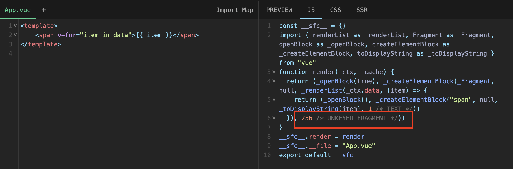

接下来我们看下`patchUnkeyedChildren`是如何进行`patch`的。

```ts
const patchUnkeyedChildren = (
  c1: VNode[],
  c2: VNodeArrayChildren,
  container: RendererElement,
  anchor: RendererNode | null,
  parentComponent: ComponentInternalInstance | null,
  parentSuspense: SuspenseBoundary | null,
  isSVG: boolean,
  slotScopeIds: string[] | null,
  optimized: boolean
) => {
  c1 = c1 || EMPTY_ARR
  c2 = c2 || EMPTY_ARR
  const oldLength = c1.length
  const newLength = c2.length
  const commonLength = Math.min(oldLength, newLength)
  let i
  // 对位patch
  // 例如：
  // 旧：a b c
  // 新：d e
  // patch(a, d)，patch(b, e)
  for (i = 0; i < commonLength; i++) {
    // 如果开启优化，调用cloneIfMounted进行克隆
    // 否则调用normalizeVNode对c2[i]进行标准化
    // cloneIfMounted：如果节点el为空或存在memo，child不变，否则克隆child
    const nextChild = (c2[i] = optimized
      ? cloneIfMounted(c2[i] as VNode)
      : normalizeVNode(c2[i]))
    // 对位patch
    patch(
      c1[i],
      nextChild,
      container,
      null,
      parentComponent,
      parentSuspense,
      isSVG,
      slotScopeIds,
      optimized
    )
  }
  // 卸载多余的旧节点
  // 例如：
  // 旧：a b c
  // 新：d f
  // 当遍历完公共的部分后，需要卸载c
  if (oldLength > newLength) {
    // remove old
    unmountChildren(
      c1,
      parentComponent,
      parentSuspense,
      true,
      false,
      commonLength
    )
  } else {
    // 挂载多余的新节点
    // 例如：
    // 旧：a b
    // 新：d f e
    // 当遍历完公共的部分后，需要挂载e
    mountChildren(
      c2,
      container,
      anchor,
      parentComponent,
      parentSuspense,
      isSVG,
      slotScopeIds,
      optimized,
      commonLength
    )
  }
}
```

`patchUnkeyedChildren`的`patch`流程：
1. 对位`patch`新旧节点列表公共部分（索引1对1，,2对2）
2. 如果旧节点列表长度大于新节点列表长度，卸载旧节点列表中多余的节点，否则挂载新节点列表中多余的节点

### patchKeyedChildren

`patchKeyedChildren`主要应用于使用`v-for`时设置了`key`值而生成的`vnode`，或普通`vnode`列表（未经过模板编译所产生的的`vnode`）。这也正是真正的`Diff`算法。

<details>
  <summary><code>patchKeyedChildren</code>完整代码</summary>

```ts
const patchKeyedChildren = (
  c1: VNode[],
  c2: VNodeArrayChildren,
  container: RendererElement,
  parentAnchor: RendererNode | null,
  parentComponent: ComponentInternalInstance | null,
  parentSuspense: SuspenseBoundary | null,
  isSVG: boolean,
  slotScopeIds: string[] | null,
  optimized: boolean
) => {
  let i = 0
  const l2 = c2.length
  let e1 = c1.length - 1 // prev ending index
  let e2 = l2 - 1 // next ending index

  // 1.处理公共前置vnode
  // (a b) c
  // (a b) d e
  while (i <= e1 && i <= e2) {
    const n1 = c1[i]
    const n2 = (c2[i] = optimized
      ? cloneIfMounted(c2[i] as VNode)
      : normalizeVNode(c2[i]))
    if (isSameVNodeType(n1, n2)) {
      patch(
        n1,
        n2,
        container,
        null,
        parentComponent,
        parentSuspense,
        isSVG,
        slotScopeIds,
        optimized
      )
    } else {
      break
    }
    i++
  }

  // 2. 处理公共后置vnode
  // a (b c)
  // d e (b c)
  while (i <= e1 && i <= e2) {
    const n1 = c1[e1]
    const n2 = (c2[e2] = optimized
      ? cloneIfMounted(c2[e2] as VNode)
      : normalizeVNode(c2[e2]))
    if (isSameVNodeType(n1, n2)) {
      patch(
        n1,
        n2,
        container,
        null,
        parentComponent,
        parentSuspense,
        isSVG,
        slotScopeIds,
        optimized
      )
    } else {
      break
    }
    e1--
    e2--
  }

  // 3. 如果此时i>e1，说明旧节点列表已经遍历完了，那么如果还存在未遍历的新节点，需要挂载这些新节点
  // (a b)
  // (a b) c
  // i = 2, e1 = 1, e2 = 2
  // (a b)
  // c (a b)
  // i = 0, e1 = -1, e2 = 0
  if (i > e1) {
    if (i <= e2) {
      const nextPos = e2 + 1
      const anchor = nextPos < l2 ? (c2[nextPos] as VNode).el : parentAnchor
      while (i <= e2) {
        patch(
          null,
          (c2[i] = optimized
            ? cloneIfMounted(c2[i] as VNode)
            : normalizeVNode(c2[i])),
          container,
          anchor,
          parentComponent,
          parentSuspense,
          isSVG,
          slotScopeIds,
          optimized
        )
        i++
      }
    }
  }

  // 4. 同理，当i > e2，说明新节点列表已经遍历完了，那么此时如果还存在未遍历过的旧节点，需要卸载这些旧节点
  // (a b) c
  // (a b)
  // i = 2, e1 = 2, e2 = 1
  // a (b c)
  // (b c)
  // i = 0, e1 = 0, e2 = -1
  else if (i > e2) {
    while (i <= e1) {
      unmount(c1[i], parentComponent, parentSuspense, true)
      i++
    }
  }

  // 如果不满足3、4，则进入该分支
  // [i ... e1 + 1]: a b [c d e] f g
  // [i ... e2 + 1]: a b [e d c h] f g
  // i = 2, e1 = 4, e2 = 5
  else {
    const s1 = i // prev starting index
    const s2 = i // next starting index

    // 遍历未遍历过的新节点列表，并将新节点的key、index存放到一个map对象中
    const keyToNewIndexMap: Map<string | number | symbol, number> = new Map()
    for (i = s2; i <= e2; i++) {
      const nextChild = (c2[i] = optimized
        ? cloneIfMounted(c2[i] as VNode)
        : normalizeVNode(c2[i]))
      if (nextChild.key != null) {
        if (__DEV__ && keyToNewIndexMap.has(nextChild.key)) {
          warn(
            `Duplicate keys found during update:`,
            JSON.stringify(nextChild.key),
            `Make sure keys are unique.`
          )
        }
        keyToNewIndexMap.set(nextChild.key, i)
      }
    }

    let j
    let patched = 0 // 已经被patch节点的数量
    const toBePatched = e2 - s2 + 1 // 新节点列表中需要被patch的个数
    let moved = false // 是否存在节点移动
    let maxNewIndexSoFar = 0 // 用于确定是否存在节点移动
    // 新节点在旧节点中的索引
    // key为新节点索引（从0开始），value为旧节点索引+1
    // 如果value为0，说明新节点中没有对应的旧节点
    // 该数组会被用于确定最长递增序列
    const newIndexToOldIndexMap = new Array(toBePatched)
    for (i = 0; i < toBePatched; i++) newIndexToOldIndexMap[i] = 0

    for (i = s1; i <= e1; i++) {
      const prevChild = c1[i]
      // 如果patch的节点数大于等于新节点列表中需要被patch的数量，那么此时prevChild是多余的，只需要将其进行卸载，并进入下一个vnode的处理过程即可
      if (patched >= toBePatched) {
        unmount(prevChild, parentComponent, parentSuspense, true)
        continue
      }
      // 获取旧节点对应的新节点在新节点列表中的索引
      let newIndex
      if (prevChild.key != null) { // 旧节点key不为null，根据key获取在新节点列表中的索引
        newIndex = keyToNewIndexMap.get(prevChild.key)
      } else { // 旧节点key为null，则在新节点列表中获取相同type且无key的新节点
        for (j = s2; j <= e2; j++) {
          if (
            newIndexToOldIndexMap[j - s2] === 0 &&
            isSameVNodeType(prevChild, c2[j] as VNode)
          ) {
            newIndex = j
            break
          }
        }
      }
      // 如果新节点列表索引为undefined，说明没有找到对应的新节点，那么此时卸载旧节点
      if (newIndex === undefined) {
        unmount(prevChild, parentComponent, parentSuspense, true)
      } else { // 存在对应新节点
        // 设置newIndexToOldIndexMap
        newIndexToOldIndexMap[newIndex - s2] = i + 1
        // 如果新索引大于maxNewIndexSoFar，将newIndex作为最新的maxNewIndexSoFar
        // 否则意味着新节点需要被移动
        if (newIndex >= maxNewIndexSoFar) {
          maxNewIndexSoFar = newIndex
        } else {
          moved = true
        }
        patch(
          prevChild,
          c2[newIndex] as VNode,
          container,
          null,
          parentComponent,
          parentSuspense,
          isSVG,
          slotScopeIds,
          optimized
        )
        patched++
      }
    }
    
    // 如果节点需要被移动，则需要根据newIndexToOldIndexMap获取旧节点索引的最长递增序列(increasingNewIndexSequence中保存的是索引)
    const increasingNewIndexSequence = moved
      ? getSequence(newIndexToOldIndexMap)
      : EMPTY_ARR
    // j指向最长递增序列的最后一个位置
    j = increasingNewIndexSequence.length - 1
    // looping backwards so that we can use last patched node as anchor
    for (i = toBePatched - 1; i >= 0; i--) {
      const nextIndex = s2 + i
      const nextChild = c2[nextIndex] as VNode
      const anchor =
        nextIndex + 1 < l2 ? (c2[nextIndex + 1] as VNode).el : parentAnchor
      // 如果不存在对应旧节点，说明nextChild是个新节点，那么需要挂载
      if (newIndexToOldIndexMap[i] === 0) {
        patch(
          null,
          nextChild,
          container,
          anchor,
          parentComponent,
          parentSuspense,
          isSVG,
          slotScopeIds,
          optimized
        )
      } else if (moved) { // 需要移动
        // j < 0 或i不等于increasingNewIndexSequence[j]说明节点需要移动
        if (j < 0 || i !== increasingNewIndexSequence[j]) {
          move(nextChild, container, anchor, MoveType.REORDER)
        } else {
          j--
        }
      }
    }
  }
}
```
</details>

`Diff`的流程可以分为三大步：

- 预处理，该步主要处理相同的前置与后置节点
- 判断是否存在移动的节点
- 如果存在移动的节点进行移动

接下来我们使用一个小例子来分步骤详细看下`Diff`流程：

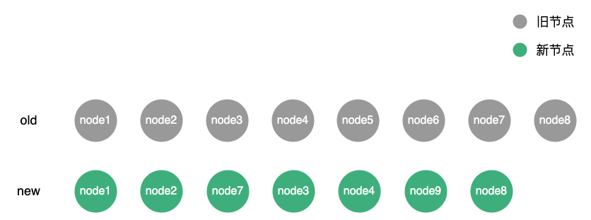

#### 预处理

预处理阶段，相同的前置节点与后置节点，因为这类节点的顺序不会发生改变，所以不用判断是否移动，直接进行`patch`即可。这里的相同指的是`vnode.type`与`vnode.key`一致。

首先，定义四个变量：`i`（指向新旧两组节点的起始索引）、`l2`（新节点的长度）、`e1`（旧节点的结尾索引）、`e2`（新节点的结尾索引）
```ts
let i = 0 // 新旧两组节点的起始索引
const l2 = c2.length // 新节点的长度
let e1 = c1.length - 1 // 旧节点的结尾索引
let e2 = l2 - 1 // 新节点的结尾索引
```

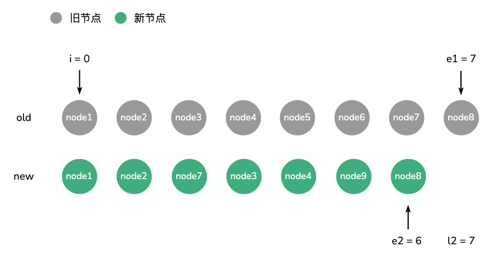

然后先从前向后遍历，如果对应节点相同，`i`加1，直到对应节点不同，退出遍历。接着从后向前遍历，如果对应节点相同，将`e1`与`e2`同时减1，直到对应节点不同。
```ts
// 处理前置节点
while (i <= e1 && i <= e2) {
  const n1 = c1[i]
  const n2 = (c2[i] = optimized
    ? cloneIfMounted(c2[i] as VNode)
    : normalizeVNode(c2[i]))
  if (isSameVNodeType(n1, n2)) {
    patch(
      n1,
      n2,
      container,
      null,
      parentComponent,
      parentSuspense,
      isSVG,
      slotScopeIds,
      optimized
    )
  } else {
    break
  }
  i++
}

// 处理后置节点
while (i <= e1 && i <= e2) {
  const n1 = c1[e1]
  const n2 = (c2[e2] = optimized
    ? cloneIfMounted(c2[e2] as VNode)
    : normalizeVNode(c2[e2]))
  if (isSameVNodeType(n1, n2)) {
    patch(
      n1,
      n2,
      container,
      null,
      parentComponent,
      parentSuspense,
      isSVG,
      slotScopeIds,
      optimized
    )
  } else {
    break
  }
  e1--
  e2--
}
```

经过前置与后置处理后，节点状态如下图：

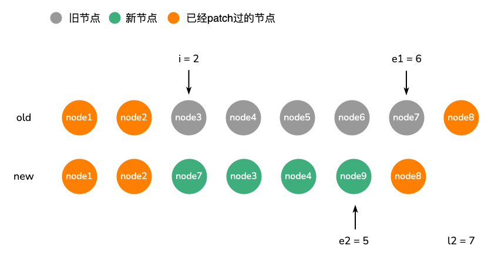

接着，如果此时`i > e1`，说明旧节点已经遍历完成，此时可能还存在剩余的新节点，对于这些新节点，我们需要挂载它们。同理，如果`i > e2`，说明新节点已经遍历完毕，对于剩余的旧节点，我们需要卸载它们。

```ts
if (i > e1) {
  // 挂载剩余的新节点
  if (i <= e2) {
    const nextPos = e2 + 1
    const anchor = nextPos < l2 ? (c2[nextPos] as VNode).el : parentAnchor
    while (i <= e2) {
      patch(
        null,
        (c2[i] = optimized
          ? cloneIfMounted(c2[i] as VNode)
          : normalizeVNode(c2[i])),
        container,
        anchor,
        parentComponent,
        parentSuspense,
        isSVG,
        slotScopeIds,
        optimized
      )
      i++
    }
  }
}

else if (i > e2) {
  // 卸载剩余的旧节点
  while (i <= e1) {
    unmount(c1[i], parentComponent, parentSuspense, true)
    i++
  }
}
```

在上述例子中，因为`i < e1 && i < e2`所以不会经历这个过程。下面使用两个简单例子简单介绍挂载和卸载的过程。

例一：

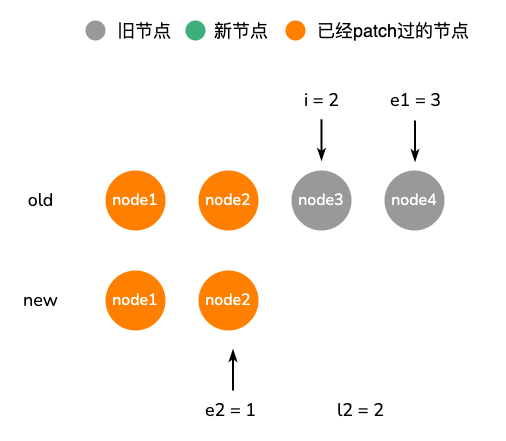

该例中，当处理完前置节点与后置节点，`i > e2`，此时`node3`与`node4`需要被卸载。

例二：

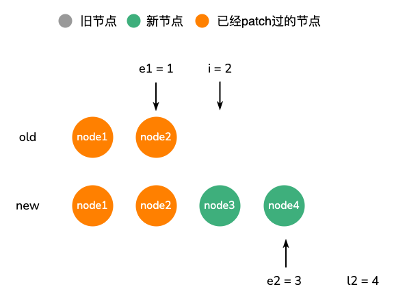

该例中，当处理完前置节点与后置节点，`i > e1`，此时`node3`与`node4`需要进行挂载。

到此，预处理的步骤就完成了。但对于`i < e1 && i < e2`的情况还没有就行处理，我们接着继续向下看。

#### 判断是否存在移动元素

对于`i < e1 && i < e2`的情况，过程会比较复杂，因为这些节点中可能存在需要移动、需要挂载、需要卸载等操作。

首先需要设置两个变量：`s1`（旧节点起始索引）、`s2`（新节点起始索引），并设置初始值为`i`。同时声明一个`Map`变量`keyToNewIndexMap`，用来存储新节点中的`key`与其索引的映射关系。
```ts
const s1 = i // 旧节点起始索引
const s2 = i // 新节点起始索引

// 构建一个map，这个map反映了新节点的key与其位置索引的映射
// key是新节点的key，value是新节点的索引
const keyToNewIndexMap: Map<string | number | symbol, number> = new Map()
for (i = s2; i <= e2; i++) {
  const nextChild = (c2[i] = optimized
    ? cloneIfMounted(c2[i] as VNode)
    : normalizeVNode(c2[i]))
  if (nextChild.key != null) {
    if (__DEV__ && keyToNewIndexMap.has(nextChild.key)) {
      warn(
        `Duplicate keys found during update:`,
        JSON.stringify(nextChild.key),
        `Make sure keys are unique.`
      )
    }
    keyToNewIndexMap.set(nextChild.key, i)
  }
}
```

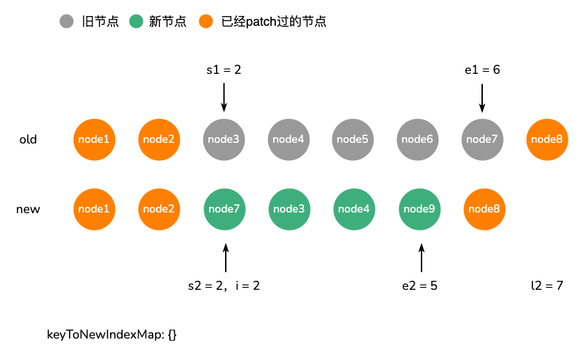

生成`keyToNewIndexMap`后的状态。

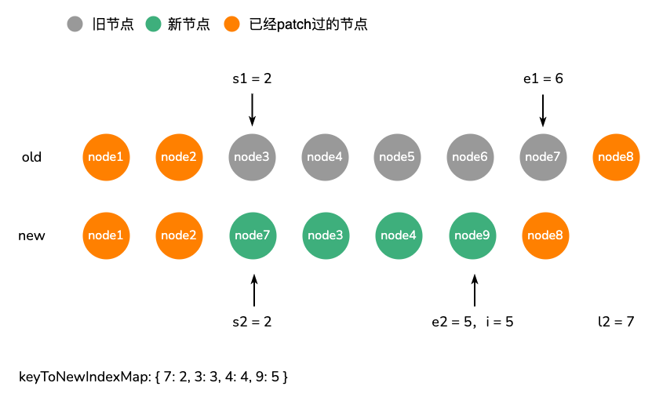

然后声明一些变量：`patched`（`s2`到`e2`之间已经被`patch`的节点数量）、`toBePatched`（`s2`到`e2`之间需要被`patch`的节点数量）、`moved`（是否存在节点移动）、`maxNewIndexSoFar`（用于确定是否存在节点移动）、`newIndexToOldIndexMap`（新节点在旧节点中的索引）

```ts
let j
let patched = 0 // 已经被patch节点的数量
const toBePatched = e2 - s2 + 1 // 新节点列表中需要被patch的个数
let moved = false // 是否存在节点移动
let maxNewIndexSoFar = 0 // 用于确定是否存在节点移动
// 新节点在旧节点中的索引
// key为新节点索引（从0开始），value为旧节点索引+1
// 如果value为0，说明新节点中没有对应的旧节点
// 该数组会被用于确定最长递增序列
const newIndexToOldIndexMap = new Array(toBePatched)
for (i = 0; i < toBePatched; i++) newIndexToOldIndexMap[i] = 0
```

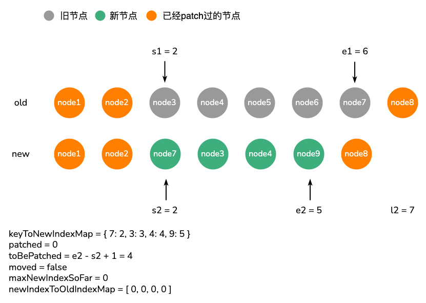

接着，需要遍历旧节点未`patch`的节点，进行同类型节点之间的`patch`，并判断是否存在需要移动的节点。

```ts
for (i = s1; i <= e1; i++) {
  const prevChild = c1[i]
  // 如果patch的节点数大于等于新节点列表中需要被patch的数量，那么此时prevChild是多余的，只需要将其进行卸载，并进入下一个vnode的处理过程即可
  if (patched >= toBePatched) {
    unmount(prevChild, parentComponent, parentSuspense, true)
    continue
  }
  // 获取旧节点对应的新节点在新节点列表中的索引
  let newIndex
  if (prevChild.key != null) { // 旧节点key不为null，根据key获取在新节点列表中的索引
    newIndex = keyToNewIndexMap.get(prevChild.key)
  } else { // 旧节点key为null，则在新节点列表中获取相同type且无key的新节点
    for (j = s2; j <= e2; j++) {
      if (
        newIndexToOldIndexMap[j - s2] === 0 &&
        isSameVNodeType(prevChild, c2[j] as VNode)
      ) {
        newIndex = j
        break
      }
    }
  }
  // 如果新节点列表索引为undefined，说明没有找到对应的新节点，那么此时卸载旧节点
  if (newIndex === undefined) {
    unmount(prevChild, parentComponent, parentSuspense, true)
  } else { // 存在对应新节点
    // 设置newIndexToOldIndexMap
    newIndexToOldIndexMap[newIndex - s2] = i + 1
    // 如果新索引大于maxNewIndexSoFar，将newIndex作为最新的maxNewIndexSoFar
    // 否则意味着新节点需要被移动
    if (newIndex >= maxNewIndexSoFar) {
      maxNewIndexSoFar = newIndex
    } else {
      moved = true
    }
    patch(
      prevChild,
      c2[newIndex] as VNode,
      container,
      null,
      parentComponent,
      parentSuspense,
      isSVG,
      slotScopeIds,
      optimized
    )
    patched++
  }
}
```

当`i = 2`时，`patched < toBePatched`，所以不会执行卸载操作；从`keyToNewIndexMap`获取旧节点在新节点列表中的索引`newIndex`为`3`；由于`newIndex`不为`undefined`，所以会将`newIndexToOldIndexMap[newIndex - s2]`，即`newIndexToOldIndexMap[1]`设置为`i + 1`；此时`newIndex > maxNewIndexSoFar`，更新`maxNewIndexSoFar`为`newIndex`；然后将新旧节点进行`patch`，同时`patched`加1。

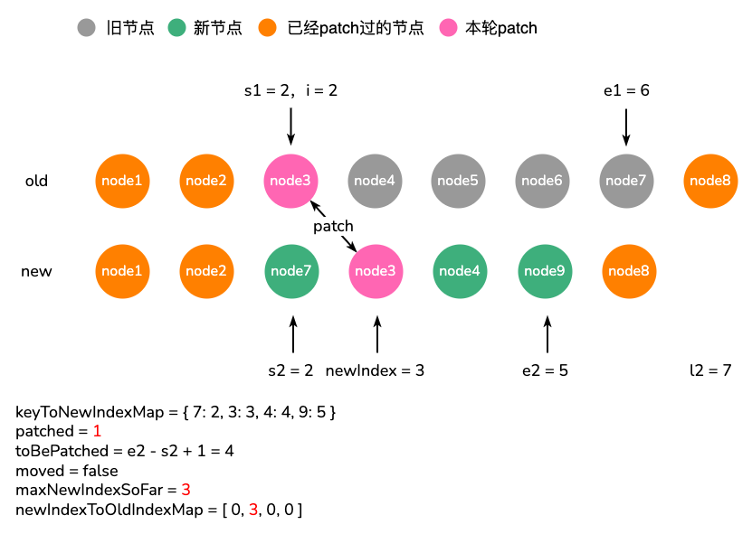

当`i = 3`时，与`i = 2`时步骤相同。

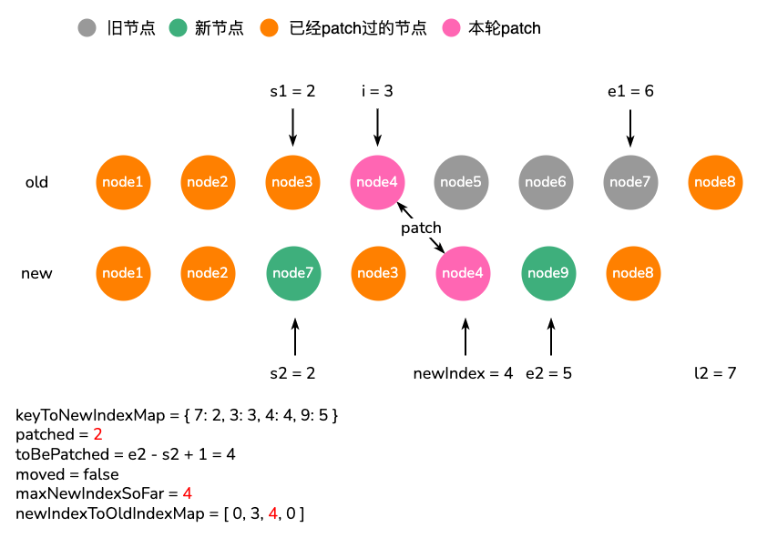

当`i = 4`时，由于从`keyToNewIndexMap`中无法获取对应新节点的索引，说明`node5`在新节点列表中是不存在的，那么调用`unmount`进行卸载。

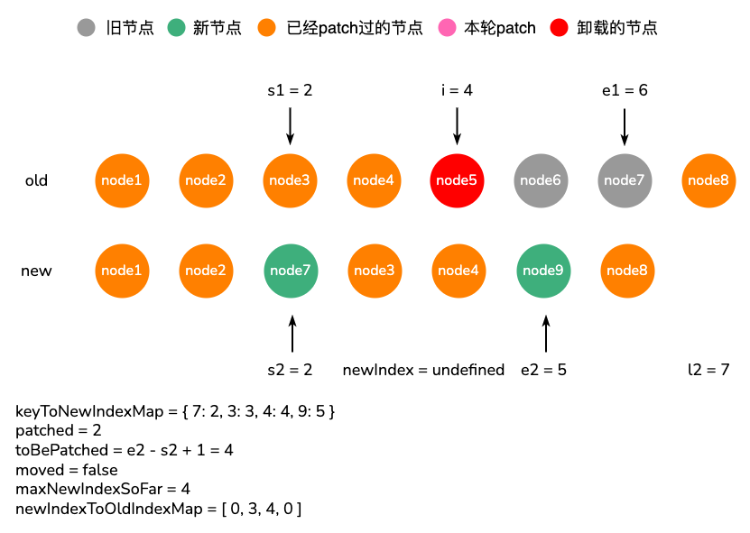

当`i = 5`时，过程与`i = 4`步骤相同。

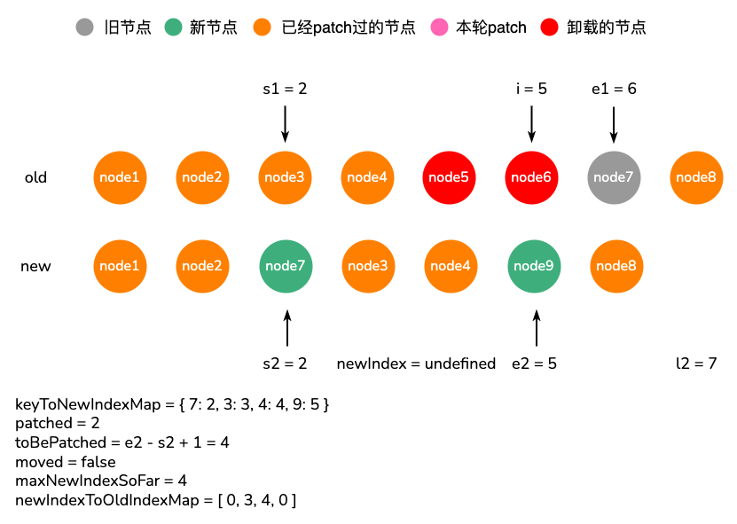

当`i = 6`时，从`keyToNewIndexMap`获取旧节点在新节点列表中的索引`newIndex`为`2`；由于`newIndex`不为`2`，所以会将`newIndexToOldIndexMap[newIndex - s2]`，即`newIndexToOldIndexMap[0]`设置为`7`；此时`newIndex < maxNewIndexSoFar`，`node7`需要移动，设置`moved`为`true`；然后将新旧节点进行`patch`，同时`patched`加1。

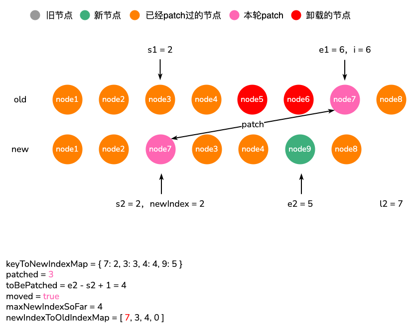

此时，我们发现新节点中有节点待挂载，而且存在节点需要移动。这时就需要进行移动并挂载剩余的新节点。

#### 移动与挂载节点

首先，如果存在节点移动，需要通过`newIndexToOldIndexMap`获取一个最大上升子序列，并使`j`指向这个序列的最后一个索引。
```ts
// 如果节点需要被移动，则需要根据newIndexToOldIndexMap获取旧节点索引的最长递增序列(increasingNewIndexSequence中保存的是索引)
const increasingNewIndexSequence = moved
  ? getSequence(newIndexToOldIndexMap)
  : EMPTY_ARR
// j指向最长递增序列的最后一个位置
j = increasingNewIndexSequence.length - 1
```

::: details 什么是最大上升子序列
最大上升子序列就是在一个序列内求出一段严格上升的子序列，即序列中的前一个数需要严格小于当前数。如`[5, 1, 9, 2, 8]`的最大上升子序列为`[1, 2, 8]`。

关于最大上升子序列，`vue3`中是通过`getSequence`方法实现。`getSequence`返回的是对应数字的索引，例如`[5, 1, 9, 2, 8]`返回的是`[1, 3, 4]`，`[1, 2, 8]`对应的索引。

```ts
function getSequence(arr: number[]): number[] {
  const p = arr.slice()
  const result = [0]
  let i, j, u, v, c
  const len = arr.length
  for (i = 0; i < len; i++) {
    const arrI = arr[i]
    if (arrI !== 0) {
      j = result[result.length - 1]
      if (arr[j] < arrI) {
        p[i] = j
        result.push(i)
        continue
      }
      u = 0
      v = result.length - 1
      while (u < v) {
        c = (u + v) >> 1
        if (arr[result[c]] < arrI) {
          u = c + 1
        } else {
          v = c
        }
      }
      if (arrI < arr[result[u]]) {
        if (u > 0) {
          p[i] = result[u - 1]
        }
        result[u] = i
      }
    }
  }
  u = result.length
  v = result[u - 1]
  while (u-- > 0) {
    result[u] = v
    v = p[v]
  }
  return result
}
```

以`[5, 1, 9, 2, 8]`为例，其过程如下：

初始状态：

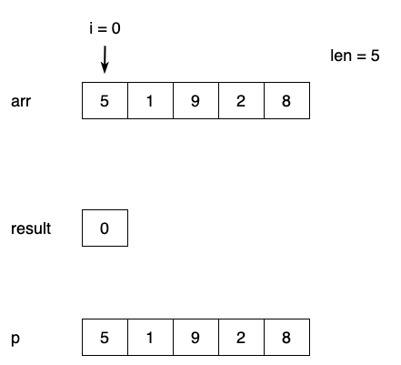

当`i = 0`时，`arrI !== 0`，令`j`指向`result`的最后一个值`0`；`arr[j] === arrI`，令`u = 0; v = 0`；因为`u === v`，跳过`while`；`arrI === arr[result[0]]`，进入下一个循环。

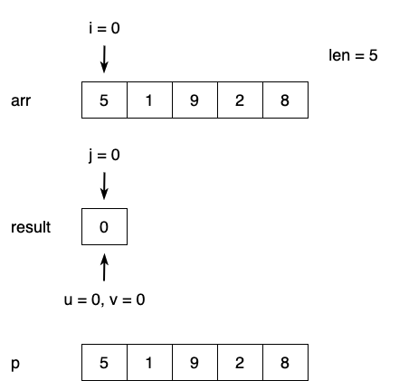

当`i = 1`时，`arrI !== 0`，令`j`指向`result`的最后一个值`0`；`arr[j] > arrI`，令`u = 0; v = 0`；因为`u === v`，跳过`while`；`arrI < arr[result[0]] && u = 0`，令`result[0] = 1`。

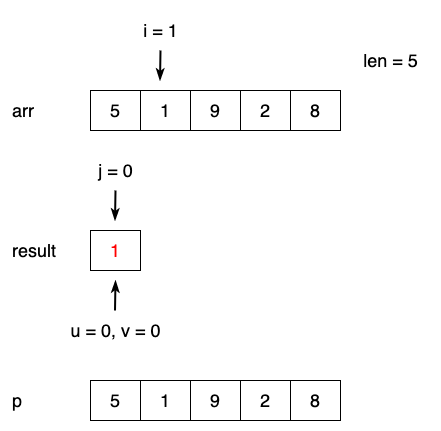

当`i = 2`时，`arrI !== 0`，令`j`指向`result`的最后一个值`1`；`arr[j] < arrI`，令`p[2] = 1`，将`2`放入`result`，进入下一个循环。

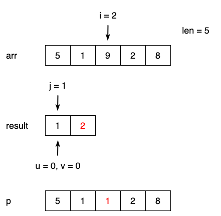

当`i = 3`时，`arrI !== 0`，令`j`指向`result`的最后一个值`2`；`arr[j] > arrI`，令`u = 0; v = 1`；经过`while`循环后，`u = 1; v = 1`；`arrI < arr[result[0]] && u > 0`，令`p[3] = result[0]`，`result[1] = 3`

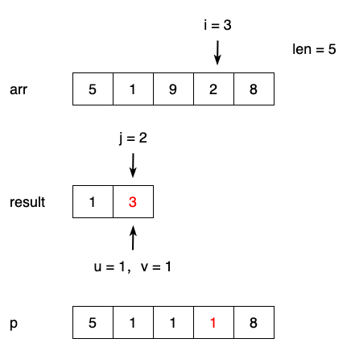

当`i = 4`时，`arrI !== 0`，令`j`指向`result`的最后一个值`3`；`arr[j] < arrI`，令`p[4] = 3`，将`4`放入`result`中；循环结束。

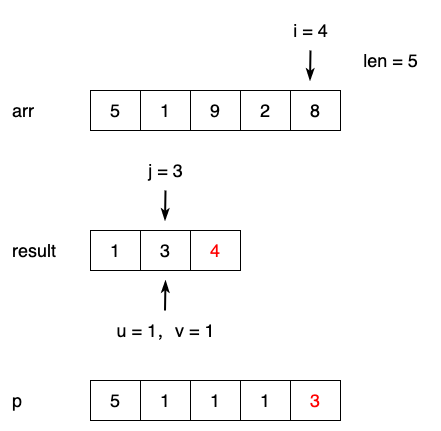

令`u = result.length；v = result[u - 1]`，即`u = 3; v = 4`; 因为`u > 0`，`u--`，令`result[2] = 4`，`v = 3`

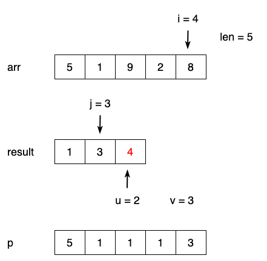

`u = 2; v = 3`，令`u--`，`result[1] = 3`，`v = 1`

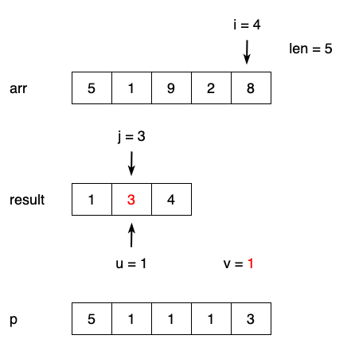

`u = 1; v = 1`，令`u--`，`result[0] = 1`，`v = 1`

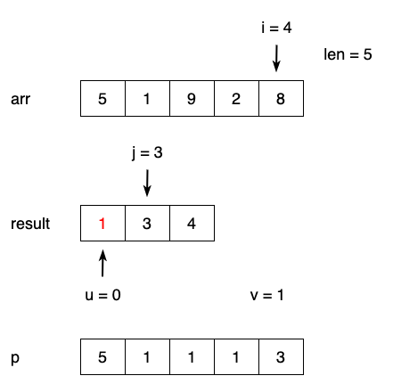

最后返回`result`
:::

接着，遍历新节点，判断是否有新节点需要移动或挂载。

```ts
for (i = toBePatched - 1; i >= 0; i--) {
  const nextIndex = s2 + i
  const nextChild = c2[nextIndex] as VNode
  const anchor =
    nextIndex + 1 < l2 ? (c2[nextIndex + 1] as VNode).el : parentAnchor
  // 如果不存在对应旧节点，说明nextChild是个新节点，那么需要挂载
  if (newIndexToOldIndexMap[i] === 0) {
    patch(
      null,
      nextChild,
      container,
      anchor,
      parentComponent,
      parentSuspense,
      isSVG,
      slotScopeIds,
      optimized
    )
  } else if (moved) { // 需要移动
    // j < 0 或i不等于increasingNewIndexSequence[j]说明节点需要移动
    if (j < 0 || i !== increasingNewIndexSequence[j]) {
      move(nextChild, container, anchor, MoveType.REORDER)
    } else {
      j--
    }
  }
}
```

`i = 3`时，`newIndexToOldIndexMap[3] = 0`，说明节点`node9`没有对应的旧节点，需要挂载它。

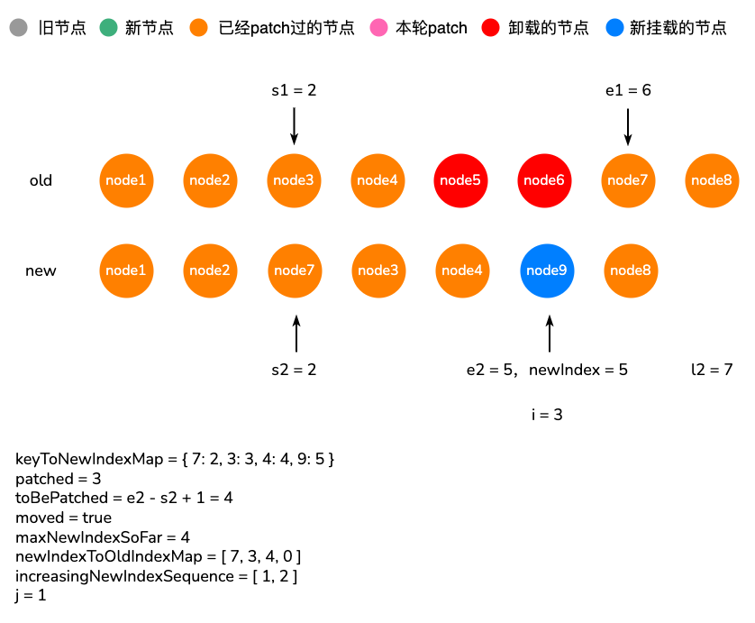

`i = 2`时，`newIndexToOldIndexMap[2] = 4`，`node4`存在对应旧节点，`moved`为`true`；因为`2 === increasingNewIndexSequence[1]`，所以`j--`。

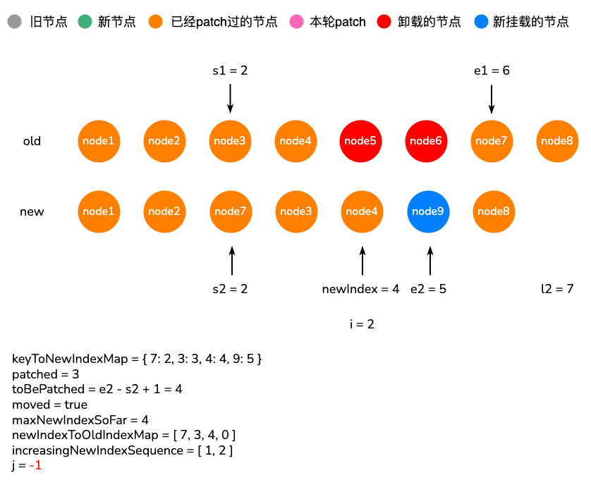

`i = 1`时，`newIndexToOldIndexMap[1] = 3`，`node3`存在对应旧节点，`moved`为`true`；因为`1 === increasingNewIndexSequence[0]`，所以`j--`。

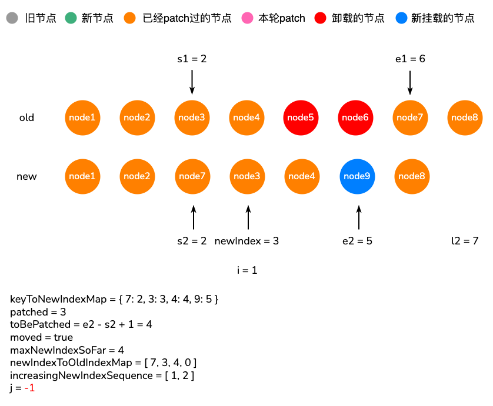

`i = 0`时，`newIndexToOldIndexMap[0] = 7`，`node7`存在对应旧节点，`moved`为`true`；因为`-1 < 0`，所以`node7`需要移动。移动的锚点就是`node3`。

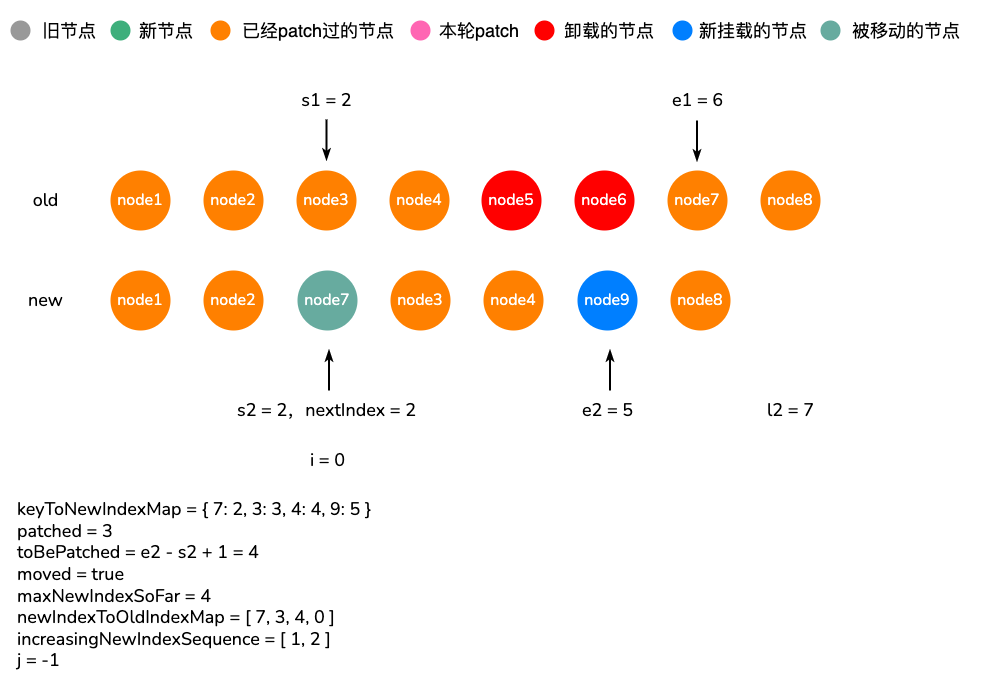

### patchUnkeyedChildren与patchKeyedChildren对比：


根据上面这个例子。

如果使用`patchUnkeyedChildren`进行`Diff`的话，直接进行对位`patch`，前两个节点间不会有区别，一旦从第三个节点开始，每次`patch`的过程中，都会卸载旧节点，然后再挂载新节点，最后剩下一个多余的旧节点，直接卸载。整个过程比较暴力，除了前两个节点，不存在DOM的复用。

使用`patchKeyedChildren`进行`Diff`，`node1`、`node2`、`node3`、`node4`、`node7`、`node8`节点会进行对位`patch`，在`patch`过程中会复用旧节点中DOM，并且减少了很多额外的开销（这几个节点间不存在挂载卸载操作）。

|     | 更新节点 |   挂载节点  |   卸载节点  |  移动节点   |
|-----|--|-----|-----|-----|
|  `patchUnkeyedChildren`   | 2 |  5   |   6  |   0  |
|   `patchKeyedChildren`  | 6 |  1   |   2  |   1  |

### key的作用

在`Diff`过程中，一方面我们可以根据`key`与`type`属性确定两个新旧节点是否是同一类型；另一方面，我们通过`key`值，构造了一个新节点列表的`key-index`映射，在遍历旧节点时可以快速地通过`key`值获取到对应的新节点。

通过`key`，我们可以最大程度上复用元素，并且可以根据`key`的变化顺序来重新排列元素。

关于`key`的使用，我们应尽可能使用能够唯一确定元素的属性，如数据的主键，尽量不要使用数据的索引作为`key`值，除非你可以肯定数据不会发生更新。

**为什么尽量不用数据索引作为key？**

想象下面这组节点的`Diff`过程，由于`key`就是其索引，所以构建出来的新节点`key-index`映射为`{ 0: 0, 1: 1, 2: 2, 3: 3 }`，在遍历旧节点过程中，每次都可以从映射中获取对应新节点的索引，并且新旧节点的索引是一致的，这时进行`patch`的过程中旧节点始终都会被卸载，新节点始终都会被挂载。效果和`patchUnkeyedChildren`是一样的。所以我们应尽量避免使用索引作为`key`。

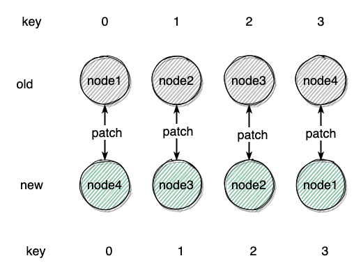

## 总结

`patchKeyedChildren`的过程总结如下：

1. 处理公共的前置节点与后置节点。如果处理完后，旧节点已经遍历完成，而此时还存在新节点，那么需要挂载这些新节点；相反，如果新节点已经遍历完成，而此时还存在旧节点，那么需要卸载这些旧节点。不符合这两种情况，继续向下执行
2. 判断是否存在节点需要移动，并`patch`剩余的相同新旧节点。
   - 先建立一个`Map`存储新节点的`key-index`映射关系
   - 遍历旧节点，用旧节点的`key`从`Map`中获取对应新节点的索引，如果存在，进行`patch`操作，否则卸载旧节点。这个过程还会建立一个数组，用于保存新节点索引与旧节点索引的映射，同时判断是否存在有移动的节点。
3. 移动、挂载节点。
   - 通过第二步产生的新节点索引与旧节点索引的映射数组，生成一个最大递增序列，并令`j`指向这个序列的最后一个索引。
   - 遍历新节点，如果从索引映射数组中获取到的值为0，说明旧节点中无对应节点，那么进行挂载。否则如果存在移动节点，如果`j<0`或`i`不等于新旧节点索引映射的第`j`个值，说明节点需要移动，否则执行`j--`。

`patchKeyedChildren`在`Diff`过程中会最大程度地复用`DOM`，并且利用最长递增子序列，最大程度地减少了`DOM`移动，相比`patchKeyedChildren`带来了不小的性能提升
