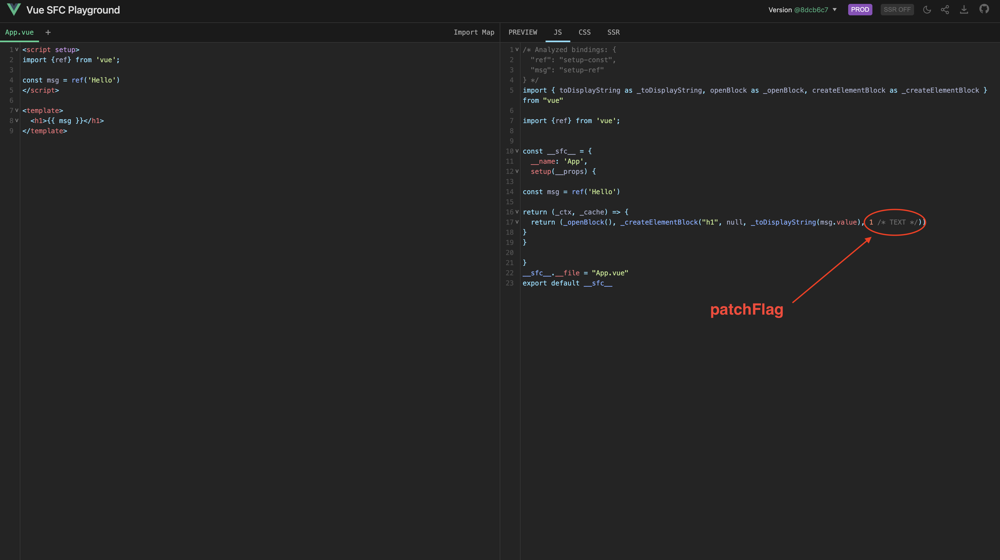

# vnode中的shapeFlag和patchFlag

## shapeFLag

`vnode`的`shapeFLag`属性使用二进制的方式描述了组件的类型。`shapeFLag`的值的类型是个枚举：
```ts
export const enum ShapeFlags {
  ELEMENT = 1, // 表示一个普通的HTML元素
  FUNCTIONAL_COMPONENT = 1 << 1, // 函数式组件
  STATEFUL_COMPONENT = 1 << 2,  // 有状态组件
  TEXT_CHILDREN = 1 << 3, // 子节点是文本
  ARRAY_CHILDREN = 1 << 4, // 子节点是数组
  SLOTS_CHILDREN = 1 << 5, // 子节点是插槽
  TELEPORT = 1 << 6, // 表示vnode描述的是个teleport组件
  SUSPENSE = 1 << 7, // 表示vnode描述的是个suspense组件
  COMPONENT_SHOULD_KEEP_ALIVE = 1 << 8, // 表示需要被keep-live的有状态组件
  COMPONENT_KEPT_ALIVE = 1 << 9, // 已经被keep-live的有状态组件
  COMPONENT = ShapeFlags.STATEFUL_COMPONENT | ShapeFlags.FUNCTIONAL_COMPONENT // 组件，有状态组件和函数式组件的统称
}
```

一个`vnode`可以是多个不同的的类型，如：
```ts
vnode.shapeFlag = ShapeFlags.ELEMENT | ShapeFlags.ARRAY_CHILDREN
```

判断某个`vnode`的类型时可以使用`vnode.shapeFlag & ShapeFlags.ELEMENT`的方式进行判断，或判断`vnode`是否同时是多种类型`vnode.shapeFlag & ShapeFlags.ELEMENT | ShapeFlags.ARRAY_CHILDREN`

## patchFlag
`patchFlag`是在编译`template`模板时，给`vnode`添加的一个标识信息，这个标识信息反映了`vnode`的哪些部位绑定了动态值，这样在`runtime`阶段，可以根据`patchFlag`判断出哪些内容需要更新，实现靶向更新。

`patchFlag`的类型和`shapeFLag`相同，也是个枚举类型：
```ts
export const enum PatchFlags {
  // 表示vnode具有动态textContent的元素
  TEXT = 1,
  // 表示vnode具有动态的class
  CLASS = 1 << 1,
  // 表示具有动态的style
  STYLE = 1 << 2,
  // 表示具有动态的非class和style的props
  PROPS = 1 << 3,
  // 表示props具有动态的key，与CLASS、STYLE、PROPS冲突
  FULL_PROPS = 1 << 4,
  // 表示有监听事件(在同构期间需要添加)
  HYDRATE_EVENTS = 1 << 5,
  // 表示vnode是个children顺序不会改变的fragment
  STABLE_FRAGMENT = 1 << 6,
  // 表示children带有key的fragment
  KEYED_FRAGMENT = 1 << 7,
  // 表示children没有key的fragment
  UNKEYED_FRAGMENT = 1 << 8,
  // 表示vnode只需要非props的patch。例如只有标签中只有ref或指令
  NEED_PATCH = 1 << 9,
  // 表示vnode存在动态的插槽。例如动态的插槽名
  DYNAMIC_SLOTS = 1 << 10,
  // 表示用户在模板的根级别存在注释而创建的片段，这是一个仅用于开发的标志，因为注释在生产中被剥离
  DEV_ROOT_FRAGMENT = 1 << 11,
  
  // 以下都是一些特殊的flag，它们不能使用位运算进行匹配
  // 表示vnode经过静态提升
  HOISTED = -1,
  // diff算法应该退出优化模式
  BAIL = -2
}
```
以下是针对不同`patchFlag`的一些示例

### PatchFlags.TEXT

```vue
<script setup>
import {ref} from 'vue';

const msg = ref('Hello')
</script>

<template>
  <h1>{{ msg }}</h1>
</template>
```

`<h1>`标签中只绑定了动态的`textContext`，所以以上模板转为`vnode`之后，`patchFlag`为`PatchFlags.TEXT`。

你可以将代码复制在[Vue SFC Playground](https://sfc.vuejs.org/#eNp9jstOwzAQRX/F8iYgNbagC6QQqrLjI7wpybQNxA/NTMoi8r8zbhHqQ+ryPuaemfV7SuYwgW50Sx0OiRUBT2nlwuBTRFYzwjarLUavKilWry640MVArDzt1JuS/KH6gHGM1aMLrT3NyIAIBp/GDYMopdr902qej1c5t1ZUqf9X9EKfkLXfJPNFMchTczl0fwE53aijUzx5pmin98yJGmunkL53poveriWzOAUePNR99OuleTbLF9sPxOe+AfL1J8YfAhSi04uzcSvmAbBGCD0g4F3YVfcCeJXdQAszu5B1/gWiX4op)中进行测试。



### PatchFlags.CLASS、PatchFlags.STYLE

```vue
<script setup>
import { ref, reactive } from 'vue'
  
const msg = ref('Hello')
const style = reactive({ fontSize: '24px' })
const classObj = ref('red')
</script>

<template>
  <h1 :class="classObj" :style="style">{{ msg }}</h1>
</template>

<style>
  .red {
    color: red;
  }
</style>
```

`<h1>`标签绑定了动态的`class`、`style`、`textContent`，所以`patchFlag`为`PatchFlags.TEXT | PatchFlags.CLASS | PatchFlags.STYLE`

[Vue SFC Playground](https://sfc.vuejs.org/#eNp9kLtuwzAMRX+F0OIWSGyk6KQ6Abp169BVi+PQiQPrAVJJH4b+vbQSF0ELdJFE8vLwiqN6DqE8n1BpVXNLfYjAGE9hY1xvg6cIIxB2CzmaNvZnhAQdeQuFNBXGARjXescRLO9hPWnvihccBl/czxWOnwPm2gVxN0LnXXzrv1BD8fAYPgpIP+p2aJhft8cZRribUMbV1cWgWJMgog1DE1EigPqwAp0b10bNAKNA59GSy7dRm3HMPlOqq8NKWuvqhiNh1mVkKXNhnF4ArR88abGze5oSKXvJSrVQlzUtbRPKI3sni8xd5lpgo/TMMUqWNsVGHWIMrKuKu3Za/5FLT/tKXiWdXOwtlsh2uSX/zkgCNmpxw6gkeUZaErodEtJ/zF/SP9zrj5JK33vTtRM=)

### PatchFlags.PROPS

```vue
<script setup>
import { ref } from 'vue'

const msg = ref('Hello')
</script>

<template>
  <h1 :title="msg">{{ msg }}</h1>
</template>
```

`<h1>`标签绑定了动态的`title`、`textContent`，所以`patchFlag`为`PatchFlags.TEXT | PatchFlags.PROPS`

[Vue SFC Playground](https://sfc.vuejs.org/#eNp9js1uwjAQhF9l5UtaidiiHCpFAdFbH8IXmiwkbfyj9YYeIr97N6GqKEgcd2Z2vpnUW4z6PKKqVJ0a6iNDQh7jzvrexUAMExAeIcORgoNCooX1ANY3wScGl06wnRNPxTsOQyiera/NpUk65GB0cTgwygVQd2uouOcBt1bJr1W7aVpKcq5Nt5ZQbf4+1EpdRpTuEPVnCl5mTgv+10hWVbAosybj5tuqjjmmypjRx6+TboIze/EMjZ57h2Ub3H6jX/Tm1bR94mtdY3LlB4XvhCREq1ZX5UbEM1JJ6FskpIewm+w/4I13B52Z2fqs8g9E3o9q)

### PatchFlags.FULL_PROPS

```vue
<script setup>
import { ref } from 'vue'

const msg = ref('Hello')
const dynamicKey = ref('foo')
</script>

<template>
  <h1 :[dynamicKey]="msg" >{{ msg }}</h1>
</template>
```

`<h1>`标签绑定了动态的`textContent`和一个动态的`dynamicKey`属性，所以`patchFlag`为`PatchFlags.TEXT | PatchFlags.FULL_PROPS`

[Vue SFC Playground](https://sfc.vuejs.org/#eNp9j81OwzAMx1/FyqUgrYnGDkhVN40bEo9AOIzWXQvNh5x0aKry7rgdgzEkjv8P+2eP4sF7eRhQFKIMFXU+QsA4+I22nfGOIoxA2ECChpyBjKuZtgDaVs6GCCbsYT01brJH7HuX3Z6T+mh3pque8HguNG6OS3UCMYJFROP7XURWAGW7hOL5Z/JlrQUTtIDNOM6slErVLrlcqu9JsRCnW3Oz8/ItOMvfjPOVX0HQooDZmTz+YdJatDH6UCg1WP++l5UzasuZosHGzmBeO7NdyTu5uld1F+KlLzGY/JXcR0BiohaLi+WKzQNSTmhrJKR/YVfdX8Cr7A90YiZtk0ifU5mc6g==)

### PatchFlags.STABLE_FRAGMENT

```vue
<script setup>
import { ref } from 'vue'

const msg = ref('Hello')

function handleClick() {
  classObj.red = !classObj.red
}
</script>

<template>
  <h1 @click="handleClick" >{{ msg }}</h1>
  <span>text</span>
</template>
```

`<template>`标签中有多个根标签，会创建一个`Fragment`类型的`vnode`，因为`<h1>`、`<span>`标签的顺序始终不会发生变化，所以`Fragment`类型的`vnode`的`patchFlag`为`PatchFlags.STABLE_FRAGMENT`。

[Vue SFC Playground](https://sfc.vuejs.org/#__SSR__eNp9UDFuwzAM/AqrxQkQS0gzFAicwEWXbv2AFkemYycWJUhyWsDw3yvFHdwU6MYjj3dHjuzVWn4bkO1Z4ZXrbACPYbBHSZ22xgUYwWEDEzTOaMgiNZMEIEkZ8gG0P8MhMVbZO/a9ydaSJDUDqdAZgraiuse3vlPX1RrGtKn6yvuP04U7rOPq0xJLmiQVYg4SI0QQUNu+ChgRQNFuoVRJ7SDZQlsyOI7jPcw0FaLdzmxvKzoG/ApRMpVJe6HHNmy+MdeV5RdvKH7hnlH+DLxk+zl16sXbE47OIVi/F2Igez1zZbQo40y4gUKnMa+NLnf8me9eRN35sOxz9Do/OfPp0UVHyTYLcRGbN3S5Q6rRofvX7IH7y/Bh9sc0ecZHT2z6BhKrsRo=)

### PatchFlags.KEYED_FRAGMENT

```vue
<script setup>
import { reactive } from 'vue'

const data = reactive([ 'one', 'two', 'three' ])
</script>

<template>
  <span v-for="item in data" :key="item">{{ item }}</span>
</template>
```

`<template>`标签中有多个根标签，而且每个标签都有`key`，所以`Fragment`类型的`vnode`的`patchFlag`为`PatchFlags.KEYED_FRAGMENT`

[Vue SFC Playground](https://sfc.vuejs.org/#__SSR__eNp9j9FOwzAMRX/FyktBWhsJHpCqbhrfQXgorcfCiBM5bidU9d/xugmNIfFk+V77HnsyzylV44CmNk3u2CeBjDKkjSMfUmSBCRjbTvyIMMOOY4BC5wtHAI66SFmgb6WF9c/c3QsUkbBYQSHHuJQ9Ixbweu+osWeMArQRDOmzFdQOoMmpJRjLXeS1M1498LSEOwP1Ab8uqjObaYLFn2fN0y3db+xVmFmZ8/llaFP1kSPpg9Ny88XIztSwKCdNPzr1zuxFUq6tHSgd3qsuBrtVz/JA4gOWfQzbx+qhenyyvc9yrVeYQ/nG8ZiRlejM6ircqjgil4zUIyP/C7uZ/QW88f5AT8zZ0WzmbxEdo2s=)

### PatchFlags.UNKEYED_FRAGMENT

```vue
<script setup>
import { reactive } from 'vue'

const data = reactive([ 'one', 'two', 'three' ])
</script>

<template>
  <span v-for="item in data">{{ item }}</span>
</template>
```

`<template>`标签中有多个根标签，但标签都没有`key`，所以`Fragment`类型的`vnode`的`patchFlag`为`PatchFlags.UNKEYED_FRAGMENT`

[Vue SFC Playground](https://sfc.vuejs.org/#__SSR__eNp9j8FOwzAMhl/FyqUgrY3EDkhTN43nIBxK67EAcSLH7Q5V3x23Q6gMiZPl///tzx7NU0rV0KPZmTq37JNARunTwZEPKbLACIxNK35AmODEMUCh+cIRgKM2UhboGmlg/5O7e4YiEhYbKOQSl3JmxAJe7h3V9opRgDaCIX02gtoB1Dk1BEN5irx3xqsHnpblzhzGERZlmnSD5nSitqtxszHXg8vQpOo9R9KXxuXKbyM7s4NFmTX9Ye6dOYukvLO2p/TxVrUx2KN6lnsSH7DsYjhuq4dq+2g7n2WtV5hD+crxkpGV6MxmtdyqOCCXjNQhI/8Lu8n+At54f6Azc3I0mekLl52e4A==)

### PatchFlags.NEED_PATCH

```vue
<script setup>
import { ref } from 'vue'

const dom = ref()

const vFocus = {
  mounted: (el) => el.focus()
}
</script>

<template>
  <input v-focus />
  <h1 ref="dom">Hello</h1>
</template>
```

`<input/>`和`<h1>`对应的`vnode`的`patchFlag`均为`PatchFlags.NEED_PATCH`

[Vue SFC Playground](https://sfc.vuejs.org/#__SSR__eNp9kMtOw0AMRX/Fmk1bqZlR6QIpSqKyQXzEbErikMC8NI+wiPLveBoEpUhd+t5rH9sze3KOTwlZyarQ+tFFCBiTa6QZtbM+wgwee1ig91bDhqIbaaRprQkROpLq7G93v+L0bNsUSJ+lAdA2mYhdCVtUO6gbQMX7HMgtizSVWLEEpCKiduockSqAajQu0bzikgexisMhA2vJCC5Z84JK2UoMB3Ir8dPP9mzdv9Bnx9+DNXThZSH5bQTJynXFrNFduZZsiNGFUohk3Mcbb60WJ/KEpytGjQVBT0f+wI+PohtDvNY5Bl28evsZ0BNRsv3VcEHihL7waDr06O/CbrJ/gDfeP2hm0lsXtnwBhhijWw==)

### PatchFlags.DYNAMIC_SLOTS

```vue
<template>
  <Comp>
    <template #one v-if="ok">hello</template>
  </Comp>

  <Comp>
    <template v-for="name in list" #[name]>{{ name }}</template>
  </Comp>
</template>
```

两个`<Comp>`中的`slot`都可能发生变化，所以它们对应的`vnode`的`patchFlag`为`PatchFlags.DYNAMIC_SLOTS`

[Vue SFC Playground](https://sfc.vuejs.org/#__SSR__eNp9j8FuwjAMhl8lMleSSOMwqeoqpj3GskO3mhFo4ihJy6HKu5NUIBUQ3Ozvt//fnuDTOTEOCBXUEY3r24iNsozVX2TcXOX6qrAVWWQj17sPBXRU0Oyx76mWt6vysvvcZ+Q78tnDtgaZtqzXISpgq+8CfpppYrOS0jPrBYc1aOPIR25aJw6BbH5mKtPqIgQFFZtJYfnb0ivYx+hCJeVg3fFf/JGR26xJP9ioDfKOzHYj3sTmXXb5vCUXGAz/9XQK6HOigvXCXGY4oucebYce/cuwu9mbwDvtIbRkJmUTpDNfzpqB)

### PatchFlags.DEV_ROOT_FRAGMENT

```vue
<template>
 <!-- title -->
 <h1>Hello</h1>
</template>
```

`<template>`的根级存在注释，同时有多个标签，便签顺序不会变化，所以根`vnode`的`patchFlag`为`PatchFlags.STABLE_FRAGMENT | PatchFlags.DEV_ROOT_FRAGMENT`

[Vue SFC Playground](https://sfc.vuejs.org/#__SSR__eNp9jcsOgjAQRX+lzpq2URYmhBDc+RHdoEwEpY+0Ay4I/24hxiAm7mbOnblnhJNzYugRMsgJtesqwkIZlu84Z9RSh4zzBTT74oxdZ3MZJ2Vy+TmHBFrtrCeuKyfuwZrYNsYfpt5BUJCxhcws6uZdQUPkQiZlb9zjJq5WyzJm0veGWo28trpMxUGkR1m3gdZcYND84u0zoI9GBcmqXEY4oOceTY0e/V/Z5vZLuMl+pLNzUmaC6QWuWm8v)

### PatchFlags.HOISTED

```vue
<template>
  <h1>Hello</h1>
  <p>test</p>
</template>
```

`<h1>`和`<p>`标签都是两个静态标签，所以它们对应的`vnode`的`patchFlag`为`PatchFlags.HOISTED`

如果只存在一个静态标签，这个静态标签对应的`vnode`的`patchFlag`不是`PatchFlags.HOISTED`，而是默认的0
```vue
<template>
 	<h1>Hello</h1>
</template>
```

[Vue SFC Playground](https://sfc.vuejs.org/#__SSR__eNp9jc8KwjAMh1+l5Owa1IMwiujNh+hFXXDT9Q9tNg9j7247ROYET0m+X5JvgKP3su8ISlBMxrdnpr22QrOq1/sTta1TmLqEhPJTEYIp8gQwE4WfQ1hBY7wLXJizl/fobPo75FX9DqKGUkwksyTOs4aa2ccSsbP+cZNXZ/CQMgyd5cZQUTlz2MqN3O6waiLPuaRoiktwz0ghGTWsZs8xwZ5CEchWFCj8lS12v4SL7EeanaO2I4wvDrlyhQ==)
