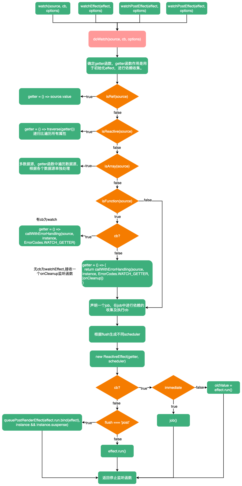

# watch

::: tip
`watch`用来监听特定数据源，并在单独的回调函数中执行副作用。默认是惰性的——即回调仅在侦听源发生变化时被调用。
文件位置：`packages/runtime-core/src/apiWatch.ts`
:::

```ts
export function watch<T = any, Immediate extends Readonly<boolean> = false>(
  source: T | WatchSource<T>,
  cb: any,
  options?: WatchOptions<Immediate>
): WatchStopHandle {
  // ...
  return doWatch(source as any, cb, options)
}
```

`watch`接收三个参数：`source`监听的源、`cb`回调函数、`options`监听配置，`watch`函数返回一个停止监听函数。。在`watch`中调用了一个叫做`doWatch`的函数，与`watch`作用相似的`watchEffect`、`watchPostEffect`、`watchSyncEffect`内部也都使用了这个`doWatch`函数。

```ts
export function watchEffect(
  effect: WatchEffect,
  options?: WatchOptionsBase
): WatchStopHandle {
  return doWatch(effect, null, options)
}

export function watchPostEffect(
  effect: WatchEffect,
  options?: DebuggerOptions
) {
  return doWatch(
    effect,
    null,
    (__DEV__
      ? Object.assign(options || {}, { flush: 'post' })
      : { flush: 'post' }) as WatchOptionsBase
  )
}

export function watchSyncEffect(
  effect: WatchEffect,
  options?: DebuggerOptions
) {
  return doWatch(
    effect,
    null,
    (__DEV__
      ? Object.assign(options || {}, { flush: 'sync' })
      : { flush: 'sync' }) as WatchOptionsBase
  )
}
```

可见`doWatch`是一系列`watch`的核心，接下来重点研究`doWatch`的实现。

`doWatch`函数接收三个参数：`source`，监听的数据源，`cb`回调函数，`options`：监听配置。

首先，`doWatch`内部声明了三个变量：`getter`在初始化`effect`时使用、`forceTrigger`强制更新、`isMultiSource`是否为多数据源。

```ts
let getter: () => any
let forceTrigger = false
let isMultiSource = false
```

紧接着根据传入的`source`类型修改这三个变量：

```ts
// 如果是ref，getter函数返会source.value，可以收集对应依赖
if (isRef(source)) {
  getter = () => source.value
  forceTrigger = isShallow(source)
} else if (isReactive(source)) {
  // 如果是reactive，getter函数返回source，并设置deep深度监听
  getter = () => source
  deep = true
} else if (isArray(source)) {
  // 如果是数组，设置isMultiSource为true，代表多数据源
  isMultiSource = true
  // 强制触发的前提是，数组中至少有一个数据源是reactive
  forceTrigger = source.some(isReactive)
  // getter函数针对不同数据类型进行不同处理
  getter = () =>
    source.map(s => {
      if (isRef(s)) {
        return s.value
      } else if (isReactive(s)) {
        return traverse(s)
      } else if (isFunction(s)) {
        return callWithErrorHandling(s, instance, ErrorCodes.WATCH_GETTER)
      } else {
        __DEV__ && warnInvalidSource(s)
      }
    })
} else if (isFunction(source)) {
  if (cb) {
    // 如果有回调函数，就是watch
    getter = () =>
      callWithErrorHandling(source, instance, ErrorCodes.WATCH_GETTER)
  } else {
    // 没有回调函数，就是watchEffect
    getter = () => {
      // 如果组件已被卸载，直接返回
      if (instance && instance.isUnmounted) {
        return
      }
      // 清除依赖
      if (cleanup) {
        cleanup()
      }
      // 执行source函数
      return callWithAsyncErrorHandling(
        source,
        instance,
        ErrorCodes.WATCH_CALLBACK,
        [onCleanup]
      )
    }
  }
} else {
  getter = NOOP
  __DEV__ && warnInvalidSource(source)
}
```

如果有`cb`并且`deep`为`true`，使用`traverse`函数递归遍历数据源的属性进行监听。

```ts
// 如果有回调函数并且deep为true，使用traverse递归遍历所有属性
if (cb && deep) {
  const baseGetter = getter
  getter = () => traverse(baseGetter())
}
```

::: info
`traverse`实现，递归遍历获取值，`seen`用于防止循环引用问题
```ts
export function traverse(value: unknown, seen?: Set<unknown>) {
  if (!isObject(value) || (value as any)[ReactiveFlags.SKIP]) {
    return value
  }
  seen = seen || new Set()
  if (seen.has(value)) {
    return value
  }
  seen.add(value)
  if (isRef(value)) {
    traverse(value.value, seen)
  } else if (isArray(value)) {
    for (let i = 0; i < value.length; i++) {
      traverse(value[i], seen)
    }
  } else if (isSet(value) || isMap(value)) {
    value.forEach((v: any) => {
      traverse(v, seen)
    })
  } else if (isPlainObject(value)) {
    for (const key in value) {
      traverse((value as any)[key], seen)
    }
  }
  return value
}
```
:::

紧跟着声明了`cleanup`与`onCleanup`两个变量，在`onCleanup`中给`cleanup`进行重新赋值。这里的`onCleanup`会作为`watchEffect`中回调函数的参数，用来注册清理失效时的回调

```ts
let cleanup: () => void
let onCleanup: OnCleanup = (fn: () => void) => {
  cleanup = effect.onStop = () => {
    callWithErrorHandling(fn, instance, ErrorCodes.WATCH_CLEANUP)
  }
}
```

然后初始化`oldValue`，并声明了一个`job`函数，设置`job.allowRecurse = !!cb`

```ts
let oldValue = isMultiSource ? [] : INITIAL_WATCHER_VALUE
const job: SchedulerJob = () => {
  if (!effect.active) {
    return
  }
  if (cb) {
    // watch(source, cb)
    const newValue = effect.run()
    // 如果是deep || forceTrigger || || 值变化了
    if (
      deep ||
      forceTrigger ||
      (isMultiSource
        ? (newValue as any[]).some((v, i) =>
            hasChanged(v, (oldValue as any[])[i])
          )
        : hasChanged(newValue, oldValue)) ||
      (__COMPAT__ &&
        isArray(newValue) &&
        isCompatEnabled(DeprecationTypes.WATCH_ARRAY, instance))
    ) {
      // 执行前清除副作用
      if (cleanup) {
        cleanup()
      }
      // 执行回调函数
      callWithAsyncErrorHandling(cb, instance, ErrorCodes.WATCH_CALLBACK, [
        newValue,
        // pass undefined as the old value when it's changed for the first time
        oldValue === INITIAL_WATCHER_VALUE ? undefined : oldValue,
        onCleanup
      ])
      // 执行完毕后，更新oldValue
      oldValue = newValue
    }
  } else {
    // watchEffect
    effect.run()
  }
}

// 允许递归调用，也就是说可以在watch里面修改值，达到重新触发watch的目的
job.allowRecurse = !!cb
```

接着声明一个`scheduler`调度器，并根据`flush`来决定`job`执行时机。

```ts
let scheduler: EffectScheduler
if (flush === 'sync') {
  // 同步状态
  scheduler = job as any // the scheduler function gets called directly
} else if (flush === 'post') {
  // 延迟执行，将job添加加一个延迟队列，这个队列会在组件挂在后、更新的申明周期中执行
  scheduler = () => queuePostRenderEffect(job, instance && instance.suspense)
} else {
  // 默认 pre，将job添加到一个优先执行队列，该队列在挂载前执行
  scheduler = () => {
    if (!instance || instance.isMounted) {
      queuePreFlushCb(job)
    } else {
      // with 'pre' option, the first call must happen before
      // the component is mounted so it is called synchronously.
      job()
    }
  }
}
```

`getter`与`scheduler`准备完成，创建`effect`实例。

```ts
const effect = new ReactiveEffect(getter, scheduler)
```

创建`effect`实例后，开始首次执行副作用函数。

```ts
// 如果有cb
if (cb) {
  // 需要立即执行
  if (immediate) {
    // 在job中进行依赖收集及执行回调函数
    job()
  } else {
    // 收集依赖
    oldValue = effect.run()
  }
} else if (flush === 'post') {
  // 需要延迟执行，将runner推入延迟队列中
  queuePostRenderEffect(
    effect.run.bind(effect),
    instance && instance.suspense
  )
} else {
  effect.run()
}
```

最后返回一个停止监听数据源的函数。

```ts
return () => {
  effect.stop()
  if (instance && instance.scope) {
    remove(instance.scope.effects!, effect)
  }
}
```

`watch`流程：


